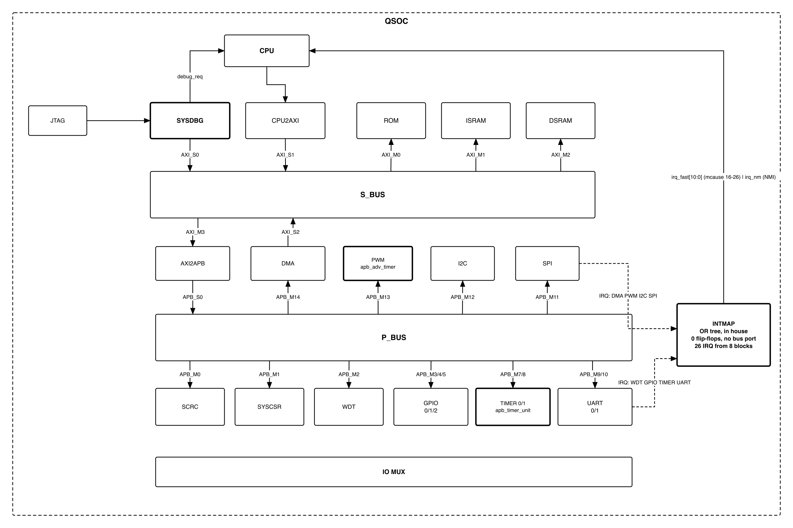

# QSOC

A general-purpose 32-bit microcontroller, designed from the block level up as a
deep-training project. RV32IMC core, two bus levels, 98 KiB of on-chip memory and
twelve peripherals, targeting **SMIC 28 nm**.

There is no flash and no external memory interface, which shapes everything else:
the application is downloaded into RAM over the serial port after every reset, and
runs from there.



Blocks with a **bold border** are designed here. The rest integrate upstream IP
through a wrapper.

## What it is

| | |
|---|---|
| **Core** | lowRISC **Ibex**, RV32IMC, two-stage pipeline, machine mode |
| **Clock** | one external 20 MHz input, no PLL — the PDK carries no analogue IP |
| **Memory** | 2 KiB ROM · 64 KiB instruction RAM · 32 KiB data RAM |
| **System bus** | AXI4 crossbar, fully connected, decode error on an unmapped address |
| **Peripheral bus** | APB4 router, 16 slaves |
| **Peripherals** | 2× UART · SPI host + device · I²C · 3× GPIO · 2× timer · PWM · watchdog · DMA |
| **Interrupts** | 26 sources → 11 fast lines + 1 NMI, through a combinational OR tree |
| **Debug** | JTAG, in-house: halt, resume, and memory access without the CPU |
| **Boot** | serial download into RAM, header + payload + CRC32, then jump |

Address map, interrupt assignment and clock domains live in one place —
[`util/qsoc_contract.yml`](util/qsoc_contract.yml) — and the package every block
imports is generated from it.

## Where the project is

Honest status, so nobody has to guess:

| | |
|---|---|
| Architecture and memory map | **agreed** — one contract file, checked by CI |
| Specifications | **5 of 17 blocks** written: RAM, SYSDBG, INTMAP, TIMER, PWM |
| RTL | **not started.** The scaffold, naming rules and CI are in place; wrappers are next |
| Verification | not started |
| Physical design | not started |
| Per-IP status | [`doc/TRACKER.md`](doc/TRACKER.md), one column per sign-off stage |

## Repository layout

| Path | Contents |
|------|----------|
| `design/` | RTL, one directory per block — see [`design/README.md`](design/README.md) |
| `doc/` | Specifications and the toolchain that builds them — see [`doc/README.md`](doc/README.md) |
| `vendor/` | Upstream IP, copied in at a pinned commit, never edited |
| `util/` | The inter-block contract, its generator, and the vendoring tool |
| `flow/` | Scripts for every sign-off stage: lint, sim, syn, STA/SDC, and the CDC/RDC rules |
| `dv/` · `pd/` · `fpga/` | Verification, implementation, FPGA bring-up |
| `doc/TRACKER.md` | Sign-off status of every IP, one column per stage |
| `.github/` | CI, ownership and repository policy — see [`.github/POLICY.md`](.github/POLICY.md) |

## Getting started

Needs Python 3 with PyYAML, `verilator` for lint, `emacs` for generated
wrappers, and `pandoc` to build the specifications. `make setup` installs them
(Homebrew or apt) and turns on the pre-push hook; `make doctor` says what is
missing on a machine where you cannot install.

```bash
make setup                             # once: tools + pre-push hook
make check                             # every check CI runs
make help                              # each check on its own, per block
make docs                              # build the specifications
python3 util/vendor_ip.py --list       # which upstream IP is pinned, and at what commit
```

## Contributing

**Start with [`CONTRIBUTING.md`](CONTRIBUTING.md)** — what to read first, the five
steps for writing a block, and the checks that gate a pull request.

`main` is protected: no direct pushes, and a code-owner review is required.
Ownership is per directory in [`.github/CODEOWNERS`](.github/CODEOWNERS).

Upstream IP is **vendored at a pinned commit rather than submoduled**, because
tape-out needs a frozen, auditable source: every upstream fact a specification
relies on is commit-specific. [`vendor/manifest.yml`](vendor/manifest.yml) records
each one, and CI refuses a change under `vendor/` that does not update it.


