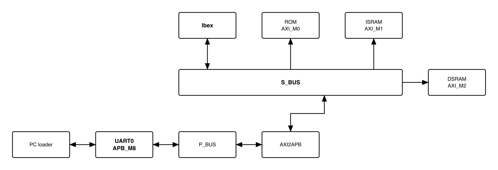
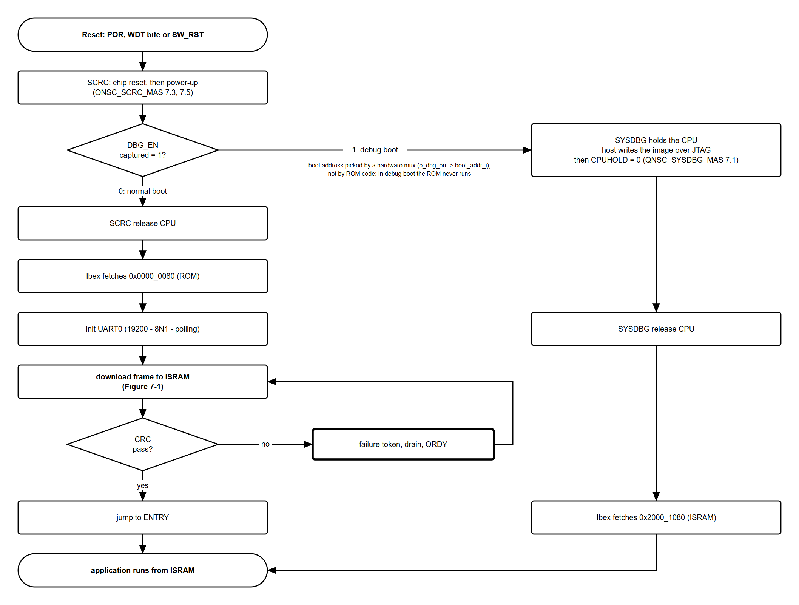
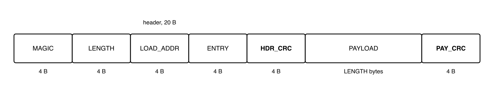
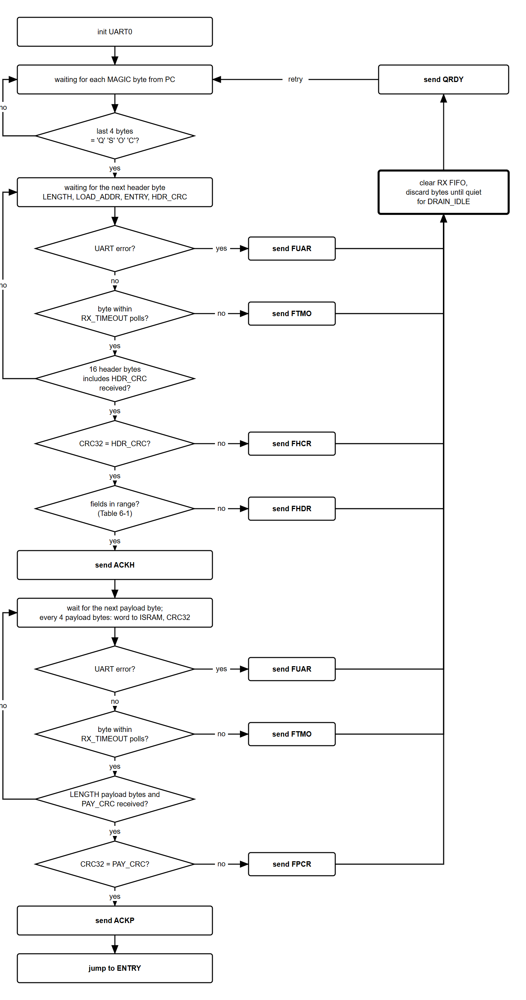
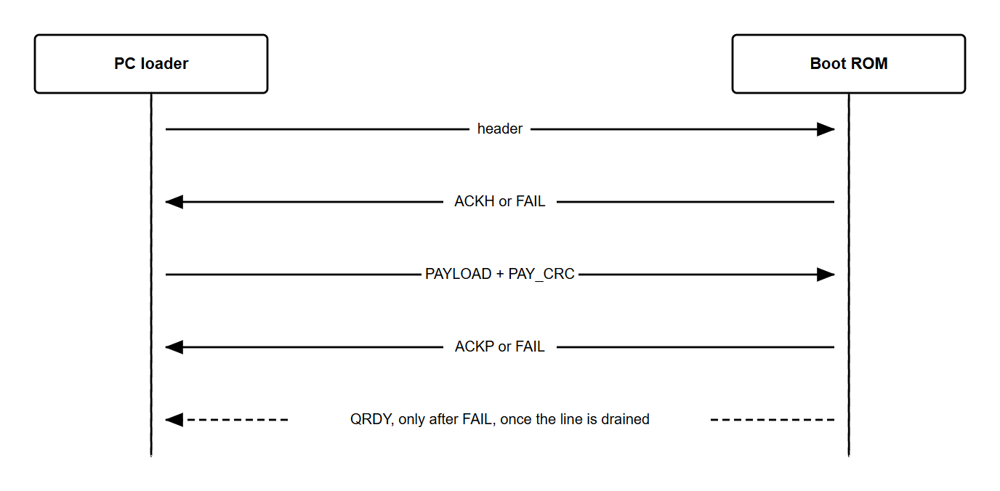

# Revision history

The reasoning behind each change, the V1.0--V2.2 history and the V2.2 text are in
[`QNSC_BOOT_DECISIONS.md`](QNSC_BOOT_DECISIONS.md).

| Version | Date | Author | Reviewer | Description of change |
|---|---|---|---|---|
| V3.1 | 2026-09-30 | Nguyen Hao Nam | -- | Mentor review 29/09 (Appendix B): no `QRDY` after reset, only after a failure; 19 200 baud; Figure 4-1 shows the CPU release and tests CRC pass; debug boot explained by the boot address mux; steps of Figures 4-1 and 7-1 described (Tables 4-2, 7-1); how each failure is detected; timeouts given as minimums; UART errors before `MAGIC` get no reply; Figure 7-1 redrawn with one decision per check; the PC stops on a failure token; `RX_TIMEOUT` and `DRAIN_IDLE` raised |
| V3.0 | 2026-09-28 | Nghia VT (lead), for Nguyen Hao Nam | -- | V2.2 moved onto the template: `UART0` address corrected to `0x8002_0000`, hardware sequencing referenced to `SCRC`/`SYSDBG`, bootloader image limits moved here from the ROM, timing recomputed, monochrome figures |

# 1. Overview

QSOC has no Flash. After every reset the boot ROM downloads the application from a
PC into `ISRAM` over `UART0`, checks it, and jumps to it. This specification is the
bootloader, the frame and handshake between it and the PC loader, and what the
application can rely on.

It is not a block and has no RTL. The hardware it runs on is `QNSC_ROM_MAS`,
`QNSC_SCRC_MAS` (reset and release order) and `QNSC_SYSDBG_MAS` (debug boot).

Source `design/rom/boot/`, output `rom_image.hex`; owner Nguyen Hao Nam.

# 2. Features

- The same flow after every reset: power-on, watchdog, software -- 4.
- `UART0` at 19 231 baud (19 200 nominal) 8N1, polled -- 5.
- Frame: 20-byte header with its own CRC, payload, payload CRC -- 6.
- A 4-byte token answers every step; any failure returns to `QRDY` -- 7.
- Nothing written to RAM before the header is checked -- 7.1.
- Application up to 60 KiB, from `0x2000_1000` -- 9.

# 3. Boot path

{width=6.4in}

<!-- gen:memory_map ports=AXI_M0,AXI_M1,AXI_M2,APB_M8 -->
: Memory map, regions behind APB_M8 and AXI_M0 and AXI_M1 and AXI_M2

| Base | Size | Region | Port | Kind | Note |
|---|---|---|---|---|---|
| `0x00000000` | 2 KiB | `rom` | AXI_M0 | memory | Boot code, read-only, executable |
| `0x20000000` | 4 KiB | `isram_dbg` | AXI_M1 | memory | The debug window: the first 4 KiB of ISRAM, not a block of its own |
| `0x20001000` | 60 KiB | `isram` | AXI_M1 | memory | The downloaded application |
| `0x30000000` | 32 KiB | `dsram` | AXI_M2 | memory | Stack, heap and variables |
| `0x80020000` | 16 KiB | `uart_0` | APB_M8 | peripheral | Carries the boot download |
<!-- /gen -->

The bootloader runs from the ROM, keeps its stack in `DSRAM`, writes `ISRAM` only
from `0x2000_1000`, and accesses no peripheral other than `UART0`.

# 4. Sequence

{width=6.4in}

: Boot stages

| Stage | Done by | Specified in | Ends when |
|---|---|---|---|
| 1. Chip reset | `SCRC` `RRC` | `QNSC_SCRC_MAS` 7.3 | chip reset releases |
| 2. Power-up | `SCRC` `MCPU` | `QNSC_SCRC_MAS` 7.5 | CPU released; `UART0` clocked and reachable |
| 3. Mode | `SYSDBG` | `QNSC_SYSDBG_MAS` 7.1 | `o_dbg_cpu_hold` = 0 |
| 4. ROM start | Ibex, `crt0.S` | `QNSC_ROM_MAS` 6, section 8 | `boot_main` called |
| 5. Download | bootloader | section 7 | both CRCs pass, `ACKP` sent |
| 6. Jump | bootloader | 7.5 | first instruction at `ENTRY` |

With `DBG_EN` = 1 stages 4 to 6 do not run. `SYSDBG` captures `DBG_EN` once after
power-on, and the captured `o_dbg_en` switches the Ibex `boot_addr_i` from
`0x0000_0000` to `0x2000_1000` in hardware. The ROM never reads `DBG_EN`; in debug
boot it executes no instruction. The host loads the image through `SYSDBG`,
releases the CPU, and the CPU starts at `0x2000_1080` (`QNSC_SYSDBG_MAS` 7.1, 7.2).
The layout of section 9 is the same in both modes, so one image serves both.

: Steps of Figure 4-1

| Step of Figure 4-1 | What happens | Specified in |
|---|---|---|
| Reset: POR, WDT bite or SW_RST | Any of the three resets the chip. Only POR makes `SYSDBG` read the DBG_EN pin again and put the CPU hold back on. | `QNSC_SCRC_MAS` 7.3 |
| SCRC: chip reset, then power-up | The `RRC` holds the chip in reset: 16 cycles after a WDT bite or SW_RST; after POR it releases one cycle later. Then `MCPU` runs the CRM program, in this order: (1) starts the clocks of the peripherals that `CLK_EN` asks for, after reset every peripheral except TIMER1; (2) at least 3 cycles later, releases the reset of every domain except the CPU; (3) at least 16 cycles later, opens the APB guards of the peripherals whose clock runs, the TIMER1 guard staying closed; (4) last, releases the CPU reset. Register values: `QNSC_SCRC_MAS` 7.5. | `QNSC_SCRC_MAS` 7.3, 7.5 |
| DBG_EN captured = 1? | Decided by hardware, not by the ROM. `SYSDBG` reads the DBG_EN pin once after power-on. The value decides whether the CPU starts in the ROM (0) or in ISRAM (1), and whether the debugger may hold the CPU in reset. A WDT bite or SW_RST does not read the pin again. | `QNSC_SYSDBG_MAS` 7.1 |
| SCRC release CPU (DBG_EN = 0) | The CPU leaves reset only when `SCRC` has released it and `SYSDBG` no longer holds it. With `DBG_EN` = 0, `SYSDBG` lets go as soon as it has captured `DBG_EN`, so the CPU starts when `SCRC` releases it, with the boot address already pointing at the ROM. | `QNSC_SCRC_MAS` 7.8, `QNSC_SYSDBG_MAS` 7.1 |
| Ibex fetches 0x0000_0080 (ROM) | Ibex starts at its boot address + 0x80: `0x0000_0080` in the ROM. The start-up code points the stack at the top of DSRAM, `0x3000_8000`, and calls the bootloader, `boot_main`. | `QNSC_ROM_MAS` 6, section 8 |
| init UART0 | Sets 19 200 baud, 8 data bits, no parity and 1 stop bit, turns the FIFOs on and the interrupts off (section 5). The ROM starts listening for MAGIC at once. | 5 |
| download frame to ISRAM | Receive and check the frame, Figure 7-1 and Table 7-1. | 7 |
| CRC pass? | Yes when both CRCs match, the header CRC and the payload CRC, and every other check of Figure 7-1 passes. If not: the ROM sends a failure token, empties the line and sends QRDY; the PC resends the whole frame. | 7.2 |
| jump to ENTRY | The ROM sends ACKP, waits until the token has fully left UART0, clears the instruction prefetch and jumps to ENTRY. | 7.5 |
| SYSDBG holds the CPU (DBG_EN = 1) | `SYSDBG` keeps the CPU in reset while `SCRC` releases everything else. Meanwhile the host writes the debug program and the application image into ISRAM over JTAG. | `QNSC_SYSDBG_MAS` 7.2 |
| SYSDBG release CPU | The host writes 0 to the `CPUHOLD` register. `SCRC` has already released the CPU, so it leaves reset at once. | `QNSC_SYSDBG_MAS` 7.2 |
| Ibex fetches 0x2000_1080 (ISRAM) | The boot address now points at ISRAM, so Ibex starts at `0x2000_1080`, just after the image's vector table. | `QNSC_SYSDBG_MAS` 7.2 |

In debug boot a WDT bite or SW_RST neither captures `DBG_EN` again nor sets
`CPUHOLD`: with `CPUHOLD` = 0 the CPU restarts at `0x2000_1080` on the image already
in `ISRAM`.

# 5. UART0 configuration

`UART0` is `pulp-platform/apb_uart` around `obi_uart`: 16550 registers at byte
offset 4 x *n*, 16-byte RX FIFO.

: `UART0` registers used, base `0x8002_0000`

| Offset | Register | Use |
|---|---|---|
| `0x00` | `RBR` / `THR` / `DLL` | receive, transmit; `DLL` = 65 while `DLAB` = 1 |
| `0x04` | `IER` / `DLM` | `IER` = 0; `DLM` = 0 while `DLAB` = 1 |
| `0x08` | `FCR` | `0x07`: FIFOs on, both cleared |
| `0x0C` | `LCR` | `0x80` (`DLAB`) while writing the divisor, then `0x03`: 8 bits, no parity, 1 stop |
| `0x14` | `LSR` | bit 0 data ready; bits 1--3 overrun, parity, framing; bit 5 `THRE`; bit 6 `TEMT` |

Divisor 65: 20 MHz / (16 x 65) = 19 231 baud, 0.16 % above 19 200, a standard rate
on the PC. One byte takes 520 µs, 10 400 cycles. The low rate keeps a wide margin
against framing errors on the link.

The ROM polls `UART0` and uses no interrupt. To receive, it reads `LSR` in a loop:
an error bit (1 to 3) set is a UART error; bit 0 set means a byte waits in `RBR`,
which it then reads; otherwise it reads `LSR` again. While it hunts `MAGIC` the
loop has no limit; after `MAGIC` it counts the polls against `RX_TIMEOUT` (7.3). To
send, it waits for `LSR.THRE` = 1 and writes `THR`.

# 6. Frame format

{width=6.4in}

: Frame fields

| Offset | Field | ROM check |
|---|---|---|
| `0x00` | `MAGIC` | the bytes 'Q', 'S', 'O', 'C' in that order |
| `0x04` | `LENGTH` | multiple of 4, 4 to 61 440 |
| `0x08` | `LOAD_ADDR` | multiple of 4, >= `0x2000_1000`, `LOAD_ADDR` + `LENGTH` <= `0x2001_0000` |
| `0x0C` | `ENTRY` | even, `LOAD_ADDR` <= `ENTRY` < `LOAD_ADDR` + `LENGTH` |
| `0x10` | `HDR_CRC` | CRC32 of bytes `0x00`--`0x0F` |
| `0x14` | `PAYLOAD` | `LENGTH` bytes of the application binary, zero-padded by the PC |
| `0x14` + `LENGTH` | `PAY_CRC` | CRC32 of `PAYLOAD` |

CRC32 is the zlib variant: reflected polynomial `0xEDB88320`, initial value and
final XOR `0xFFFF_FFFF`. The ROM computes it bitwise.

# 7. Bootloader behaviour

{width=4.1in}

Table 7-1 describes each step of Figure 7-1 and how each failure is found. Every
check is done by the bootloader in software; `UART0` only flags line errors in `LSR`.

: Steps of Figure 7-1

| Step of Figure 7-1 | What the ROM does | Failure detected, token |
|---|---|---|
| init UART0 | Section 5. | -- |
| waiting for each MAGIC byte from PC; last 4 bytes = 'Q' 'S' 'O' 'C'? | Poll `LSR` with no time limit and shift each byte through a 4-byte window until it holds `MAGIC`. A byte with a UART error is dropped. Nothing is sent. | none |
| waiting for the next header byte | Poll `LSR` for the 16 bytes of `LENGTH`, `LOAD_ADDR`, `ENTRY` and `HDR_CRC`. A CRC32 runs over `MAGIC` and the three fields as they arrive. | -- |
| UART error? | `LSR` bit 1, 2 or 3 (overrun, parity, framing) is set when the byte is read. | yes: `FUAR` |
| byte within RX_TIMEOUT polls? | The poll count restarts at every byte (7.3). | no: `FTMO` |
| 16 header bytes includes HDR_CRC received? | No: wait for the next header byte. | -- |
| CRC32 = HDR_CRC? | Checked before the fields: with a wrong CRC they mean nothing. | no: `FHCR` |
| fields in range? | `LENGTH`, `LOAD_ADDR` and `ENTRY` against Table 6-1. | no: `FHDR` |
| send ACKH | `ISRAM` is written only after this token. | -- |
| wait for the next payload byte | Every 4 payload bytes are written as one word to `ISRAM` from `LOAD_ADDR` and fed to a second CRC32. The 4 bytes of `PAY_CRC` are neither written nor fed. | -- |
| UART error?, byte within RX_TIMEOUT polls? | As for the header. | `FUAR`, `FTMO` |
| LENGTH payload bytes and PAY_CRC received? | The loop bound only: `LENGTH` was checked with the header. No: wait for the next payload byte. | -- |
| CRC32 = PAY_CRC? | `PAY_CRC` is the CRC32 the PC computed over the payload; the ROM compares it with its own. | no: `FPCR`, no jump |
| send ACKP, jump to ENTRY | 7.5. | -- |
| send failure token, clear RX FIFO, discard bytes until quiet for DRAIN_IDLE, send QRDY | The token is sent in full first. Then the RX FIFO is cleared, bytes are discarded until the line has been quiet for `DRAIN_IDLE`, `QRDY` is sent, and the ROM waits for `MAGIC` again (7.2). | -- |

## 7.1 Handshake

{width=5.6in}

: Tokens, 4 ASCII bytes, sent by the ROM

| Token | Sent when |
|---|---|
| `QRDY` | after every failure, once the line is drained; not after reset |
| `ACKH` | header received, `HDR_CRC` correct, every field in range |
| `ACKP` | `PAY_CRC` correct |
| `FHCR` | `HDR_CRC` wrong |
| `FHDR` | `LENGTH`, `LOAD_ADDR` or `ENTRY` out of range |
| `FPCR` | `PAY_CRC` wrong |
| `FTMO` | more than `RX_TIMEOUT` between two bytes after `MAGIC` |
| `FUAR` | `LSR` overrun, parity or framing error, after `MAGIC` |

- FAIL in Figure 7-2 is any failure token; Figure 7-1 shows which step sends which.
- Bytes before `MAGIC` get no reply, UART errors included, so line noise is
  harmless. No token is sent after reset: the PC sends its frame without waiting.
  If the frame starts before `UART0` is configured, `MAGIC` is missed, no `ACKH`
  comes back, and the PC resends after its 2 s wait.
- Nothing is written to `ISRAM` before `ACKH`.

## 7.2 Failure and retry

After a failure token the ROM clears its RX FIFO, discards bytes until the line
has been quiet for `DRAIN_IDLE`, sends `QRDY` and waits for a new frame; the PC
resends the whole frame. Words already in `ISRAM` are overwritten by the next one.
The watchdog is off after reset (`aon_timer` `WDOG_CTRL` resets to 0), so a
download that never completes waits for the PC or a reset. The PC waits for
`QRDY` before it resends, so no byte of the new frame is lost in the drain. The PC
stops sending as soon as it reads a failure token: it sends the payload in chunks
and checks for a token between them, so the ROM does not drain the rest of a bad
frame.

## 7.3 Timeouts

The bootloader uses no timer: a timeout is a count of `LSR` polls. A poll is at
least one APB read, and an APB transfer takes at least 2 cycles, so Table 7-3 gives
minimum times only. The exact time per poll depends on the bus path and is not
specified.

: Timeouts

| Constant | Polls | Minimum, at 2 cycles per poll | Meaning |
|---|---:|---|---|
| `RX_TIMEOUT` | 1 000 000 | 100 ms, 192 byte times | between two bytes of a frame, after `MAGIC` |
| `DRAIN_IDLE` | 500 000 | 50 ms, 96 byte times | quiet line that ends a drain |
| `MAGIC` hunt | -- | -- | no limit |

A slower poll only lengthens a timeout. The PC waits 2 s for each token, plus the
payload time for `ACKP`, so the counts need no tuning. The margins cover gaps in
the PC stream from the operating system and the USB-serial adapter. `RX_TIMEOUT`
must stay below the PC's 2 s wait, so a poll must take fewer than 40 cycles; the
time per poll is measured in simulation (10).

## 7.4 Writing ISRAM

The payload is written one 32-bit word per four received bytes.

## 7.5 Jump

After `ACKP` the ROM waits for `LSR.TEMT` = 1, so the token has left `UART0`,
executes `fence.i`, and jumps to `ENTRY`. It does not return.

# 8. Bootloader image

: Limits, enforced by the build

| Limit | Value | Enforced by |
|---|---|---|
| Image | 2048 bytes, vector table included (`QNSC_ROM_MAS` 6) | `link.ld`, `util/gen_rom.py` |
| Code | 1 KiB after the vector table (Day005 review) | `make size` |
| Sections | `.text` only: no `.data`, `.bss` or `.rodata` | `link.ld` |

- `crt0.S` holds the 32 vectors and `_start` at `0x80`: `sp` = `0x3000_8000`, the
  top of `DSRAM`, then `boot_main`.
- Built with `-march=rv32imc_zicsr_zifencei`, which `fence.i` needs.

: Source, `design/rom/boot/`

| File | Content |
|---|---|
| `boot.h` | Frame, tokens, timeouts; addresses from the generated `qnsc_map.h` |
| `crt0.S`, `boot.c` | Vectors and `_start`; the bootloader |
| `link.ld` | Layout and the limits above |
| `Makefile` | `make`, `make size`, `make test`, `make test-serial`; output `rom_image.hex` |
| `tools/qsoc_image.py` | Packs an application binary into a frame; `--load` default `0x2000_1000`, `--entry` default load + `0x80` |
| `tools/qsoc_loader.py` | Sends a frame over a serial port at 19 200 baud and follows the handshake: the payload in chunks, stopped at a failure token, then a retry |
| `tools/rom_model.py`, `tools/test_protocol.py` | Python model of `boot.c`, and the loader run against it for every token (`make test`) |
| `tools/test_serial_link.py` | The loader command line through `pyserial` (`socket://`) against the model (`make test-serial`) |

# 9. Application contract

- Link at `LOAD_ADDR` >= `0x2000_1000`.
- Put a 128-byte vector table at `LOAD_ADDR` and set `mtvec` to it; put `_start` at
  `LOAD_ADDR` + `0x80`, so `ENTRY` = `0x2000_1080` by default.
- Set up its own stack and data in `DSRAM`.
- Find `UART0` configured (19 231 baud 8N1, FIFOs on, interrupts off, transmitter
  empty), every peripheral clock running except `TIMER1`, and the watchdog off.
- Read and clear `SYSCSR` `RESET_CAUSE` (`QNSC_SYSCSR_MAS` 7.5).

Download time at 19 231 baud: 60 KiB in about 32 s, 22 KiB in about 11.7 s.

# 10. Requirements on others, and open items

: Requirements on other owners

| Item | Owner | What it blocks |
|---|---|---|
| `qnsc_map.h` generated from the contract, as `qnsc_pkg.sv` is | lead | `boot.h` without typed addresses |

Open items: `design/rom/boot/` is in PR #51 (`feat/rom-wrapper`), not yet merged. ROM
owner. Time per `LSR` poll, measured in simulation, to replace the minimums of
Table 7-3. ROM owner.

# 11. Verification

1. `BOOT_001` After each reset source the ROM sends no token and accepts a correct
   frame: `ACKH`, `ACKP`, then execution at `ENTRY`.
2. `BOOT_002` Bytes before `MAGIC`, UART errors included, get no reply.
3. `BOOT_003` A wrong `HDR_CRC` gives `FHCR`, a field out of range gives `FHDR`;
   neither writes `ISRAM`.
4. `BOOT_004` A wrong `PAY_CRC` gives `FPCR` and no jump.
5. `BOOT_005` A gap longer than `RX_TIMEOUT` after `MAGIC` gives `FTMO`; a UART error
   gives `FUAR`.
6. `BOOT_006` After every failure the ROM sends `QRDY` and accepts a resent frame.
7. `BOOT_007` After `ACKP`, `ISRAM` from `LOAD_ADDR` equals the payload word for word.
8. `BOOT_008` The build fails when a limit of Table 8-1 is broken.
9. `BOOT_009` `make test` passes against `rom_model.py` for every token.

# Appendix A. Acronyms

: Acronyms

| Acronym | Description |
|---|---|
| CRC | Cyclic Redundancy Check |
| DLAB | Divisor Latch Access Bit, `LCR[7]` |
| LSR | Line Status Register |
| THRE, TEMT | Transmit holding register empty, transmitter empty |

# Appendix B. First review

: First review

| Item | Reviewer | Response |
|---|---|---|
| Handshake mandatory: ACK or failure per step | Quan (mentor), Day006 | 7.1 |
| Header checked separately from payload | Quan (mentor), Day006 | 6, `HDR_CRC` |
| Why `LOAD_ADDR` and `ENTRY` are separate | Quan (mentor) | DECISIONS |
| First fetch is ROM base + `0x80` | Sinh | `QNSC_ROM_MAS` 6 |
| `UART0` at `0x8002_4000`, "APB slave 9" | lead, V3.0 | `0x8002_0000`, `APB_M8`, map generated in 3 |
| Byte time 86.8 µs, 1736 cycles | lead, V3.0 | 88.0 µs, 1760 cycles at the real baud rate |
| Word writes justified by "no byte-strobe path" | lead, V3.0 | `ISRAM` has byte strobes (`QNSC_RAM_MAS` 7.3); reason removed |
| Figure 4-1: show the CPU release | Quan (mentor), 29/09 | Figure 4-1, Table 4-2 |
| Leave out of the MAS any parameter or step that is not known | Quan (mentor), 29/09 | 7.3: timeouts as minimums |
| Polling for the PC data not defined; `QRDY` after reset not needed | Quan (mentor), 29/09 | 5: polling; 7.1: no `QRDY` after reset, kept after a failure |
| "ACKP sent?" should test the CRC | Quan (mentor), 29/09 | Figure 4-1: CRC pass? |
| How does the CPU run the image loaded over JTAG if it starts in the ROM? | Quan (mentor), 29/09 | 4: hardware boot address mux; the ROM does not run |
| Baud rate down to about 10 000--20 000 | Quan (mentor), 29/09 | 5: 19 200 |
| Figure 7-1: how each failure is detected and reported | Quan (mentor), 29/09 | Table 7-1 |
| Describe every step of Figures 4-1 and 7-1 | Quan (mentor), 29/09 | Tables 4-2, 7-1 |
