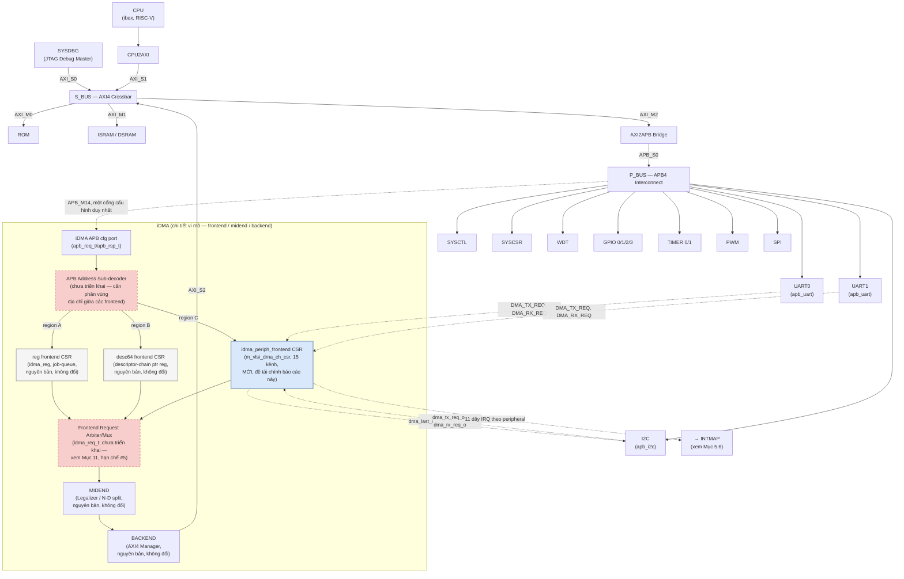
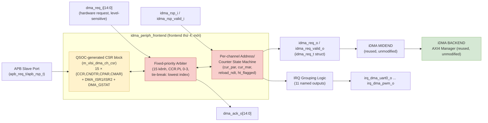
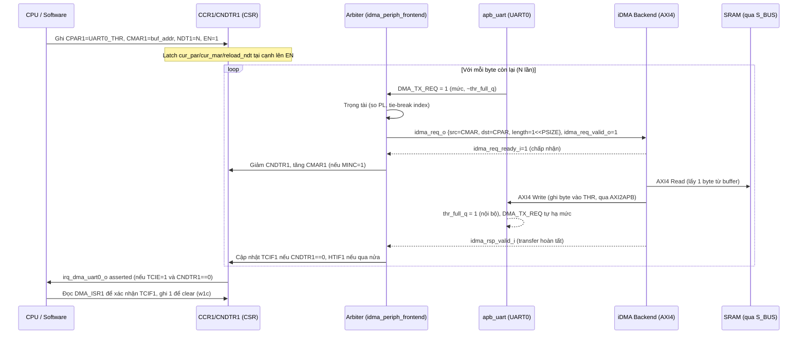
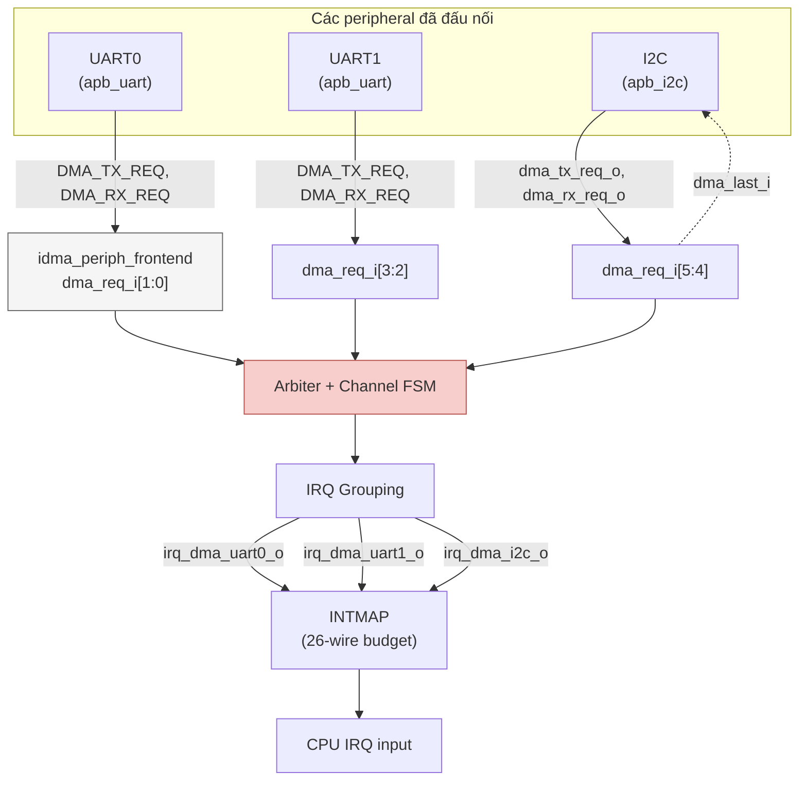
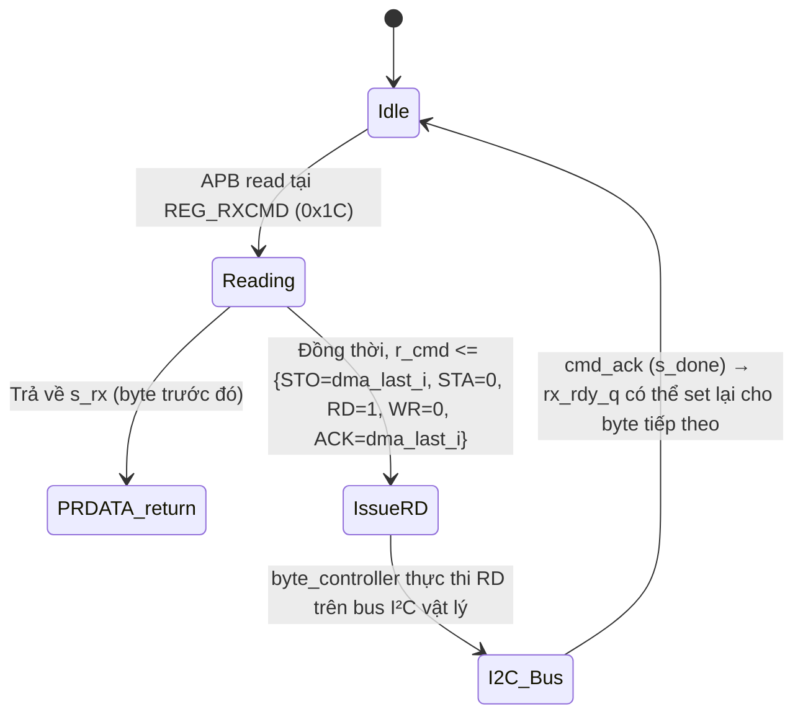

# QNSC_DMA — design decisions and record

**This is not the specification.** That is [`QNSC_DMA_MAS.md`](QNSC_DMA_MAS.md).

This file holds why V3.0 replaces the V2.0 architecture, and keeps whole the V2.0
document and the research report of Ong Bao Vinh it was built on. Their figures are
not reproduced.

---

# 1. V2.0 to V3.0

V2.0 designed a new frontend with three engines -- a register job, a descriptor
chain and eight STM32-style peripheral channels -- behind an arbiter and a 3:1
`axi_mux`, none simulated. V3.0 uses the upstream iDMA frontend `reg` unmodified.

| Decision | Why |
|---|---|
| Upstream frontend `reg32_2d` with `--cpuif apb4-flat` | The mentor: use an open-source 32-bit DMA, do not redesign the IP. The template at the pinned commit already has an APB4 configuration port and a 32-bit variant, so no in-house register file is needed |
| No hardware request from peripherals | The research found correctly that no iDMA frontend has one. It is not needed in QSOC: at 20 MHz and 113 636 baud a 16-byte UART FIFO needs one interrupt every 1.4 ms, and the CPU starts one job per interrupt. The STM32 DMA1 model was the research's own premise; no requirement asked for it |
| Stride-0 2D job for FIFO registers | Reaches a fixed data register `REPS` times with the upstream `idma_nd_midend`, which covers what the peripheral channels were for, minus the hardware pacing |
| No descriptor engine | Firmware launches the next job; a descriptor chain adds a memory fetch path and an FSM to verify for no QSOC use |
| No change to `apb_i2c` | The combined `REG_TXCMD`/`REG_RXCMD` registers read with a side effect (a debugger read starts an I2C transfer), and I2C has no FIFO, so DMA brings it nothing |
| Read and write ports joined by wires | Without a descriptor fetch port the remaining ports use disjoint AXI channels; the `axi_mux` is not needed |
| Idle-level interrupt from `STATUS` | The upstream frontend has no interrupt. `NOT busy` needs no register; the handler compares `DONE_ID` with the launched ID |
| `ErrorCap` = `NO_ERROR_HANDLING` | No error-handler port to drive; an AXI error is an accepted, stated limit |
| `APB_M14` corrected to `APB_M13` | Contract since `GPIO3` was dropped; V2.0 and the HAS kept the old slot |
| UART `o_dma_*_req` and patch `0001-add-dma-request-lines` to be dropped | Nothing consumes them |

## If a hardware request is needed later

Keep the upstream frontend, midend and backend, and add a gate between the midend and
the backend: each 1D transfer of a stride-0 job waits for the selected peripheral's
request level. The level-sensitive request and the UART request lines of the research
(sections 4.4 and 7.1 below) are the parts to reuse. One channel, no arbiter.

---

# V2.0 as issued

## Reversion and History

Source note: nội dung kỹ thuật trong tài liệu này phản ánh trực tiếp RTL/tài liệu đã tạo trong phiên làm việc này (chosen_repos/11_DMA_idma/src/frontend/qsoc/, doc/qsoc_dma_integration.md); các phần đánh dấu \[CHƯA MÔ PHỎNG\] là tuyên bố tường minh về trạng thái xác minh, không phải kết quả simulation/RTL đã đo được.

| **Revision** | **Date** | **Author** | **Description** |
|----|----|----|----|
| V1.0 | 2026-09-17 | Vinh Ong Bao | Initial micro-architecture specification (PULP iDMA research, STM32 comparison) |
| V2.0 | 2026-09-22 | Vinh Ong Bao | Unified single-frontend architecture (register-job + descriptor + 8-channel peripheral), generated AXI backend, axi_mux + cc_stream_arbiter reuse, single dma_irq_o |

## Table of Tables

| **No.** | **Description**                                      |
|---------|------------------------------------------------------|
| Table 1 | Unified frontend mode decomposition (Region A/B/C)   |
| Table 2 | APB register map summary                             |
| Table 3 | Fixed peripheral channel table                       |
| Table 4 | QSOC integration wiring table                        |
| Table 5 | Comparison: v1 multi-frontend vs v2 unified frontend |

## Table of Figures

| **No.**  | **Description**                                 |
|----------|-------------------------------------------------|
| Figure 1 | idma_qsoc_frontend Unified Architecture         |
| Figure 2 | idma_qsoc_top: Backend and AXI4 Mux Composition |
| Figure 3 | Register-Job Transfer: End-to-End Sequence      |
| Figure 4 | idma_qsoc_top Integration into QNSC_SoC         |

## 1. Overview

Tài liệu này đặc tả kiến trúc vi mô (micro-architecture) của phiên bản V2.0 tích hợp iDMA (pulp-platform) vào SoC QNSC, thay thế hoàn toàn kiến trúc V1.0 (3 frontend \`reg\`/\`desc64\`/\`periph\` chạy song song sau một frontend-arbiter chưa từng được xây dựng) bằng một frontend duy nhất \`idma_qsoc_frontend\` chứa 3 chế độ hoạt động nội bộ (register-programmed job, descriptor-chain job, 8 kênh peripheral kích hoạt phần cứng), được trọng tài hoá bởi \`cc_stream_arbiter\` (IP thật của pulp-platform) thành đúng một luồng \`idma_req_t\`/\`idma_rsp_t\` duy nhất đưa vào backend AXI4 dùng chung.

Mục tiêu của tài liệu: mô tả chính xác cấu trúc RTL đã triển khai (\`idma_qsoc_top\`, \`idma_qsoc_frontend\`, \`idma_qsoc_pkg\`), bộ thanh ghi APB hợp nhất, bảng kênh peripheral cố định, mô hình interrupt hợp nhất (\`dma_irq_o\` duy nhất thay cho 11 dây IRQ riêng biệt của thiết kế trước), và tình trạng kiểm chứng thực tế (chưa qua mô phỏng — không có Verilator/QuestaSim trong môi trường phát triển). Toàn bộ RTL được sinh một phần bằng chính công cụ có sẵn của repository (\`util/gen_idma.py\` cho backend AXI4, \`CSR_Generation.py\` nội bộ QSOC cho bộ thanh ghi), không phải viết tay hoàn toàn từ đầu.

## 2. Feature

Phần này tổng hợp các đặc tính kỹ thuật chính của kiến trúc V2.0, so với kiến trúc V1.0 nhiều-frontend trước đó.

### 2.1. Unified Frontend Architecture (Three Modes, One Stream)

\`idma_qsoc_frontend\` gộp 3 chức năng từng thuộc 3 frontend riêng biệt vào một module RTL duy nhất, tránh việc phải xây dựng một frontend-arbiter cấp cao (điều mà kiến trúc V1.0 dự kiến nhưng chưa từng triển khai).

Table 1 – Unified frontend mode decomposition

| **Mode / Region** | **Chức năng** | **Interface** | **Trạng thái** |
|----|----|----|----|
| A – Register-job | One-shot copy SRC-\>DST theo LEN, kích hoạt bằng CTRL.START | APB rw + idma_req_t | Triển khai đầy đủ |
| B – Descriptor | Duyệt chuỗi descriptor 4-word (32-bit) tự thiết kế, tự fetch qua AXI4 AR/R riêng | APB rw + AXI4 (AR/R) + idma_req_t | Triển khai đầy đủ (KHÔNG dùng lại \`desc64\` gốc — xem 2.5/4.4) |
| C – Peripheral x8 | UART0/1, I2C, SPI TX/RX, mô hình CCR/CNDTR/CPAR/CMAR kiểu STM32 | APB rw + dma_req_i/dma_ack_o + idma_req_t | 6/8 kênh đã đấu nối RTL thật (UART0/1, I2C); SPI dự trù, chưa đấu nối |

### 2.2. Generated AXI4 Backend and Reused IP

Backend AXI4 (\`idma_backend_rw_axi\`) và các dependency (\`idma_legalizer_rw_axi\`, \`idma_transport_layer_rw_axi\`) KHÔNG được viết tay trong dự án này — chúng được sinh trực tiếp bằng công cụ \`util/gen_idma.py\` sẵn có của chính repository iDMA, đúng như quy trình build thật của dự án. Việc gộp 3 cổng AXI4 manager (backend read, backend write, descriptor-fetch read) thành một cổng vật lý \`AXI_S2\` duy nhất sử dụng \`axi_mux\` (module thật, \`chosen_repos/02_System_BUS_axi\`), và việc trọng tài hoá 3 lớp request nội bộ dùng \`cc_stream_arbiter\` (round-robin, \`common_cells\`, pulp-platform) — không có logic mux/arbiter tự viết từ đầu ở 2 điểm này.

### 2.3. Fixed Peripheral Channel Table

Table 3 – Fixed peripheral channel table (8 kênh, không còn GPIO/TIMER/PWM như thiết kế V1.0)

| **\#** | **Kênh** | **Hướng** | **Nguồn dma_req_i** | **Trạng thái** |
|----|----|----|----|----|
| 1 | UART0_TX | mem→periph | apb_uart (UART0) DMA_TX_REQ | Đã đấu nối |
| 2 | UART0_RX | periph→mem | apb_uart (UART0) DMA_RX_REQ | Đã đấu nối |
| 3 | UART1_TX | mem→periph | apb_uart (UART1) DMA_TX_REQ | Đã đấu nối |
| 4 | UART1_RX | periph→mem | apb_uart (UART1) DMA_RX_REQ | Đã đấu nối |
| 5 | I2C_TX | mem→periph | apb_i2c dma_tx_req_o | Đã đấu nối |
| 6 | I2C_RX | periph→mem | apb_i2c dma_rx_req_o (+dma_last_i) | Đã đấu nối |
| 7 | SPI_TX | mem→periph | — (tie 0) | Dự trù, chưa đấu nối |
| 8 | SPI_RX | periph→mem | — (tie 0) | Dự trù, chưa đấu nối |

### 2.4. Unified Interrupt Model

Toàn bộ 11 dây IRQ riêng biệt theo peripheral của thiết kế trước (\`irq_dma_uart0_o\`, \`irq_dma_i2c_o\`, v.v.) được thay bằng đúng MỘT dây \`dma_irq_o\`. Nguyên nhân chi tiết vẫn đọc được đầy đủ qua thanh ghi sticky write-1-to-clear \`DMA_ISR\`. Bit toàn cục \`DMA_GCTRL.IRQ_MODE\` (mặc định reset = 0, error-only) quyết định sự kiện hoàn tất (DONE/TC) có góp phần tạo \`dma_irq_o\` hay không; sự kiện lỗi luôn được tính (khi bit IE tương ứng bật) bất kể IRQ_MODE.

### 2.5. Comparison with the Prior (v1) Multi-Frontend Architecture

Table 5 – So sánh kiến trúc V1.0 và V2.0

| **Tiêu chí** | **V1.0 (multi-frontend)** | **V2.0 (unified frontend)** |
|----|----|----|
| Số frontend | 3 (\`reg\`, \`desc64\`, \`periph\`) + arbiter CHƯA xây dựng | 1 (\`idma_qsoc_frontend\`) |
| Số kênh peripheral | 15 (bao gồm GPIO×4, TIMER×2, PWM) | 8 (chỉ UART0/1, I2C, SPI) |
| Cổng cấu hình | \`APB_M14\` (frontend reg) — desc64/periph chưa có điểm nối chung | Một cổng \`APB_M14\` duy nhất, CSR hợp nhất |
| Interrupt | 11 dây riêng theo peripheral + \`DMA_done_irq\` | 1 dây \`dma_irq_o\` duy nhất |
| Backend AXI4 | Chưa từng được instantiate cùng frontend nào | \`idma_backend_rw_axi\` (sinh thật), đã instantiate trong \`idma_qsoc_top\` |

## 3. Block Diagram

### 3.1. idma_qsoc_frontend Internal Architecture

*[figure not reproduced]*

*Figure 1 - idma_qsoc_frontend Unified Architecture*

Mô tả: CSR hợp nhất (Region A/B/C/D) nạp cấu hình cho 3 engine song song — Register-Job (Region A), Descriptor (Region B, có cổng AXI4 AR/R riêng để tự fetch descriptor), và 8 kênh Peripheral (Region C, tự trọng tài nội bộ theo \`CCR.PL\`). Cả 3 lớp request được \`cc_stream_arbiter\` (round-robin 3-input) gộp thành một luồng \`idma_req_t\`/\`idma_rsp_t\` duy nhất.

### 3.2. idma_qsoc_top: Backend and AXI4 Mux Composition

*[figure not reproduced]*

*Figure 2 - idma_qsoc_top: Backend and AXI4 Mux Composition*

Mô tả: \`idma_backend_rw_axi\` (sinh tự động) nhận \`idma_req_t\` từ frontend và phát 2 cổng AXI4 manager độc lập (đọc và ghi). Cổng đọc, cổng ghi, và cổng đọc-riêng để fetch descriptor của frontend được gộp qua \`axi_mux\` (3:1) thành một cổng vật lý \`AXI_S2\` duy nhất, độ rộng ID tăng thêm 2 bit (7-bit) theo đúng quy tắc mở rộng ID của \`axi_mux\` cho 3 cổng slave.

### 3.3. Register-Job Transaction Flow

*[figure not reproduced]*

*Figure 3 - Register-Job Transfer: End-to-End Sequence*

Mô tả: chuỗi 7 bước từ khi CPU ghi cấu hình tới khi \`dma_irq_o\` được assert. Số chu kỳ cụ thể phụ thuộc trạng thái trọng tài, độ trễ bộ nhớ, và chính sách chỉ-một-request-đang-xử-lý-toàn-hệ-thống — không phải cam kết timing cố định.

### 3.4. SoC Integration

*[figure not reproduced]*

*Figure 4 - idma_qsoc_top Integration into QNSC_SoC*

Mô tả: giữ nguyên topology gốc của \`QNSC_SoC.drawio.xml\` — một cổng cấu hình APB duy nhất (\`APB_M14\` trên \`P_BUS\`) và một cổng dữ liệu AXI4 duy nhất (\`AXI_S2\` trên \`S_BUS\`). Phương án \`AXI_M3\` AXI4-Lite trực tiếp trên \`S_BUS\` (từng được đề xuất ở một bản phác thảo khác) đã bị loại bỏ.

## 4. Micro-Architecture Analysis

### 4.1. Transaction Flow and Arbitration

Ví dụ register-job SRC→DST (xem Hình 3):

1.  CPU ghi REGJOB_SRC/REGJOB_DST/REGJOB_LEN, sau đó ghi REGJOB_CTRL.START=1.

<!-- -->

1.  Register-job engine chuyển sang trạng thái REGJOB_REQ, đưa yêu cầu vào cc_stream_arbiter.

2.  Khi không có request nào khác đang outstanding, arbiter cấp quyền; idma_req_valid_o được assert tới backend.

3.  Backend phát AR/R (đọc SRC) qua axi_mux.

4.  Backend phát AW/W/B (ghi DST) qua axi_mux.

5.  idma_rsp_valid_i về; DMA_ISR.REGJOB_DONE được set (w1c) nếu không có lỗi.

6.  dma_irq_o được assert nếu DMA_GCTRL.IRQ_MODE=1 và REGJOB_CTRL.IE=1 (hoặc luôn assert nếu là lỗi và IE=1).

Cơ chế tương tự áp dụng cho descriptor engine (Region B, có thêm bước fetch descriptor qua AXI4 AR/R riêng trước bước 3) và từng kênh peripheral (Region C, bước 1 thay bằng cấu hình CCR/CNDTR/CPAR/CMAR và một xung \`dma_req_i\[n\]\` từ phần cứng thay cho CTRL.START).

### 4.2. AXI/APB Signal Verification Points

Các tín hiệu cần probe khi mô phỏng (chưa thực hiện được trong môi trường phát triển hiện tại):

- AXI4 (AXI_S2, post-mux): axi_s2_req_o.{ar_valid,ar,r_ready} / axi_s2_rsp_i.{ar_ready,r_valid,r.last,r.resp}

<!-- -->

- AXI4 (AXI_S2, post-mux): axi_s2_req_o.{aw_valid,aw,w_valid,w,b_ready} / axi_s2_rsp_i.{aw_ready,w_ready,b_valid,b.resp}

- Descriptor-fetch riêng: idma_qsoc_frontend.desc_axi_req_o.ar.\* trước khi vào axi_mux

- APB: apb_req_i.{psel,penable,pwrite,paddr,pwdata,pstrb} / apb_rsp_o.{pready,prdata,pslverr}

- Nội bộ frontend: outstanding_q, outstanding_class_q, outstanding_ch_q (định tuyến response về đúng engine sở hữu)

### 4.3. Interrupt Architecture and Status Model

dma_irq_o = error_irq HOẶC (DMA_GCTRL.IRQ_MODE VÀ completion_irq), trong đó error_irq là OR của tất cả cờ lỗi (REGJOB_ERR, DESC_ERR, TEIFn) đã bật IE tương ứng, và completion_irq là OR của tất cả cờ hoàn tất (REGJOB_DONE, DESC_DONE, TCIFn) đã bật IE tương ứng. Phần mềm xử lý ngắt: đọc DMA_ISR → xác định bit nào đang set → xử lý → ghi lại chính các bit đó bằng 1 để clear (w1c) → dma_irq_o tự hạ khi không còn bit nào vừa set vừa được enable.

### 4.4. Constraints and Known Limitations

- Chỉ một request được xử lý tại một thời điểm trên toàn hệ thống (không pipeline nhiều lớp/kênh song song).

- PSIZE phải bằng MSIZE cho các kênh peripheral (không hỗ trợ chuyển đổi độ rộng dữ liệu).

- Descriptor engine là thiết kế MỚI, 32-bit-native, KHÔNG phải định dạng \`desc64\` gốc của iDMA — \`desc64\` có CSR nội bộ cứng theo APB 64-bit (không khớp APB 32-bit của QSOC) và phụ thuộc package do PeakRDL sinh ra chưa có sẵn trong repo; đây là lựa chọn kỹ thuật có bằng chứng, không phải suy đoán.

- 2/8 kênh peripheral (SPI TX/RX) chưa đấu nối RTL thật — SPI nằm trong cây \`opentitan\` được vendor hoá, ngoài phạm vi của đợt tái cấu trúc này.

- Cơ chế \`apb_i2c.REG_RXCMD\` đọc-có-tác-dụng-phụ (từ thiết kế trước) chưa được đánh giá lại trong đợt này.

- \[CHƯA MÔ PHỎNG\] Toàn bộ RTL mới chỉ được rà soát thủ công (cân bằng cú pháp, đối chiếu tên/độ rộng field với RTL đã sinh thật), chưa qua Verilator/QuestaSim.

## 5. Integration and Verification Plan

### 5.1. QSOC Interface Mapping

Table 4 – QSOC integration wiring table

| **Từ** | **Đến** | **Ghi chú** |
|----|----|----|
| P_BUS APB_M14 | idma_qsoc_top.apb_req_i / .apb_rsp_o | Một cổng APB duy nhất cho cả 3 mode |
| idma_qsoc_top.axi_s2_req_o / .axi_s2_rsp_i | S_BUS AXI_S2 | AXI4 master vật lý duy nhất, ID width = 7 bit |
| UART0/1 DMA_TX_REQ/DMA_RX_REQ, I2C dma_tx_req_o/dma_rx_req_o | idma_qsoc_top.dma_req_i\[7:0\] | Theo bảng kênh cố định, mục 2.3 |
| idma_qsoc_top.dma_ack_o\[7:0\] | I2C dma_last_i (kênh 6) | Không đổi so với thiết kế trước |
| idma_qsoc_top.dma_irq_o | INTMAP input | Một dây duy nhất, không còn 11 dây riêng |

### 5.2. RTL / Toolchain Integration (What Was Actually Done)

7.  Cài đặt mako + pyyaml, chạy trực tiếp util/gen_idma.py để sinh idma_transport_layer_rw_axi.sv, idma_legalizer_rw_axi.sv, idma_backend_rw_axi.sv (backend AXI4 thật, không viết tay).

8.  Điều tra khả năng tái dùng desc64: cài peakrdl + plugin, sinh thử thành công idma_desc64_reg_top/reg_pkg — nhưng xác nhận CSR nội bộ cứng theo APB 64-bit, không tương thích APB 32-bit của QSOC; quyết định viết descriptor engine mới.

9.  Clone common_cells (đúng revision pin trong Bender.yml của package axi) để lấy cc_stream_arbiter, cc_rr_arb_tree, cc_spill_register phục vụ arbiter và axi_mux.

10. Viết build_qsoc_dma_csr_xlsx.py, chạy CSR_Generation.py thật của QSOC để sinh m_vlsi_qsoc_dma_csr.sv (Region A/B/C/D, một bộ thanh ghi phẳng).

11. Viết idma_qsoc_pkg.sv (định nghĩa kiểu AXI4/idma_req_t cụ thể cho QSOC), idma_qsoc_frontend.sv (3 engine + trọng tài), idma_qsoc_top.sv (APB boundary + axi_mux + kiểm tra địa chỉ ngoài phạm vi).

12. Di chuyển thiết kế V1.0 (15 kênh) sang src/frontend/deprecated_v1_multi_frontend/, kèm README giải thích, không xoá.

### 5.3. Verification Scope and Status

- Functional: register-job copy đúng SRC→DST theo LEN (kiểm tra qua BFM bộ nhớ AXI4 trong testbench).

- Protocol: handshake APB (PSEL/PENABLE/PREADY/PSLVERR) và AXI4 (AR/R, AW/W/B) trong testbench tự viết.

- Peripheral channel: one-shot (kênh 1) và circular (kênh 5) đồng thời, kiểm tra CNDTR/địa chỉ cập nhật và trọng tài CCR.PL.

- Interrupt: xác nhận dma_irq_o là một dây duy nhất phản ánh đúng DMA_ISR dù nhiều nguồn sự kiện đồng thời.

- \[CHƯA CHẠY\] Testbench test/qsoc/tb_idma_qsoc_top.sv đã viết đầy đủ 3 phase (APB / register-job / peripheral-channel) nhưng CHƯA được compile hay chạy — không có Verilator/QuestaSim trong môi trường phát triển. Đây là việc ưu tiên cao nhất trước khi tích hợp SoC thật.

## Appendix A. Acronyms

| **Acronyms** | **Description**                   |
|--------------|-----------------------------------|
| AXI          | Advanced eXtensible Interface     |
| APB          | Advanced Peripheral Bus           |
| DMA          | Direct Memory Access              |
| FIFO         | First-In First-Out                |
| OBI          | Open Bus Interface                |
| CSR          | Control and Status Register       |
| ISR          | Interrupt Status Register         |
| IRQ          | Interrupt Request                 |
| W1C          | Write-1-to-Clear                  |
| RTL          | Register-Transfer Level           |
| SoC          | System on Chip                    |
| IP           | Intellectual Property (RTL block) |

---

# Research report as issued

> ⚠️ **SUPERSEDED — architecture changed.** This report describes the v1
> **multi-frontend** design (`reg` + `desc64` + a 15-channel `periph`
> frontend behind a frontend-arbiter that was never built). That
> architecture was replaced by a **single unified frontend**
> (`idma_qsoc_frontend`/`idma_qsoc_top`, 8 peripheral channels, one
> `dma_irq_o`). See **`doc/qsoc_dma_integration.md`** for the current
> architecture and the full migration note. Kept here for the STM32/iDMA
> background research (§1–§3, §10.2) and as a record of the v1 design's
> defect-review history (§9), which still applies to the lessons carried
> forward into the new design.

## Thiết Kế và Tích Hợp Frontend DMA Kích Hoạt Phần Cứng (Hardware-Triggered Peripheral DMA Frontend) cho SoC QNSC: Mô Hình Kênh CCR Lấy Cảm Hứng STM32 trên Nền Tảng iDMA (pulp-platform)

**Nhóm nghiên cứu:** QNSC VLSI Team
**Đối tượng nghiên cứu (Subject IP):** `iDMA` (ETH Zürich / University of Bologna, pulp-platform), mở rộng bởi module `idma_periph_frontend`
**Trạng thái:** RTL draft, chưa qua mô phỏng/lint (pre-silicon, pre-verification)
**Ngày:** 2026-09-21

---

### Tóm tắt (Abstract)

Báo cáo này trình bày quá trình phân tích kiến trúc, thiết kế và tích hợp một **frontend DMA kích hoạt bởi phần cứng (hardware-triggered frontend)** cho lõi IP `iDMA` — một Data Movement Accelerator (DMA) tham số hóa, module hóa của pulp-platform — nhằm bổ sung năng lực mà `iDMA` nguyên bản không có: khả năng để một peripheral (UART, I²C, SPI, GPIO, TIMER, PWM) **tự kích hoạt (self-trigger)** một transaction di chuyển dữ liệu mà không cần CPU can thiệp cho từng phần tử dữ liệu, tương tự cơ chế của DMA1 controller trên vi điều khiển STM32F103C8T6 (Cortex-M3, ST Microelectronics). Công trình gồm: (1) phân tích so sánh kiến trúc giữa `iDMA` nguyên bản (frontend `reg`/`desc64`/`inst64`, tất cả đều software-triggered) và DMA1 của STM32 (channel-based, hardware-triggered, circular-mode); (2) thiết kế một frontend thứ tư — `idma_periph_frontend` — tương thích ngược 100% với giao thức `idma_req_t`/`idma_rsp_t` sẵn có, cho phép tái sử dụng nguyên vẹn AXI4 backend đã được kiểm chứng của `iDMA`; (3) một bộ thanh ghi cấu hình theo kênh (per-channel Control/Status Register — CSR) được sinh (generate) bằng chính công cụ CSR generator nội bộ của QSOC (`APB-CSR-Generator`), đảm bảo tính nhất quán về quy ước thanh ghi trên toàn SoC; (4) các sửa đổi RTL tối thiểu trên IP `apb_uart` và `apb_i2c` để lộ (expose) tín hiệu request/acknowledge cần thiết; và (5) một kiến trúc interrupt được nhóm theo instance của peripheral (peripheral-instance-grouped IRQ) thay vì theo chỉ số kênh vật lý. Thiết kế đạt `NumChannels = 15`, với 6 kênh đã được đấu nối đầy đủ vào RTL thật của UART0/UART1/I²C, và 9 kênh còn lại (SPI, GPIO×4, TIMER×2, PWM) được dự trù vị trí (reserved) trong không gian thanh ghi nhưng chưa đấu nối vật lý. Hai lỗi thiết kế nghiêm trọng được phát hiện và sửa trong quá trình mở rộng số kênh (channel-count scaling) được ghi nhận như minh chứng thực nghiệm cho giá trị của quy trình rà soát thủ công khi không có công cụ mô phỏng SystemVerilog khả dụng.

**Từ khóa (Keywords):** Direct Memory Access (DMA), System-on-Chip (SoC), AXI4, APB, Peripheral Request, Hardware Trigger, Channel Arbitration, Control/Status Register (CSR), Interrupt Controller, RTL Design, iDMA, STM32, Register-Transfer Level Verification.

---

### Mục lục

1. Giới thiệu và Động lực nghiên cứu
2. Nghiên cứu liên quan (Related Work)
3. Kiến trúc hệ thống QNSC_SoC
4. Kiến trúc `idma_periph_frontend` được đề xuất
5. Bộ thanh ghi (Register Map) chi tiết
6. Sơ đồ đường tín hiệu (Signal Path Diagrams)
7. Tích hợp peripheral: sửa đổi RTL của UART và I²C
8. Phương pháp luận triển khai (Implementation Methodology)
9. Các lỗi phát hiện được và biện pháp khắc phục (Defects Found & Remediation)
10. Thảo luận và đánh đổi thiết kế (Design Trade-off Discussion)
11. Hạn chế của phiên bản hiện tại (Current Limitations)
12. Hướng phát triển tương lai (Future Work)
13. Kết luận
14. Tài liệu tham khảo
15. Phụ lục: Bảng tra cứu toàn bộ tệp RTL/tool liên quan

---

### 1. Giới thiệu và Động lực nghiên cứu

#### 1.1. Bối cảnh

QNSC_SoC là một hệ thống trên chip (System-on-Chip) đang trong giai đoạn thiết kế, tích hợp một lõi CPU (`ibex`, RISC-V), các bus fabric AXI4 (`S_BUS`) và APB4 (`P_BUS`), cùng một tập hợp IP ngoại vi (UART, I²C, SPI, GPIO, TIMER, PWM, WDT...) được lựa chọn từ các nguồn mã nguồn mở (chủ yếu từ hệ sinh thái `pulp-platform` và `lowRISC`) kết hợp với các IP tự thiết kế nội bộ. Trong danh sách IP được lựa chọn, `iDMA` (pulp-platform) được chỉ định làm engine di chuyển dữ liệu trung tâm của hệ thống.

#### 1.2. Vấn đề nghiên cứu (Problem Statement)

Yêu cầu đặt ra là: **`iDMA` phải có khả năng thực hiện transaction với các peripheral theo cách tương tự DMA1 controller trên STM32F103C8T6** — nghĩa là, một peripheral (ví dụ UART) có khả năng "yêu cầu" DMA di chuyển dữ liệu ngay khi nó sẵn sàng (ví dụ: transmit holding register trống), mà không cần CPU polling hoặc can thiệp cho từng byte.

Qua khảo sát trực tiếp mã nguồn RTL của `iDMA` (không chỉ tài liệu), nhóm nghiên cứu xác định rằng: **`iDMA` nguyên bản không có khái niệm hardware request/channel nào cả**. Toàn bộ 3 frontend sẵn có (`reg`, `desc64`, `inst64`) đều được thiết kế cho mô hình **software-triggered job queue**, phù hợp cho vai trò cluster-level DMA trong các hệ thống Snitch/PULP Cluster, nơi CPU chủ động khởi tạo mọi transfer.

Đây là một **khoảng trống kiến trúc (architectural gap)** cần được lấp đầy bằng một frontend mới, và là trọng tâm của nghiên cứu này.

#### 1.3. Đóng góp của nghiên cứu (Contributions)

1. Phân tích so sánh định lượng giữa mô hình DMA request-driven của STM32 DMA1 và kiến trúc frontend/midend/backend của `iDMA`.
2. Thiết kế và triển khai `idma_periph_frontend` — một frontend thứ tư cho `iDMA`, hoàn toàn tương thích với giao diện `idma_req_t`/`idma_rsp_t` sẵn có.
3. Một quy trình sinh mã (code-generation pipeline) sử dụng chính công cụ `APB-CSR-Generator` nội bộ của QSOC để đảm bảo tính nhất quán CSR trên toàn hệ thống, thay vì dùng pipeline SystemRDL riêng của `iDMA`.
4. Các sửa đổi tối thiểu, có chứng cứ (evidence-based) trên RTL thật của `apb_uart` và `apb_i2c` để tạo tín hiệu hardware request.
5. Ghi nhận thực nghiệm 4 lỗi thiết kế phát hiện được trong quá trình phát triển (register bit-field overflow, sai thứ tự bit trong command encoding, race condition trong edge-detection của tín hiệu request, và giả định sai về độ rộng field), cùng biện pháp khắc phục — có giá trị như một nghiên cứu tình huống (case study) về rủi ro của thiết kế RTL không có công cụ mô phỏng hỗ trợ.

---

### 2. Nghiên cứu liên quan (Related Work)

#### 2.1. Kiến trúc `iDMA` (pulp-platform)

`iDMA` [1] là một DMA engine tham số hóa cao, được công bố trong công trình "A high-performance, energy-efficient modular DMA engine architecture" (Benz et al., IEEE Transactions on Computers, 2023). Điểm đặc trưng kiến trúc là sự phân tách tường minh thành 3 lớp độc lập:

- **Frontend:** giao tiếp với platform, phát sinh transfer request. `iDMA` cung cấp sẵn 3 loại: `reg` (job-queue theo mô hình ghi `src_addr/dst_addr/length` rồi ghi `next_id` để khởi chạy, polling `busy`/`done_id`), `desc64` (descriptor chain 64-bit, CPU chuẩn bị sẵn danh sách liên kết (linked list) các descriptor trong bộ nhớ, iDMA tự động fetch và thực thi tuần tự, có hỗ trợ **speculative prefetch** thông qua tham số `NSpeculation`), và `inst64` (custom instruction extension riêng cho lõi Snitch).
- **Midend:** hợp thức hóa (legalize) transfer request thành các transfer 1-D đơn giản mà backend có thể xử lý — bao gồm `idma_nd_midend` (hỗ trợ N-dimensional strided transfer) và `idma_mp_split_midend`.
- **Backend:** thực thi transfer trên giao thức bus vật lý. Hỗ trợ AXI4 (+ATOPs), AXI4-Lite, AXI4-Stream, OBI v1.5.0, và TileLink-UH.

Giao diện giữa các lớp được định nghĩa tường minh qua struct `idma_req_t`/`idma_rsp_t` (macro `IDMA_TYPEDEF_REQ_T`/`IDMA_TYPEDEF_RSP_T` trong `src/include/idma/typedef.svh`), cho phép bất kỳ frontend mới nào — miễn tuân thủ đúng handshake valid/ready trên struct này — được tích hợp mà **không cần sửa đổi midend/backend đã qua kiểm chứng**. Đây chính là tiền đề kỹ thuật cho phép nghiên cứu này bổ sung một frontend thứ tư mà không xâm phạm vào lõi backend AXI4 manager.

#### 2.2. DMA1 Controller trên STM32F103C8T6

Theo datasheet DS5319 Rev 20 (STMicroelectronics, 07/2025), mục 2.3.13: STM32F103x8/xB tích hợp một DMA controller "flexible 7-channel general-purpose", hỗ trợ memory-to-memory, peripheral-to-memory, và memory-to-peripheral. Các đặc điểm kiến trúc chính được trích dẫn nguyên văn:

> "The DMA controller supports circular buffer management avoiding the generation of interrupts when the controller reaches the end of the buffer. Each channel is connected to dedicated hardware DMA requests, with support for software trigger on each channel."

Mỗi kênh sở hữu một bộ thanh ghi vật lý độc lập — theo Reference Manual RM0008 (không nằm trong phạm vi trích dẫn trực tiếp của nghiên cứu này do chỉ có datasheet khả dụng): `DMA_CCRx` (Channel Configuration Register), `DMA_CNDTRx` (Number of Data to Transfer Register), `DMA_CPARx` (Peripheral Address Register), `DMA_CMARx` (Memory Address Register), cùng thanh ghi trạng thái/ngắt toàn cục `DMA_ISR`/`DMA_IFCR`. Đây chính là mô hình tham chiếu (reference model) cho thiết kế `idma_periph_frontend` trong nghiên cứu này — **không sao chép bit-exact**, mà kế thừa về mặt khái niệm (conceptual inheritance), điều chỉnh theo quy ước CSR riêng của QSOC.

#### 2.3. QSOC CSR Generation Tooling

QSOC sở hữu công cụ nội bộ `APB-CSR-Generator` (`CSR_Generation.py`), nhận đầu vào là workbook Excel theo định dạng cố định (sheet `Configuration` + sheet mô tả từng thanh ghi/field với kiểu truy cập `rw`/`ro`/`rwi`/`w1c`), sinh ra RTL SystemVerilog cho một APB slave hoàn chỉnh. Việc mọi CSR trong SoC — bao gồm cả của `idma_periph_frontend` — được sinh từ cùng một công cụ là một **ràng buộc thiết kế bắt buộc (mandatory design constraint)** nhằm đảm bảo tính đồng nhất (uniformity) toàn hệ thống, thay vì sử dụng pipeline SystemRDL độc lập vốn có sẵn trong `iDMA` gốc (`src/frontend/reg/idma_reg.rdl`).

---

### 3. Kiến trúc hệ thống QNSC_SoC

#### 3.1. Bus Fabric

Sơ đồ dưới đây **giữ nguyên topology gốc** của `QNSC_SoC.drawio.xml` (một cổng cấu hình APB duy nhất `APB_M14` đi vào `iDMA`, một cổng dữ liệu AXI duy nhất `AXI_S2` đi ra từ `iDMA`) — không áp dụng phương án cổng AXI4-Lite riêng (`AXI_M3`) từng được đề cập ở bản phác thảo `QNSC_SoC_iDMA.drawio.xml` (xem quyết định tại Mục 3.2). Phần bên trong khung `iDMA` được vẽ chi tiết thêm để thể hiện rõ **các thành phần vi mô (frontend/CSR/arbiter) kết nối với nhau và với phần còn lại của hệ thống ra sao**, kể cả với các peripheral đã đấu nối `dma_req_i` thật (UART0/UART1/I²C).

*Hình 1. Sơ đồ khối bus fabric QNSC_SoC (topology gốc, không đổi) mở rộng chi tiết phần bên trong `iDMA`. Đường nét đứt màu đỏ (`APB Address Sub-decoder`, `Frontend Request Arbiter/Mux`) đánh dấu 2 khối tích hợp cấp `iDMA`-top **còn thiếu, chưa triển khai** — phát hiện trực tiếp từ việc vẽ sơ đồ này (xem Mục 11, hạn chế #5). `idma_periph_frontend` (tô xanh) là đối tượng nghiên cứu chính của báo cáo.*

**Bảng 1. Bảng ánh xạ cổng crossbar `S_BUS`.**

| Cổng | Vai trò | Thiết bị kết nối |
|---|---|---|
| `AXI_S0` | Slave-facing input (initiator) | SYSDBG (JTAG debug) |
| `AXI_S1` | Slave-facing input (initiator) | CPU (qua CPU2AXI) |
| `AXI_S2` | Slave-facing input (initiator) | **iDMA BACKEND** |
| `AXI_M0` | Master-facing output | ROM |
| `AXI_M1` | Master-facing output | ISRAM/DSRAM |
| `AXI_M2` | Master-facing output | AXI2APB → `P_BUS` |

#### 3.2. Quyết định kiến trúc: vị trí cổng cấu hình DMA (RESOLVED)

Một bản phác thảo riêng của team (`QNSC_SoC_iDMA.drawio.xml`) từng đề xuất một cổng cấu hình bổ sung `AXI_M3` (AXI4-Lite) trên `S_BUS`, dành riêng cho việc CPU truy cập cấu hình `iDMA` mà không đi vòng qua `AXI2APB`/`P_BUS`. Phương án này **đã được quyết định không áp dụng**: kiến trúc chính thức giữ nguyên đúng topology gốc của `QNSC_SoC.drawio.xml` — **một cổng cấu hình APB duy nhất (`APB_M14`) trên `P_BUS`**, phục vụ chung cho mọi frontend bên trong `iDMA` (bao gồm `idma_periph_frontend` mới). Xem Hình 1 (đã cập nhật) và thảo luận đầy đủ tại Mục 10.1.

Hệ quả kỹ thuật trực tiếp của quyết định này — được phát hiện trong lúc vẽ chi tiết Hình 1 — là **`iDMA` cần một tầng tích hợp cấp top chưa tồn tại**: một bộ giải mã địa chỉ APB (APB address sub-decoder) để phân vùng cửa sổ `APB_M14` cho 3 CSR khác nhau (`reg`, `desc64`, `idma_periph_frontend`), và một bộ trọng tài/dồn kênh request (frontend request arbiter/mux) để gộp 3 luồng `idma_req_t` từ 3 frontend thành một luồng duy nhất đưa vào MIDEND/BACKEND dùng chung. Hai khối này **chưa được thiết kế** trong phạm vi nghiên cứu hiện tại — xem Mục 11, hạn chế #5.

---

### 4. Kiến trúc `idma_periph_frontend` được đề xuất

#### 4.1. Mô hình tổng quát

*Hình 2. Kiến trúc nội bộ `idma_periph_frontend`, thể hiện luồng dữ liệu từ CSR (cấu hình phần mềm) và `dma_req_i` (kích hoạt phần cứng) tới giao diện chuẩn `idma_req_t` của backend.*

#### 4.2. Mô hình kênh (Channel Model)

Mỗi trong 15 kênh sở hữu một bộ 4 thanh ghi độc lập — `CCRn`/`CNDTRn`/`CPARn`/`CMARn` — được nạp bởi CPU một lần duy nhất (one-shot configuration), sau đó kênh **tự vận hành hoàn toàn bằng phần cứng** (fully autonomous hardware operation) không cần can thiệp phần mềm cho từng phần tử dữ liệu, tương tự nguyên lý hoạt động của DMA1 STM32.

**Nguyên lý hoạt động (Operating Principle):**

1. Phần mềm nạp `CPARn` (địa chỉ ngoại vi cố định), `CMARn` (địa chỉ base bộ nhớ), `CNDTRn` (số phần tử cần chuyển), rồi set `EN=1` trong `CCRn`.
2. Tại cạnh lên (rising edge) của `EN`, phần cứng chốt (latch) `CPARn`/`CMARn` vào các thanh ghi con trỏ nội bộ (`cur_par_q`, `cur_mar_q`) và `CNDTRn` vào `reload_ndt_q` (giá trị dùng để nạp lại khi ở circular mode).
3. Mỗi khi `dma_req_i[n]` được peripheral tương ứng assert (mức tín hiệu — level-sensitive, không phải edge-triggered — xem Mục 4.4), và kênh thắng trọng tài (arbitration), phần cứng phát sinh **một beat transfer** (`1 << PSIZE` byte) tới backend AXI4.
4. Sau khi backend chấp nhận request (`idma_req_ready_i` asserted), phần cứng: giảm `CNDTRn` đi 1, tăng địa chỉ con trỏ tương ứng (nếu `PINC`/`MINC` = 1), và cập nhật cờ trạng thái (`TCIF`/`HTIF`) trong `DMA_ISRi`.
5. Nếu `CIRC = 1` và `CNDTRn` chạm 0, phần cứng tự nạp lại `CNDTRn` từ `reload_ndt_q` và tái nạp con trỏ từ `CPARn`/`CMARn` — tạo vòng lặp vô hạn (infinite streaming loop) không cần CPU.

#### 4.3. Cơ chế trọng tài (Arbitration)

`idma_periph_frontend` sử dụng **fixed-priority arbitration**: mỗi kênh có trường `PL[1:0]` (Priority Level, 4 mức: 0 = thấp nhất, 3 = cao nhất). Tại mỗi chu kỳ xung nhịp, trong số các kênh "ứng viên" (candidate — thỏa mãn `EN=1 ∧ CNDTR≠0 ∧ (dma_req_i ∨ SWTRIG)`), kênh có `PL` cao nhất thắng; nếu bằng nhau, kênh có chỉ số thấp hơn thắng (tie-break by lowest index) — chính sách này đồng nhất với cơ chế arbitration của DMA1 STM32.

**Giới hạn thiết kế phiên bản hiện tại (v1 constraint):** chỉ **một request được xử lý tại một thời điểm trên toàn hệ thống** (`outstanding_q`, single system-wide in-flight transaction). Đây là đơn giản hóa có chủ đích nhằm tránh phải xây dựng cơ chế theo dõi nhiều response đang chờ theo từng kênh (per-channel outstanding-response tracking) — đổi lại giảm thông lượng lý thuyết (throughput ceiling) so với việc pipeline nhiều kênh song song. Lưu ý rằng về mặt vật lý, ngay cả DMA1 thật của STM32 cũng chia sẻ một cổng AHB master duy nhất giữa 7 kênh — tức là **quá trình di chuyển dữ liệu vốn dĩ đã tuần tự hóa (serialized) tại tầng bus**, dù có cảm giác song song ở tầng người dùng do tốc độ xử lý rất nhanh.

#### 4.4. Mô hình tín hiệu request (Request Signaling Model)

`dma_req_i[n]` được thiết kế là tín hiệu **mức (level-sensitive)**, không phải xung cạnh (edge-triggered): peripheral tự động hạ mức tín hiệu này khi và chỉ khi giao dịch AXI4 thật sự của backend đã tác động lên thanh ghi của nó (ví dụ: khi giá trị được ghi vào `THR` của UART), phản ánh đúng nguyên lý hoạt động của cờ THRE (Transmit Holding Register Empty) trên UART 16550 kinh điển. Một bản nháp thiết kế ban đầu sử dụng cơ chế edge-latch (chốt theo cạnh) đã bị loại bỏ sau khi rà soát, do phát hiện nguy cơ **bỏ lỡ tái kích hoạt (missed re-trigger)** khi tín hiệu request duy trì ở mức cao liên tục (xem Mục 9.2).

---

### 5. Bộ thanh ghi (Register Map) chi tiết

#### 5.1. Cấu trúc địa chỉ tổng thể

Không gian địa chỉ APB của `idma_periph_frontend`, sinh bởi `APB-CSR-Generator` từ workbook `dma_periph_csr.xlsx`, gồm 63 thanh ghi 32-bit, độ rộng địa chỉ 16-bit:

**Bảng 2. Bản đồ thanh ghi tổng thể.**

| Vùng offset | Nội dung | Số thanh ghi |
|---|---|---|
| `0x00 – 0xEC` | 15 × { `CCRn`, `CNDTRn`, `CPARn`, `CMARn` }, stride `0x10`/kênh | 60 |
| `0xF0` | `DMA_ISR1` (kênh 1–8) | 1 |
| `0xF4` | `DMA_ISR2` (kênh 9–15) | 1 |
| `0xF8` | `DMA_GSTAT` | 1 |

#### 5.2. Định dạng `CCRn` (Channel Configuration Register)

**Bảng 3. Bit-field layout của `CCRn`.**

| Bit(s) | Tên field | Kiểu truy cập | Mô tả |
|---|---|---|---|
| `[0]` | `EN` | `rw` | Channel enable |
| `[1]` | `DIR` | `rw` | 0 = peripheral→memory; 1 = memory→peripheral |
| `[2]` | `CIRC` | `rw` | Circular mode enable |
| `[3]` | `PINC` | `rw` | Peripheral address increment enable |
| `[4]` | `MINC` | `rw` | Memory address increment enable |
| `[6:5]` | `PSIZE` | `rw` | Peripheral data size: `00`=byte, `01`=half-word, `10`=word |
| `[8:7]` | `MSIZE` | `rw` | Memory data size (phải bằng `PSIZE`, xem Mục 11) |
| `[10:9]` | `PL` | `rw` | Priority level (0 = thấp, 3 = cao) |
| `[11]` | `TCIE` | `rw` | Transfer-Complete Interrupt Enable |
| `[12]` | `HTIE` | `rw` | Half-Transfer Interrupt Enable |
| `[13]` | `TEIE` | `rw` | Transfer-Error Interrupt Enable |
| `[14]` | `SWTRIG` | `rwi` | Software trigger (self-clearing bởi phần cứng sau khi tiêu thụ) |
| `[31:15]` | reserved | `ro` | Đọc luôn bằng 0 |

#### 5.3. Định dạng `CNDTRn`, `CPARn`, `CMARn`

**Bảng 4. Các thanh ghi còn lại theo kênh.**

| Thanh ghi | Bit(s) | Kiểu | Mô tả |
|---|---|---|---|
| `CNDTRn` | `[15:0]` `NDT` | `rwi` | Số phần tử còn lại; SW nạp giá trị khởi tạo, HW tự giảm dần |
| `CNDTRn` | `[31:16]` | `ro` | Reserved |
| `CPARn` | `[31:0]` `ADDR` | `rw` | Địa chỉ cố định phía peripheral |
| `CMARn` | `[31:0]` `ADDR` | `rw` | Địa chỉ base phía bộ nhớ (SRAM buffer) |

#### 5.4. Định dạng `DMA_ISR1`/`DMA_ISR2` và `DMA_GSTAT`

Mỗi kênh chiếm 4 bit trong `DMA_ISRi` (kiểu `w1c` — Write-1-to-Clear): `GIFn` (Global Interrupt Flag, hợp của 3 cờ dưới), `TCIFn` (Transfer Complete), `HTIFn` (Half Transfer), `TEIFn` (Transfer Error). Do 15 kênh × 4 bit = 60 bit vượt quá độ rộng 32-bit của một thanh ghi đơn, bản đồ được **chia thành hai thanh ghi**: `DMA_ISR1` (kênh 1–8, lấp đầy đúng 32 bit) và `DMA_ISR2` (kênh 9–15, chiếm 28/32 bit) — xem phân tích chi tiết về lỗi thiết kế liên quan tại Mục 9.1.

`DMA_GSTAT` (kiểu `ro`) chứa `BUSY[14:0]` — cờ bận theo từng kênh, do phần cứng điều khiển (hardware-driven, không thể ghi bởi phần mềm).

#### 5.5. Bảng kênh cố định (Fixed Channel Table)

**Bảng 5. Ánh xạ 15 kênh vật lý tới nguồn tín hiệu peripheral.**

| # | Tên kênh | Hướng | Nguồn `dma_req_i` | Trạng thái tích hợp |
|---|---|---|---|---|
| 1 | `UART0_TX` | mem→periph | `apb_uart.DMA_TX_REQ` (`~thr_full_q`) | ✅ Đã đấu nối |
| 2 | `UART0_RX` | periph→mem | `apb_uart.DMA_RX_REQ` (`rx_fifo_trigger`) | ✅ Đã đấu nối |
| 3 | `UART1_TX` | mem→periph | idem, instance thứ 2 | ✅ Đã đấu nối |
| 4 | `UART1_RX` | periph→mem | idem, instance thứ 2 | ✅ Đã đấu nối |
| 5 | `I2C_TX` | mem→periph | `apb_i2c.dma_tx_req_o` | ✅ Đã đấu nối |
| 6 | `I2C_RX` | periph→mem | `apb_i2c.dma_rx_req_o` | ✅ Đã đấu nối |
| 7 | `SPI_TX` | mem→periph | — | ⛔ Dự trù, chưa đấu nối |
| 8 | `SPI_RX` | periph→mem | — | ⛔ Dự trù, chưa đấu nối |
| 9 | `GPIO_A` | periph→mem | — (dự kiến: TIMER tick) | ⛔ Dự trù, chưa đấu nối |
| 10 | `GPIO_B` | periph→mem | — | ⛔ Dự trù, chưa đấu nối |
| 11 | `GPIO_C` | periph→mem | — | ⛔ Dự trù, chưa đấu nối |
| 12 | `GPIO_D` | periph→mem | — | ⛔ Dự trù, chưa đấu nối |
| 13 | `TIMER0` | chưa xác định | — | ⛔ Dự trù, chưa đấu nối |
| 14 | `TIMER1` | chưa xác định | — | ⛔ Dự trù, chưa đấu nối |
| 15 | `PWM` | mem→periph (giả định) | — | ⛔ Dự trù, chưa đấu nối |

#### 5.6. Kiến trúc Interrupt

Khác với việc phơi bày trực tiếp 15 dây IRQ (một trên mỗi kênh vật lý), `idma_periph_frontend` **nhóm IRQ theo instance peripheral** — quyết định thiết kế xuất phát từ việc cân bằng giữa (a) chi phí CPU phải trả để giải mã ngắt và (b) số lượng dây vật lý cần định tuyến vào `INTMAP`:

**Bảng 6. Ánh xạ nhóm IRQ.**

| Cổng IRQ (output) | Kênh nguồn (OR logic) |
|---|---|
| `irq_dma_uart0_o` | 1 + 2 |
| `irq_dma_uart1_o` | 3 + 4 |
| `irq_dma_i2c_o` | 5 + 6 |
| `irq_dma_spi_o` | 7 + 8 |
| `irq_dma_gpio_a_o` | 9 |
| `irq_dma_gpio_b_o` | 10 |
| `irq_dma_gpio_c_o` | 11 |
| `irq_dma_gpio_d_o` | 12 |
| `irq_dma_timer0_o` | 13 |
| `irq_dma_timer1_o` | 14 |
| `irq_dma_pwm_o` | 15 |

Ngoài 11 dây trên, một dây `DMA_done_irq` thứ 12 — không sinh ra từ module này — được dành riêng cho các job mem-to-mem/descriptor khởi tạo bởi CPU qua frontend `reg`/`desc64` nguyên bản.

---

### 6. Sơ đồ đường tín hiệu (Signal Path Diagrams)

#### 6.1. Sequence Diagram: một beat transfer UART0 TX

*Hình 3. Chuỗi sự kiện (sequence) cho một transfer hoàn chỉnh N-byte từ SRAM ra UART0, minh họa nguyên lý "one hardware request = one beat" và cơ chế w1c của thanh ghi ISR.*

#### 6.2. Block Diagram: tổng hợp toàn bộ đường tín hiệu request/ack/irq

*Hình 4. Tổng hợp đường tín hiệu request/ack và IRQ giữa các peripheral đã tích hợp hoàn chỉnh và `idma_periph_frontend`.*

#### 6.3. State Transition: cơ chế đọc-có-tác-dụng-phụ của `REG_RXCMD` (I²C)

*Hình 5. Hành vi "read-with-side-effect" của thanh ghi `REG_RXCMD` — một quyết định thiết kế phi chuẩn (non-standard) cần lưu ý đặc biệt khi verify (xem Mục 11).*

---

### 7. Tích hợp peripheral: sửa đổi RTL của UART và I²C

#### 7.1. `apb_uart` (pulp-platform, wrapper của OBI UART 16550-style)

Khảo sát RTL thật (không chỉ tài liệu) cho thấy `apb_uart.sv` chỉ là một wrapper mỏng; engine UART thật (bao gồm FIFO, baud-rate generator, interrupt controller) nằm trong dependency `obi_peripherals` (Bender package, không nằm trong `choose_repo.xlsx` gốc — phải clone bổ sung để truy cập RTL thật). Hai tín hiệu request được tạo mới, dẫn xuyên qua 3 lớp module (`obi_uart_tx.sv` → `obi_uart.sv` → `apb_uart_wrap.sv` → `apb_uart.sv`):

- **`dma_tx_req_o = ~thr_full_q`** — nghịch đảo của cờ nội bộ "Transmit Holding Register đang chứa dữ liệu chưa tiêu thụ", tương đương ngữ nghĩa với cờ THRE (Transmit Holding Register Empty) của UART 16550 kinh điển.
- **`dma_rx_req_o = rx_fifo_trigger`** — tái sử dụng tín hiệu nội bộ sẵn có, biểu thị RX FIFO đã đạt ngưỡng trigger level.

#### 7.2. `apb_i2c` (dựa trên lõi OpenCores I²C Master)

Đây là điểm tích hợp phức tạp nhất về mặt kỹ thuật: khảo sát RTL cho thấy `apb_i2c` **không sở hữu FIFO**, và giao thức truyền một byte đòi hỏi **hai lượt ghi APB tuần tự** — ghi thanh ghi `TX` (dữ liệu), rồi ghi thanh ghi `CMD` (cờ `START`/`STOP`/`RD`/`WR`/`ACK`) — với ràng buộc phải chờ `cmd_ack` (`s_done`) của lượt trước hoàn tất mới được phát lượt sau. Đây là một **kiểu register interface khác về bản chất** so với mô hình "1 thanh ghi dữ liệu duy nhất" mà một kênh DMA đơn giản (single fixed-address streaming target) yêu cầu.

Giải pháp được lựa chọn — trong số 2 phương án được đề xuất (xem Mục 10.2) — là bổ sung **hai thanh ghi gộp (combined register)** mới:

- **`REG_TXCMD` (offset `0x18`, ghi):** một lượt ghi APB duy nhất vừa nạp byte dữ liệu (`PWDATA[7:0]`) vừa tự động phát lệnh `WR=1`, với `START`/`STOP` được trích từ `PWDATA[8]`/`PWDATA[9]` — cho phép phần mềm đánh dấu byte đầu/cuối của chuỗi burst ngay trong nội dung buffer nguồn, không cần DMA phải "biết" ngữ nghĩa I²C.
- **`REG_RXCMD` (offset `0x1C`, đọc):** một lượt đọc APB vừa trả về byte đã nhận trước đó (`s_rx`) vừa **tự động phát lệnh `RD` tiếp theo** — với tín hiệu mới `dma_last_i` (do kênh DMA điều khiển, assert khi đang đọc byte cuối cùng của burst) quyết định phát `NACK+STOP` thay vì `ACK+continue`.

**Cảnh báo học thuật (Academic Caveat):** cơ chế "read-with-side-effect" của `REG_RXCMD` là một thiết kế phi chuẩn (xem Hình 5, Mục 6.3) — bất kỳ truy cập đọc nào khác vào địa chỉ này (ví dụ từ một debugger qua JTAG) cũng sẽ vô tình kích hoạt một giao dịch I²C thật trên bus vật lý. Rủi ro này được xác định là chấp nhận được trong phạm vi nghiên cứu hiện tại, nhưng **bắt buộc phải được xác minh bằng mô phỏng** trước khi đưa vào silicon.

---

### 8. Phương pháp luận triển khai (Implementation Methodology)

#### 8.1. Quy trình sinh mã (Code Generation Pipeline)

Để đảm bảo khả năng tái lập (reproducibility) và giảm thiểu lỗi transcription khi mở rộng tham số hóa (ví dụ tăng `NumChannels`), toàn bộ CSR và phần lớn logic của `idma_periph_frontend` được sinh bằng script, không viết tay trực tiếp:

1. `build_dma_csr_xlsx.py` — sinh workbook `dma_periph_csr.xlsx` đúng định dạng `APB-CSR-Generator` yêu cầu, tham số hóa theo `NUM_CH` và `CHANNEL_NAMES`.
2. `CSR_Generation.py` (công cụ gốc của QSOC, không chỉnh sửa) — biên dịch workbook thành `RTL/m_vlsi_dma_ch_csr.sv`.
3. `gen_periph_frontend.py` — sinh `idma_periph_frontend.sv`, đồng bộ cùng bảng `CHANNEL_NAMES`/`IRQ_GROUPS` với bước (1), đảm bảo tên cổng (port name) giữa 2 file luôn khớp nhau.

#### 8.2. Trạng thái xác minh (Verification Status)

**Môi trường phát triển không có sẵn công cụ mô phỏng SystemVerilog** (Verilator, QuestaSim đều không khả dụng). Do đó, toàn bộ RTL trong nghiên cứu này mới chỉ trải qua:

- Rà soát cấu trúc tự động (structural sanity check): đối chiếu số lượng `module`/`endmodule`, `begin`/`end`, `generate`/`endgenerate`, cặp ngoặc đơn — bằng script Python/grep, không phải công cụ parser SystemVerilog thật.
- Rà soát thủ công (manual review) hai lượt cho từng khối logic mới, tập trung vào tính đúng đắn của thứ tự bit trong các phép ghép (concatenation) và độ rộng tín hiệu.

Đây là một **hạn chế phương pháp luận quan trọng** cần nêu rõ: kết quả trong báo cáo này là RTL ở trạng thái "chưa qua mô phỏng" (pre-simulation), không phải RTL đã được silicon-proven hay thậm chí testbench-proven.

---

### 9. Các lỗi phát hiện được và biện pháp khắc phục (Defects Found & Remediation)

Phần này ghi nhận 4 lỗi thiết kế cụ thể phát hiện trong quá trình phát triển, có giá trị như dữ liệu thực nghiệm (empirical evidence) về loại rủi ro phát sinh khi thiết kế RTL không có công cụ mô phỏng hỗ trợ.

#### 9.1. Tràn bit trường thanh ghi khi mở rộng số kênh (Register Field Overflow)

**Mô tả:** Khi mở rộng `NumChannels` từ 8 lên 15, hàm sinh `isr_bits()` tiếp tục đặt field tại vị trí bit `4×(n-1)` cho `n` lên tới 15, tạo ra vị trí bit tối đa là 59 — trong khi thanh ghi `DMA_ISR` chỉ rộng 32 bit. Công cụ `CSR_Generation.py` sinh RTL mà không kiểm tra ràng buộc độ rộng (width validation), tạo ra biểu thức không hợp lệ về mặt cú pháp SystemVerilog: `dma_isr_value[59] = reg_dma_isr_gif15;` trên một tín hiệu khai báo `logic [31:0]`.

**Phát hiện:** thông qua kiểm tra thủ công bằng `grep` đối chiếu chỉ số bit tối đa trong RTL vừa sinh với độ rộng thanh ghi khai báo — **không phải do công cụ tạo mã báo lỗi**.

**Khắc phục:** tách `DMA_ISR` thành hai thanh ghi độc lập `DMA_ISR1`/`DMA_ISR2`, mỗi thanh ghi chứa tối đa 8 kênh (32 bit vừa khít).

#### 9.2. Race condition trong cơ chế edge-latch của tín hiệu request

**Mô tả:** Bản thiết kế ban đầu dùng cơ chế "capture rising edge" (`req_latched_d = req_latched_q | (dma_req_i & ~dma_req_q)`) để chốt tín hiệu request. Với các tín hiệu **mức** (level, ví dụ `thr_empty` của UART duy trì mức cao liên tục khi FIFO còn chỗ trống), cơ chế này chỉ bắt được cạnh lên **đầu tiên**; nếu tín hiệu tiếp tục ở mức cao mà không có cạnh lên mới, kênh sẽ không được tái kích hoạt cho đến khi tín hiệu hạ xuống rồi lên lại — dẫn tới bỏ lỡ dữ liệu (data starvation) trong điều kiện luồng dữ liệu liên tục.

**Khắc phục:** thay thế bằng lấy mẫu mức trực tiếp (`grant_cand[gi] = ... && dma_req_q[gi]`), phù hợp hơn với ngữ nghĩa vật lý thật của tín hiệu nguồn (peripheral tự hạ mức khi được phục vụ).

#### 9.3. Sai thứ tự bit trong command encoding (I²C `REG_TXCMD`/`REG_RXCMD`)

**Mô tả:** Khi triển khai phép ghép bit cho lệnh I²C tự động (`r_cmd <= {sta, sto, rd, wr, ack, rsvd, iack}`), bản draft đầu tiên gán nhầm `PWDATA[9]` (dự định là `STOP`) vào vị trí `sta` (bit 7) và `PWDATA[8]` (dự định là `START`) vào vị trí `sto` (bit 6) — đảo ngược hoàn toàn ngữ nghĩa START/STOP. Lỗi tương tự lặp lại ở `REG_RXCMD`, nơi `dma_last_i` bị gán nhầm vào vị trí `STA` thay vì `STO`/`ACK`.

**Khắc phục:** phát hiện qua rà soát chéo (cross-check) giữa comment mô tả ý định thiết kế và biểu thức concatenation thực tế; sửa lại đúng thứ tự.

#### 9.4. Giả định sai về độ rộng field `length` trong `idma_req_t`

**Mô tả:** Bản draft đầu gán `idma_req_o.length` bằng một biểu thức mở rộng 0 tường minh với độ rộng cố định theo `AddrWidth` (`{{(AddrWidth-8){1'b0}}, beat_bytes}`), trong khi `length` thuộc kiểu `tf_len_t` — một `parameter type` trừu tượng không đảm bảo có cùng độ rộng với `AddrWidth`.

**Khắc phục:** loại bỏ ép kiểu tường minh, sử dụng gán ngầm định (implicit assignment), tận dụng cơ chế mở rộng/cắt bớt số nguyên không dấu tự động của SystemVerilog.

---

### 10. Thảo luận và đánh đổi thiết kế (Design Trade-off Discussion)

#### 10.1. Vị trí cổng cấu hình: APB (`P_BUS`) so với AXI4-Lite riêng — RESOLVED

Một mâu thuẫn thiết kế từng được xác định giữa phương án CSR trên `P_BUS` (nhất quán với mọi peripheral khác) và một bản phác thảo riêng của team đề xuất cổng AXI4-Lite chuyên dụng trên `S_BUS`. Bảng đánh đổi được lập tại thời điểm còn tranh luận:

| Tiêu chí | Qua `P_BUS`/APB | AXI4-Lite riêng trên `S_BUS` |
|---|---|---|
| Nhất quán CSR toàn SoC | Cao (dùng chung tool/quy ước) | Thấp (ngoại lệ riêng cho DMA) |
| Độ trễ cấu hình | Cao hơn (qua AXI2APB) | Thấp hơn (trực tiếp) |
| Tác động lên `APB-BUS-Generator` | Cần cập nhật MM-INFO | Không liên quan |
| Phù hợp với frontend gốc của iDMA | Trung bình | Cao (frontend `reg` vốn AXI4-Lite) |

**Quyết định cuối cùng:** giữ nguyên topology gốc — **một cổng `APB_M14` duy nhất trên `P_BUS`**, dùng chung cho mọi frontend bên trong `iDMA` (xem Hình 1 đã cập nhật, Mục 3.2). Lý do ưu tiên: bám sát đúng cấu trúc đã được xác lập trong `QNSC_SoC.drawio.xml` — tài liệu kiến trúc gốc của hệ thống — thay vì đưa vào một ngoại lệ mới (`AXI_M3`) mới chỉ tồn tại ở dạng phác thảo. Hệ quả kỹ thuật của quyết định này (cần thêm APB sub-decoder + frontend request arbiter ở cấp `iDMA`-top) được ghi nhận là hạn chế mới, xem Mục 11 hạng mục #5.

#### 10.2. Mô hình kênh độc lập (CCR) so với mô hình Descriptor + Trigger

Một lựa chọn kiến trúc cơ bản khác được cân nhắc kỹ trong quá trình nghiên cứu: sử dụng mô hình kênh vật lý độc lập (như đã triển khai, lấy cảm hứng STM32) hay mở rộng frontend `desc64` sẵn có của `iDMA` theo hướng "hardware trigger chỉ đóng vai trò kích hoạt descriptor tiếp theo".

**Bảng 7. So sánh hai mô hình kiến trúc.**

| Tiêu chí | Mô hình CCR (đã chọn) | Mô hình Descriptor + Trigger |
|---|---|---|
| Số bus-transaction / phần tử dữ liệu | 1 | 2 (fetch descriptor + thực thi) |
| Circular buffer | Tự động (`CIRC` bit) | Phải tự dựng chain vòng |
| Khả năng mở rộng số kênh | Tuyến tính, chi phí diện tích rõ ràng | Không giới hạn kênh vật lý, nhưng phức tạp hơn để verify |
| Tái sử dụng RTL `iDMA` gốc | Chỉ backend | Backend + phần lớn `desc64` |
| Độ khó xác minh (verify) | Thấp (trạng thái nằm trong thanh ghi) | Cao hơn (trạng thái nằm trong bộ nhớ) |
| Phù hợp cho peripheral không FIFO (I²C) | Tốt | Kém (độ trễ fetch descriptor rủi ro với timing nhạy) |

**Quyết định:** mô hình CCR được lựa chọn, dựa trên tiêu chí "dễ triển khai và dễ kiểm soát" — cụ thể, hạ tầng sinh mã đã có sẵn và đã được chứng minh chạy được qua công cụ thật, trong khi việc sửa đổi `desc64` đòi hỏi vô hiệu hóa cơ chế speculative prefetch vốn có (tham số `NSpeculation`), một thay đổi có rủi ro cao hơn do nhóm nghiên cứu chưa đọc toàn bộ FSM nội bộ của `desc64`.

---

### 11. Hạn chế của phiên bản hiện tại (Current Limitations)

1. **Một transaction tại một thời điểm (v1):** không pipeline nhiều kênh song song qua backend AXI4 dùng chung.
2. **`PSIZE` phải bằng `MSIZE`:** không hỗ trợ chuyển đổi độ rộng dữ liệu tức thời (on-the-fly width conversion) như STM32 thật có thể làm (ví dụ 8-bit ↔ 32-bit).
3. **Không có DMAMUX:** ánh xạ kênh↔nguồn request là cố định tại thời điểm thiết kế, không thể cấu hình lại bằng phần mềm.
4. **9/15 kênh chưa có đấu nối vật lý thật** (SPI, GPIO×4, TIMER×2, PWM) — tồn tại trong không gian thanh ghi nhưng `dma_req_i` tương ứng chưa được nối tới RTL peripheral thật.
5. **Thiếu tầng tích hợp cấp `iDMA`-top (APB sub-decoder + frontend request arbiter).** Quyết định giữ cổng cấu hình chung `APB_M14` (Mục 3.2, 10.1) kéo theo yêu cầu: (a) một bộ giải mã địa chỉ APB để phân vùng cửa sổ `APB_M14` cho 3 CSR (`reg`, `desc64`, `idma_periph_frontend`), và (b) một bộ trọng tài/dồn kênh `idma_req_t` để gộp request từ 3 frontend trước khi vào MIDEND dùng chung. **Cả hai khối này chưa tồn tại** — `idma_periph_frontend` hiện chỉ được thiết kế/kiểm tra như một module độc lập, chưa được instantiate cùng `reg`/`desc64` trong một `idma_top` thống nhất.
6. **Chưa tích hợp ở cấp SoC top-level:** không có repo tích hợp SoC trong phạm vi làm việc hiện tại để instantiate `iDMA` (với hạn chế #5 ở trên) và đấu nối `INTMAP` thật.
7. **Chưa qua mô phỏng/lint** bởi bất kỳ công cụ SystemVerilog chuẩn nào (xem Mục 8.2).
8. **Thiết kế `REG_RXCMD` phi chuẩn** (read-with-side-effect) cần đánh giá lại độ an toàn khi tích hợp với công cụ debug/JTAG.

---

### 12. Hướng phát triển tương lai (Future Work)

1. Thiết kế `APB Address Sub-decoder` và `Frontend Request Arbiter/Mux` ở cấp `idma_top`, tích hợp `reg`/`desc64`/`idma_periph_frontend` thành một khối `iDMA` thống nhất đúng như Hình 1 mô tả (ưu tiên cao — chặn mọi bước tích hợp SoC tiếp theo).
2. Xác minh bằng mô phỏng (Verilator/QuestaSim) toàn bộ `idma_periph_frontend`, khối tích hợp mới ở mục (1), và các sửa đổi trên `apb_uart`/`apb_i2c`.
3. Đấu nối RTL thật cho 9 kênh còn lại: SPI (yêu cầu khảo sát sâu vào `opentitan`), GPIO×4 (xác định rõ nguồn trigger — dự kiến từ TIMER), TIMER0/1 (xác định hướng truyền dữ liệu và ngữ nghĩa chính xác), PWM.
4. Cập nhật `APB-BUS-Generator` MM-INFO/MM-CFG để phản ánh cửa sổ địa chỉ `APB_M14` đã mở rộng (nay phục vụ 3 CSR thay vì 1).
5. Đấu nối 11+1 dây IRQ vào `INTMAP` thật của SoC.
6. Xem xét cơ chế FIFO thật cho `apb_i2c` như một giải pháp dài hạn thay thế cho `REG_RXCMD` read-with-side-effect.

---

### 13. Kết luận

Nghiên cứu này trình bày việc thiết kế `idma_periph_frontend` — một frontend hardware-triggered mới cho `iDMA`, được xây dựng dựa trên phân tích so sánh kiến trúc chặt chẽ giữa `iDMA` nguyên bản và DMA1 controller của STM32F103C8T6, đồng thời tuân thủ nghiêm ngặt các ràng buộc và quy ước riêng của QSOC (sử dụng công cụ CSR generator nội bộ, tích hợp qua giao diện `idma_req_t` chuẩn). Thiết kế đạt quy mô 15 kênh, với 6 kênh đã hoàn thiện đấu nối tới RTL thật của UART0/UART1/I²C — bao gồm các sửa đổi tối thiểu, có căn cứ kỹ thuật rõ ràng trên chính các IP đó. Bốn lỗi thiết kế được phát hiện và khắc phục trong quá trình phát triển minh chứng cho tầm quan trọng của quy trình rà soát nghiêm ngặt khi không có công cụ mô phỏng hỗ trợ. Các hạn chế và điểm mở kiến trúc được ghi nhận tường minh, tạo cơ sở cho các giai đoạn phát triển tiếp theo.

---

### 14. Tài liệu tham khảo

[1] T. Benz, M. Rogenmoser, P. Scheffler, S. Riedel, A. Ottaviano, A. Kurth, T. Hoefler, and L. Benini, "A High-Performance, Energy-Efficient Modular DMA Engine Architecture," *IEEE Transactions on Computers*, vol. 73, no. 1, pp. 263–277, 2023.

[2] STMicroelectronics, "STM32F103x8, STM32F103xB — Medium-density performance line Arm®-based 32-bit MCU," Datasheet DS5319 Rev 20, July 2025.

[3] pulp-platform, "iDMA: Modular DMA Engine," GitHub repository, `https://github.com/pulp-platform/idma` (bản clone cục bộ tại `chosen_repos/11_DMA_idma/`).

[4] pulp-platform, "apb_uart," GitHub repository, `https://github.com/pulp-platform/apb_uart`.

[5] Richard Herveille, "WISHBONE rev.B2 compliant I2C Master Controller," OpenCores project, `http://www.opencores.org/projects/i2c/` (bản tích hợp qua `apb_i2c`, pulp-platform).

[6] QNSC VLSI Team, "APB-CSR-Generator: CSR Generation Tool," công cụ nội bộ (`chosen_repos/16_System_Register_APB-CSR-Generator/`).

[7] QNSC VLSI Team, "APB Bus Generator," công cụ nội bộ (`chosen_repos/03_Peripheral_BUS_APB-BUS-Generator/`).

[8] QNSC VLSI Team, `QNSC_SoC.drawio.xml` và `QNSC_SoC_iDMA.drawio.xml` — sơ đồ kiến trúc SoC nội bộ.

---

### Phụ lục: Bảng tra cứu toàn bộ tệp RTL/tool liên quan

| Tệp | Vai trò |
|---|---|
| `src/frontend/periph/idma_periph_frontend.sv` | RTL frontend chính (được sinh tự động) |
| `src/frontend/periph/gen_periph_frontend.py` | Script sinh `idma_periph_frontend.sv` |
| `src/frontend/periph/dma_periph_csr.xlsx` | Workbook đặc tả CSR (input cho `APB-CSR-Generator`) |
| `src/frontend/periph/build_dma_csr_xlsx.py` | Script sinh `dma_periph_csr.xlsx` |
| `src/frontend/periph/RTL/m_vlsi_dma_ch_csr.sv` | RTL CSR (được sinh bởi `CSR_Generation.py`) |
| `doc/qsoc_periph_dma.md` | Ghi chú thiết kế chi tiết (working design note) |
| `../06_UART_apb_uart/qsoc_dma_changes/` | Bản sao các file UART đã sửa đổi (đối chiếu với bản gốc) |
| `../08_I2C_apb_i2c/qsoc_dma_changes/` | Bản sao `apb_i2c.sv` đã sửa đổi (đối chiếu với bản gốc) |

**Ghi chú về khả năng tái lập (Reproducibility Statement):** mọi RTL sinh tự động trong báo cáo này có thể được tái tạo hoàn toàn bằng cách chạy tuần tự `build_dma_csr_xlsx.py` → `CSR_Generation.py` → `gen_periph_frontend.py`, không phụ thuộc vào bất kỳ trạng thái ẩn nào ngoài các script này.
