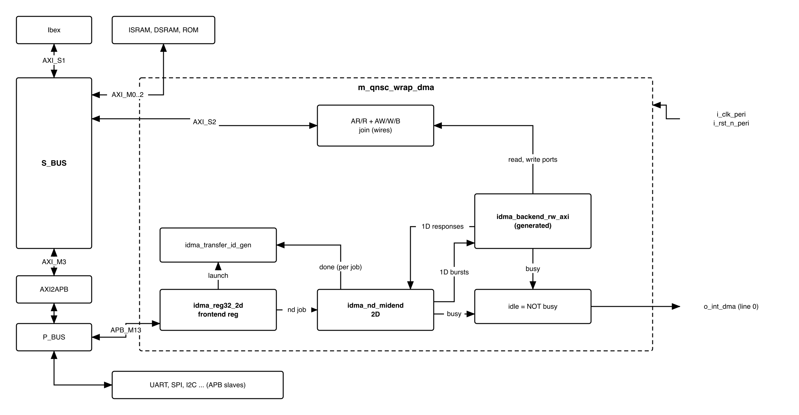
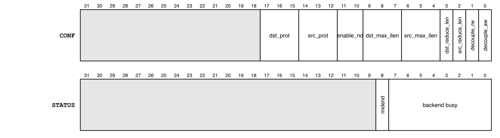
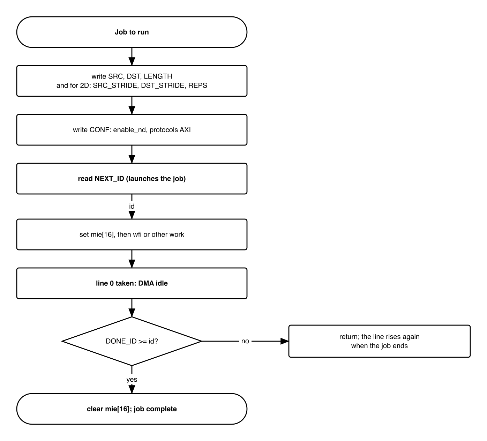
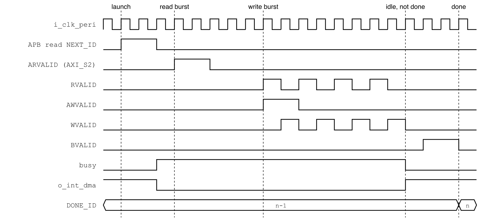

# Revision history

The reasoning behind each change, the V1.0--V2.0 history, the V2.0 text and the
research report it was based on are in
[`QNSC_DMA_DECISIONS.md`](QNSC_DMA_DECISIONS.md).

| Version | Date | Author | Reviewer | Description of change |
|---|---|---|---|---|
| V3.0 | 2026-09-28 | Nghia VT (lead), for Ong Bao Vinh | -- | Upstream iDMA used unmodified (frontend `reg`, 32-bit, 2D, APB), per the mentor: open-source 32-bit DMA, IP not redesigned. In-house frontend, descriptor engine and peripheral channels of V2.0 removed; `APB_M13`; idle interrupt |
| V3.1 | 2026-09-28 | Nghia VT (lead) | -- | Section 4: the libraries iDMA needs (`common_cells`, `axi`, `apb`) |

# 1. Overview

The DMA copies blocks of data between any two addresses of QSOC without the CPU
executing a load and a store per word. Firmware writes a source, a destination and a
length, launches the job, and continues or sleeps until the DMA interrupt.

The fact that shapes it: it is **`pulp-platform/iDMA` used as released**. Frontend,
midend and backend are upstream; this block is a wrapper that joins them and
connects them to `APB_M13` and `AXI_S2`.

Every transfer is started by software. There is **no hardware request from
peripherals**: a peripheral is reached as an ordinary address through `S_BUS`,
`AXI2APB` and `P_BUS`.

Block directory `design/dma`, wrapper `m_qnsc_wrap_dma`, owner Ong Bao Vinh.

# 2. Features

- Memory-to-memory, memory-to-peripheral and peripheral-to-memory copies at any byte
  address and length -- 7.1.
- 2D jobs: `REPS` repetitions with independent source and destination strides; a
  stride of 0 reaches a FIFO data register -- 7.3.
- AXI4 bursts on `AXI_S2`, 32-bit data -- 7.2.
- Configuration on `APB_M13`, upstream register file -- 6.
- One level interrupt while the DMA is idle -- 7.4.

Use in QSOC: block copies between memories and buffers, and SPI host and SPI Device
data at high rates. UART and I2C are served by the CPU: at 113 636 baud a 16-byte
FIFO needs one interrupt every 1.4 ms.

# 3. Block diagram

{width=6.5in}

: Sub-blocks

| Block | Module | Source | Function |
|---|---|---|---|
| Frontend | `idma_reg32_2d` | upstream, generated (7.6) | APB register file; builds a 2D job; launches it on a read of `NEXT_ID` |
| Transfer IDs | `idma_transfer_id_gen` | upstream | Issues the job ID returned by `NEXT_ID`; counts completed jobs into `DONE_ID` |
| Midend | `idma_nd_midend` | upstream | Splits a 2D job into `REPS` 1D transfers |
| Backend | `idma_backend_rw_axi` | upstream, generated (7.6) | Executes a 1D transfer as AXI4 read and write bursts |
| Port join | in `m_qnsc_wrap_dma` | wires | Read port AR/R and write port AW/W/B onto one AXI port, `AXI_S2` |
| Idle | in `m_qnsc_wrap_dma` | one NOR | `o_int_dma` = no unit busy |

The block is in the `peri` clock cluster, `SCRC` `CLK_EN[10]`.

# 4. IP used

: Upstream IP used

| From | Module | Commit | Licence |
|---|---|---|---|
| `pulp-platform/iDMA` | `idma_reg.sv.tpl`, `idma_reg.rdl` (frontend), `idma_nd_midend`, `idma_transfer_id_gen`, backend templates, `idma_pkg` | `2e0b0fe5` | SHL-0.51 |
| `pulp-platform/common_cells` | `cc_stream_fifo_optimal_wrap`, `cc_passthrough_stream_fifo`, `cc_fall_through_register`, `cc_stream_fork`, `cc_stream_join`, `cc_popcount`, `cc_rr_arb_tree`; `registers.svh` | `db427693` (v2.0.0-beta.3+3), the copy `design/bus` uses; iDMA asks for 2.0.0-beta.3 | SHL-0.51 |
| `pulp-platform/axi` | `axi/typedef.svh` | `70b8e54f`, vendored | SHL-0.51 |
| `pulp-platform/apb` | `apb/typedef.svh` | `6ae8bf8d`, as iDMA pins | SHL-0.51 |

Facts this specification relies on, read at that commit:

- Backend protocols: AXI4, AXI4-Lite, AXI4-Stream, OBI, TileLink, Init (`src/db`).
  No APB, which QSOC does not need: the configuration port is the frontend's.
- The frontend template has an APB4 configuration port (`--cpuif apb4-flat`, the
  `idma.mk` default) and a 32-bit variant. It has **no interrupt** and no hardware
  request input.
- A read of `NEXT_ID` launches the job and returns the next transfer ID; one launch
  is held until the midend accepts it (`idma_reg.sv.tpl`, `launch_pending_q`).
- The frontend drives `burst = INCR` for source and destination (`idma_reg.sv.tpl`).
- `idma_rt_midend` launches on a time counter, not on a peripheral event; it is not used.

# 5. Interface

: DMA interface

| Signal | Dir | Width | Description |
|---|---|---:|---|
| `i_clk_peri`, `i_rst_n_peri` | in | 1 | `SCRC` `o_clk_dma`, `o_rst_n_dma` |
| `i_bus_apb_psel`, `i_bus_apb_penable`, `i_bus_apb_pwrite` | in | 1 | `P_BUS` `APB_M13` |
| `i_bus_apb_paddr` | in | 12 | Offset in the window (contract `meta.apb_paddr_width`) |
| `i_bus_apb_pwdata`, `i_bus_apb_pstrb`, `i_bus_apb_pprot` | in | 32, 4, 3 | APB4 |
| `o_bus_apb_prdata`, `o_bus_apb_pready`, `o_bus_apb_pslverr` | out | 32, 1, 1 | APB4 response |
| `o_bus_axi_ar_*`, `i_bus_axi_r_*` | -- | AXI4 | Read channels to `S_BUS` `AXI_S2`, from the backend read port |
| `o_bus_axi_aw_*`, `o_bus_axi_w_*`, `i_bus_axi_b_*` | -- | AXI4 | Write channels to `AXI_S2`, from the backend write port |
| `o_int_dma` | out | 1 | 1 while the DMA is idle -- 7.4. To `INTMAP` `i_int_dma`, line 0 |

: Configuration, fixed at the instances in `m_qnsc_wrap_dma`

| Parameter | Value | Why |
|---|---|---|
| Frontend | `reg32_2d`, `apb4-flat`, 1 register port, 1 stream | 32-bit system, 2D for the stride-0 case; one job stream |
| `DataWidth`, `AddrWidth` | 32, 32 | QSOC bus widths |
| `AxiIdWidth` | 5 | `AXI_S2` ID width assumed by `S_BUS` (`QNSC_BUS_MAS` 11) |
| `TFLenWidth` | 32 | `LENGTH` is a 32-bit register |
| `NumAxInFlight`, `BufferDepth` | 2, 2 | Backend template defaults |
| `ErrorCap` | `NO_ERROR_HANDLING` | No error-handler port -- 7.5 |
| `HardwareLegalizer`, `RejectZeroTransfers` | 1, 1 | Bursts split at 4 KiB and to legal lengths; a zero-length job is dropped |
| `EnableCompute` | 0 | No on-the-fly compute; `COMPUTE_CFG` has no effect |

# 6. Register map

<!-- gen:memory_map ports=APB_M13 -->
: Memory map, regions behind APB_M13

| Base | Size | Region | Port | Kind | Note |
|---|---|---|---|---|---|
| `0x80034000` | 16 KiB | `dma_cfg` | APB_M13 | peripheral | Register interface of the DMA |
<!-- /gen -->

The frontend decodes offset bits 7:0, so the map repeats every 256 bytes in the
window. All registers are 32-bit; an offset with no register reads 0.

: Register map, `idma_reg32_2d`

| Offset | Register | Access | Reset | Description |
|---|---|---|---|---|
| `0x00` | `CONF` | RW | 0 | Job options, Figure 6-1 |
| `0x04` | `STATUS` | RO | 0 | `busy`: bit 8 midend, bits 7:0 the eight backend units of `idma_busy_t`; bit 9 reads 0 |
| `0x08`--`0x40` | `STATUS` of streams 1--15 | RO | 0 | Not present; read 0 |
| `0x44` | `NEXT_ID` | RO, read has effect | 0 | **Read launches the job** and returns its ID |
| `0x48`--`0x80` | `NEXT_ID` of streams 1--15 | RO | 0 | Not present; read 0, launch nothing |
| `0x84` | `DONE_ID` | RO | 0 | ID of the last completed job |
| `0x88`--`0xC0` | `DONE_ID` of streams 1--15 | RO | 0 | Not present |
| `0xD0` | `DST_ADDR` | RW | 0 | Destination byte address |
| `0xD4` | `SRC_ADDR` | RW | 0 | Source byte address |
| `0xD8` | `LENGTH` | RW | 0 | Bytes per 1D transfer |
| `0xDC` | `DST_STRIDE` | RW | 0 | Destination address step between repetitions |
| `0xE0` | `SRC_STRIDE` | RW | 0 | Source address step between repetitions |
| `0xE4` | `REPS` | RW | 0 | Number of repetitions (2D) |
| `0xE8` | `COMPUTE_CFG` | RW | 0 | No effect (`EnableCompute` = 0) |

{width=6.5in}

: `CONF` fields

| Bits | Field | QSOC value | Meaning |
|---|---|---|---|
| 0 | `decouple_aw` | 0 | Write address may be issued before read data; 0 = coupled |
| 1 | `decouple_rw` | 0 | Read and write decoupled; 0 = coupled |
| 2, 3 | `src_reduce_len`, `dst_reduce_len` | 0 | 1 limits the burst to `2^max_llen` beats |
| 6:4, 9:7 | `src_max_llen`, `dst_max_llen` | 0 | Log2 of the maximum burst length when reduced |
| 11:10 | `enable_nd` | 0 or 1 | 1 = 2D job (`REPS`, strides used) |
| 14:12, 17:15 | `src_protocol`, `dst_protocol` | 0 | 0 = AXI, the only backend protocol |
| 31:18 | -- | 0 | Reserved |

# 7. Functional behaviour

## 7.1 Job

{width=4.6in}

- A 1D job copies `LENGTH` bytes from `SRC_ADDR` to `DST_ADDR`, both incrementing.
  Addresses and length need no alignment; the backend handles the byte offsets.
- A 2D job (`enable_nd` = 1) copies `REPS` blocks of `LENGTH` bytes; block *k* starts
  at `SRC_ADDR` + *k* x `SRC_STRIDE` and `DST_ADDR` + *k* x `DST_STRIDE`.
- Reading `NEXT_ID` samples the registers and launches the job; the registers may be
  rewritten at once.
- The frontend holds one launch until the midend accepts it; a second read of
  `NEXT_ID` before that is lost. Firmware runs one job at a time: it launches the next
  job after `DONE_ID` has reached the previous ID.
- `DONE_ID` is the ID of the last job completed. A job with ID *i* is complete when
  `DONE_ID` >= *i*, modulo 2^32.

## 7.2 Bus traffic

{width=6.4in}

- Reads and writes use INCR bursts on `AXI_S2`, split at 4 KiB boundaries.
- With the `ISRAM`/`DSRAM` controller, a read burst returns one beat every 2 cycles
  and a write burst takes one beat per cycle (`QNSC_RAM_MAS` 7.1): about 2 cycles per
  word, against about 10 for a CPU copy loop (estimate, not simulated).
- A peripheral address goes through `AXI_M3`, `AXI2APB` and `P_BUS`: one APB access
  per beat.
- The DMA and Ibex share `S_BUS`; the crossbar arbitrates between them.

## 7.3 Peripheral FIFO: stride 0

A FIFO data register is reached with a 2D job whose peripheral-side stride is 0:

: Examples

| Job | `SRC_ADDR` | `DST_ADDR` | `LENGTH` | `REPS` | `SRC_STRIDE` | `DST_STRIDE` |
|---|---|---|---|---:|---:|---:|
| 16 bytes to `UART0` THR | buffer | `0x8002_0000` | 1 | 16 | 1 | 0 |
| 16 bytes from `UART0` RBR | `0x8002_0000` | buffer | 1 | 16 | 0 | 1 |
| 4 KiB memory copy (1D) | source | destination | 4096 | -- | -- | -- |

Firmware starts a FIFO job only when the FIFO has room or data for all `REPS`
entries, for example from the peripheral's FIFO interrupt. Nothing paces the DMA by
the peripheral.

## 7.4 Interrupt

- `o_int_dma` = 1 while neither the midend nor any backend unit is busy (`STATUS` =
  0). It is a level, 1 out of reset.
- Firmware enables `mie` bit 16 after launching, and the handler compares `DONE_ID`
  with the launched ID: equal or later, the job is done and the handler clears
  `mie[16]`; earlier, the line was sampled before the job became busy and the handler
  returns.
- Line 0 is the highest-priority fast line (`QNSC_Interrupt_Map_MAS` 7.2).

## 7.5 Errors

- `LENGTH` = 0 is not a job: firmware does not launch one.
- With `ErrorCap` = `NO_ERROR_HANDLING`, an AXI error response on `AXI_S2` (decode
  error, `SLVERR` from the ROM or a blocked peripheral) is not reported: the job
  completes and `DONE_ID` advances.

## 7.6 Generated files

The frontend and the backend are generated once, at the pinned commit, and committed
with the command that made them in `util/gen/idma/`:

- `idma_reg32_2d_reg_top.sv`, `idma_reg32_2d_reg_pkg.sv`: PeakRDL `regblock` on
  `idma_reg.rdl`, `SysAddrWidth=32 NumDims=2 Log2NumDims=1`, `--cpuif apb4-flat`.
- `idma_reg32_2d_top.sv`: `gen_idma.py` on `idma_reg.sv.tpl`.
- `idma_backend_rw_axi.sv`, `idma_legalizer_rw_axi.sv`, `idma_transport_layer_rw_axi.sv`:
  `gen_idma.py` on the backend templates, `--ids rw_axi`.

None is edited by hand. `design/dma/rtl/` holds the wrapper only.

## 7.7 Clock and reset

- Clock `o_clk_dma`, gateable by `CLK_EN[10]`; reset `o_rst_n_dma`, released with the
  other domains (`QNSC_SCRC_MAS` 7.5).
- The `SCRC` APB guard covers `APB_M13` only. Before gating the DMA, firmware waits
  until `STATUS` = 0, so no burst is cut on `S_BUS` (`QNSC_SCRC_MAS` 7.10).

# 8. Instances

One `m_qnsc_wrap_dma` in `design/top`.

# 9. What is not provided here, and who provides it

: Functions this block does not provide

| Function | Where it lives |
|---|---|
| Hardware request from a peripheral | not provided; firmware starts every job from the peripheral's interrupt (7.3) |
| Descriptor chains, circular buffers | not provided; firmware launches the next job |
| Reporting an AXI error | not provided (7.5) |
| Memory fill without a source | not provided; copy from a zero buffer |
| Routing `AXI_S2` to memories and `AXI_M3` | `S_BUS` |

# 10. Tie-offs

: Tie-offs inside `m_qnsc_wrap_dma`

| Port | Tied to | Why |
|---|---|---|
| Frontend `midend_busy_i` | midend `busy_o` | Reported in `STATUS[8]` |
| Backend error-handler request | none (`NO_ERROR_HANDLING` has no port) | 7.5 |
| AXI `user` on every channel | 0 | Not used on `S_BUS` |
| AXI `ar_prot`, `aw_prot` | as driven by the backend | Not checked by any QSOC slave |

# 11. Requirements on others, and open items

: Requirements on other owners

| Item | Owner | What it blocks |
|---|---|---|
| `AXI_S2` ID width 5; `AXI_S2` reaches `AXI_M0`--`AXI_M3` | bus owner | 7.2 |
| UART wrapper drops `o_dma_tx_req`, `o_dma_rx_req` and the patch `0001-add-dma-request-lines` | UART owner | a vendor patch that nothing uses |
| Contract: close tbd "DMA peripheral channel for each requester"; interrupt line 0 note: idle level | lead | contract matching this block |

: HAS text this specification departs from

| `QSOC_HAS_Report_EN_v4_final` Table 10-1/10-2 says | This specification | Why |
|---|---|---|
| Three modes: register job, descriptor chain, eight peripheral channels | upstream frontend `reg` only | Mentor: open-source DMA, IP not redesigned; QSOC peripherals are slow enough for CPU-paced jobs |
| Configuration port `APB_M14` at `0x8003_8000` | `APB_M13` at `0x8003_4000` | Contract since `GPIO3` was dropped |
| `DMA_ISR` write-1-to-clear flags, `IRQ_MODE` | idle level from `STATUS` | The upstream frontend has no interrupt; an idle level needs no register |
| `axi_mux` 3:1 onto `AXI_S2` | wires | Without a descriptor fetch port only the read and write ports remain, on disjoint channels |

Open items, DMA owner:

- Generate the files of 7.6 and commit them with the commands.
- Add the `cc_*` modules of section 4 to the `common_cells` copy, and vendor `apb`.
- Run the upstream `rw_axi` backend jobs and a wrapper test in simulation.

Accepted limits:

- No AXI error is visible to software (7.5).
- A FIFO job is paced by firmware, not by the peripheral (7.3).
- One job at a time (7.1).

# 12. Verification

1. `DMA_001` Register reset values, access and the 256-byte alias of section 6.
2. `DMA_002` A 1D job copies `LENGTH` bytes for unaligned addresses and lengths 1, 3,
   4, 5, 4096 and across a 4 KiB boundary.
3. `DMA_003` A 2D job with `DST_STRIDE` = 0 writes one address `REPS` times, in order.
4. `DMA_004` Two jobs, each launched after `DONE_ID` reached the previous ID, complete
   in order and `DONE_ID` reaches each ID.
5. `DMA_005` A read of `NEXT_ID` while a launch is still held changes nothing (documents
   the limit of 7.1).
6. `DMA_006` `o_int_dma` is 1 exactly while `STATUS` = 0.
7. `DMA_007` A job to `UART0` at `0x8002_0000` through `S_BUS` and `P_BUS` (SoC test).
8. `DMA_008` Ibex and the DMA both reach `ISRAM` during a job; both complete (SoC test).
9. `DMA_009` The generated files match a regeneration from the pinned commit (CI).

# Appendix A. Acronyms

: Acronyms

| Acronym | Description |
|---|---|
| DMA | Direct Memory Access |
| iDMA | pulp-platform's modular DMA engine |
| INCR | AXI incrementing burst |
| ND | N-dimensional (here 2D) transfer |

# Appendix B. First review

: First review

| Item | Reviewer | Response |
|---|---|---|
| Use an open-source 32-bit DMA; do not redesign the IP | Quan (mentor) | Upstream iDMA unmodified, 3, 4 |
| iDMA has no hardware request from peripherals | Vinh (research) | Correct; QSOC does not need it, 1, 9 |
| Is an APB backend needed to reach the peripherals? | Vinh | No: peripherals are addresses behind `S_BUS`, 1 |
| What is the DMA for if the CPU starts every job? | Vinh | Block copies and fast SPI without a CPU load/store per word; one interrupt per job, 2, 7.2 |
| `APB_M14` against contract `APB_M13` | lead, V3.0 | 6 |
