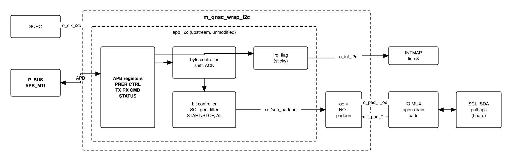
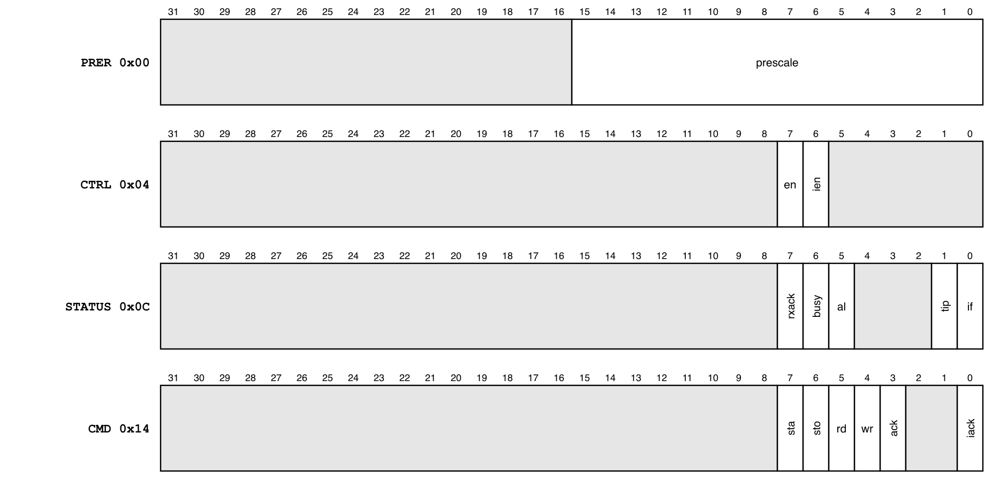
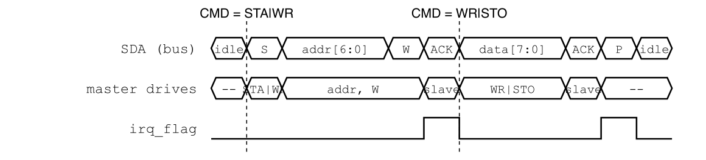

# Revision history

The reasoning behind each change, and the research report this specification is
built on, are in [`QNSC_I2C_DECISIONS.md`](QNSC_I2C_DECISIONS.md).

| Version | Date | Author | Reviewer | Description of change |
|---|---|---|---|---|
| V3.0 | 2026-09-28 | Nghia VT (lead), for Ong Bao Vinh | -- | Specification written from the research report: upstream `apb_i2c` unmodified (the DMA registers `TXCMD`/`RXCMD` dropped), wrapper `m_qnsc_wrap_i2c`, open-drain as output enables to the IO MUX, 20 MHz prescaler values |

# 1. Overview

`I2C` is one instance of `pulp-platform/apb_i2c`, an I2C **master** built on the
OpenCores I2C core: START, repeated START, STOP, ACK and NACK, clock stretching,
multi-master clock synchronisation and arbitration-loss detection.

The fact that shapes it: firmware drives the bus **one byte per command**. It writes
a byte and a command, waits for the interrupt flag, and issues the next; the core
has no FIFO.

The block is not an I2C slave, and has no DMA request.

Block directory `design/i2c`, wrapper `m_qnsc_wrap_i2c`, owner Ong Bao Vinh.

<!-- gen:memory_map ports=APB_M11 -->
: Memory map, regions behind APB_M11

| Base | Size | Region | Port | Kind | Note |
|---|---|---|---|---|---|
| `0x8002C000` | 16 KiB | `i2c` | APB_M11 | peripheral |  |
<!-- /gen -->

Interrupt: fast line 3, `mcause` 19. `SCRC` domain `i2c`, `CLK_EN[8]`.

# 2. Features

- Standard mode (100 kHz) and fast mode (400 kHz) from a 16-bit prescaler -- 7.2.
- One command per byte: START, STOP, read, write, ACK or NACK -- 7.1.
- Clock stretching by the slave; SCL synchronisation with another master -- 7.3.
- Arbitration loss and bus-busy status -- 7.3.
- One level interrupt, set on every completed command and on arbitration loss -- 7.4.
- Zero-wait-state APB, never an error -- 6.

# 3. Block diagram

{width=6.5in}

: Sub-blocks

| Block | Module | Function |
|---|---|---|
| Registers | `apb_i2c` | APB slave, 6 registers, interrupt flag |
| Byte controller | `i2c_master_byte_ctrl` | Executes one command: shifts a byte, handles ACK |
| Bit controller | `i2c_master_bit_ctrl` | SCL generation, input filter, START/STOP detection, stretching, arbitration |
| Output enables | in `m_qnsc_wrap_i2c` | `o_pad_i2c_*_oe` = NOT `*_padoen_o`: 1 drives the line low |

The block is in the `peri` clock cluster.

# 4. IP used

: Upstream IP used

| From | Module | Commit | Licence |
|---|---|---|---|
| `pulp-platform/apb_i2c` | `apb_i2c`, `i2c_master_byte_ctrl`, `i2c_master_bit_ctrl` | `84855413` | OpenCores notice in the controller files; no LICENSE file upstream |

Facts this specification relies on, read in the vendored source:

- `PADDR[5:2]` is decoded; `PREADY` = 1 and `PSLVERR` = 0 always (`apb_i2c.sv`).
- `scl_pad_o` and `sda_pad_o` are constant 0 (`i2c_master_bit_ctrl.sv`): a line is
  either driven low or released.
- The interrupt flag is sticky: set by a completed command or arbitration loss,
  cleared by `CMD.IACK`; `interrupt_o` = flag AND `CTRL.IEN`, from a flip-flop.
- `CMD` is written only while `CTRL.EN` = 1.

# 5. Interface

: `m_qnsc_wrap_i2c` interface

| Signal | Dir | Width | Description |
|---|---|---:|---|
| `i_clk_peri`, `i_rst_n_peri` | in | 1 | `SCRC` `o_clk_i2c`, `o_rst_n_i2c` |
| `i_bus_apb_psel`, `i_bus_apb_penable`, `i_bus_apb_pwrite` | in | 1 | `P_BUS` `APB_M11` |
| `i_bus_apb_paddr` | in | 12 | Offset in the window (contract `meta.apb_paddr_width`) |
| `i_bus_apb_pwdata` | in | 32 | Write data |
| `i_bus_apb_pstrb`, `i_bus_apb_pprot` | in | 4, 3 | Not used |
| `o_bus_apb_prdata`, `o_bus_apb_pready`, `o_bus_apb_pslverr` | out | 32, 1, 1 | `pready` = 1, `pslverr` = 0 |
| `o_int_i2c` | out | 1 | `interrupt_o`, level -- 7.4. To `INTMAP` `i_int_i2c` |
| `i_pad_i2c_scl`, `i_pad_i2c_sda` | in | 1 | Line level, from the pad |
| `o_pad_i2c_scl_oe`, `o_pad_i2c_sda_oe` | out | 1 | 1 = drive the line low; 0 = release. The pad drives 0 when enabled |

# 6. Register map

The core decodes offset bits 5:2: offsets `0x18`--`0x3C` read 0 and ignore writes,
and the 64-byte map repeats every 64 bytes in the window. No access returns an error.

: Register map

| Offset | Register | Access | Reset | Description |
|---|---|---|---|---|
| `0x00` | `PRER` | RW | 0 | Prescaler, bits 15:0 -- 7.2 |
| `0x04` | `CTRL` | RW | 0 | Bit 7 `EN` core enable, bit 6 `IEN` interrupt enable |
| `0x08` | `RX` | RO | 0 | Last byte received |
| `0x0C` | `STATUS` | RO | 0 | Figure 6-1 |
| `0x10` | `TX` | RW | 0 | Byte to send: data, or address and R/W bit |
| `0x14` | `CMD` | RW | 0 | Command, Figure 6-1. Writable only while `EN` = 1 |

{width=6.5in}

: `STATUS` and `CMD` fields

| Register | Bit | Name | Meaning |
|---|---|---|---|
| `STATUS` | 7 | `RXACK` | 1 = the slave did not acknowledge (NACK) |
| `STATUS` | 6 | `BUSY` | A START has been seen on the bus and no STOP yet, from any master |
| `STATUS` | 5 | `AL` | Arbitration lost; held until the next START |
| `STATUS` | 1 | `TIP` | A transfer is in progress |
| `STATUS` | 0 | `IF` | Interrupt flag |
| `CMD` | 7 / 6 | `STA` / `STO` | Generate START (or repeated START) / STOP |
| `CMD` | 5 / 4 | `RD` / `WR` | Read / write one byte |
| `CMD` | 3 | `ACK` | When reading: 0 = send ACK, 1 = send NACK |
| `CMD` | 0 | `IACK` | Write 1 to clear `IF` |

`CMD` bits 7:4 clear themselves when the command ends or arbitration is lost;
`IACK` clears after one cycle.

# 7. Functional behaviour

## 7.1 Commands

{width=6.4in}

Each command moves one byte and ends by setting `IF`. START and STOP travel with
the byte command they belong to.

: Command sequences

| Transaction | Writes, each followed by waiting for `IF` and writing `CMD` = `IACK` |
|---|---|
| Write register *r* of slave *a* with *d* | `TX` = *a*<<1, `CMD` = `STA`\|`WR` -- `TX` = *r*, `CMD` = `WR` -- `TX` = *d*, `CMD` = `WR`\|`STO` |
| Read register *r* of slave *a* | `TX` = *a*<<1, `CMD` = `STA`\|`WR` -- `TX` = *r*, `CMD` = `WR` -- `TX` = (*a*<<1)\|1, `CMD` = `STA`\|`WR` -- `CMD` = `RD`\|`ACK`\|`STO`, then read `RX` |

After each write command firmware checks `STATUS.RXACK` = 0; after each command it
checks `STATUS.AL` = 0.

## 7.2 SCL frequency

- A bit takes 4 phases of (`PRER` + 1) cycles, plus the input filter delay and the
  rise time of the line:
  *T*~SCL~ ≈ [4 (`PRER` + 1) + 2 ((`PRER` >> 2) + 1) + 3] x 50 ns + *t*~rise~.
- The OpenCores rule `PRER` = f / (5 f~SCL~) - 1 overshoots: at 100 kHz it gives
  about 109 kHz.

: Prescaler at 20 MHz (estimate without rise time)

| Mode | `PRER` | *f*~SCL~, estimated |
|---|---:|---:|
| Standard, 100 kHz | 44 | 96.6 kHz |
| Fast, 400 kHz | 10 | 377 kHz |

The rise time only lowers the frequency; `I2C_003` measures it.

## 7.3 Bus conditions

- **Clock stretching**: after releasing SCL the core waits until the line is high.
- **Multi-master**: a falling SCL driven by another master restarts the local phase,
  so both masters share one SCL.
- **Arbitration**: releasing SDA for a 1 and reading 0, or an unexpected STOP,
  sets `AL` and `IF`; the core releases both lines and ends the command.
- **Busy**: `BUSY` follows START and STOP on the bus, whoever sends them.

## 7.4 Interrupt

- `o_int_i2c` = `IF` AND `IEN`, a level from a flip-flop. `IF` is set by the end of
  every command and by arbitration loss, and is cleared only by `CMD.IACK`.
- With `IEN` = 0 firmware polls `STATUS.IF`.

## 7.5 Pads

- Each line is open drain: `o_pad_i2c_*_oe` = 1 pulls it low, 0 releases it; the
  board pull-up makes it high. `i_pad_i2c_*` is the line level, so the core sees the
  wired-AND of every device.
- The inputs pass the core's own synchroniser and filter.

# 8. Instances

One `m_qnsc_wrap_i2c` in `design/top`.

# 9. What is not provided here, and who provides it

: Functions this block does not provide

| Function | Where it lives |
|---|---|
| I2C slave mode | not provided |
| FIFO, DMA request | not provided; one command per byte |
| Open-drain pad cells, pull-ups | IO MUX and pads; board |
| 10-bit addressing | firmware: two address bytes |

# 10. Tie-offs

None. Every core port reaches a wrapper port; the wrapper inverts the two output
enables.

# 11. Requirements on others, and open items

: Requirements on other owners

| Item | Owner | What it blocks |
|---|---|---|
| Open-drain pads for SCL and SDA: drive 0 when `oe` = 1, high impedance otherwise; line level back on the input | IO MUX, pad owner | Every transfer |
| Pull-up resistors on SCL and SDA | board | Every transfer |

Open items, I2C owner: wrapper RTL, lint, and the tests of section 12.

Accepted limits:

- An access to an unused offset returns 0 without `PSLVERR`; the map aliases every
  64 bytes.
- The register layout differs from the original OpenCores map (separate `RX`/`TX` and
  `STATUS`/`CMD`); OpenCores drivers need new offsets.

# 12. Verification

1. `I2C_001` Reset values; `CMD` ignores writes while `EN` = 0.
2. `I2C_002` Write and read sequences of 7.1 against an I2C slave model, with ACK and NACK.
3. `I2C_003` SCL frequency for `PRER` = 44 and 10 with a modelled rise time.
4. `I2C_004` A slave stretching SCL delays the bit without error.
5. `I2C_005` Arbitration against a second master: `AL` and `IF` set, both lines released.
6. `I2C_006` `o_int_i2c` follows `IF` AND `IEN`; `IACK` clears it.
7. `I2C_007` `o_pad_i2c_*_oe` is never 1 while the core releases the line (open-drain rule).

# Appendix A. Acronyms

: Acronyms

| Acronym | Description |
|---|---|
| AL | Arbitration Lost |
| NACK | Not acknowledged |
| SCL, SDA | Serial clock, serial data |

# Appendix B. First review

: First review

| Item | Reviewer | Response |
|---|---|---|
| `dma_last_i` floating in the wrapper | Vinh (research, F1) | DMA registers dropped with the patch |
| DMA request ports not brought out | Vinh (research, F2) | Not needed: `QNSC_DMA_MAS` V3.0 has no hardware request |
| OpenCores prescaler rule overshoots | Vinh (research, F3) | 7.2 |
| `1'bz` in the wrapper is not synthesisable | Vinh (research, F5) | Output enables to the IO MUX, 7.5 |
| Alias every 64 B, no `PSLVERR` | Vinh (research, F7) | Accepted limit |
| Register map differs from OpenCores | Vinh (research, F9) | Accepted limit |
| Wrapper name, clock names, address width | lead, V3.0 | `m_qnsc_wrap_i2c`, `i_clk_peri`, 12-bit `PADDR` |
