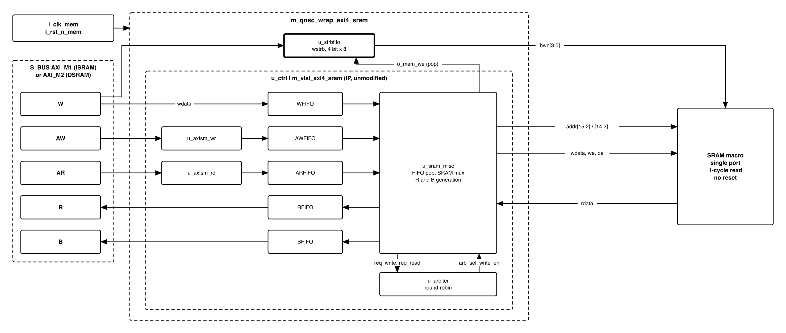

# Revision history

The reasoning behind each change is in [`QNSC_RAM_DECISIONS.md`](QNSC_RAM_DECISIONS.md).

| Version | Date | Author | Reviewer | Description of change |
|---|---|---|---|---|
| V2.0 | 2026-09-23 | Nghia VT | -- | Rewritten as specification only; memory map generated from the contract |
| V2.1 | 2026-09-24 | Nghia VT | -- | `ISRAM` contents survive every reset except power loss. `PARA_ID_WD` = 7, from the HAS |
| V2.2 | 2026-09-24 | Nghia VT | -- | Wrapper interface, strobe FIFO, timing, reset and tie-offs specified; figure and macro address corrected |
| V2.3 | 2026-09-25 | Nghia VT | -- | Port names to `QNSC_RTL_Design_Naming_Rule` V1.0: AXI named per channel (`i_bus_axi_aw_valid`, ...), macro port `o_mem_*` / `i_mem_rdata` (was `o_sram_*`, `o_sram_bwe` is `o_mem_be`). No change in behaviour |

# 1. Overview

`ISRAM` and `DSRAM` are the on-chip RAMs of QSOC. Each is one instance of
`m_qnsc_wrap_axi4_sram`: the upstream `AXI4-SRAM-CONTROLLER`, unmodified, plus a
write-strobe FIFO, in front of an SMIC 28 nm single-port SRAM macro. The block does
not decode addresses, never returns an error response, and has no registers.

<!-- gen:memory_map ports=AXI_M1,AXI_M2 -->
: Memory map, regions behind AXI_M1 and AXI_M2

| Base | Size | Region | Port | Kind | Note |
|---|---|---|---|---|---|
| `0x20000000` | 4 KiB | `isram_dbg` | AXI_M1 | memory | The debug window: the first 4 KiB of ISRAM, not a block of its own |
| `0x20001000` | 60 KiB | `isram` | AXI_M1 | memory | The downloaded application |
| `0x30000000` | 32 KiB | `dsram` | AXI_M2 | memory | Stack, heap and variables |
<!-- /gen -->

`isram_dbg` and `isram` are one macro on one port; the block sees one 64 KiB region.

File `design/ram/rtl/m_qnsc_wrap_axi4_sram.sv`, owner Nghia Van Trong.

# 2. Features

- **AXI4 subordinate**, 32-bit data and address, 7-bit ID, on `AXI_M1` or `AXI_M2`.
- **Bursts** `INCR` of 1 to 256 beats and `FIXED` of 1 to 16 (the AXI4 limit); responses in order -- 7.1, 7.2.
- **Byte, halfword and word writes** through `WSTRB` -- 7.3.
- **Eight-entry FIFO** on every channel; one SRAM read in flight -- 7.1.
- **64 KiB `ISRAM`** and **32 KiB `DSRAM`**, set by `PARA_SRAM_DEPTH` -- section 8.
- **Macro array not reset**: contents survive watchdog and software reset -- 7.6.

# 3. Block diagram

{width=6.5in}

Clock `i_clk_mem` and reset `i_rst_n_mem` come from the `mem` cluster. The clock is
never gated; the reset is asserted by power-on, watchdog and software reset.

# 4. IP used

: Upstream IP used

| From | Module | Commit | Licence |
|---|---|---|---|
| `nguyenquanicd/AXI4-SRAM-CONTROLLER` | `m_vlsi_axi4_sram` and four sub-modules | `503d7cd` | MentorProvided-QNSC-Course |
| SMIC 28 nm | single-port SRAM macro | PDK | foundry |

# 5. Interface

: RAM interface

| Signal | Dir | Width | Description |
|---|---|---:|---|
| `i_clk_mem` | in | 1 | `mem` cluster clock, 20 MHz |
| `i_rst_n_mem` | in | 1 | Asynchronous active-low reset, 7.6 |
| `i_bus_axi_aw_valid`, `o_bus_axi_aw_ready` | in, out | 1 | AW handshake. `awready` = address FSM idle and `AWFIFO` not full |
| `i_bus_axi_aw_addr`, `i_bus_axi_ar_addr` | in | 32 | Byte address |
| `i_bus_axi_aw_len`, `i_bus_axi_ar_len` | in | 8 | Beats minus one |
| `i_bus_axi_aw_burst`, `i_bus_axi_ar_burst` | in | 2 | `00` FIXED, `01` INCR; `10` and `11` see 7.4 |
| `i_bus_axi_aw_id`, `i_bus_axi_ar_id` | in | 7 | Returned on `bid`, `rid` |
| `i_bus_axi_w_valid`, `o_bus_axi_w_ready` | in, out | 1 | W handshake. `wready` = `WFIFO` not full |
| `i_bus_axi_w_data` | in | 32 | Write data |
| `i_bus_axi_w_strb` | in | 4 | Byte lane enables, 7.3 |
| `i_bus_axi_w_last` | in | 1 | Connected to the IP, not used, section 10 |
| `o_bus_axi_b_valid`, `i_bus_axi_b_ready` | out, in | 1 | B handshake. `bvalid` = `BFIFO` not empty |
| `i_bus_axi_ar_valid`, `o_bus_axi_ar_ready` | in, out | 1 | AR handshake. `arready` = address FSM idle and `ARFIFO` not full |
| `o_bus_axi_r_valid`, `i_bus_axi_r_ready` | out, in | 1 | R handshake. `rvalid` = `RFIFO` not empty |
| `o_bus_axi_r_data` | out | 32 | Read data |
| `o_bus_axi_b_id`, `o_bus_axi_r_id` | out | 7 | ID of the request |
| `o_bus_axi_b_resp`, `o_bus_axi_r_resp` | out | 2 | Always `00`, OKAY |
| `o_bus_axi_r_last` | out | 1 | Last beat of the burst |
| `o_mem_addr` | out | 14 / 13 | Word address, IP byte address `[15:2]` (`ISRAM`) or `[14:2]` (`DSRAM`) |
| `o_mem_wdata` | out | 32 | Write data |
| `o_mem_we` | out | 1 | High for one cycle per write beat |
| `o_mem_be` | out | 4 | Byte write enables, active high; bit *n* writes `wdata[8n+7:8n]`. Zero when `o_mem_we` = 0 |
| `o_mem_oe` | out | 1 | High in the read-issue cycle |
| `i_mem_rdata` | in | 32 | Read data, sampled in the cycle after `o_mem_oe` |

: RAM parameters

| Parameter | `ISRAM` | `DSRAM` | Meaning |
|---|---:|---:|---|
| `PARA_DATA_WD` | 32 | 32 | Data width in bits |
| `PARA_ADDR_WD` | 32 | 32 | AXI address width |
| `PARA_ID_WD` | 7 | 7 | AXI ID width, the `S_BUS` master-port ID width of HAS Table 5-1 |
| `PARA_LEN_WD` | 8 | 8 | `AxLEN` width |
| `PARA_FIFO_DEPTH` | 8 | 8 | Depth of all six FIFOs, a power of two |
| `PARA_SRAM_DEPTH` | 16384 | 8192 | Macro depth in words; sets the `o_mem_addr` width to `$clog2(PARA_SRAM_DEPTH)` |

# 6. Register map

**None.** Configuration is the parameters of section 5, fixed at elaboration.

# 7. Functional behaviour

## 7.1 FIFOs, arbitration and timing

: FIFO buffers

| FIFO | Width | Contents | Push | Pop |
|---|---|---|---|---|
| `AWFIFO` | `ADDR + ID + 1` | address, ID, last flag | write FSM, one per beat | write grant |
| `WFIFO` | `DATA` | write data | `wvalid & wready` | write grant |
| `STRBFIFO` | 4 | `wstrb` | `wvalid & wready` | `o_mem_we` |
| `ARFIFO` | `ADDR + ID + 1` | address, ID, last flag | read FSM, one per beat | read issue |
| `RFIFO` | `DATA + ID + 2 + 1` | data, ID, `RRESP`, last flag | cycle after read issue | `rvalid & rready` |
| `BFIFO` | `ID + 2` | ID, `BRESP` | write grant of a last beat | `bvalid & bready` |

A write is granted when `AWFIFO` and `WFIFO` are both non-empty; one entry is popped
from each and written to the macro in the same cycle. When a write and a read
request in the same cycle, the arbiter's round-robin toggle picks one; the toggle
flips after every grant. A lone request is granted in the cycle it appears.

A read is issued when `ARFIFO` is non-empty, `RFIFO` is not full and no read is
pending. At most one SRAM read is in flight: the address is presented in one cycle
and the data is pushed into `RFIFO` in the next.

`B` and `R` responses return in the order their addresses were accepted, each with
the ID of its request.

: Timing at the block ports, no contention, FIFOs empty

| Quantity | Value |
|---|---|
| `rvalid` after the AR handshake cycle, single beat | 4 cycles |
| `bvalid` after the AW handshake cycle, W accepted in the same cycle | 3 cycles |
| Read burst | 1 beat per 2 cycles |
| Write burst | 1 beat per cycle |
| Address handshakes on one channel, N-beat bursts | 1 per N + 2 cycles |

## 7.2 Burst address generation

: Burst address generation

| `AxBURST` | Next address |
|---|---|
| `00` FIXED | unchanged |
| `01` INCR | `addr + 4` |
| `10` WRAP, `11` reserved | `(addr + 4) & ~3` -- 7.4 |

The first beat uses `AxADDR` as given; the increment is 4 bytes whatever `AxSIZE`.
The last beat is flagged by a counter loaded from `AxLEN`; `WLAST` is not used.

The macro word address is IP address bits `[$clog2(PARA_SRAM_DEPTH)+1:2]`. Bits
`[1:0]` never reach the macro, so a single-beat access at an unaligned address
reads the containing word, or writes the bytes `WSTRB` selects in it.

## 7.3 Byte-enable path

The IP has no `WSTRB` input. The wrapper adds `u_strbfifo`, an `m_vlsi_fifo`
4 bits wide with `PARA_DEPTH` = `$clog2(PARA_FIFO_DEPTH)`, so it holds
`PARA_FIFO_DEPTH` entries, the same as `WFIFO`:

- **Push** `i_bus_axi_w_strb` on `i_bus_axi_w_valid & o_bus_axi_w_ready`, the `WFIFO` push.
- **Pop** on `o_mem_we`, which is the `WFIFO` pop.
- **Output** `o_mem_be = o_mem_we ? head : 4'b0000`.

`STRBFIFO` and `WFIFO` hold the same number of entries in every cycle, so the head
of `STRBFIFO` is the strobe of the beat being written. A beat with `wstrb` =
`4'b0000` writes no byte and still completes.

## 7.4 WRAP

`AxBURST` = `2'b10` or `2'b11` is accepted. `addr_wrap` in `m_vlsi_axfsm.sv`
computes `(addr + 4) & ~3`, which aligns the address and does not wrap it. For a
4-byte-aligned start address a WRAP burst produces the same addresses as INCR.

## 7.5 Error handling

`BRESP` and `RRESP` are always `2'b00`, OKAY. The block never returns `SLVERR` or
`DECERR`. Address bits above the macro word address are ignored.

## 7.6 Reset

`i_rst_n_mem` (asserted asynchronously, released synchronously by `SCRC`) resets every flip-flop in the controller and in
`u_strbfifo`: address FSMs to `S_IDLE`, FIFO pointers and storage to zero, the
arbiter toggle and the read-pending flag to zero. After reset `awready`, `arready`
and `wready` are 1, and `bvalid` and `rvalid` are 0. A transaction in flight when
reset asserts is dropped without a response.

The macro array has no reset and no clear-on-reset: its contents are unchanged by
any assertion of `i_rst_n_mem` while power is applied.

# 8. Instances

: The two instances

| Instance | Port | `PARA_SRAM_DEPTH` | `o_mem_addr` |
|---|---|---:|---|
| `ISRAM` | `AXI_M1` | 16384 | `[15:2]` |
| `DSRAM` | `AXI_M2` | 8192 | `[14:2]` |

The instances differ only in `PARA_SRAM_DEPTH`. Each decode window (section 1) equals its macro
size, so every routed address selects exactly one word.

# 9. What is not provided here, and who provides it

: Functions this block does not provide

| Function | Where it lives |
|---|---|
| Address decode, `DECERR` for unmapped addresses | `S_BUS` |
| `WRAP` bursts | Nowhere; masters must not issue them -- 7.4 |
| Narrow bursts (`AxSIZE` below 4 bytes with `AxLEN` above 0) | Nowhere -- 7.2 |
| Exclusive and locked access | Nowhere |
| Error detection, SECDED | Nowhere |
| Macro margin, retention and test pins | Physical design -- section 10 |
| `ISRAM` contents | ROM bootloader, or the host through `SYSDBG` |

# 10. Tie-offs

: Tie-offs

| Port | Tied to | Why |
|---|---|---|
| `S_BUS` `awsize`, `arsize` | open | The IP has no `AxSIZE`; the increment is 4 bytes |
| `S_BUS` `awprot`, `arprot`, `awcache`, `arcache`, `awlock`, `arlock`, `awqos`, `arqos` | open | No protection, cache, exclusive or QoS function |
| IP `i_wlast` | `i_bus_axi_w_last`, unused inside | The last beat comes from `AxLEN` |
| IP `BRESP`, `RRESP` source | `2'b00` inside the IP | No error source; firmware sees OKAY for every access |
| Macro margin pins | databook default | Margin at default |
| Macro retention pins | inactive | Retention off |
| Macro test and BIST pins | inactive | Test off |

# 11. Requirements on others, and open items

: Requirements on other owners

| Item | Owner | What it blocks |
|---|---|---|
| `CPU2AXI` carries the Ibex byte enables to `wstrb` | bus owner | Every sub-word CPU store -- 7.3 |
| `DECERR` for unmapped addresses; decode windows as Table 1-1 | bus owner | Out-of-range accesses -- 7.5 |
| `S_BUS` master-port ID width 7, equal to `PARA_ID_WD` | bus owner | Response ID matching |
| **Does the DMA issue `WRAP` or narrow bursts into RAM?** If yes, `axi_burst_unwrap` goes in front of this block | DMA owner | DMA transfers -- 7.2, 7.4 |
| First 4 KiB of `ISRAM` reserved, main image linked at `0x20001000` | firmware owner | The `SYSDBG` debug window |
| Macro pins tied as section 10 | physical design | Silicon function |

**Open:** timing and area of both instances after synthesis.

# 12. Verification

The IP's regression runs unchanged against the controller alone:
`nguyenquanicd/AXI4-SRAM-CONTROLLER` at `503d7cd98352378c09dff3930f7fdb0590ea643d`,
46 directed tests in `sim/vcs/tests/` on the Synopsys AXI VIP, self-checking in
`sim/vcs/env/axi_svt_basic_env.sv`. Its macro model `sim/vcs/env/m_vlsi_sram_sp.sv`
has no byte enables and resets its array; the checks below use a model with byte
enables and no reset.

Checks QSOC adds:

1. Each of the 15 non-zero `wstrb` patterns writes only its bytes; `0000` none -- 7.3.
2. Assertion: `STRBFIFO` and `WFIFO` occupancy are equal in every cycle -- 7.3.
3. A C program writing `uint8_t` and `uint16_t` data leaves neighbours intact -- 7.3.
4. Every value of the timing table of 7.1, measured at the block ports.
5. `B` and `R` return in acceptance order, each with its request's ID -- 7.1.
6. Against an independent address model, aligned WRAP gives INCR addresses -- 7.4.
7. `o_mem_addr` is `[15:2]` / `[14:2]`; an unaligned single beat hits its word -- 7.2.
8. `BRESP` and `RRESP` are `00` for every access -- 7.5.
9. Reset values of 7.6; a pattern survives an `i_rst_n_mem` pulse -- 7.6.
10. Macro pin tie-offs match the databook -- section 10.
11. The vendored `rtl/` files match commit `503d7cd` -- section 4.

# Appendix A. Acronyms

: Acronyms

| Acronym | Description |
|---|---|
| BWE | Byte write enable |
| FIFO | First-In, First-Out buffer |
| `DECERR` | AXI decode error response |
| `DSRAM` | Data RAM, 32 KiB on `AXI_M2` |
| `ISRAM` | Instruction RAM, 64 KiB on `AXI_M1` |
| SECDED | Single Error Correct, Double Error Detect |
| `SLVERR` | AXI slave error response |
| `WSTRB` | AXI write strobes, the byte enables |

# Appendix B. First review

: First review

| Item | Reviewer | Response |
|---|---|---|
| Too long, and the redundancy causes wrong information | Teacher, 2026-09-23 | Rewritten as specification only; the memory map is generated from `util/qsoc_contract.yml` |
| Is the missing `WSTRB` a defect in the IP? | -- | No. The IP's README states it as a boundary. The wrapper adds it -- 7.3 |
| Do the four passing `wrap_*` tests prove `WRAP` works? | -- | No. The IP's reference model computes the same address -- 7.4 |
| Is ROM the same block? | Teacher | No. Separate block `design/rom`, same controller with the write channel idle |
