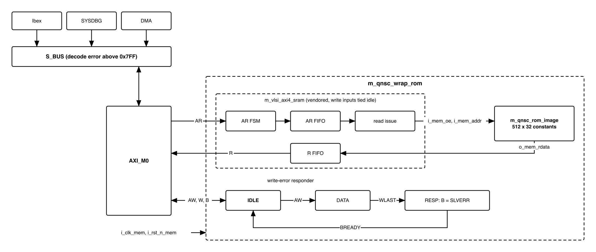
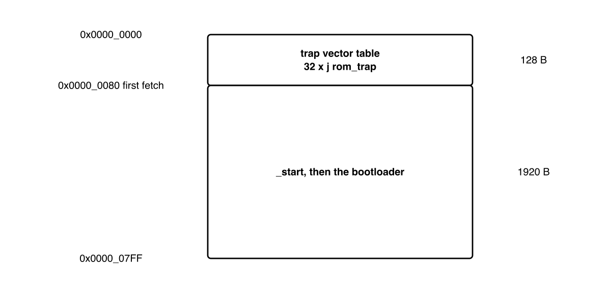
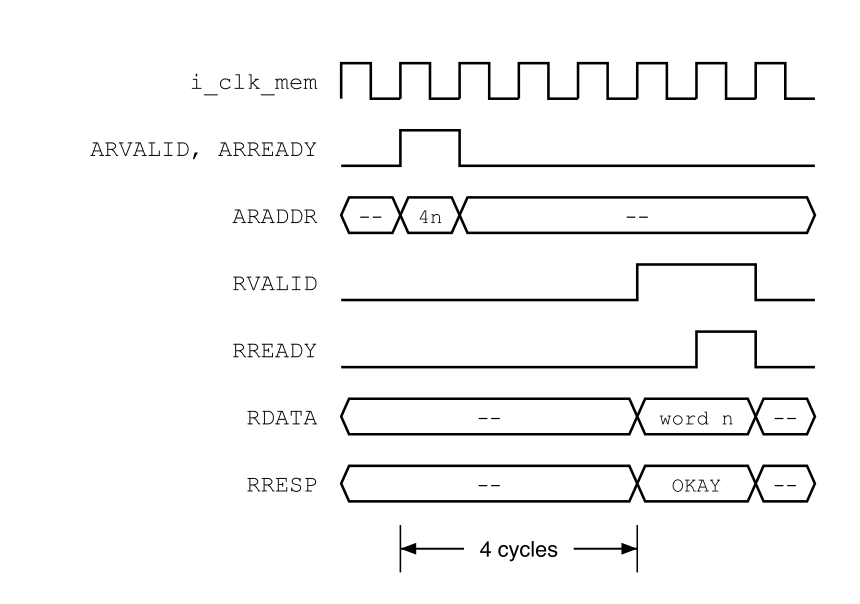
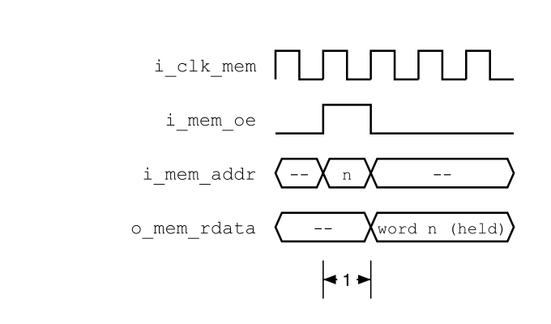
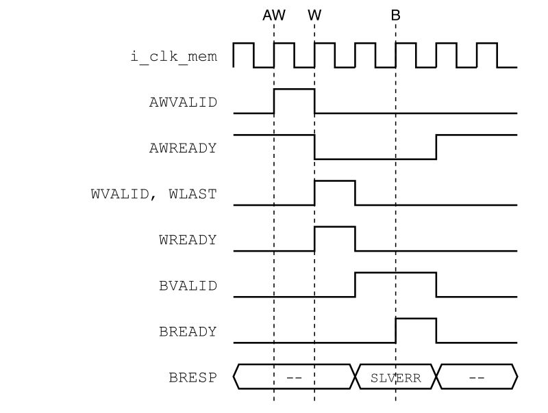

# Revision history

The reasoning behind each change, the V1.0--V2.1 history and the V2.1 text are in
[`QNSC_ROM_DECISIONS.md`](QNSC_ROM_DECISIONS.md).

| Version | Date | Author | Reviewer | Description of change |
|---|---|---|---|---|
| V3.0 | 2026-09-28 | Nghia VT (lead), for Nguyen Hao Nam | -- | V2.1 moved onto the MAS template: generated constant image instead of `$readmemh`, ports as `QNSC_RAM_MAS`, controller behaviour referenced, timing diagrams, monochrome figures |
| V3.1 | 2026-09-28 | Nghia VT | -- | Section 9: bootloader debugging is `QNSC_SYSDBG_MAS` 7.2 (was 7.1) |

# 1. Overview

The boot ROM is 2 KiB of read-only memory at `0x0000_0000` on `S_BUS` port
`AXI_M0`. QSOC has no Flash, so the ROM holds the only code present at reset:
Ibex fetches its first instruction from it.

The fact that shapes it: the libraries have **no mask ROM and no OTP**. The ROM is
the RAM's AXI controller in front of a constant array generated from the
bootloader image, with every write answered by an error.

This document is the ROM hardware and the layout Ibex forces on its contents.
What the bootloader does is `QNSC_BOOT_SPEC`.

Block directory `design/rom`, wrapper `m_qnsc_wrap_rom`, owner Nguyen Hao Nam.

# 2. Features

- 512 words of 32 bits at `0x0000_0000`--`0x0000_07FF` -- 6.
- Reads by the vendored AXI controller, INCR bursts up to 256 beats -- 7.1.
- Contents fixed at build time, as synthesisable constant logic -- 7.2.
- Every write answered with `SLVERR`, bursts of any length drained -- 7.3.
- Layout forced by Ibex: 128-byte trap vector table, first fetch at `0x80` -- 6.

# 3. Block diagram

{width=6.5in}

: Sub-blocks

| Block | Module | Function |
|---|---|---|
| AXI controller | `m_vlsi_axi4_sram`, vendored, not modified | AR/R handshake, burst addresses, read issue. Its write channel is tied idle |
| Image | `m_qnsc_rom_image`, generated | 512 x 32 constants, one-cycle read |
| Write-error responder | in `m_qnsc_wrap_rom` | Accepts AW and W, answers B with `SLVERR` |

The controller is the one `ISRAM` and `DSRAM` use, with the same parameters, so
`QNSC_RAM_MAS` 7.1, 7.2, 7.4 and 7.6 apply to the read path unchanged. The block
is in the `mem` clock cluster: clock never gated.

# 4. IP used

: Upstream IP used

| From | Module | Commit | Licence |
|---|---|---|---|
| `nguyenquanicd/AXI4-SRAM-CONTROLLER` | `m_vlsi_axi4_sram` and its sub-modules | `503d7cd9` | MentorProvided-QNSC-Course |

Controller facts relied on, at that commit: `o_sram_addr` is a byte address;
`i_sram_rdata` is sampled in the cycle after `o_sram_oe`; `RRESP` is always OKAY;
there is no `AxSIZE`, every beat is a full word.

# 5. Interface

: `m_qnsc_wrap_rom` interface

| Signal | Dir | Width | Description |
|---|---|---:|---|
| `i_clk_mem`, `i_rst_n_mem` | in | 1 | `SCRC` `o_clk_rom`, `o_rst_n_rom` |
| `i_bus_axi_ar_*`, `o_bus_axi_r_*` | -- | as `QNSC_RAM_MAS` Table 5-1 | To the controller |
| `i_bus_axi_aw_*`, `i_bus_axi_w_*`, `o_bus_axi_b_*` | -- | as `QNSC_RAM_MAS` Table 5-1 | To the responder. `w_strb` and `w_data` not used; `b_resp` always `2'b10` |

The RAM's macro ports `o_mem_*`, `i_mem_rdata` are internal here, to the image.

: `m_qnsc_rom_image` interface

| Signal | Dir | Width | Description |
|---|---|---:|---|
| `i_clk_mem` | in | 1 | Wrapper clock |
| `i_mem_oe` | in | 1 | Controller `o_sram_oe` |
| `i_mem_addr` | in | 9 | Word index, controller `o_sram_addr[10:2]` |
| `o_mem_rdata` | out | 32 | Word `i_mem_addr`, in the cycle after `i_mem_oe` = 1 |

: Controller parameters

| Parameter | Value |
|---|---:|
| `PARA_DATA_WD`, `PARA_ADDR_WD` | 32 |
| `PARA_ID_WD` | 7, as `ISRAM` and `DSRAM` |
| `PARA_LEN_WD`, `PARA_FIFO_DEPTH` | 8 |

# 6. Address map and layout

<!-- gen:memory_map ports=AXI_M0 -->
: Memory map, regions behind AXI_M0

| Base | Size | Region | Port | Kind | Note |
|---|---|---|---|---|---|
| `0x00000000` | 2 KiB | `rom` | AXI_M0 | memory | Boot code, read-only, executable |
<!-- /gen -->

{width=4.6in}

: ROM layout

| Offset | Size | Contents | Forced by |
|---|---|---|---|
| `0x000`--`0x07F` | 128 B | 32 x `j rom_trap`, each a 4-byte instruction | `mtvec` resets to `boot_addr_i` in vectored mode; causes 16--30 are the fast interrupts, 31 the NMI |
| `0x080`--`0x7FF` | 1920 B | `_start`, then the rest of the bootloader | Ibex fetches first from `{boot_addr_i[31:8], 8'h80}` |

Ibex `boot_addr_i` = `0x0000_0000` in normal boot. A trap while the bootloader runs
enters `rom_trap`, a loop left only by a reset.

# 7. Functional behaviour

## 7.1 Read

{width=4.6in}

- `RVALID` 4 cycles after the AR handshake; one beat every 2 cycles in a burst;
  one read in flight (`QNSC_RAM_MAS` 7.1). `RRESP` = OKAY.
- Burst addresses as `QNSC_RAM_MAS` 7.2 and 7.4.
- Address bits above `[10:2]` are ignored. `S_BUS` decodes the start address
  only, so an INCR burst that runs past `0x7FF` continues from word 0.

## 7.2 Image

{width=3.0in}

- `util/gen_rom.py` writes `m_qnsc_rom_image.sv` from `rom_image.hex`: a `case` over
  the 512 indices into an output register loaded when `i_mem_oe` = 1. No reset, no
  `initial`, no memory array: synthesis maps it to constant logic.
- `rom_image.hex` holds 512 words, one per line; word *n* is bytes 4*n* to 4*n*+3 of
  the bootloader binary, byte 4*n* in bits 7:0. Words past the binary are 0.
- The generator fails if the binary exceeds 2048 bytes. CI regenerates the module
  from the committed hex and fails on a difference.

## 7.3 Write-error responder

{width=4.4in}

The controller's write inputs are tied idle, so no write reaches the image. A
write to the ROM must still be answered, or its master waits forever.

1. **IDLE**: `AWREADY` = 1. On the AW handshake, store `AWID`.
2. **DATA**: `WREADY` = 1. Discard beats up to the one with `WLAST`.
3. **RESP**: `BVALID` = 1, `BID` = stored ID, `BRESP` = SLVERR, until `BREADY`.

W is accepted only after AW, which AXI allows. Reads continue meanwhile. A stray
write ends as a store access fault in Ibex, or an error at `SYSDBG` or DMA.

## 7.4 Reset

`i_rst_n_mem` asserts with every chip reset and releases with `S_BUS`, before the
CPU (`QNSC_SCRC_MAS` 7.5). Every `S_BUS` master is in reset whenever the ROM is,
so no access reaches it in reset. The responder resets to IDLE.

# 8. Instances

One `m_qnsc_wrap_rom` at `AXI_M0`.

# 9. What is not provided here, and who provides it

: Functions this block does not provide

| Function | Where it lives |
|---|---|
| Bootloader behaviour, its size budget and its build | `QNSC_BOOT_SPEC`; source `design/rom/boot/` |
| Decode error above `0x0000_07FF` | `S_BUS` |
| `boot_addr_i` and its debug-boot mux | CPU owner, `QNSC_SYSDBG_MAS` 11 |
| Debugging the bootloader from its first instruction | `QNSC_SYSDBG_MAS` 7.2 |

# 10. Tie-offs

: Controller ports tied inside `m_qnsc_wrap_rom`

| Port | Tied to | Why |
|---|---|---|
| `i_awvalid`, `i_wvalid` | 0 | No write reaches the image |
| `i_awaddr`, `i_awburst`, `i_awlen`, `i_awid`, `i_wdata`, `i_wlast` | 0 | Unused while the valids are 0 |
| `i_bready` | 1 | No B response is produced |
| `o_awready`, `o_wready`, `o_bid`, `o_bresp`, `o_bvalid`, `o_sram_wdata`, `o_sram_we` | open | Write path replaced by the responder |

# 11. Requirements on others, and open items

: Requirements on other owners

| Item | Owner | What it blocks |
|---|---|---|
| `AXI_M0` window exactly `0x0000_0000`--`0x0000_07FF`, no aliasing | bus owner | 6 |
| `boot_addr_i` = `0x0000_0000` in normal boot | CPU owner | 6 |

: HAS text this specification departs from

| `QSOC_HAS_Report_EN_v4_final` says | This specification | Why |
|---|---|---|
| Read-only by tying the write channel to the idle state | also a responder answering writes with `SLVERR` | A tied write channel never answers, so a stray write would hang its master |

Open items: `util/gen_rom.py` and the bootloader source `design/rom/boot/` are not
yet in the repository. ROM owner.

Accepted limit: an INCR read burst past `0x7FF` wraps to word 0 (7.1). Ibex, `SYSDBG`
and a correctly programmed DMA never issue one.

# 12. Verification

1. `ROM_001` After reset, every word reads as the matching word of `rom_image.hex`.
2. `ROM_002` INCR bursts of 1--16 beats return consecutive words, `RLAST` on the last,
   `RRESP` = OKAY.
3. `ROM_003` The first Ibex fetch after reset is at `0x0000_0080` and returns the first
   instruction of `_start`.
4. `ROM_004` Writes of 1, 2, 16 and 256 beats change no word and complete with
   `BRESP` = SLVERR and `BID` = `AWID`.
5. `ROM_005` Reads issued while a write is being answered complete normally.
6. `ROM_006` `util/gen_rom.py` fails on a binary above 2048 bytes; CI fails when the
   committed `m_qnsc_rom_image.sv` differs from its regeneration.
7. `ROM_007` `SYSDBG` (`AXI_S0`) reads every ROM word through `S_BUS`.
8. `ROM_008` `m_qnsc_rom_image.sv` contains no `initial` and no memory array; SYN
   reports no memory and no latch.

# Appendix A. Acronyms

: Acronyms

| Acronym | Description |
|---|---|
| NMI | Non-Maskable Interrupt |
| OTP | One-Time Programmable memory |
| SLVERR | AXI slave error response, `2'b10` |

# Appendix B. First review

: First review

| Item | Reviewer | Response |
|---|---|---|
| Reset vector is `boot_addr_i` + `0x80` | Sinh | 6 |
| ROM is 2 KiB; crossbar window must match | Sinh | 6, 11 |
| `o_sram_addr` is a byte address; the index belongs to the wrapper | Nam | 5 |
| All domains released together, CPU last | Quan (mentor) | 7.4 |
| `PARA_ID_WD` = 7 | RAM owner | 5 |
| A write to the ROM must not hang its master | Nam | 7.3 |
| Licence of AXI4-SRAM-CONTROLLER | mentor | 4 |
| Can the debugger read the ROM? | `SYSDBG` owner | yes, `ROM_007` |
| `initial $readmemh` does not synthesise to ASIC logic | lead, V3.0 | generated image, 7.2, `ROM_008` |
| Port names differed from `QNSC_RAM_MAS` for the same controller | lead, V3.0 | 5 |
| A burst past `0x7FF` wraps | lead, V3.0 | 7.1, accepted limit |
