# Revision history

The reasoning behind each change, the V1.0--V2.3 history and the V2.3 text are in
[`QNSC_SCRC_DECISIONS.md`](QNSC_SCRC_DECISIONS.md).

| Version | Date | Author | Reviewer | Description of change |
|---|---|---|---|---|
| V3.0 | 2026-09-27 | Nghia VT (lead), for Nguyen Hao Nam | -- | V2.3 moved onto the MAS template; Naming Rule ports; `APB_M0`/`APB_M1`; one SPI domain (bit 13 reserved); per-peripheral soft reset removed; WDT never gated; monochrome figures after the mentor's `VLSI_SCRC.drawio`; timing diagrams; deviations from the HAS listed |
| V3.1 | 2026-09-28 | Nghia VT (lead), for Nguyen Hao Nam | -- | Owner decisions on the two proposals: no stretch after POR, adopted (7.3, `SCRC_RST_001`); two CSRs, rejected, the mentor's APB BUS and WFs stay. Open item on the APB BUS name narrowed to renaming the generated module |

# 1. Overview

`SCRC` (System Clock and Reset Controller) turns the two dedicated pads `CLKIN`
and `PORSTN` into one gated clock and one synchronised reset for each of the 18
domains of QSOC, and turns the three reset sources -- power-on, watchdog bite,
software -- into one chip reset.

The fact that shapes it: sequencing is **software**. A mini RISC-V core, `MCPU`
(`MRV-CPU`), runs a program from its own ROM and is the only agent that opens a
clock gate, releases a reset or opens an APB guard. Ibex only writes *requests*.
No register field has two writers.

`SCRC` does not divide or switch frequency (no PLL; one 20 MHz clock, contract
`meta.clock_mhz`), does not hold the status registers (`SYSCSR`, `APB_M1`, a
separate specification), and does not capture `DBG_EN` (`SYSDBG`).

Block directory `design/scrc`, top module `m_qnsc_scrc`, owner Nguyen Hao Nam.

# 2. Features

- One root clock, 18 domain outputs: 7 always-on, 11 gateable -- 7.1.
- Glitch filter and synchroniser on `PORSTN`, from library cells -- 7.2.
- Three reset sources merged by the Reset Request Controller (`RRC`) into a
  chip reset, 16 cycles after a WDT bite or `SW_RST`, with the cause reported to
  `SYSCSR` -- 7.3.
- Register access rights enforced in hardware per master -- 7.4.
- Power-up sequence after every chip reset: all domains together, APB guards
  opened, CPU released last -- 7.5.
- Runtime clock gating on request from Ibex -- 7.6.
- Two recovery levels only: chip reset and CPU hold; no per-peripheral reset -- 7.3.
- APB guard per gateable slave: an access to a stopped peripheral ends in
  `PSLVERR` instead of hanging the bus -- 7.7.
- CPU held in reset by `SYSDBG`; `SYSDBG` reset by power-on only -- 7.8.

# 3. Block diagram

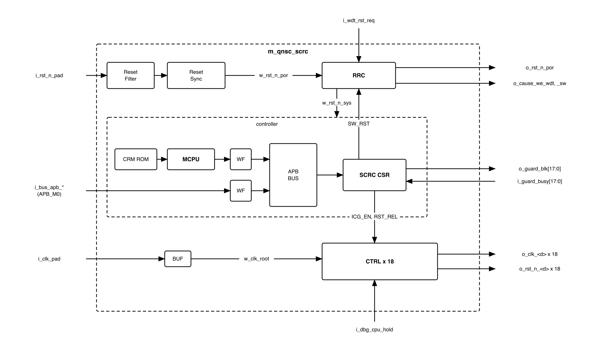{width=6.5in}

The structure is the mentor's (`doc/reference/VLSI_SCRC.drawio`): input stage
above, controller below, one `CTRL` per domain. Two blocks are added to it:

- `RRC`, because the watchdog and software requests would otherwise be cleared
  by the reset they cause -- 7.3.
- `WF`, a write filter per master, because the CSR generator sees one slave and
  cannot tell the masters apart -- 7.4.

The APB guards are designed and delivered with `SCRC` but instantiated in
`design/top` -- 7.7.

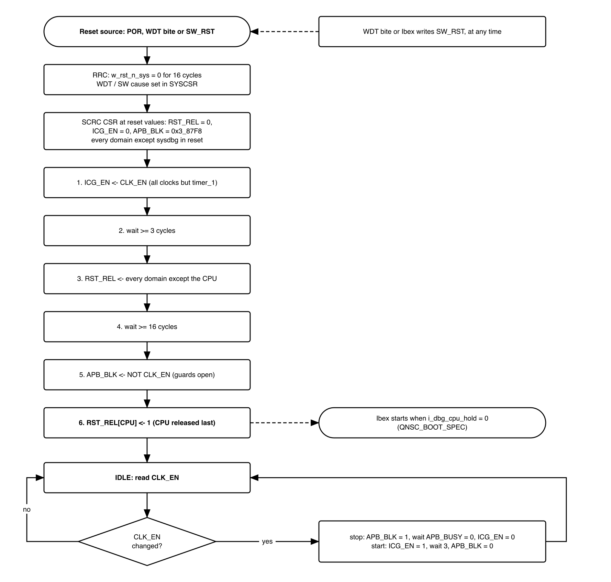{width=6.2in}

The figure is the whole behaviour of `SCRC`: sections 7.3, 7.5 and 7.6 specify
each box.

: Sub-blocks

| Block | Module | Function | Clock | Reset |
|---|---|---|---|---|
| Reset Filter | `m_qnsc_scrc_rst_filter` | Rejects glitches on `PORSTN` | none | none |
| Reset Sync | `m_qnsc_scrc_rst_sync` | Asynchronous assert, synchronous release of `w_rst_n_por` | `w_clk_root` | filter output |
| RRC | `m_qnsc_scrc_rrc` | Merges WDT and SW requests; 16-cycle `w_rst_n_sys`; cause enables | `w_clk_root` | `w_rst_n_por` |
| MCPU | `m_vlsit_mrv_cpu` | Runs the CRM ROM program -- 7.5, 7.6 | `w_clk_root` | `w_rst_n_sys` |
| CRM ROM | `m_qnsc_scrc_crm_rom` | `MCPU` program, combinational read | -- | -- |
| WF x 2 | `m_qnsc_scrc_apb_wfilter` | Drops writes a master may not make -- 7.4 | `w_clk_root` | `w_rst_n_sys` |
| APB BUS | generated -- 11 | 2 masters, 1 slave | `w_clk_root` | `w_rst_n_sys` |
| SCRC CSR | `m_qnsc_scrc_csr` | Registers of section 6 | `w_clk_root` | `w_rst_n_sys` |
| BUF | library root buffer | Root of every clock | -- | -- |
| CTRL x 18 | `m_qnsc_scrc_ctrl` | Clock gate + reset synchroniser per domain -- 7.1 | `w_clk_root` | `RST_REL[n]` |

: Names in `VLSI_SCRC.drawio` against this specification

| Mentor's diagram | This specification |
|---|---|
| `i_clkin`, `i_porstn` | `i_clk_pad`, `i_rst_n_pad` |
| `i_int_clkin`, `i_int_porstn` | `w_clk_root`, `w_rst_n_por`; `i_int_` is the interrupt prefix |
| Small CPU / MCPU, `RISC-V CPU(MRV)` + `BIU` | `MCPU` (`m_vlsit_mrv_cpu`, BIU inside) |
| ROM | CRM ROM |
| APB BUS, "APB Decoder Generator" | APB BUS, from APB-BUS-Generator |
| CPU CTRL, UART, SPI, System CTRL | `CTRL` x 18 |
| CTRL `i_clkin_en`, `i_rst_n`, `o_clk`, `o_clk_rstn` | `ICG_EN[n]`, `RST_REL[n]`, `o_clk_<d>`, `o_rst_n_<d>` |
| RST SYNC `i_scan_en`, `o_sync_rst_n`; 2-FF Synchronizer | `m_qnsc_scrc_rst_sync`; `m_qnsc_scrc_sync` |
| Interrupt into the Small CPU | tied 0 -- 10 |

# 4. IP used

: Upstream IP used

| From | Module | Commit | Licence |
|---|---|---|---|
| `nguyenquanicd/MRV-CPU` | `m_vlsit_mrv_cpu` and its sub-modules | `eea0028c` | MentorProvided-QNSC-Course |
| `nguyenquanicd/APB-CSR-Generator` | generator; output `m_qnsc_scrc_csr` | `ee80ff54` | MentorProvided-QNSC-Course |
| `nguyenquanicd/APB-BUS-Generator` | generator; output the APB BUS | `5661aecf` | MentorProvided-QNSC-Course |

Upstream facts this specification relies on, read at those commits:

- `m_vlsit_mrv_cpu`: 13 instructions (`add sub and or addi andi ori lw sw jal jalr
  beq lui`, `docs/MRV-CPU-SPEC.md`): no `xor`, no shift. `PARA_RESET_VECTOR` =
  `0x1000`. APB master ports `o_psel o_penable o_pwrite o_paddr o_pwdata i_prdata
  i_pready` only: **no `PSTRB`, `PPROT` or `PSLVERR`**. The BIU goes IDLE, SETUP,
  ACCESS, DONE, so every `lw`/`sw` takes at least 3 cycles and stalls the core.
- APB-CSR-Generator (`CSR_Generation.py`): module name from the workbook `Module
  Name` cell. With `i_slverr_en` = 1 and `i_protect_en` = 0, `PSLVERR` = 1 exactly
  when `PADDR[1:0]` != 0, or `PWRITE` = 1 and `PSTRB` != `4'hF`. An unused offset
  reads 0 without error.

# 5. Interface

All resets are active low, asserted asynchronously and released on the clock of
their own domain.

: SCRC interface

| Signal | Dir | Width | Description |
|---|---|---:|---|
| `i_clk_pad` | in | 1 | `CLKIN` pad, dedicated, not through IO MUX. Root clock |
| `i_rst_n_pad` | in | 1 | `PORSTN` pad, dedicated. Power-on reset, asynchronous -- 7.2 |
| `i_wdt_rst_req` | in | 1 | WDT `aon_timer_rst_req_o`. Active high, sticky, WDT domain -- 7.3 |
| `i_dbg_cpu_hold` | in | 1 | `SYSDBG` `o_dbg_cpu_hold`. 1 holds the CPU in reset -- 7.8 |
| `i_bus_apb_psel`, `i_bus_apb_penable`, `i_bus_apb_pwrite` | in | 1 | `P_BUS` `APB_M0` control |
| `i_bus_apb_paddr` | in | 12 | Offset in the window (contract `meta.apb_paddr_width`) |
| `i_bus_apb_pwdata` | in | 32 | Write data |
| `i_bus_apb_pstrb`, `i_bus_apb_pprot` | in | 4, 3 | APB4 strobe, protection |
| `o_bus_apb_prdata`, `o_bus_apb_pready`, `o_bus_apb_pslverr` | out | 32, 1, 1 | APB response -- 7.4 |
| `i_guard_busy` | in | 18 | Bit *n* = 1 while the guard of domain *n* has a transfer in progress |
| `o_guard_blk` | out | 18 | `APB_BLK[17:0]`. Bit *n* = 1 blocks the APB slave of domain *n* |
| `o_clk_<d>`, `o_rst_n_<d>` | out | 1 each | 18 pairs, Table 5-2 |
| `o_rst_n_por` | out | 1 | Synchronised power-on reset, not affected by WDT or SW |
| `o_cause_we_wdt`, `o_cause_we_sw` | out | 1 | From a flip-flop, 1 while a WDT / SW chip reset lasts: set `RESET_CAUSE.cause_wdt` / `.cause_soft` in `SYSCSR` -- 7.3 |

: Domain clock and reset outputs

| `<d>` | Drives, in `design/top` |
|---|---|
| `cpu` | Ibex wrapper `i_clk_cpu`, `i_rst_n_cpu` |
| `sbus` | `S_BUS`; reset also to `SYSDBG` `i_rst_n_sysbus` |
| `pbus` | `P_BUS`; clock also to `SYSCSR` and the 11 guards |
| `rom` | ROM `i_clk_mem`, `i_rst_n_mem` |
| `ram` | ISRAM and DSRAM `i_clk_mem`, `i_rst_n_mem` |
| `sysdbg` | `SYSDBG` `i_clk_cpu`, `i_rst_n_por` |
| `wdt` | WDT wrapper `i_clk_wdt`, `i_rst_n_wdt`, and `aon_timer` `clk_aon_i`, `rst_aon_ni`. Never gated |
| `timer_0`, `timer_1`, `uart_0`, `uart_1`, `spi`, `i2c`, `gpio_0`, `gpio_1`, `gpio_2`, `pwm`, `dma` | the wrapper's `i_clk_peri`, `i_rst_n_peri`. The SPI wrapper feeds SPI Host and SPI Device from its one pair |

`SYSCSR` `DOMAIN_RST_STATUS[n]` is `~o_rst_n_<d>`, wired in `design/top`.

# 6. Register map

<!-- gen:memory_map ports=APB_M0,APB_M1 -->
: Memory map, regions behind APB_M0 and APB_M1

| Base | Size | Region | Port | Kind | Note |
|---|---|---|---|---|---|
| `0x80000000` | 16 KiB | `scrc` | APB_M0 | peripheral | System clock and reset control registers |
| `0x80004000` | 16 KiB | `syscsr` | APB_M1 | peripheral |  |
<!-- /gen -->

Ibex reaches `SCRC CSR` through `APB_M0`, `MCPU` through the APB BUS, at the same
offsets. Only offset bits 11:0 reach `SCRC`, so the map repeats every 4 KiB in
the window: `0x8000_1000` is `SW_RST`. Reserved bits read 0 and ignore writes.

: Register map

| Offset | Register | Bits | Ibex | `MCPU` | Reset | Description |
|---|---|---|---|---|---|---|
| `0x00` | `SW_RST` | 0 | RW | RO | 0 | Write 1: chip reset, cause SOFT -- 7.3 |
| `0x04` | `CLK_EN` | 17:0 | RW | RO | `0x0003_87E8` | Requested clock state, 1 = run |
| `0x08` | -- | -- | RSVD | RSVD | 0 | Reads 0, writes ignored |
| `0x0C` | `ICG_EN` | 17:0 | RO | RW | 0 | Clock-gate enable of each gateable `CTRL` |
| `0x10` | `RST_REL` | 31, 17:0 | RO | RW | 0 | Reset release of each `CTRL`, 1 = released |
| `0x14` | `APB_BLK` | 17:0 | RO | RW | `0x0003_87F8` | Guard block, 1 = block. To `o_guard_blk` |
| `0x18` | `APB_BUSY` | 17:0 | RO | RO | live | `i_guard_busy` |
| `0x1C`--`0xFFF` | -- | -- | RSVD | RSVD | -- | `PSLVERR` -- 7.4 |

Implemented bits: `0x0003_87F8` (gateable) in `CLK_EN`, `ICG_EN`, `APB_BLK`, `APB_BUSY`; `0x8003_9FFF` in `RST_REL`; bit 0 in `SW_RST`.

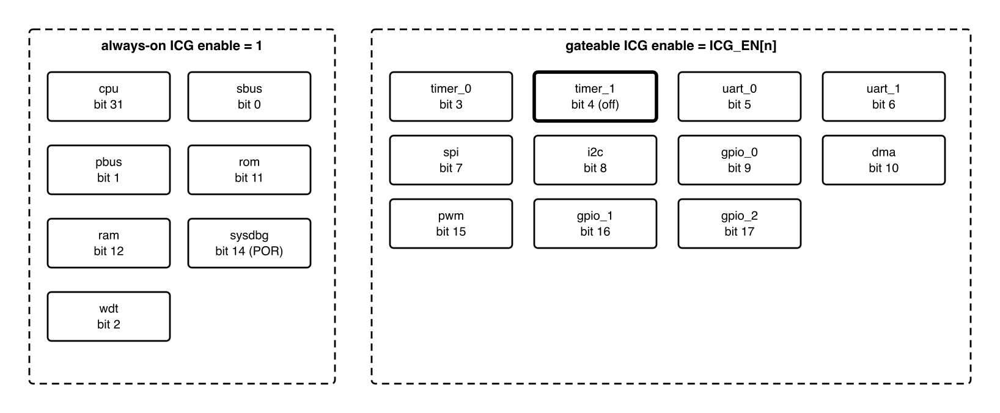{width=6.4in}

: Domain bit map

| Bit | `<d>` | Type | `CLK_EN` reset | Guard |
|---:|---|---|---|---|
| 0 | `sbus` | always-on | -- | -- |
| 1 | `pbus` | always-on | -- | -- |
| 2 | `wdt` | always-on | -- | -- |
| 3 | `timer_0` | gateable | 1 | own |
| 4 | `timer_1` | gateable | **0** | own |
| 5 | `uart_0` | gateable | 1 | own |
| 6 | `uart_1` | gateable | 1 | own |
| 7 | `spi` | gateable | 1 | own; SPI Host and SPI Device |
| 8 | `i2c` | gateable | 1 | own |
| 9 | `gpio_0` | gateable | 1 | own |
| 10 | `dma` | gateable | 1 | configuration port only |
| 11 | `rom` | always-on | -- | -- |
| 12 | `ram` | always-on | -- | -- |
| 13 | -- | reserved | -- | -- |
| 14 | `sysdbg` | always-on, POR only | -- | -- |
| 15 | `pwm` | gateable | 1 | own |
| 16 | `gpio_1` | gateable | 1 | own |
| 17 | `gpio_2` | gateable | 1 | own |
| 30:18 | -- | reserved | -- | -- |
| 31 | `cpu` | always-on | -- | -- |

Bit 18 was `GPIO3`, removed with the 40-pin package. Bit 13 was `spi_device`: the
SPI wrapper runs both SPI blocks on one clock and reset (SPI MAS V1.3).

# 7. Functional behaviour

## 7.1 Clocks

- `i_clk_pad` drives one root buffer, `w_clk_root`, and 18 `CTRL`s. The only cell
  on a clock path after the root buffer is the library ICG cell of each `CTRL`.
- The seven always-on domains and the `SCRC` logic have their ICG enable tied 1.
  No register value stops them. `wdt` is among them so that no firmware can stop
  the watchdog that supervises it.
- A gateable domain's ICG enable is `ICG_EN[n]`.
- All outputs are synchronous to each other (skew closed by clock-tree
  synthesis); nothing in `SCRC` crosses a clock domain except `i_wdt_rst_req`.

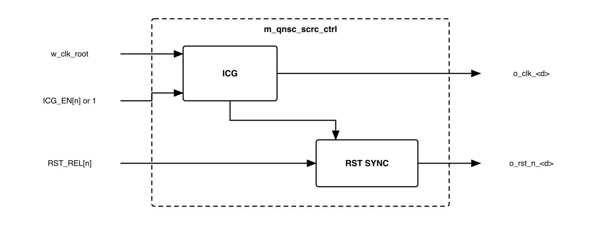{width=5.2in}

The reset synchroniser of a `CTRL` runs on the gated clock. A release written
while the clock is stopped completes when the clock runs again.

## 7.2 Power-on input stage

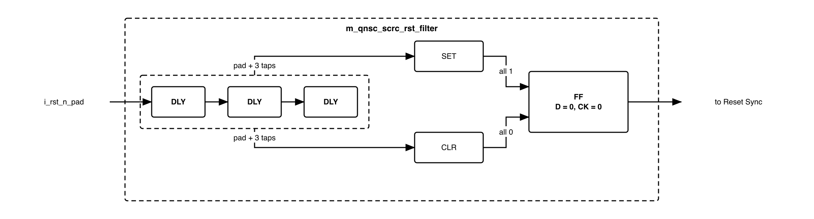{width=6.2in}

- Three library delay cells in series. `SET` drives the flip-flop's asynchronous
  set when the pad and all three taps are 1; `CLR` drives its asynchronous clear
  when all four are 0. The output therefore changes only after the pad has been
  stable for the whole chain; a shorter pulse changes nothing. Gate-level detail:
  `doc/reference/VLSI_SCRC.drawio`.
- The Reset Sync asserts `w_rst_n_por` asynchronously and releases it on the
  second rising edge of `w_clk_root` after the filter output rises.
- Every cell of this stage is an instantiated library cell, none is inferred -- 11.

## 7.3 Reset Request Controller

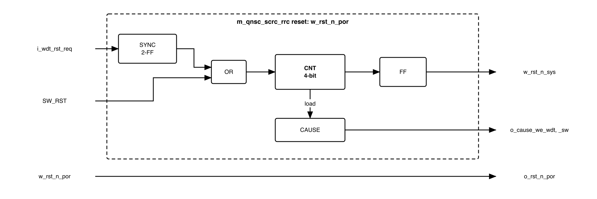{width=6.4in}

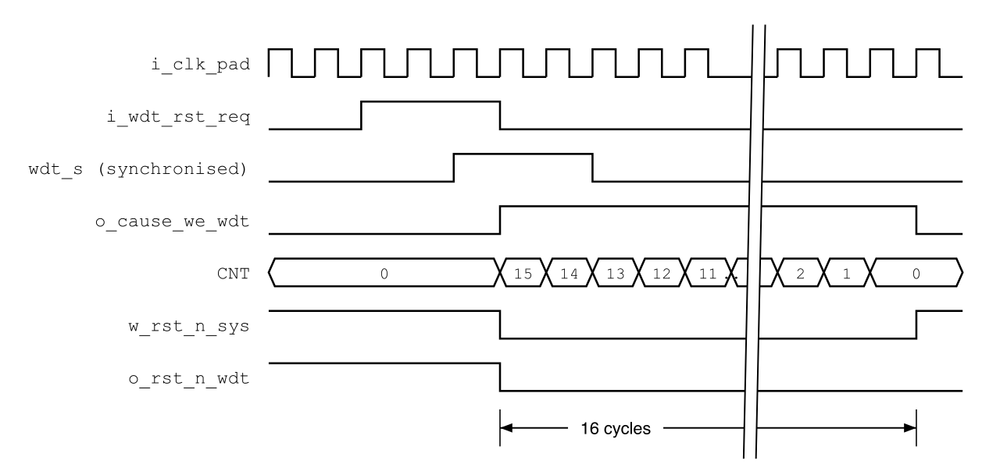{width=6.0in}

- Every `RRC` flip-flop, `CNT` included, is reset to 0 by `w_rst_n_por` only.
- `i_wdt_rst_req` passes a 2-FF synchroniser (`m_qnsc_scrc_sync`). `SW_RST` is
  already on `w_clk_root`.
- A request while `CNT` = 0 loads `CNT` = 15 and asserts `w_rst_n_sys` from the
  flip-flop. `w_rst_n_sys` stays 0 while `CNT` != 0 or a request is held.
- In the load cycle `CAUSE` captures the synchronised WDT request and `SW_RST`.
  `o_cause_we_wdt` and `o_cause_we_sw` are those flip-flops, held while
  `w_rst_n_sys` = 0 and cleared when it releases. A level, not a one-cycle pulse:
  the generated `SYSCSR` lets an APB write win over a hardware set in the same
  cycle, and `P_BUS` is in reset for the later cycles, so the set cannot be lost
  (`QNSC_SYSCSR_MAS` 7.2). Power-on sets neither: `RESET_CAUSE.cause_por` resets
  to 1 in `SYSCSR`.
- `w_rst_n_sys` resets `MCPU`, the WFs, the APB BUS and `SCRC CSR`, which clears
  `SW_RST` and `RST_REL`. `RST_REL` = 0 asserts every domain reset except `sysdbg`,
  `wdt` included, and the WDT reset clears `i_wdt_rst_req`. Both requests drop
  inside the 16 cycles, so a WDT or SW reset lasts exactly 16 cycles.
- On power-on there is no stretch: `w_rst_n_sys` releases one cycle after
  `w_rst_n_por`. None is needed, because every domain stays in reset through
  `RST_REL` = 0 until the program of 7.5 releases it.
- The APB write of `SW_RST` = 1 completes before `w_rst_n_sys` asserts. Its
  response may not reach Ibex, which is reset with the rest of the chip.

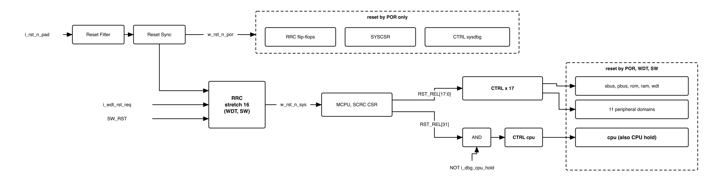{width=6.5in}

: What each reset clears

| Logic | POR | WDT, SW | CPU hold |
|---|---|---|---|
| `RRC`, `o_rst_n_por`, `SYSCSR` | yes | no | no |
| `sysdbg` (synchroniser input `w_rst_n_por`) | yes | no | no |
| `MCPU`, WFs, APB BUS, `SCRC CSR` | yes | yes | no |
| `cpu` (input `RST_REL[31]` AND NOT `i_dbg_cpu_hold`) | yes | yes | yes |
| `sbus`, `pbus`, `rom`, `ram` | yes | yes | no |
| `wdt`, 11 gateable domains | yes | yes | no |

There is no per-peripheral reset. No IP can report that it is hung, so a hang is
recovered by a chip reset: the watchdog bite, or firmware writing `SW_RST`. The
only partial reset is the CPU hold, from `SYSDBG` (7.8).

## 7.4 Register access

: `PSLVERR` sources on `APB_M0`

| Access | Result | Produced by |
|---|---|---|
| Ibex write to `0x0C`--`0x18` | dropped, `PSLVERR` | Ibex WF |
| `MCPU` write to `0x00`, `0x04`, `0x18` | dropped, silently: `MCPU` has no `PSLVERR` | `MCPU` WF |
| any access to `0x1C` | `PSLVERR` | WFs |
| any access to `0x20`--`0xFFF` | `PSLVERR` | APB BUS |
| `PADDR[1:0]` != 0, or write with `PSTRB` != `4'hF` | `PSLVERR` | `SCRC CSR` |

A byte or halfword store to `SCRC` therefore faults: firmware uses word accesses.
A dropped write changes no register.

## 7.5 Power-up sequence

`MCPU` starts at `0x1000` when `w_rst_n_sys` releases, and after every chip reset
runs:

1. `ICG_EN` <- `CLK_EN`.
2. Wait at least 3 cycles.
3. `RST_REL` <- `0x0003_9FFF`: every domain except the CPU, in one write.
4. Wait at least 16 cycles.
5. `APB_BLK` <- NOT `CLK_EN` AND `0x0003_87F8`: guards of running peripherals open.
6. `RST_REL` <- `0x8003_9FFF`: the CPU is released last.
7. Take `CLK_EN` as the applied clock state; enter IDLE (7.6).

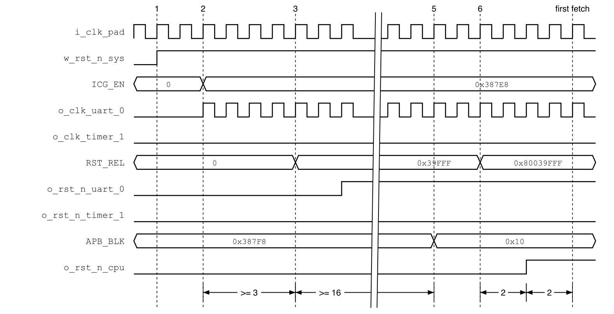{width=6.5in}

- Step 5 precedes step 6, so the boot ROM's first `UART0` access is not blocked.
- The order is the CRM ROM program: changing it changes no RTL.
- After step 6, `timer_1` is gated, blocked and still in reset: its synchroniser
  input is 1 but it has no clock edge. `DOMAIN_RST_STATUS[4]` reads 1 until
  `CLK_EN[4]` is written 1.

## 7.6 Runtime requests

In IDLE (Figure 3-2), `MCPU` polls `CLK_EN` and compares it with the state it has
applied. Only the last value written matters, so Ibex may write it back to back.

: MCPU actions, per changed bit *n*

| Request | Step 1 | Step 2 | Step 3 |
|---|---|---|---|
| Clock stop | `APB_BLK[n]` <- 1 | wait `APB_BUSY[n]` = 0 | `ICG_EN[n]` <- 0 |
| Clock start | `ICG_EN[n]` <- 1 | wait 3 cycles | `APB_BLK[n]` <- 0 |

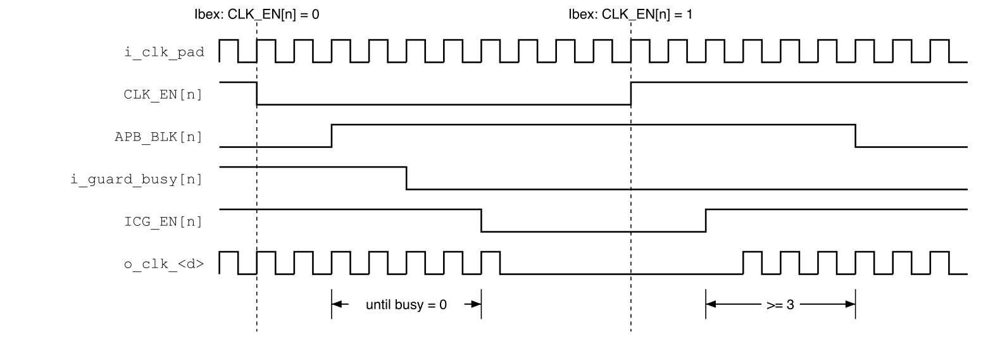{width=6.5in}

- Invariant, in every cycle: `APB_BLK[n]` = 0 only if domain *n*'s clock runs.
- `RST_REL` changes only in the power-up sequence; at runtime `MCPU` writes
  `ICG_EN` and `APB_BLK` only.

## 7.7 APB guard

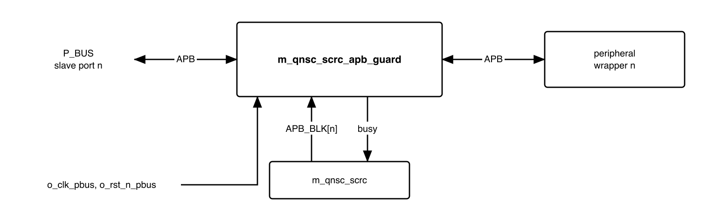{width=5.6in}

`m_qnsc_scrc_apb_guard`, on `o_clk_pbus` and `o_rst_n_pbus`:

- Samples `APB_BLK[n]` in the SETUP phase (`PSEL` AND NOT `PENABLE`); a change
  during a transfer does not affect that transfer.
- Blocked: completes in the ACCESS phase with `PREADY` = 1, `PSLVERR` = 1,
  `PRDATA` = 0, and holds `PSEL` to the IP at 0.
- Not blocked: pass-through, `busy` = 1 from SETUP until the IP completes the
  transfer (`PENABLE` AND `PREADY`).
- One guard per gateable domain: 11 guards, 11 bits of `APB_BLK`.

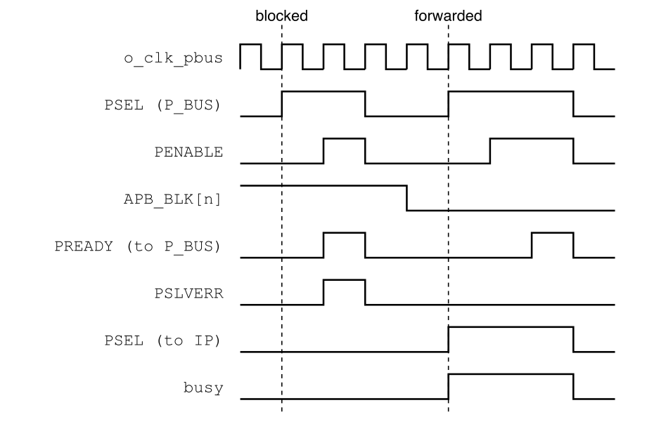{width=4.6in}

The error reaches Ibex as a load or store access fault, through `P_BUS`
`PSLVERR` and AXI2APB `SLVERR`. There is no automatic clock restart and no retry.

## 7.8 CPU hold and `SYSDBG`

- `cpu` synchroniser input = `RST_REL[31]` AND NOT `i_dbg_cpu_hold`. The hold is
  not a reset source and sets no cause bit.
- `sysdbg` synchroniser input = `w_rst_n_por`; its clock never stops.
- `o_rst_n_sbus` also resets `SYSDBG`'s bus side, so a WDT or SW reset leaves no
  half-finished `SYSDBG` bus handshake.

What `SYSDBG` does with the hold: `QNSC_SYSDBG_MAS` 7.1.

## 7.9 Timing summary

: SCRC timing, `w_clk_root` cycles

| Quantity | Value |
|---|---|
| WDT or SW chip reset | 16 |
| `w_rst_n_por` release to `w_rst_n_sys` release | 16 |
| Domain reset release after its input rises | 2 domain-clock edges |
| `ICG_EN[n]` = 1 before `RST_REL[n]` = 1 | >= 3 |
| Non-CPU release to CPU release | >= 16, plus the `APB_BLK` write |
| CPU reset release to first Ibex fetch | 2 (Ibex) |
| `MCPU` APB access | >= 3 |
| `APB_BLK[n]` = 1 to clock stop | until `APB_BUSY[n]` = 0, unbounded |
| Clock start to `APB_BLK[n]` = 0 | >= 3 |

## 7.10 Firmware sequences

: What firmware does

| To | Write | Then | Done when |
|---|---|---|---|
| Stop a peripheral clock | mask its interrupts; `CLK_EN[n]` = 0 | -- | `ICG_EN[n]` = 0 |
| Start a peripheral clock | `CLK_EN[n]` = 1 | -- | `APB_BLK[n]` = 0 |
| Use `TIMER1` | `CLK_EN[4]` = 1 | -- | `APB_BLK[4]` = 0 |
| Reset the chip | `SW_RST` = 1 | -- | restart; `RESET_CAUSE.SOFT` = 1 |
| Recover from an access fault at a gated peripheral | `CLK_EN[n]` = 1 | -- | retry the access |
| Recover from a hung peripheral | `SW_RST` = 1, or let the watchdog bite | -- | restart |

Before stopping `pwm`, write PWM `CMD` = STOP | RST (`QNSC_PWM_MAS` 7.7). Before
stopping `dma`, wait until the DMA is idle.

# 8. Instances

: RTL modules and instance counts

| Module | Count | Where | Source |
|---|---:|---|---|
| `m_qnsc_scrc` | 1 | `design/top` | in house |
| `m_qnsc_scrc_apb_guard` | 11 | `design/top`, one per gateable APB slave | in house |
| `m_qnsc_scrc_rst_filter` | 1 | `m_qnsc_scrc` | in house, library cells |
| `m_qnsc_scrc_rst_sync` | 19 | power-on stage, 18 `CTRL`s | library cell wrapper |
| `m_qnsc_scrc_sync` | 1 | `RRC`, `i_wdt_rst_req` | library cell wrapper |
| `m_qnsc_scrc_rrc` | 1 | `m_qnsc_scrc` | in house |
| `m_vlsit_mrv_cpu` | 1 | `m_qnsc_scrc` | MRV-CPU |
| `m_qnsc_scrc_crm_rom` | 1 | `m_qnsc_scrc` | in house |
| `m_qnsc_scrc_apb_wfilter` | 2 | one per master; a parameter selects the read-only offsets | in house |
| APB BUS | 1 | `m_qnsc_scrc` | APB-BUS-Generator -- 11 |
| `m_qnsc_scrc_csr` | 1 | `m_qnsc_scrc` | APB-CSR-Generator |
| `m_qnsc_scrc_ctrl` | 18 | `m_qnsc_scrc`; ICG enable tied 1 in seven | in house, library ICG |

The eleven guards: `timer_0`, `timer_1`, `uart_0`, `uart_1`, `gpio_0`,
`gpio_1`, `gpio_2`, `spi`, `i2c`, `pwm`, `dma` configuration port.

# 9. What is not provided here, and who provides it

: Functions this block does not provide

| Function | Where it lives |
|---|---|
| `RESET_CAUSE`, `DOMAIN_RST_STATUS`, `CHIP_ID_REV` | `SYSCSR`, `APB_M1`, RTL in `design/scrc` |
| `DBG_EN` capture, `o_dbg_cpu_hold` | `QNSC_SYSDBG_MAS` 7.1 |
| Ibex `boot_addr_i` mux, `fetch_enable_i` tie | CPU owner, `QNSC_SYSDBG_MAS` 11 |
| Decode error on an unmapped address | `S_BUS`, `P_BUS` |
| Masking interrupts, PWM safe stop, DMA idle before gating | firmware, 7.10 |
| Boot download, image format | `QNSC_BOOT_SPEC` |

# 10. Tie-offs

: Tie-offs

| Port | Tied to | Why |
|---|---|---|
| `MCPU` `i_interrupt` | 0 | Polling. The MRV interrupt is an unmasked edge that overwrites `x1`; a request during a BIU stall is lost -- DECISIONS |
| `MCPU` master `PSTRB`, `PPROT` into its WF | `4'hF`, 0 | `MCPU` has neither port; any other strobe is rejected by `SCRC CSR` |
| `SCRC CSR` `i_protect_en` | 0 | No privilege check; the rights are the WFs |
| `SCRC CSR` `i_slverr_en` | 1 | Misaligned and partial-strobe accesses answered with `PSLVERR` |
| ICG enable of the seven always-on `CTRL`s | 1 | Never gated -- 7.1 |
| `m_qnsc_scrc_rst_sync` `i_scan_en` | 0 | No scan in QSOC v1 |

# 11. Requirements on others, and open items

: Requirements on other owners

| Item | Owner | What it blocks |
|---|---|---|
| WDT `rst_aon_ni` = `o_rst_n_wdt`, `aon_timer_rst_req_o` to `i_wdt_rst_req` | WDT owner | 7.3: the request dropping inside 16 cycles |
| `SYSCSR` bus reset = `o_rst_n_por`, not `o_rst_n_pbus` | `SYSCSR` (same owner) | `RESET_CAUSE` surviving WDT and SW |
| Eleven guards between `P_BUS` and the wrappers; `i_guard_busy` bits 0, 1, 2, 11, 12, 13, 14 tied 0; `DOMAIN_RST_STATUS[n]` = `~o_rst_n_<d>` | top (lead) | 7.7, `SYSCSR` |
| `P_BUS` forwards each slave's `PSLVERR`; AXI2APB turns it into `SLVERR` | bus owner | access fault on a blocked peripheral |
| SPI MAS: `APB_S11` is `APB_M10` (contract); wrapper `PCLK`/`PRESETn` = `o_clk_spi`/`o_rst_n_spi`, as `i_clk_peri`/`i_rst_n_peri` | SPI owner | the SPI wrapper's connection |
| IO MUX has registers (`QNSC_SYSDBG_MAS` 7.1) but no clock domain, bit or address in the contract | top, IO MUX owner | IO MUX integration |

: HAS text this specification departs from

| `QSOC_HAS_Report_EN_v4_final` says | This specification | Why, in DECISIONS |
|---|---|---|
| Software reset resets every domain except the CPU | resets the whole chip, CPU included | one bit, one behaviour; firmware reads `RESET_CAUSE` after restart |
| Tier-1 reset is a plain OR of the sources | `RRC` latches, stretches to 16 cycles | the WDT and SW requests are cleared by the reset they cause |
| `MCPU` handler entered by interrupt; do not write back to back | polling; back-to-back writes allowed | the MRV interrupt loses requests |
| Responder inside `SCRC` watches `CLK_EN` | guards at the top follow `APB_BLK`, written by `MCPU` | the guard must close before the clock stops, not after the request |

Open items:

- **APB BUS name clash.** APB-BUS-Generator always names its top
  `m_vlsi_apb_router`, as for `P_BUS`, so both cannot be compiled into one design,
  and the name fails Naming Rule 2.1. The generator stays (the mentor's design);
  the generated module is renamed when it is committed to `util/gen`, with the
  command. SCRC owner with the bus owner.
- **Library cells.** DLY, ICG, the synchronisers and the filter flip-flop are
  library cells. Their SMIC 28 nm names are not known yet; Verilator needs a
  behavioural model of each, and SYN needs them instantiated, not inferred. SCRC
  owner, with the lead for the flow.
- **CRM ROM depth.** Not fixed; the program is a few dozen words. SCRC owner.

Accepted limits:

- One domain serves both SPI blocks: gating `spi` stops SPI Host and SPI Device together.
- Gating `spi` while an external host drives SPI Device `SCK`
  loses that transfer: SPI Device needs its core clock at >= 1/4 of `SCK`.
- The `dma` guard covers the configuration port only, not DMA transfers already
  issued on `S_BUS`.
- A peripheral that holds `PREADY` low while not blocked stalls Ibex; only the
  watchdog recovers it.

# 12. Verification

1. `SCRC_CLK_001` Every output clock equals the root clock while its `CTRL` is enabled.
2. `SCRC_CLK_002` The seven always-on clocks, `wdt` included, never stop, for any register value.
3. `SCRC_CLK_003` After any chip reset every gateable clock runs except `timer_1`.
4. `SCRC_RST_001` A WDT bite and `SW_RST` each hold `w_rst_n_sys` low for exactly
   16 cycles; after POR it releases one cycle after `w_rst_n_por`. Each asserts
   every domain reset except `sysdbg` (WDT, SW).
5. `SCRC_RST_002` Each domain reset releases 2 domain-clock edges after its input rises.
6. `SCRC_RST_003` All non-CPU domains release in the same cycle; the CPU releases
   >= 16 cycles later and after `APB_BLK` is written.
7. `SCRC_RST_004` With `i_dbg_cpu_hold` = 1, `o_rst_n_cpu` stays 0 for any `RST_REL[31]`.
8. `SCRC_RST_005` WDT and SW resets do not change `RRC`, `o_rst_n_por` or `o_rst_n_sysdbg`.
9. `SCRC_RST_007` Before the CPU reset releases, `APB_BLK` = NOT `CLK_EN` on the
    gateable bits; the boot ROM's first `UART0` access completes without `PSLVERR`.
10. `SCRC_RST_008` After a chip reset, `o_rst_n_timer_1` = 0 until `CLK_EN[4]` is set,
    then releases.
11. `SCRC_RRC_001` A WDT request cleared by the reset it causes still gives one
    16-cycle reset, with `o_cause_we_wdt` = 1 for exactly those 16 cycles and
    `o_cause_we_sw` = 0.
12. `SCRC_FLT_001` A pulse on `i_rst_n_pad` shorter than the three-cell delay does not
    change `w_rst_n_por` (gate-level simulation with library delays).
13. `SCRC_CSR_001` Every row of the `PSLVERR` table (7.4) gives the stated result, and a
    dropped write changes no register.
14. `SCRC_CSR_002` Reset value, implemented bits and access of every register match
    section 6, per master.
15. `SCRC_SEQ_001` Any sequence of `CLK_EN` writes, back to back included, ends with
    `ICG_EN` = the last value written.
16. `SCRC_SEQ_002` The invariant of 7.6 holds in every cycle (assertion).
17. `SCRC_BUS_001` An access to a blocked peripheral ends in one transfer with
    `PSLVERR` = 1 and never asserts `PSEL` at the IP.
18. `SCRC_BUS_002` A change of `APB_BLK` during a transfer does not change its response.
19. `SCRC_BUS_003` With an IP holding `PREADY` low for *N* cycles, its clock stops only
    after the transfer completes, for any *N*.
20. `SCRC_DBG_001` With `DBG_EN` = 0 the CPU releases as without `SYSDBG`; with
    `DBG_EN` = 1 it stays in reset until `CPUHOLD` = 0.
21. `SCRC_IMP_001` No `o_clk_<d>` path contains a cell other than the root buffer and
    one library ICG (netlist check), and no `RRC` flip-flop has a reset other than
    `w_rst_n_por`.

# Appendix A. Acronyms

: Acronyms

| Acronym | Description |
|---|---|
| BUF | Clock root buffer |
| CNT | `RRC` stretch counter |
| CRM ROM | Clock/Reset Manager ROM, the `MCPU` program memory |
| CTRL | Domain controller: clock gate + reset synchroniser |
| DLY | Library delay cell |
| ICG | Integrated Clock Gating cell |
| `MCPU` / MRV-CPU | Mini RISC-V CPU, the `SCRC` controller |
| POR | Power-On Reset |
| RRC | Reset Request Controller |
| SCRC | System Clock and Reset Controller |
| SYSCSR | System Control and Status Registers |
| WF | Write filter |

# Appendix B. First review

: First review

| Item | Reviewer | Response |
|---|---|---|
| Release all domains together, CPU last | Quan (mentor) | 7.5 |
| Per-peripheral soft reset | Quan (mentor) | first allowed, then removed in a later lesson: no IP can report a hang, so recovery is chip reset or CPU hold, 7.3 |
| `SYSDBG` survives WDT/SW, never gated; CPU holdable | `SYSDBG` owner | 7.3, 7.8 |
| `TIMER0` runs after reset, `TIMER1` may start gated | TIMER owner | 6 |
| PWM stopped before its clock is gated | PWM owner | 7.10 |
| CPU release raced the guard opening | review, V2.3 | 7.5 step 5 before 6 |
| CSR generator cannot enforce per-master rights | RTL check, V2.2 | WFs, 7.4 |
| `APB_S0`/`APB_S1` against contract `APB_M0`/`APB_M1` | lead, V3.0 | 3, 5, 6 |
| Ports did not follow the Naming Rule | lead, V3.0 | 3, 5, 8 |
| Figures had colour and drifted from the text | lead, V3.0 | redrawn; timing diagrams added |
| `timer_1` status after boot not stated | lead, V3.0 | 7.5, `SCRC_RST_008` |
| No stretch after POR | lead proposal, adopted by the owner | 7.3, `SCRC_RST_001` |
| Two CSRs instead of APB BUS + WFs | lead proposal | Rejected by the owner: the mentor's design stays, DECISIONS 4 |
| Guard reset `o_rst_n_pbus` | lead, V3.0 | 7.7; **owner to confirm** |
| Generated bus top name clashes with `P_BUS` | lead, V3.0 | 11, open |
| `spi` and `spi_device` were two domains; the SPI wrapper takes one `PCLK`/`PRESETn` for both IPs | SPI MAS V1.3, lead | one domain, bit 13 reserved |
| Earlier review items (V1.x) | Sinh, Quan | DECISIONS |
