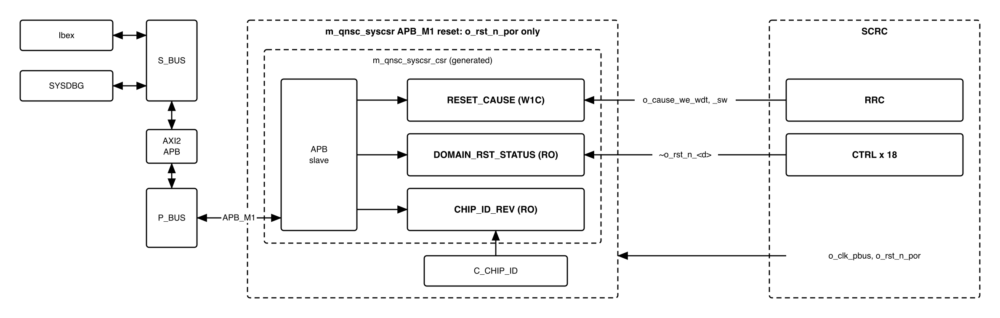
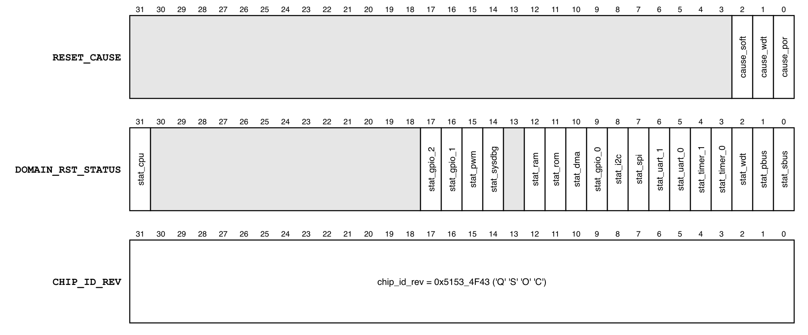
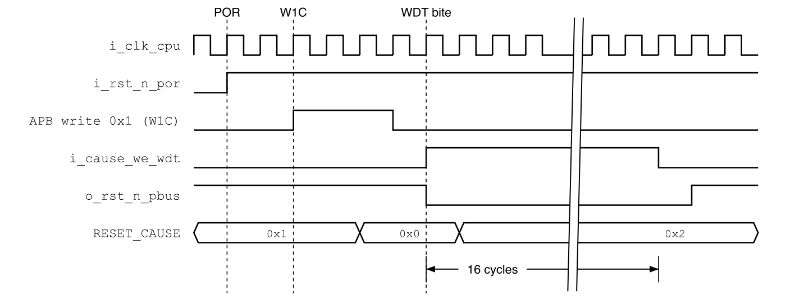

# Revision history

The reasoning behind each change, the V1.0--V2.2 history and the V2.2 text are in
[`QNSC_SYSCSR_DECISIONS.md`](QNSC_SYSCSR_DECISIONS.md).

| Version | Date | Author | Reviewer | Description of change |
|---|---|---|---|---|
| V3.0 | 2026-09-28 | Nghia VT (lead), for Nguyen Hao Nam | -- | V2.2 moved onto the MAS template and aligned with `QNSC_SCRC_MAS` V3.0: `APB_M1`, Naming Rule wrapper, bit 13 reserved, `CHIP_ID` from the contract, reset-cause write race closed, access timing and post-boot values stated |

# 1. Overview

`SYSCSR` (System Control and Status Registers) is the status half of the clock and
reset subsystem. Three read-only registers answer three questions firmware cannot
answer any other way: why the chip last reset (`RESET_CAUSE`), which domains are in
reset now (`DOMAIN_RST_STATUS`), and which chip this is (`CHIP_ID_REV`).

The fact that shapes it: `SYSCSR` is **reset by power-on only**, so a watchdog or
software reset leaves `RESET_CAUSE` for the code that runs after it.

`SYSCSR` controls nothing; every control bit is in `SCRC` (`QNSC_SCRC_MAS`).

Block directory `design/scrc`, wrapper `m_qnsc_syscsr`, owner Nguyen Hao Nam.

# 2. Features

- Three 32-bit registers on `APB_M1` -- 6.
- `RESET_CAUSE`: one sticky bit per reset source, set by hardware, write 1 to
  clear -- 7.2.
- `DOMAIN_RST_STATUS`: live reset state of every `SCRC` domain -- 7.3.
- `CHIP_ID_REV`: the contract constant `C_CHIP_ID`, ASCII 'QSOC' -- 6.
- Reset by power-on only, on a clock that is never gated -- 7.1.
- Generated by APB-CSR-Generator; one wait state per completed access -- 7.4.

# 3. Block diagram

{width=6.5in}

`m_qnsc_syscsr` wraps the generated `m_qnsc_syscsr_csr`. It renames the ports to
the Naming Rule and drives the generator's option and constant inputs (section
10); it adds no logic.

`SYSCSR` is in the `cpu` clock cluster of the contract, hence `i_clk_cpu`; the
clock is `SCRC` `o_clk_pbus`, the `P_BUS` clock.

# 4. IP used

: Upstream IP used

| From | Module | Commit | Licence |
|---|---|---|---|
| `nguyenquanicd/APB-CSR-Generator` | generator; output `m_qnsc_syscsr_csr` | `ee80ff54` | MentorProvided-QNSC-Course |

Generator behaviour this specification relies on, read in `CSR_Generation.py` at
that commit, with `i_slverr_en` = 1, `i_protect_en` = 0 and the synchronous option:

- `PSLVERR` = 1 when `PADDR[1:0]` != 0, or `PWRITE` = 1 and `PSTRB` != `4'hF`.
  Such an access changes no register.
- An access is captured in the SETUP cycle and completes with `PREADY` in the
  second ACCESS cycle; an access answered with `PSLVERR` completes in the first.
- A `ro` field is a live input with no storage; a write to it is ignored.
- A `w1c` field: an APB write clears the bits written 1; otherwise `i_hw_we` loads
  `i_hw_wdata`. The APB write wins when both occur in the same cycle -- 7.2.
- An offset with no register reads 0 and ignores writes, without error.

Workbook register names are `resetcause`, `domainrststatus`, `chipidrev`; field
names are those of Tables 6-3 to 6-5. The workbook and the generated file are kept
in `util/gen/syscsr/`, because the generated port names (`i_bus_rstn`, `i_paddr`)
do not follow the Naming Rule and `design/scrc/rtl/` holds only code written here.

# 5. Interface

: SYSCSR interface

| Signal | Dir | Width | Connected to, in `design/top` | Description |
|---|---|---:|---|---|
| `i_clk_cpu` | in | 1 | `SCRC` `o_clk_pbus` | 20 MHz, never gated |
| `i_rst_n_por` | in | 1 | `SCRC` `o_rst_n_por` | Power-on only. Never `o_rst_n_pbus` |
| `i_bus_apb_psel`, `i_bus_apb_penable`, `i_bus_apb_pwrite` | in | 1 | `P_BUS` `APB_M1` | APB control. Reached by Ibex and by `SYSDBG` |
| `i_bus_apb_paddr` | in | 12 | `P_BUS` `APB_M1` | Offset in the window (contract `meta.apb_paddr_width`) |
| `i_bus_apb_pwdata` | in | 32 | `P_BUS` `APB_M1` | Write data |
| `i_bus_apb_pstrb` | in | 4 | `P_BUS` `APB_M1` | `4'hF` on a write, else `PSLVERR` |
| `i_bus_apb_pprot` | in | 3 | `P_BUS` `APB_M1` | Not used |
| `o_bus_apb_prdata`, `o_bus_apb_pready`, `o_bus_apb_pslverr` | out | 32, 1, 1 | `P_BUS` `APB_M1` | APB response -- 7.4 |
| `i_cause_we_wdt`, `i_cause_we_sw` | in | 1 | `SCRC` `o_cause_we_wdt`, `o_cause_we_sw` | 1 for the whole WDT / SW chip reset -- 7.2 |
| `i_domain_rst_stat` | in | 32 | bit *n* = `~o_rst_n_<d>` of `SCRC` domain *n*; bits 13, 30:18 tied 0 | 1 = domain *n* in reset. Reserved bits are not read |

# 6. Register map

<!-- gen:memory_map ports=APB_M1 -->
: Memory map, regions behind APB_M1

| Base | Size | Region | Port | Kind | Note |
|---|---|---|---|---|---|
| `0x80004000` | 16 KiB | `syscsr` | APB_M1 | peripheral |  |
<!-- /gen -->

Only offset bits 11:0 reach `SYSCSR`, so the map repeats every 4 KiB in the window:
`0x8000_5000` is `RESET_CAUSE`.

: Register map

| Offset | Register | Access | Reset | Description |
|---|---|---|---|---|
| `0x00` | `RESET_CAUSE` | W1C | `0x0000_0001` | Sticky cause of the resets since last cleared |
| `0x04` | `DOMAIN_RST_STATUS` | RO | live | 1 = domain in reset |
| `0x08` | `CHIP_ID_REV` | RO | `0x5153_4F43` | Chip identifier |
| `0x0C`--`0xFFF` | -- | RSVD | 0 | Read 0, writes ignored, no error |

{width=6.5in}

: `RESET_CAUSE` fields

| Bits | Field | Access | Reset | Set by | Meaning when 1 |
|---|---|---|---|---|---|
| 0 | `cause_por` | W1C | 1 | power-on, by reset value | A power-on reset occurred |
| 1 | `cause_wdt` | W1C | 0 | `i_cause_we_wdt` | A watchdog reset occurred |
| 2 | `cause_soft` | W1C | 0 | `i_cause_we_sw` | A software reset (`SCRC` `SW_RST`) occurred |
| 31:3 | -- | RSVD | 0 | -- | -- |

: `DOMAIN_RST_STATUS` fields, all RO; the bit map is `QNSC_SCRC_MAS` Table 6-3

| Bit | Field | Domain |
|---:|---|---|
| 0 | `stat_sbus` | `S_BUS` |
| 1 | `stat_pbus` | `P_BUS` |
| 2 | `stat_wdt` | WDT |
| 3 | `stat_timer_0` | TIMER0 |
| 4 | `stat_timer_1` | TIMER1 |
| 5 | `stat_uart_0` | UART0 |
| 6 | `stat_uart_1` | UART1 |
| 7 | `stat_spi` | SPI Host and SPI Device |
| 8 | `stat_i2c` | I2C |
| 9 | `stat_gpio_0` | GPIO0 |
| 10 | `stat_dma` | DMA |
| 11 | `stat_rom` | ROM |
| 12 | `stat_ram` | ISRAM and DSRAM |
| 13 | -- | reserved |
| 14 | `stat_sysdbg` | `SYSDBG` |
| 15 | `stat_pwm` | PWM |
| 16 | `stat_gpio_1` | GPIO1 |
| 17 | `stat_gpio_2` | GPIO2 |
| 30:18 | -- | reserved |
| 31 | `stat_cpu` | CPU |

: `CHIP_ID_REV` fields

| Bits | Field | Access | Value | Description |
|---|---|---|---|---|
| 31:0 | `chip_id_rev` | RO | `0x5153_4F43` | `C_CHIP_ID`: 'Q', 'S', 'O', 'C', most significant byte first. No revision field |

# 7. Functional behaviour

## 7.1 Clock and reset

- `SYSCSR` runs on `o_clk_pbus`, which `SCRC` never gates, including during a chip
  reset, and is reset by `o_rst_n_por`, which only power-on asserts.
- After power-on `RESET_CAUSE` = `0x1`.
- A WDT or SW reset changes nothing in `SYSCSR` except the cause bit it sets.
- No initialisation is needed. `SYSCSR` is readable as soon as `P_BUS` and the
  reading master leave reset.

## 7.2 Reset cause

{width=6.3in}

- **Power-on** leaves `cause_por` = 1 by its reset value.
- **Watchdog, software**: `i_cause_we_wdt` or `i_cause_we_sw` is 1 for the 16 cycles
  of the chip reset (`QNSC_SCRC_MAS` 7.3), and sets its bit.
- A bit stays 1 until written 1. Several bits can be 1: each means its source has
  caused at least one reset since the bit was last cleared.
- **Write race.** An APB write to `RESET_CAUSE` is applied at the clock edge that
  ends the cycle after its SETUP cycle, and wins over a hardware set at that
  edge. `P_BUS` enters reset in the first cycle of the chip reset and starts no
  transfer while in reset, so at most one write lands inside the chip reset, at
  its first edge. The set enable lasts 16 edges, so the bit is set at the next.

## 7.3 Domain reset status

- `DOMAIN_RST_STATUS[n]` is `i_domain_rst_stat[n]`, captured when the register is
  read. It is not stored: every `SCRC` output is synchronous to `o_clk_pbus`.
- A bit is 1 while its domain is in reset: during a chip reset, for `timer_1` until
  its clock first runs, and for the CPU while `SYSDBG` holds it.

: Values read in the states firmware and the debugger meet

| State | `DOMAIN_RST_STATUS` | Reason |
|---|---|---|
| After any reset, normal boot | `0x0000_0010` | `timer_1` is gated after reset, so still in reset |
| Debug boot, CPU held, read by `SYSDBG` | `0x8000_0010` | also `stat_cpu`: `o_dbg_cpu_hold` = 1 |
| After firmware sets `SCRC` `CLK_EN[4]` | `0x0000_0000` | `timer_1` clocked and released |

Ibex reads `stat_cpu` = 0 whenever it can read at all; the bit is for `SYSDBG`.

## 7.4 Bus access

: Access results

| Access | `PREADY` in | `PSLVERR` | Effect |
|---|---|---|---|
| Aligned read | 2nd ACCESS cycle | 0 | Register value; 0 at an offset with no register |
| Aligned write, `PSTRB` = `4'hF`, to `RESET_CAUSE` | 2nd ACCESS cycle | 0 | Clears the bits written 1 |
| Aligned write, `PSTRB` = `4'hF`, to any other offset | 2nd ACCESS cycle | 0 | None |
| `PADDR[1:0]` != 0 | 1st ACCESS cycle | 1 | None |
| Write with `PSTRB` != `4'hF` | 1st ACCESS cycle | 1 | None |

A byte or halfword store to `SYSCSR` is therefore an access fault in Ibex.

## 7.5 Firmware use

- At start-up, read `RESET_CAUSE`, keep the value, and write it back to clear the
  bits that were set.
- Read `CHIP_ID_REV` to check the program, or the host through `SYSDBG`, is on a QSOC.

# 8. Instances

One `m_qnsc_syscsr` in `design/top`, containing one `m_qnsc_syscsr_csr`.

# 9. What is not provided here, and who provides it

: Functions this block does not provide

| Function | Where it lives |
|---|---|
| Clock gating, `SW_RST` | `SCRC`, `APB_M0` |
| The reset-cause set enables and the domain resets | `SCRC` `RRC` and `CTRL`s |
| An interrupt on a reset cause | none; firmware reads `RESET_CAUSE` at start-up |

# 10. Tie-offs

: Tie-offs inside `m_qnsc_syscsr`

| Generated port | Tied to | Why |
|---|---|---|
| `i_protect_en` | 0 | No privilege check; all code runs in machine mode |
| `i_slverr_en` | 1 | Misaligned and partial-strobe accesses answered with `PSLVERR` |
| `i_hw_we_resetcause_cause_por` | 0 | `cause_por` is set by its reset value |
| `i_hw_wdata_resetcause_cause_*` | 1 | An enable always sets the bit |
| `i_chipidrev_chip_id_rev` | `qnsc_pkg::C_CHIP_ID` | One source; `hardcode_check` rejects the literal |
| `i_paddr[15:12]` | 0 | `P_BUS` carries 12 address bits |
| `o_resetcause_cause_*` | unconnected | Generated for `w1c` fields; not needed |

# 11. Requirements on others, and open items

: Requirements on other owners

| Item | Owner | What it blocks |
|---|---|---|
| `i_rst_n_por` = `o_rst_n_por` | top (lead) | `RESET_CAUSE` surviving WDT and SW |
| `i_domain_rst_stat` wired as in section 5 | top (lead) | 7.3 |
| `o_cause_we_wdt`, `o_cause_we_sw` held for the whole chip reset; `P_BUS` reset in its first cycle | `SCRC` (same owner) | 7.2 |

: HAS text this specification departs from

| `QSOC_HAS_Report_EN_v4_final` Table 9-1, 9-2 | This specification | Why |
|---|---|---|
| Clock and reset: the peripheral bus domain | reset by power-on only | A WDT or SW reset would clear `RESET_CAUSE`. The HAS feature list already requires "SYSCSR only reset by Power-on reset" |
| `cause_por` reset 0, set by a hardware write | reset 1, hardware write tied 0 | The register is held in reset during power-on, so it cannot be written then |
| `domainrststatus` bits 0--13; one `stat_gpio` for 4 GPIO; bit 13 `spi_device` proposed | bits 0--12, 14--17, 31; one bit per GPIO; bit 13 reserved | `QNSC_SCRC_MAS` domain map: 3 GPIO, one SPI domain, `SYSDBG`, PWM and CPU added |

Open items: none.

# 12. Verification

1. `SYSCSR_001` After power-on: `RESET_CAUSE` = `0x1`, `CHIP_ID_REV` = `0x5153_4F43`.
2. `SYSCSR_002` A watchdog reset sets `cause_wdt` and leaves the other bits unchanged.
3. `SYSCSR_003` A software reset sets `cause_soft` and leaves the other bits unchanged.
4. `SYSCSR_004` Writing 1 to a `RESET_CAUSE` bit clears only that bit; writing 0 changes nothing.
5. `SYSCSR_005` `DOMAIN_RST_STATUS[n]` = `~o_rst_n_<d>` for the 18 implemented bits,
   in every cycle a read samples it; reserved bits read 0.
6. `SYSCSR_006` Writes to `DOMAIN_RST_STATUS`, `CHIP_ID_REV` and offsets with no
   register change nothing and complete without `PSLVERR`.
7. `SYSCSR_007` Each row of Table 7-2 gives the stated `PREADY` cycle, `PSLVERR` and effect.
8. `SYSCSR_008` A W1C write of `0x7` whose SETUP cycle is the last before a watchdog
   chip reset leaves `cause_wdt` = 1 after the reset.
9. `SYSCSR_009` Table 7-1 values after a normal boot and a debug boot (SoC test).
10. `SYSCSR_010` Every `SYSCSR` flip-flop is reset by `i_rst_n_por` only (netlist check).

# Appendix A. Acronyms

: Acronyms

| Acronym | Description |
|---|---|
| POR | Power-On Reset |
| RRC | Reset Request Controller, in `SCRC` |
| SCRC | System Clock and Reset Controller |
| SYSCSR | System Control and Status Registers |
| W1C | Write 1 to clear |
| WDT | Watchdog Timer |

# Appendix B. First review

: First review

| Item | Reviewer | Response |
|---|---|---|
| `CHIP_ID_REV` misspelled 'QCOS'; separate REV field | Sinh | V1.1; now `C_CHIP_ID` in the contract, 6 |
| `MRV_BUSY` premature | Sinh | Removed in V1.1 |
| `RESET_CAUSE` must survive WDT/SW | Nam, V2.0 | POR-only reset, 7.1 |
| `SYSDBG` reads `SYSCSR` while it holds the CPU | `SYSDBG` MAS V3.0 | `stat_cpu`, 7.3 |
| `APB_S1` against contract `APB_M1` | lead, V3.0 | 5, 6 |
| `spi_device` and `GPIO3` domains removed | lead, V3.0 | bits 13 and 18 reserved |
| One-cycle cause pulse lost against a W1C write in the same cycle | lead, V3.0 | set held for the whole reset, 7.2, `SYSCSR_008` |
| Generated names fail the Naming Rule | lead, V3.0 | wrapper `m_qnsc_syscsr`; generated file in `util/gen/syscsr`, 4 |
| Post-boot `DOMAIN_RST_STATUS` not stated | lead, V3.0 | 7.3 |
