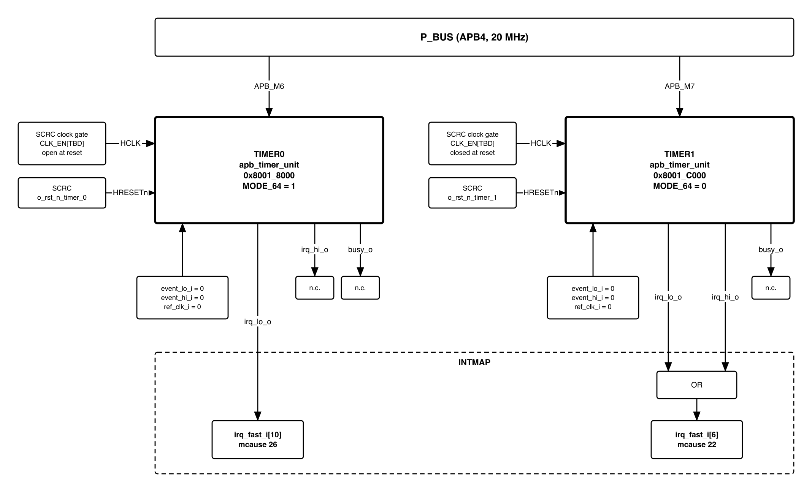

# QNSC_TIMER — design decisions and record

**This is not the specification.** That is
[`QNSC_TIMER_MAS.md`](QNSC_TIMER_MAS.md).

This file is the V1.2 document as it stood before that rewrite, kept whole: the
revision history, the reasoning behind each decision, the observations, and how
every open question closed.

Nothing here was deleted from the specification without being kept here first.

---

# Reversion and History

| Version | Date       | Author/Owner | Description of Change |
|---------|------------|--------------|-----------------------|
| V1.0    | 2026-09-21 | Nghia VT     | First issue. Supersedes the deleted timer document, which specified only `apb_adv_timer` and did not mention `apb_timer_unit` at all. **That document contradicted the crossbar**: `QSOC_HAS` allocates three APB ports and three address regions to TIMER0, TIMER1 and PWM, which one block cannot occupy. This document covers TIMER0 and TIMER1 only; PWM is `QNSC_PWM_MAS`. Every RTL claim below was read from `pulp-platform/timer_unit` at `rtl/apb_timer_unit.sv` rather than taken from a datasheet. |
| V1.1    | 2026-09-21 | Nghia VT     | **Four open questions closed.** `ref_clk_i` tied to the domain clock with `REF_CLK_EN` left 0, because the prescaler alone reaches fifteen hours and nothing needs longer; `event_lo_i`/`event_hi_i` tied 0, because no block has asked and reconnecting is a wire; **TIMER0's clock gate open out of reset and TIMER1's closed**, because a timebase must advance before firmware asks while a timeout need not; and **no RTOS in scope**, so the absence of `mtime`/`mtimecmp` stands as a disclosed limitation with the route back intact. Section 5.8 records each with its reason. |
| V1.2    | 2026-09-21 | Nghia VT     | The last item is reclassified. It was never a question awaiting an answer but a **reversibility note**: `event_*_i` are tied 0 because nobody asked, and reconnecting one later is a single wire plus an existing register bit. Section 5.8 now states that instead of listing it as open, so the document has **no open questions**. |

# Table of Tables

| Table | Title |
|-------|-------|
| Table 1 | IP sourcing decision |
| Table 2 | Why the PWM IP cannot serve as the timer |
| Table 3 | Block interface |
| Table 4 | Register map of one instance |
| Table 5 | `CFG_REG_LO` and `CFG_REG_HI` bit fields |
| Table 6 | Counting rate options |
| Table 7 | Interrupt shape and pulse width |
| Table 8 | Address decode against region size |
| Table 9 | Mode selected per instance |
| Table 10 | Interrupt sources contributed to INTMAP |
| Table 11 | Clock and reset domain |
| Table 12 | Verification QSOC must add |
| Table 13 | Interfaces to agree with the team |
| Table 14 | Acronyms |

# Table of Figures

| Figure | Title |
|--------|-------|
| Figure 1 | TIMER0 and TIMER1 in QSOC |

---

# 1. Overview

## 1.1 Scope

This document specifies the integration of **two `apb_timer_unit` instances** as QSOC's
TIMER0 and TIMER1. It covers the register map, the counting modes, the interrupt
contribution, the clock and reset domain, and the address decode.

**It does not cover PWM.** PWM is a different IP in a different block at a different
APB port, specified in `QNSC_PWM_MAS`. The separation is stated this plainly because
the document this one replaces confused the two, and that confusion reached
`QSOC_HAS` as a recorded disagreement between documents.

**Table 1 -- IP sourcing decision**

| Item | Value |
|---|---|
| IP | `pulp-platform/timer_unit`, file `rtl/apb_timer_unit.sv` |
| Sub-modules used | `timer_unit_counter`, `timer_unit_counter_presc` |
| Instances | **two** -- TIMER0 and TIMER1 |
| Bus | APB slave, plain signals, no adapter required |
| Parameter | `APB_ADDR_WIDTH = 12` |
| Written by QSOC | instantiation and tie-off only; no RTL inside the block |

**The repository name is not the module name.** The module `apb_timer_unit` lives in a
repository called `timer_unit`; searching for a repository named after the module
returns nothing. This is recorded because it cost time once already.

## 1.2 Position in the system

TIMER0 and TIMER1 are APB slaves on `P_BUS`, reached from the CPU through `AXI2APB`
on `AXI_M3`. They drive no pads. Their only outputs to the rest of QSOC are interrupt
lines into `INTMAP`.

{width=6.4in}

# 2. Feature

## 2.1 Feature -- TIMER

- Two independent instances, each an `apb_timer_unit`.
- Each instance holds **two 32-bit counters** with an 8-bit prescaler each, usable
  either as two independent 32-bit timers or as **one 64-bit timer**.
- Compare-on-equal against a programmable target, with optional
  compare-and-clear for periodic operation and optional one-shot.
- Counting rate selectable: core clock directly, a slower reference sampled as data,
  or either divided by the prescaler.
- A timer can be started by an external event instead of by a register write.
- **TIMER0 is configured as one 64-bit timer** and serves as QSOC's timebase.
  **TIMER1 is configured as two independent 32-bit timers** for general timeouts.
- **Three interrupt sources in total**, all carried by `INTMAP`. Shape depends on
  mode: a **pulse** when periodic, a **held level** in one-shot -- section 4.7.

**What the block deliberately does not provide**, so that no reader assumes otherwise:

- **No PWM output.** There is no channel pin of any kind.
- **No `mtime`/`mtimecmp`.** QSOC has no standard RISC-V machine timer; section 5.5
  states the consequence and the way back.
- **No interrupt status or flag register.** Section 4.4 gives the full read map;
  nothing in it records that an interrupt occurred.
- **No error reporting.** `PSLVERR` is tied low inside the IP, section 4.6.

# 3. Block Diagram

Figure 1 in section 1.2 is the block diagram. One `apb_timer_unit` contains two
counters, two prescalers, an APB register file and the interrupt logic; nothing else.

# 4. Micro-architecture Details

## 4.1 Why this IP and not the PWM IP

The document this one replaces specified `apb_adv_timer` for the timer role. That IP
cannot perform it, and the reason is arithmetic rather than a matter of preference.

**Table 2 -- Why the PWM IP cannot serve as the timer**

| | `apb_adv_timer` (PWM) | `apb_timer_unit` (this block) |
|---|---|---|
| Counter width | **16-bit** | 32-bit, or **64-bit** combined |
| Wrap at 20 MHz, no prescaler | **3.2768 ms** | 214.7 s, or ~29 000 years at 64-bit |
| Channel output pins | 16 | **none** |
| Suited to | short repeating waveforms | a timebase that must not wrap |

A timebase that wraps every 3.28 ms forces firmware to count wraps continuously, and
one missed wrap corrupts every later measurement. A PWM block never needs a long
count, because its period repeats thousands of times a second. **The two roles want
opposite counter widths, which is why QSOC instantiates both IPs rather than one.**

## 4.2 Structure

One instance contains:

| Sub-module | Count | Function |
|---|---:|---|
| `timer_unit_counter` | 2 | the 32-bit counters, `lo` and `hi` |
| `timer_unit_counter_presc` | 2 | 8-bit prescaler ahead of each counter |
| APB register file | 1 | ten addresses, section 4.4 |
| Interrupt logic | 1 | combinational, section 4.7 |

In 64-bit mode the two counters are chained. The RTL raises the carry explicitly:

```systemverilog
s_enable_count_hi = ( s_timer_val_lo == 32'hFFFFFFFF );
```

so `counter_hi` advances exactly once per wrap of `counter_lo`, giving a true 64-bit
count rather than two loosely coupled halves.

## 4.3 Block interface

**Table 3 -- Block interface**

| Signal | Dir | Width | Note |
|---|---|---:|---|
| `HCLK` | in | 1 | domain clock, section 5.2 |
| `HRESETn` | in | 1 | active low |
| `PADDR` | in | 12 | only `PADDR[5:0]` is decoded, section 4.8 |
| `PWDATA` | in | 32 | |
| `PWRITE`, `PSEL`, `PENABLE` | in | 1 each | |
| `PRDATA` | out | 32 | |
| `PREADY` | out | 1 | **tied** to `PSEL & PENABLE` inside the IP |
| `PSLVERR` | out | 1 | **tied 0** inside the IP |
| `ref_clk_i` | in | 1 | sampled as data, not used as a clock |
| `event_lo_i`, `event_hi_i` | in | 1 each | start a counter without CPU action |
| `irq_lo_o`, `irq_hi_o` | out | 1 each | to `INTMAP` |
| `busy_o` | out | 1 | either counter enabled |

## 4.4 Register map of one instance

**Table 4 -- Register map of one instance**

| Offset | Name | Access | Function |
|---|---|---|---|
| `0x00` | `CFG_REG_LO` | RW | configuration of `lo`; also holds the 64-bit mode bit |
| `0x04` | `CFG_REG_HI` | RW | configuration of `hi` |
| `0x08` | `TIMER_VAL_LO` | RW | current count of `lo`; a write loads it |
| `0x0C` | `TIMER_VAL_HI` | RW | current count of `hi`; a write loads it |
| `0x10` | `TIMER_CMP_LO` | RW | compare target for `lo` |
| `0x14` | `TIMER_CMP_HI` | RW | compare target for `hi` |
| `0x18` | `TIMER_START_LO` | W | any write starts `lo` |
| `0x1C` | `TIMER_START_HI` | W | any write starts `hi` |
| `0x20` | `TIMER_RESET_LO` | W | any write clears `lo` |
| `0x24` | `TIMER_RESET_HI` | W | any write clears `hi` |

**Reads return only six of the ten addresses** -- the two `CFG`, the two `VAL` and the
two `CMP`. The four command addresses are write-only and read as zero. **There is no
status register and no interrupt flag**, which is the fact section 5.5 and
`QNSC_Interrupt_Map_MAS` both depend on.

**Table 5 -- `CFG_REG_LO` and `CFG_REG_HI` bit fields**

| Bit | Name | Function |
|---:|---|---|
| 0 | `ENABLE` | counter runs |
| 1 | `RESET` | clears the counter; self-clearing |
| 2 | `IRQ_EN` | allows the compare to raise the interrupt |
| 3 | `IEM` | lets `event_*_i` set `ENABLE` |
| 4 | `CMP_CLR` | on compare, clear the counter -- this is what makes it periodic |
| 5 | `ONE_SHOT` | on compare, clear `ENABLE` |
| 6 | `PRESC_EN` | insert the prescaler |
| 7 | `REF_CLK_EN` | count on `ref_clk_i` edges instead of every core clock |
| 15:8 | `PRESC` | 8-bit prescaler divisor |
| 31 | `MODE_64` | **`CFG_REG_LO` only**: chain both counters into one 64-bit timer |

`MODE_64` is read from `CFG_REG_LO` by the RTL in every place it is used, including
the paths that control the `hi` counter. **Writing bit 31 of `CFG_REG_HI` has no
effect** and must not be relied on.

## 4.5 Counting rate

**Table 6 -- Counting rate options**

| `REF_CLK_EN` | `PRESC_EN` | Counter advances | Wrap of 32 bits at 20 MHz |
|---|---|---|---|
| 0 | 0 | every core clock | 214.7 s |
| 0 | 1 | every `PRESC`+1 core clocks | up to 256 x that |
| 1 | 0 | on each rising edge of `ref_clk_i` | set by `ref_clk_i` |
| 1 | 1 | prescaled `ref_clk_i` edges | set by both |

`ref_clk_i` passes through a four-stage shift register and an edge detector inside the
IP. **It is sampled as data, never used as a clock**, so it creates no second clock
domain and needs no CDC constraint. This is the same treatment `QSOC_HAS` already
accepted for the PWM block's low-speed clock input.

## 4.6 What the APB handshake cannot tell firmware

`PREADY` is tied to `PSEL & PENABLE` and `PSLVERR` is tied to zero, both inside the
IP. Two consequences follow, and they pull in opposite directions:

- **The block can never stall `P_BUS`.** No access to it can hang the bus, which
  removes it from the list of blocks a watchdog has to protect against.
- **The block can never report an error.** A write to an unimplemented offset is
  accepted silently and a read of one returns zero. Firmware gets no signal that it
  addressed the block wrongly.

This is the same pattern already recorded for `apb_gpio` in `QSOC_HAS`, and it is
worth stating once per block rather than assuming the reader remembers.

## 4.7 The interrupt, and the hazard in how it compares

The interrupt is combinational from the compare result:

```systemverilog
if ( s_cfg_lo_reg[`MODE_64_BIT] == 1'b0 ) begin       // 32-bit mode
   irq_lo_o = s_target_reached_lo & s_cfg_lo_reg[`IRQ_BIT];
   irq_hi_o = s_target_reached_hi & s_cfg_hi_reg[`IRQ_BIT];
end else begin                                        // 64-bit mode
   irq_lo_o = s_target_reached_lo & s_target_reached_hi & s_cfg_lo_reg[`IRQ_BIT];
end
```

**In 64-bit mode `irq_hi_o` is never driven.** The instance contributes one interrupt
source, not two. That is why TIMER0 contributes one and TIMER1 contributes two.

**The 64-bit compare is correct, and it is worth showing why**, because the expression
looks as though two unrelated events must coincide. `target_reached_hi` is high for
the whole epoch in which `counter_hi` equals its target, and that epoch lasts one full
wrap of `counter_lo`. Within it, `counter_lo` passes through every value exactly once,
so it equals its own target for exactly one tick. The AND therefore produces **exactly
one pulse**, at the intended 64-bit value.

**The hazard: the comparison is equality, not greater-or-equal.** `target_reached` is
asserted when the counter **equals** the compare value. The standard RISC-V machine
timer is specified the other way -- the interrupt is pending while
`mtime >= mtimecmp` -- specifically so that a target already passed still fires.

This block has no such protection, and the failure is silent:

| Mode | If firmware writes a target the counter has just passed |
|---|---|
| 32-bit at 20 MHz | next hit after a full wrap, **214.7 s** late |
| **64-bit at 20 MHz** | next hit after a 64-bit wrap, **~29 000 years** -- never |

**Firmware must therefore compute the next target from the current count with enough
margin to cover its own interrupt latency, and must not write a target derived from a
count it read earlier.** In 64-bit mode this is not a performance matter but a
correctness one. Section 5.6 turns it into a verification test.

**The shape depends on the mode, and one mode makes it a level.** The comparator is a
flop that is **not gated by the counter enable**:

```systemverilog
// timer_unit_counter.sv -- COMPARATOR
always_ff@(posedge clk_i, negedge rst_ni)
   if ( s_count == compare_value_i ) target_reached_o <= 1'b1;
   else                              target_reached_o <= 1'b0;
```

and when the counter is stopped, `s_count` holds its value. So a mode that **stops the
counter on the compare** leaves `s_count == compare_value_i` true indefinitely, and the
interrupt is held rather than pulsed.

**Table 7 -- Interrupt shape by mode**

| `CMP_CLR` | `ONE_SHOT` | What happens at the target | Shape | Width |
|---|---|---|---|---|
| 1 | 0 | counter clears and runs on -- periodic | **pulse** | 1 counting tick |
| 0 | 0 | counter runs past the target | **pulse** | 1 counting tick, next hit after a full wrap |
| x | **1** | `ENABLE` is cleared, **counter stops on the target** | **held level** | until firmware clears or restarts it |

One counting tick is one `HCLK` cycle with no prescaler and no reference clock,
`PRESC`+1 cycles with the prescaler, or one `ref_clk_i` period with `REF_CLK_EN` set.
**The narrowest case is one core clock**, and that is the case `INTMAP` must assume.

**Why the one-shot level is useful rather than awkward.** One-shot is exactly the mode
in which "the event repeats next period" is **not** available as a recovery mechanism.
The IP holds the line in that mode, so a one-shot alarm missed because `mstatus.MIE`
was clear is still pending when interrupts are re-enabled. `QNSC_Interrupt_Map_MAS`
Table 5 classifies the two modes separately for this reason.

**Firmware must clear a one-shot interrupt by acting on the block**, either by writing
`TIMER_RESET_*`, by moving `TIMER_CMP_*`, or by clearing `IRQ_EN`. Returning from the
handler without doing so re-enters it immediately.

## 4.8 Address decode against the region

The IP decodes `PADDR[5:0]` only. The register file therefore occupies **64 bytes**,
while `QSOC_HAS` grants the block a **16 KiB** region.

**Table 8 -- Address decode against region size**

| Item | Value |
|---|---|
| Registers implemented | 10 addresses, `0x00` to `0x24` |
| Address bits decoded | `PADDR[5:0]` |
| Span actually decoded | **64 bytes** |
| Region assigned | **16 KiB** |
| Consequence | the 64 bytes **alias 256 times** across the region |

So `0x8001_C000` and `0x8001_C040` are the same register. This is harmless if firmware
uses the base address, and it is a trap if anyone assumes an access above the first 64
bytes will fault -- it will not, because `PSLVERR` is tied low as well. **QSOC must
either accept the aliasing and document it, or narrow the decode in the wrapper.** The
recommendation is to accept it: narrowing costs logic and buys only a fault that
firmware has no way to observe.

# 5. Integration into QSOC

## 5.1 Address and port assignment

Taken from `QSOC_HAS` and not changed by this document.

| Port | Block | Base | Region |
|---|---|---|---|
| `APB_M7` | **TIMER0** | `0x8001_C000` | 16 KiB |
| `APB_M8` | **TIMER1** | `0x8002_0000` | 16 KiB |

Three APB ports and three address regions are allocated to TIMER0, TIMER1 and PWM.
**That allocation is itself the evidence that QSOC has three timer-family blocks and
not one**, and it is what settles the disagreement `QSOC_HAS` records.

## 5.2 Mode selected for each instance

**Table 9 -- Mode selected per instance**

| | TIMER0 | TIMER1 |
|---|---|---|
| `MODE_64` | **1** | **0** |
| Counters visible to firmware | one 64-bit | two independent 32-bit |
| Wrap at 20 MHz, no prescaler | ~29 000 years | 214.7 s each |
| Interrupt outputs driven | `irq_lo_o` only | `irq_lo_o` and `irq_hi_o` |
| Sources contributed | **1** | **2** |
| Intended use | the timebase: uptime, delays, timestamps | general timeouts, two clients at once |

**Why this split.** A timebase must not wrap, so it takes the 64-bit mode; the cost is
that the instance then yields only one interrupt. Timeouts are short and there are
usually several outstanding at once, so the second instance is worth more as two
independent 32-bit timers than as a second long counter. Together they give firmware
one clock it can trust and two alarms it can set.

## 5.3 Interrupt contribution

**Table 10 -- Interrupt sources contributed to INTMAP**

| Source | From | Shape | Carried on |
|---|---|---|---|
| TIMER0 compare | `irq_lo_o`, 64-bit compare | pulse, or level in one-shot | `INTMAP` fast line for TIMER0 |
| TIMER1 compare A | `irq_lo_o` | pulse, or level in one-shot | `INTMAP` fast line for TIMER1 |
| TIMER1 compare B | `irq_hi_o` | pulse, or level in one-shot | same line, OR'd with A |

**Three sources.** This matches the count `QNSC_Interrupt_Map_MAS` already assumes, so
the interrupt contract needs no change from this document. That document's Table 5
already lists the periodic and one-shot modes as separate rows with different shapes,
which this document confirms from the counter RTL.

Because TIMER1's two outputs share one fast line, the handler for that line must read
both `CMP` registers, or track which alarms it armed, to tell which of the two fired.
`mcause` identifies the block, not the compare within it.

## 5.4 Clock and reset domain

**Table 11 -- Clock and reset domain**

| Item | TIMER0 | TIMER1 |
|---|---|---|
| Domain | **D04** | **D05** |
| Clock gate bit | bit 3 | bit 4 |
| Gate | own gate, independently gateable | own gate |
| Clock | 20 MHz system clock, no PLL in QSOC |  |
| Reset | synchronous release of the system reset, active low |  |
| `ref_clk_i` | **not a clock**: sampled as data, no second domain |  |

Because each instance has its own gate, firmware can stop TIMER1 without stopping the
timebase. **Gating TIMER0 stops the timebase**, which is a way to lose time silently:
the counter does not advance and nothing records that it paused. If `SCRC` closes
bit 3, firmware must treat every timestamp taken across the gap as invalid.

## 5.5 What QSOC gives up by having no `mtime`

QSOC has no `mtime`/`mtimecmp`. `irq_timer_i` on Ibex is tied low, `mip.MTIP` is never
set, and `mcause` 7 never occurs. This is a deliberate choice and it is legal -- the
machine timer is a platform facility, not a core requirement, and the privileged
specification permits a platform not to provide one.

What it costs is **software portability, not function**. The RISC-V port of FreeRTOS
uses `mtime`/`mtimecmp` by default; without them the port must be built with the
CLINT path disabled and a timer setup function supplied by hand. Any RTOS brought to
QSOC pays that cost once.

**The way back is local.** Replacing the block behind `APB_M7` with a standard
`mtime` -- a free-running 64-bit counter, a 64-bit compare and a `>=` test -- would
use the same port, the same base address and the same gate bit, and would touch no
other block. It would also remove the equality hazard of section 4.7 by construction.
This is recorded so that the decision can be revisited without re-opening the memory
map, in the same spirit as the reserved escape hatch in `QNSC_RAM_MAS`.

## 5.6 Verification QSOC must add

**Table 12 -- Verification QSOC must add**

| # | Check | Why it is here |
|---:|---|---|
| 1 | Every register reads back what was written, at the documented offset | basic |
| 2 | The four command offsets read as zero and do not corrupt `CFG` | write-only paths |
| 3 | `0x00` and `0x40` are proven to be the same register | pins the aliasing of section 4.8 |
| 4 | 32-bit mode: both `irq_lo_o` and `irq_hi_o` fire independently | TIMER1's two sources |
| 5 | **64-bit mode: `irq_hi_o` never asserts** | the source count depends on it |
| 6 | 64-bit mode: the compare fires exactly once at the 64-bit target | proves the carry and the AND of section 4.7 |
| 7 | **Write a target the counter has just passed; confirm no interrupt** | makes the equality hazard visible on purpose |
| 8 | `CMP_CLR` = 1 gives a periodic **pulse** | the shape `INTMAP` assumes for the periodic case |
| 9 | **`ONE_SHOT` = 1 leaves the interrupt asserted** until firmware acts, and re-entry occurs if the handler returns without clearing | the level of section 4.7; the most surprising behaviour in the block |
| 10 | Pulse width equals one `HCLK` with no prescaler, `PRESC`+1 with it | the number `INTMAP` assumes |
| 11 | `event_lo_i` with `IEM` = 1 starts the counter without any APB write | otherwise the input is untested |
| 12 | `ref_clk_i` at a frequency unrelated to `HCLK` produces a stable rate | confirms the sampling path |
| 13 | Closing the domain clock gate stops the counter and does not corrupt it | the silent-time-loss case of 5.4 |

Test 7 is the one most likely to be left out, because it asserts that **nothing**
happens. It is also the test that would have caught the hazard before silicon.

## 5.7 Interfaces to agree with the team

**Table 13 -- Interfaces to agree with the team**

| Item | Owner | What this document proposes |
|---|---|---|
| `ref_clk_i` source | `SCRC` | tie to the domain clock unless a slower tick is wanted; the IP samples it, so any frequency is legal |
| `event_lo_i` / `event_hi_i` | system | **tie 0** unless a use is identified, and say so rather than leaving them floating |
| Clock gate bits 3 and 4 | `SCRC` | open out of reset, so the timebase runs before firmware configures anything |
| 16 KiB region with a 64-byte decode | bus owner | accept the aliasing, document it, do not add a narrower decode |
| Three interrupt sources | `INTMAP` | already assumed by `QNSC_Interrupt_Map_MAS`; no change |

## 5.8 Decisions taken

QSOC is a **training device**, and that ruling settles more than it first appears: there
is no external acceptance criterion to satisfy, so where a choice is between *simple and
sufficient* and *general and costly*, this document takes the first and records why.

**Decided -- `ref_clk_i` is tied to the domain clock and `REF_CLK_EN` stays 0.** With the
prescaler alone a 32-bit counter reaches 214.7 s x 256, a little over **fifteen hours**,
and nothing in QSOC measures longer. Tying it removes an entire axis from the
verification matrix -- tests 11 in Table 12 becomes a tie-off check rather than a
two-clock exercise -- and it can be un-tied later without touching the register map.

**Decided -- `event_lo_i` and `event_hi_i` are tied 0.** No block has asked to start a
timer in hardware. This is a **wire, not a design**: if the DMA survey or a later block
wants one, connecting it is an integration change and the register bit (`IEM`) already
exists. Tying an unused input is required either way; leaving it unconnected is not.

**Decided -- TIMER0's clock gate is open out of reset, TIMER1's is closed.** These are
different because their jobs are different. TIMER0 is the timebase, and time should
advance without firmware having to ask; a gate that starts closed means every timestamp
before the first `SCRC` write is silently wrong. TIMER1 does nothing until its compare
and configuration are written, so it starts closed and costs nothing until used.

**Decided -- no RTOS is in scope, so section 5.5 stands as written.** QSOC has no
`mtime`/`mtimecmp`, `mcause` 7 never occurs, and the firmware is the team's own
bare-metal code. The disclosure in section 5.5 stays, together with the route back, so
the decision is reversible without re-opening the memory map.

**Nothing is left open.** One consequence is worth recording so it is not rediscovered:

**If any block later wants a hardware timer start, `event_*_i` stops being a tie-off.**
The decision above ties them to 0 because nobody has asked. Reconnecting one is an
integration change of a single wire -- the register bit that arms it, `IEM`, already
exists and is specified in Table 5 -- and test 11 in Table 12 then becomes a real test
instead of a tie-off check. The DMA interface survey will answer it for the DMA; no
other block has a plausible use.

# 6. Observations

**The strongest argument in this document is a bus port count.** The disagreement
between the previous timer document and `QSOC_HAS` looked like a matter of opinion
about which IP to use. It was not: `QSOC_HAS` allocates `APB_M7`, `APB_M8` and
`APB_M13` with three separate base addresses and three separate clock gate bits. One
block cannot sit at three ports. The crossbar had already answered the question, and
reading it was faster than arguing about the IPs.

**The 16-bit figure that caused the confusion is not a weakness.** A 16-bit counter at
20 MHz gives 20 000 duty steps at 1 kHz, which is far more resolution than any use
QSOC has. It is the correct width for PWM and the wrong width for a timebase, and
noticing that is what makes it clear the two roles need two IPs. STMicroelectronics
documents the same split in its own training material for the STM32 family: most
timers are 16-bit, a few are 32-bit, on a 32-bit CPU.

**The equality comparison is the defect most likely to survive into silicon.** It
breaks nothing in simulation, because a testbench naturally writes a target ahead of
the counter. It breaks in the field, when an interrupt arrives late and firmware
computes a target from a stale count. In 64-bit mode the recovery time is longer than
the life of the chip. It is cheap to guard against in firmware and impossible to
notice afterwards, which is the combination that justifies a verification test whose
expected result is silence.

# Appendix A. Acronyms

**Table 14 -- Acronyms**

| Term | Meaning |
|---|---|
| APB | Advanced Peripheral Bus, the AMBA bus used for QSOC's slow peripherals |
| `CMP` | Compare register -- the target a counter is tested against |
| CDC | Clock Domain Crossing |
| DFT | Design For Test |
| `HCLK` | The APB clock, named by AMBA convention |
| `mcause` | RISC-V CSR reporting the cause of a trap |
| `mtime`, `mtimecmp` | The standard RISC-V machine timer and its compare register. **Not present in QSOC** -- section 5.5 |
| `mtimecmp` prescaler | 8-bit divider ahead of a counter, field `PRESC` |
| MAS | Micro-Architecture Specification |
| PWM | Pulse Width Modulation -- a separate block, `QNSC_PWM_MAS` |
| RTOS | Real Time Operating System |

# Appendix B. First Review

Points the author expects to be challenged on, with the answer held ready.

1. **Why two instances of the same IP rather than one block with two timers?**
   Because `QSOC_HAS` allocates two APB ports and two clock gate bits, so the two can
   be stopped independently. One block would share a gate.
2. **Why is TIMER0 64-bit when 32-bit wraps only every 214 s?**
   Because a timebase that wraps forces firmware to count wraps, and a missed wrap
   corrupts every later timestamp. The cost of 64-bit is one interrupt output.
3. **Why accept the address aliasing?**
   Narrowing the decode buys a fault that firmware cannot observe, because `PSLVERR`
   is tied low inside the IP.

# Appendix C. References

| Claim | Where the evidence is |
|---|---|
| Module name, ports, APB tie-offs | `pulp-platform/timer_unit`, `rtl/apb_timer_unit.sv` |
| Register offsets `0x00` to `0x24` | same file, the `` `define `` block at the top |
| `CFG` bit positions, including `MODE_64` at bit 31 | same file, the `` `define `` block |
| **`irq_hi_o` is not driven in 64-bit mode** | same file, the `IRQ SIGNALS GENERATION` block |
| 64-bit carry `s_enable_count_hi = ( s_timer_val_lo == 32'hFFFFFFFF )` | same file, the `ENABLE SIGNALS GENERATION` block |
| `target_reached` is a registered compare on equality, **ungated by the counter enable** -- which is why one-shot yields a held level | `rtl/timer_unit_counter.sv`, the `COMPARATOR` block |
| `ref_clk_i` sampled through four flops and an edge detector | `rtl/apb_timer_unit.sv`, `EDGE DETECTOR FOR REF CLOCK` |
| `mtime` must be 64-bit on RV32 and RV64 | RISC-V Privileged Architecture, Machine ISA 1.13 ratified, section 3.2.1 |
| Machine timer is a platform facility, not a core one | same, section 3.2.1 |
| Most STM32 timers are 16-bit, a few 32-bit | STMicroelectronics STM32G4 general purpose timer training material |
| Ports, addresses, domains D04/D05 | `QSOC_HAS` Table 9-1, the APB port table and the clock domain table |
| Three interrupt sources, all pulses | `QNSC_Interrupt_Map_MAS`, Table 6 |

# V2.1 cuts (2026-09-24)

`QNSC_TIMER_MAS` V2.1 keeps only testable claims. What it dropped, and the corrections
it made to the record above, are listed here.

**Moved out of the MAS; the reasoning already lives above.**

| Cut from V2.0 | Kept in |
|---|---|
| Why the PWM IP (`apb_adv_timer`, 16-bit, 3.28 ms wrap) cannot be the timebase | 4.1 |
| `PREADY` tied / `PSLVERR` tied: "can never stall, can never report an error" | 4.6 |
| Why the 64-bit `match_lo & match_hi` AND gives exactly one pulse | 4.7 |
| Comparison with the RISC-V `mtime >= mtimecmp` rule | 4.7, 5.5 |
| Recommendation to accept the 64-byte aliasing rather than narrow the decode | 4.8, Appendix B item 3 |
| What QSOC gives up by having no `mtime`; RTOS ports need their own driver | 5.5 |
| "Accepted limits" list, duplicating sections 9 and 10 of V2.0 | now MAS section 11 |
| Appendix B rows with no reviewer (two IPs, the 64-bit AND, status register) | 4.1, 4.7, 4.6 |

**Corrected from the RTL at `4c69615c`.** These replace the statements above
(4.4, 4.7, 5.4, 5.8 and the Appendix C row on the comparator).

1. **One-shot is a held level only when the counter does not advance every cycle.**
   `ONE_SHOT` clears `ENABLE` through the combinational `s_cfg_lo`, so the registered
   `ENABLE` is still 1 in the cycle after the match. With no prescaler (or
   `PRESC` = 0) the counter steps to `CMP`+1 in that cycle, the comparator sees a
   mismatch, and the interrupt is a 1-cycle pulse. With `PRESC` >= 1 or `ref_clk_i`
   there is no tick in that cycle, the count stays on `CMP` and the level is held.
   With `CMP_CLR` = 1 as well, the counter clears to 0 and the interrupt is a pulse.
   Not yet simulated; MAS section 12 carries the check. `vendor/manifest.yml` still
   says "held level" unconditionally.
2. **Periodic (`CMP_CLR`) pulses are always one `HCLK` cycle**, even prescaled,
   because the clear follows the match flag at once. Period: `CMP`+1 cycles unprescaled,
   `CMP` x (`PRESC`+1) with `PRESC` >= 1.
3. **`CFG_REG_HI[31]` is not ignored.** The `hi` one-shot path reads
   `s_cfg_hi_reg[MODE_64_BIT]`; with it set in 32-bit mode, counter `hi` no longer
   clears its own `ENABLE` at its match.
4. **`TIMER_START_x` alone does not restart a held one-shot**: the one-shot condition
   is still true and clears `ENABLE` again the next cycle.
5. **`ref_clk_i` is tied 0, not to the domain clock (5.8).** With `REF_CLK_EN` = 0
   behaviour is identical, and a constant keeps the clock net off flop data pins.
6. **"D04, bit 3" / "D05, bit 4" removed from the figure.** Bits 3 and 4 are the
   `domainrststatus` bits in `QSOC_HAS` Table 9-2, not `CLK_EN` positions; those are
   still `tbd` in `util/qsoc_contract.yml`.
7. **New accepted limit**: `TIMER1` ORs two sources onto `irq_fast_i[6]` and has no
   status register, so in periodic mode firmware cannot tell `lo` from `hi`.

## Decided 2026-09-24

- `paddr` is 12 bits at the wrapper; the IP decodes `[5:0]`. `P_BUS` supplies the offset within the region.
