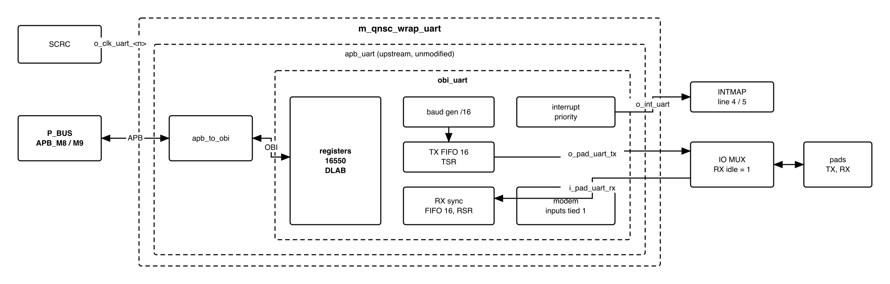
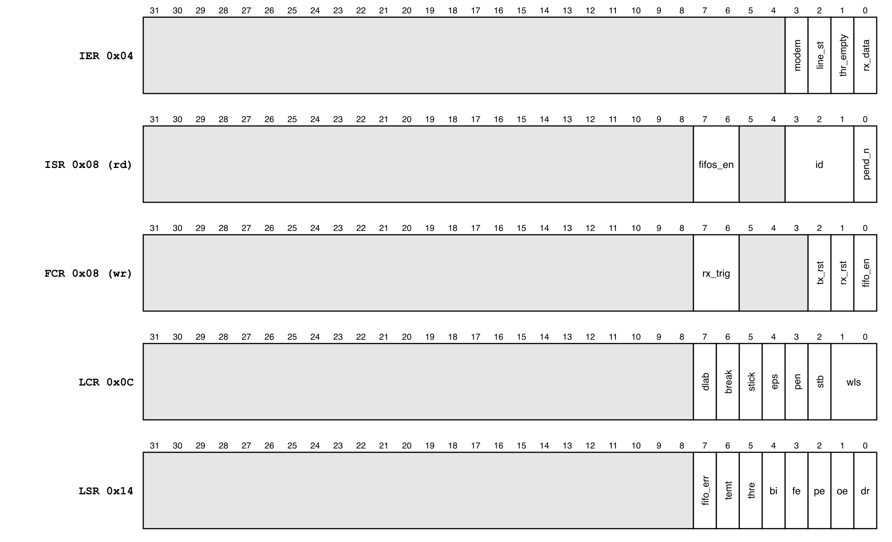
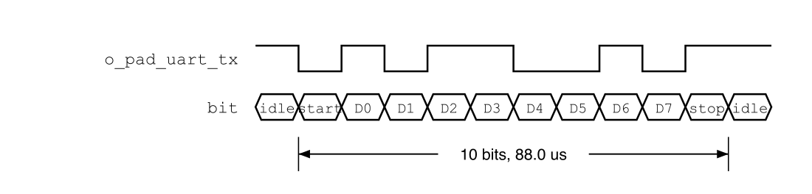

# Revision history

The reasoning behind each change, and the research report this specification is
built on, are in [`QNSC_UART_DECISIONS.md`](QNSC_UART_DECISIONS.md).

| Version | Date | Author | Reviewer | Description of change |
|---|---|---|---|---|
| V3.0 | 2026-09-28 | Nghia VT (lead), for Ong Bao Vinh | -- | Specification written from the research report (V2.x): addresses and interrupt lines from the contract, wrapper `m_qnsc_wrap_uart` around upstream `apb_uart` unmodified, no DMA request ports, no parameter |
| V3.1 | 2026-09-30 | Nghia VT | -- | Interrupt source named `INT`, the port of `apb_uart` the wrapper instantiates, as the contract and `INTMAP` name it; `irq_o` is its source inside `obi_uart` |

# 1. Overview

`UART0` and `UART1` are two instances of `pulp-platform/apb_uart`, a 16550A-compatible
serial port with 16-byte transmit and receive FIFOs. `UART0` carries the boot
download (`QNSC_BOOT_SPEC`); `UART1` is a general-purpose port.

The fact that shapes it: QSOC has one 20 MHz clock, so the baud rate is set only by
the divisor, and the reset divisor stops the baud generator until firmware writes
one (7.2).

The block has no hardware flow control and no DMA request: modem inputs are tied
inactive, and every transfer is made by the CPU or by a software-started DMA job.

Block directory `design/uart`, wrapper `m_qnsc_wrap_uart`, owner Ong Bao Vinh.

<!-- gen:memory_map ports=APB_M8,APB_M9 -->
: Memory map, regions behind APB_M8 and APB_M9

| Base | Size | Region | Port | Kind | Note |
|---|---|---|---|---|---|
| `0x80020000` | 16 KiB | `uart_0` | APB_M8 | peripheral | Carries the boot download |
| `0x80024000` | 16 KiB | `uart_1` | APB_M9 | peripheral |  |
<!-- /gen -->

: Instances

| Instance | APB port | Interrupt | `SCRC` domain | Use |
|---|---|---|---|---|
| `UART0` | `APB_M8` | fast line 4, `mcause` 20 | `uart_0`, `CLK_EN[5]` | Boot download, console |
| `UART1` | `APB_M9` | fast line 5, `mcause` 21 | `uart_1`, `CLK_EN[6]` | General purpose |

# 2. Features

- 16550A register map at byte offset 4 x *n*; 8 registers, `DLAB` banking -- 6.
- 5 to 8 data bits, 1 or 2 stop bits, none, odd, even or stick parity, break -- 7.1.
- 16-bit divisor: baud = 20 MHz / (16 x divisor) -- 7.2.
- 16-byte TX and RX FIFOs, RX trigger at 1, 4, 8 or 14 bytes, character timeout -- 7.3.
- One level interrupt from four prioritised sources -- 7.4.
- Zero-wait-state APB; register errors answered with `PSLVERR` -- 7.5.

# 3. Block diagram

{width=6.5in}

: Sub-blocks

| Block | Module | Function |
|---|---|---|
| APB to OBI | `apb_to_obi` (in `apb_uart`) | APB4 slave; the register offset is `PADDR[4:2]` |
| Registers | `obi_uart_register` | 16550 registers, `DLAB` decode, `PSLVERR` on unmapped access |
| Baud generator | `obi_uart_baudgen` | Divides `i_clk_peri` by the divisor; 16 ticks per bit |
| Transmitter | `obi_uart_tx` | THR, 16-byte FIFO, shift register, frame generation |
| Receiver | `obi_uart_rx` | 2-FF input synchroniser, majority sampling, 16-byte FIFO, timeout |
| Interrupts | `obi_uart_interrupts` | Four sources, priority encoder, `ISR` |
| Modem | `obi_uart_modem` | Inputs tied inactive in the wrapper |

The block is in the `peri` clock cluster: `i_clk_peri` is gated by `SCRC`.

# 4. IP used

: Upstream IP used

| From | Module | Commit | Licence |
|---|---|---|---|
| `pulp-platform/apb_uart` | `apb_uart`, `apb_uart_wrap` | `8182a85d` | SHL-0.51 |
| `pulp-platform/obi_peripherals` | `obi_uart` and its sub-modules | `079894a6` (v0.1.1) | SHL-0.51 |
| `pulp-platform/obi` | `apb_to_obi`, `obi_pkg` | `v0.1.7`, as `apb_uart` pins | SHL-0.51 |
| `pulp-platform/apb` | `apb/typedef.svh` | `6ae8bf8d` (v0.2.4+6), as iDMA pins; `apb_uart` asks for 0.2.4 | SHL-0.51 |
| `pulp-platform/common_cells` | `fifo_v3`, `counter`, `delta_counter`, `sync`, `cf_math_pkg` (the `src/deprecated` shims onto `cc_*`) | `db427693` (v2.0.0-beta.3+3), the copy `design/bus` uses | SHL-0.51 |
| `pulp-platform/tech_cells_generic` | `tc_sync`, called by the `sync` shim | `v0.2.14`, as `common_cells` pins | SHL-0.51 |

Facts this specification relies on, read at those commits:

- `apb_uart` has a 3-bit `PADDR` and forms `{PADDR, 2'b00}`, ties `PSTRB` to `'1`
  and `PPROT` to 0. Its ports have no DMA request.
- The reset value of `DLL` is 1 and of `DLM` 0; the baud generator counts only when
  `{DLM, DLL}` - 1 is not 0 (`obi_uart_baudgen.sv`), so it is stopped out of reset.
- `obi_uart` `irq_o` = 1 while any enabled source is pending (`obi_uart_interrupts.sv`);
  `apb_uart` brings it out as its port `INT`.
- In non-FIFO mode the receiver reports `LSR.BI` = 1 for every character
  (`obi_uart_rx.sv` line 462, which overrides the computed value).

# 5. Interface

: `m_qnsc_wrap_uart` interface

| Signal | Dir | Width | Description |
|---|---|---:|---|
| `i_clk_peri`, `i_rst_n_peri` | in | 1 | `SCRC` `o_clk_uart_<n>`, `o_rst_n_uart_<n>` |
| `i_bus_apb_psel`, `i_bus_apb_penable`, `i_bus_apb_pwrite` | in | 1 | `P_BUS` `APB_M8` / `APB_M9` |
| `i_bus_apb_paddr` | in | 12 | Offset in the window (contract `meta.apb_paddr_width`); bits 4:2 used |
| `i_bus_apb_pwdata` | in | 32 | Bits 7:0 used |
| `i_bus_apb_pstrb`, `i_bus_apb_pprot` | in | 4, 3 | Not used |
| `o_bus_apb_prdata`, `o_bus_apb_pready`, `o_bus_apb_pslverr` | out | 32, 1, 1 | Bits 31:8 read 0 |
| `o_int_uart` | out | 1 | `apb_uart` `INT` (`obi_uart` `irq_o`), level -- 7.4. To `INTMAP` `i_int_uart_<n>` |
| `i_pad_uart_rx` | in | 1 | Serial input through IO MUX. Idle 1 |
| `o_pad_uart_tx` | out | 1 | Serial output through IO MUX. Idle 1 |

# 6. Register map

The UART decodes offset bits 4:2 only, so its 32-byte map repeats every 32 bytes in
the window: `base + 0x20` is `RBR`. Registers are 8 bits wide in bits 7:0.

: Register map

| Offset | `DLAB` = 0 read | `DLAB` = 0 write | `DLAB` = 1 read | `DLAB` = 1 write | Reset |
|---|---|---|---|---|---|
| `0x00` | `RBR` | `THR` | `DLL` | `DLL` | `DLL` 0x01 |
| `0x04` | `IER` | `IER` | `DLM` | `DLM` | 0x00 |
| `0x08` | `ISR` | `FCR` | `PSLVERR` | `FCR` | `ISR` 0xC1, `FCR` 0x00 |
| `0x0C` | `LCR` | `LCR` | `PSLVERR` | `LCR` | 0x00 |
| `0x10` | `MCR` | `MCR` | `PSLVERR` | `MCR` | 0x00 |
| `0x14` | `LSR` | `PSLVERR` | `PSLVERR` | `PSLVERR` | 0x60 |
| `0x18` | `MSR` | `PSLVERR` | `PSLVERR` | `PSLVERR` | 0x00 |
| `0x1C` | `SPR`, reads 0 | ignored | `PSLVERR` | ignored | 0x00 |

With `DLAB` = 1 only `DLL` and `DLM` can be read: firmware clears `DLAB` before it
reads `LSR`. `LCR` is writable in both banks, so `DLAB` can always be cleared.

{width=6.5in}

: Fields firmware uses

| Register | Bits | Meaning |
|---|---|---|
| `IER` | 0 / 1 / 2 / 3 | Enable: RX data or timeout / THR empty / line status (not used, 7.4) / modem status (not used) |
| `ISR` | 0 | 0 = an interrupt is pending |
| `ISR` | 3:1 | `011` line status, `010` RX data, `110` timeout, `001` THR empty, `000` modem |
| `ISR` | 7:6 | Always `11` (16550A FIFOs) |
| `FCR` | 0 / 1 / 2 | FIFO enable / clear RX FIFO / clear TX FIFO |
| `FCR` | 7:6 | RX trigger level: 1, 4, 8, 14 bytes |
| `LCR` | 1:0 | Data bits: 5, 6, 7, 8 |
| `LCR` | 2 / 3 / 4 / 5 | 2 stop bits / parity enable / even parity / stick parity |
| `LCR` | 6 / 7 | Send break / `DLAB` |
| `LSR` | 0 / 1 / 2 / 3 / 4 | Data ready / overrun / parity / framing / break |
| `LSR` | 5 / 6 / 7 | THR empty / transmitter empty / error in RX FIFO |

# 7. Functional behaviour

## 7.1 Frame

{width=6.0in}

A frame is a start bit (0), 5 to 8 data bits least significant first, an optional
parity bit and 1 or 2 stop bits (1). The line idles at 1.

## 7.2 Baud rate

- baud = 20 MHz / (16 x `{DLM, DLL}`). Divisor 11 gives 113 636 baud, 1.36 % below
  115 200, inside the 8N1 tolerance.
- Out of reset the divisor is 1 and the baud generator does not run: nothing is sent
  or received until firmware writes the divisor.
- Writing `DLL` or `DLM` restarts the baud counter.

: Common divisors at 20 MHz

| Target baud | Divisor | Actual | Error |
|---:|---:|---:|---:|
| 9 600 | 130 | 9 615 | +0.16 % |
| 19 200 | 65 | 19 231 | +0.16 % |
| 57 600 | 22 | 56 818 | -1.36 % |
| 115 200 | 11 | 113 636 | -1.36 % |

## 7.3 FIFOs

- Firmware sets `FCR` = `0x07` (FIFOs on, both cleared) before use. Without FIFOs the
  receiver reports `LSR.BI` = 1 for every character (section 4), so the non-FIFO mode
  is not used.
- The RX interrupt fires when the RX FIFO reaches the `FCR[7:6]` trigger level, or
  when data waits without a new character for 4 character times (timeout).
- A 16-byte FIFO at 113 636 baud holds 1.4 ms of data.

## 7.4 Interrupt

- `o_int_uart` is 1 while any source enabled in `IER` is pending. `ISR[3:1]` names
  the highest-priority one: line status, RX data, timeout, THR empty, modem.
- RX data is a level while the RX FIFO is at or above its trigger level; timeout clears
  on a read of `RBR`; THR empty is a level while the THR is empty and clears when `THR`
  is written.
- The line-status source is computed from the error events of the character being
  received, so it may last one cycle (`obi_uart_interrupts.sv`), and `INTMAP` does not
  latch. Firmware leaves `IER[2]` = 0 and reads the errors in `LSR` with each
  character; `UART_008` settles it.
- Modem status is not used: `IER[3]` stays 0.

## 7.5 Bus access

- Every access completes with no wait state.
- An access the table of section 6 marks `PSLVERR` completes with `PSLVERR` = 1 and
  changes nothing. It reaches Ibex as a load or store access fault.
- `PSTRB` is ignored: a byte, halfword or word store writes bits 7:0.

## 7.6 Firmware initialisation

The order `QNSC_BOOT_SPEC` 5 uses, and every driver follows:

1. `LCR` = `0x80` (`DLAB` = 1).
2. `DLL` = divisor low byte, `DLM` = divisor high byte.
3. `LCR` = `0x03` (8N1, `DLAB` = 0), written as a value, not read-modify-write.
4. `FCR` = `0x07`.
5. `IER` as required; 0 for polling.

# 8. Instances

Two instances of one wrapper, `UART0` and `UART1` (section 1). They differ only in
their connections in `design/top`.

# 9. What is not provided here, and who provides it

: Functions this block does not provide

| Function | Where it lives |
|---|---|
| Pin selection, RX idle level when the pin is not selected | IO MUX |
| Hardware flow control (RTS/CTS) | not provided; modem inputs tied inactive |
| DMA request | not provided; a DMA job is started by firmware (`QNSC_DMA_MAS` 7.3) |
| Clock gating, reset | `SCRC` |
| Boot download protocol | `QNSC_BOOT_SPEC` |

# 10. Tie-offs

: Tie-offs inside `m_qnsc_wrap_uart`

| Port of `apb_uart` | Tied to | Why |
|---|---|---|
| `CTSN`, `DSRN`, `DCDN`, `RIN` | 1 | Inactive; equals the reset value of the modem synchronisers, so no modem-status change is seen after reset |
| `RTSN`, `DTRN`, `OUT1N`, `OUT2N` | open | No flow control, no modem outputs |
| `PADDR[2:0]` | `i_bus_apb_paddr[4:2]` | Register index |

# 11. Requirements on others, and open items

: Requirements on other owners

| Item | Owner | What it blocks |
|---|---|---|
| RX input driven 1 when the pad is not selected for the UART | IO MUX owner | A 0 is a continuous break: framing errors and interrupts |
| `UART0` pins selected out of reset | IO MUX owner | Boot download |

: HAS text this specification departs from

| `QSOC_HAS_Report_EN_v4_final` says | This specification | Why |
|---|---|---|
| (research report V2.x) `UART0` at `APB_M9` `0x8002_4000`, `UART1` at `APB_M10` | `APB_M8` `0x8002_0000`, `APB_M9` `0x8002_4000` | Contract since `GPIO3` was dropped |
| (research report V2.x) interrupts to PLIC sources 13, 14 | `INTMAP` fast lines 4, 5 | QSOC has no PLIC |

Open items, UART owner:

- Vendor `obi_peripherals`, `obi`, `apb` and `tech_cells_generic` at the commits of
  section 4, without the DMA-request patch, and add the `src/deprecated` shims to the
  one `common_cells` copy. `obi_peripherals` asks for `common_cells` 1.37; the shims
  keep the old ports, and this set was linted together with Verilator 5.
- Lint waiver: Verilator reports a latch on `character_length` (`obi_uart_rx.sv`
  line 200). It is a temporary, read only in the branch that assigns it.
- Wrapper RTL, lint, and the tests of section 12.

Accepted limits:

- The 32-byte register map aliases across the 16 KiB window without an error.
- `LCR[2]` (2 stop bits) is not yet confirmed in simulation (`UART_007`).
- The line-status interrupt is not used (7.4) until `UART_008` shows it is a level.

# 12. Verification

1. `UART_001` Reset values of every register; the baud generator does not run until
   the divisor is written.
2. `UART_002` Every cell of the section 6 table: result and `PSLVERR`, in both banks.
3. `UART_003` Internal loopback (`MCR[4]` = 1), 8N1, divisor 11: every byte sent is received.
4. `UART_004` FIFO mode, a 60 KiB stream at 113 636 baud against a peer 2 % off: no
   overrun, framing or parity error.
5. `UART_005` RX trigger levels 1, 4, 8, 14 and the timeout interrupt with 3 bytes.
6. `UART_006` Interrupt priority and clearing actions of 7.4.
7. `UART_007` Stop-bit count on `o_pad_uart_tx` with `LCR[2]` = 0 and 1.
8. `UART_008` Parity, framing and break with `IER[2]` = 1: width of the `o_int_uart`
   pulse, recorded; the result decides whether `IER[2]` may be used.
9. `UART_009` Boot: `QNSC_BOOT_SPEC` initialisation and frame reception on `UART0` (SoC test).

# Appendix A. Acronyms

: Acronyms

| Acronym | Description |
|---|---|
| DLAB | Divisor Latch Access Bit, `LCR[7]` |
| FIFO | First-in, first-out buffer |
| OBI | Open Bus Interface |
| RBR, THR | Receiver buffer, transmit holding register |
| TSR, RSR | Transmit, receive shift register |

# Appendix B. First review

: First review

| Item | Reviewer | Response |
|---|---|---|
| Why `apb_uart`: APB, 16550 map, polling, no subsystem | Vinh (research) | 4; DECISIONS |
| Non-FIFO mode reports `BI` for every character | Vinh (research, F1) | 7.3: `FCR` = `0x07` always |
| With `DLAB` = 1 most reads fault | Vinh (research, F2) | 6, 7.6 |
| Reset divisor stops the baud generator | Vinh (research, F5) | 7.2 |
| 512 aliases in the 16 KiB window | Vinh (research, F6) | accepted limit, as the other APB IP |
| Wrapper name, parameters, DMA ports | lead, V3.0 | `m_qnsc_wrap_uart`, no parameter (Naming Rule V1.1, `design/README.md`); DMA ports dropped (`QNSC_DMA_MAS` V3.0) |
| Addresses and interrupt from HAS v1.3 | lead, V3.0 | contract, section 1 |
