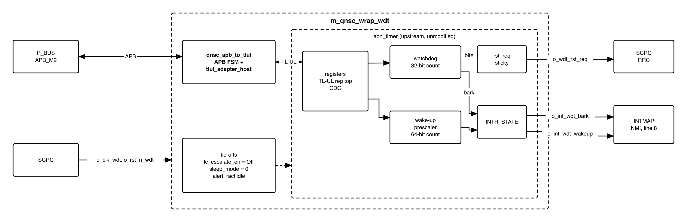
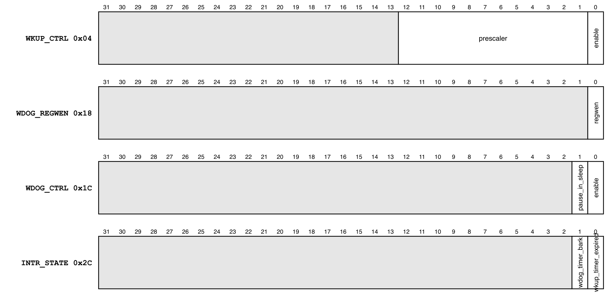
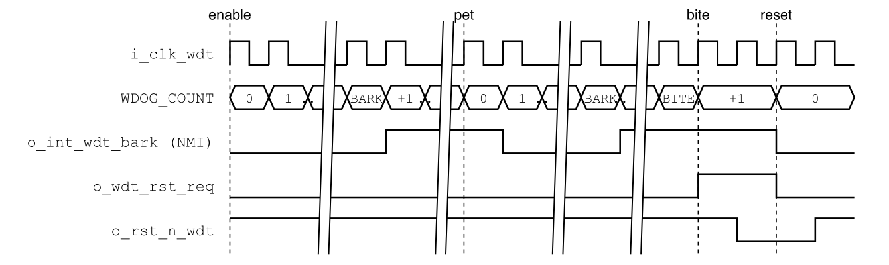

# Revision history

The reasoning behind each change, and the research draft this specification is
built on, are in [`QNSC_WDT_DECISIONS.md`](QNSC_WDT_DECISIONS.md).

| Version | Date | Author | Reviewer | Description of change |
|---|---|---|---|---|
| V1.0 | 2026-09-28 | Nghia VT (lead), for Vu Bui Minh Hieu | -- | Specification written from Quach Huynh Huu Tai's research draft V0.1: upstream `aon_timer` unmodified, one 20 MHz clock, bark to the NMI and bite to `SCRC`, APB bridge on the upstream `tlul_adapter_host`, tie-offs, missing OpenTitan packages |
| V1.1 | 2026-09-30 | Nghia VT | -- | `INTR_STATE` access written W1C, the template name (OpenTitan calls it rw1c) |

# 1. Overview

`WDT` is one instance of lowRISC OpenTitan `aon_timer`: a 32-bit watchdog with two
thresholds and a 64-bit wake-up timer, behind one register block.

The fact that shapes it: **the watchdog is the only recovery from a hung chip**.
Its bark is the non-maskable interrupt; its bite is a chip reset through `SCRC`.
Nothing else in QSOC resets a hung peripheral (`QNSC_SCRC_MAS` 7.3), so the block
is never clock-gated and firmware cannot stop it by gating.

The IP speaks TL-UL; the wrapper adds an APB bridge built on the upstream
`tlul_adapter_host`.

Block directory `design/wdt`, wrapper `m_qnsc_wrap_wdt`, owner Vu Bui Minh Hieu.

<!-- gen:memory_map ports=APB_M2 -->
: Memory map, regions behind APB_M2

| Base | Size | Region | Port | Kind | Note |
|---|---|---|---|---|---|
| `0x80008000` | 16 KiB | `wdt` | APB_M2 | peripheral |  |
<!-- /gen -->

Interrupts: bark to `irq_nm_i`, `mcause` 31; wake-up to fast line 8, `mcause` 24
(`QNSC_Interrupt_Map_MAS` 7.2, 7.3). `SCRC` domain `wdt`, bit 2, always on.

# 2. Features

- Watchdog: 32-bit counter at 20 MHz, bark and bite thresholds, up to 214.7 s -- 7.1.
- Bark: a level on the NMI until firmware pets the counter and clears it -- 7.2.
- Bite: a sticky reset request, cleared by the chip reset it causes -- 7.3.
- Configuration lock `WDOG_REGWEN` until the next reset -- 6.
- Wake-up timer: 12-bit prescaler, 64-bit counter, one level interrupt -- 7.4.
- APB access with 2 wait states; `PSLVERR` on an unused offset or a partial write -- 7.5.

# 3. Block diagram

{width=6.5in}

: Sub-blocks

| Block | Module | Function |
|---|---|---|
| APB bridge | `qnsc_apb_to_tlul` (in house) around `tlul_adapter_host` (upstream) | One APB transfer to one TL-UL request; integrity bits generated by the adapter -- 7.5 |
| Registers | `aon_timer_reg_top` | TL-UL register block; `prim_reg_cdc` to the always-on side |
| Watchdog | `aon_timer_core` | Counter, bark and bite comparators |
| Wake-up timer | `aon_timer_core` | Prescaler, 64-bit counter, comparator |
| Interrupts | `prim_intr_hw` | `INTR_STATE`, both enables fixed to 1 |
| Reset request | flip-flop in `aon_timer` | Set by the bite, cleared only by `rst_aon_ni` |
| Tie-offs | in `m_qnsc_wrap_wdt` | Section 10 |

The block is the only member of the `wdt` clock cluster, never gated. `clk_i` and
`clk_aon_i` are the same clock, so the IP's CDC is a fixed few-cycle delay.

# 4. IP used

: Upstream IP used

| From | Module | Commit | Licence |
|---|---|---|---|
| `lowRISC/opentitan` | `aon_timer`, `aon_timer_core`, `aon_timer_reg_top`, `tlul_adapter_host`, `prim_*` | `aecc39ba` | Apache-2.0 |
| `lowRISC/opentitan`, not yet vendored | `lc_ctrl_pkg`, `lc_ctrl_state_pkg`, `lc_ctrl_reg_pkg` (`hw/ip/lc_ctrl/rtl`); `top_pkg`, `top_racl_pkg` (`hw/top_earlgrey/rtl`) | `aecc39ba` | Apache-2.0 |

Facts this specification relies on, read at that commit and checked in an RTL
simulation of this configuration (Verilator 5):

- The counters run only while `lc_escalate_en_i` = `lc_ctrl_pkg::Off` (`4'b1010`);
  tied to 0 they never count (`aon_timer_core.sv`, `lc_tx_test_false_strict`).
- Bark sets `INTR_STATE[1]` on every count while `WDOG_COUNT` >= `WDOG_BARK_THOLD`;
  `nmi_wdog_timer_bark_o` = `intr_wdog_timer_bark_o` (`aon_timer.sv`).
- The bite sets `aon_timer_rst_req_o` while `WDOG_COUNT` >= `WDOG_BITE_THOLD`; it
  stays 1 until `rst_aon_ni` (`aon_timer.sv`, "Reset Request").
- `aon_timer_reg_top` checks TL-UL command and data integrity on every request;
  `tlul_adapter_host` with `EnableDataIntgGen` = 1 generates both.
- The register block decodes address bits 5:0 (`BlockAw` = 6).

# 5. Interface

: `m_qnsc_wrap_wdt` interface

| Signal | Dir | Width | Description |
|---|---|---:|---|
| `i_clk_wdt`, `i_rst_n_wdt` | in | 1 | `SCRC` `o_clk_wdt`, `o_rst_n_wdt`. Drive `clk_i`, `clk_aon_i`, `rst_ni`, `rst_aon_ni` |
| `i_bus_apb_psel`, `i_bus_apb_penable`, `i_bus_apb_pwrite` | in | 1 | `P_BUS` `APB_M2` |
| `i_bus_apb_paddr` | in | 12 | Offset in the window (contract `meta.apb_paddr_width`); bits 5:2 used |
| `i_bus_apb_pwdata` | in | 32 | Write data |
| `i_bus_apb_pstrb` | in | 4 | Byte enables, to the TL-UL mask |
| `i_bus_apb_pprot` | in | 3 | Not used |
| `o_bus_apb_prdata`, `o_bus_apb_pready`, `o_bus_apb_pslverr` | out | 32, 1, 1 | 7.5 |
| `o_int_wdt_bark` | out | 1 | `nmi_wdog_timer_bark_o`, level. To `INTMAP` `i_int_wdt_bark` |
| `o_int_wdt_wakeup` | out | 1 | `intr_wkup_timer_expired_o`, level. To `INTMAP` `i_int_wdt_wakeup` |
| `o_wdt_rst_req` | out | 1 | `aon_timer_rst_req_o`, sticky. To `SCRC` `i_wdt_rst_req` |

# 6. Register map

The block decodes offset bits 5:0: the 64-byte map repeats every 64 bytes in the
window. Offsets `0x38` and `0x3C` answer `PSLVERR`.

: Register map

| Offset | Register | Access | Reset | Description |
|---|---|---|---|---|
| `0x00` | `ALERT_TEST` | WO | 0 | Bit 0 fires the fatal alert; no effect in QSOC |
| `0x04` | `WKUP_CTRL` | RW | 0 | Wake-up enable and prescaler, Figure 6-1 |
| `0x08`, `0x0C` | `WKUP_THOLD_HI`, `_LO` | RW | 0 | Wake-up threshold, bits 63:32 and 31:0 |
| `0x10`, `0x14` | `WKUP_COUNT_HI`, `_LO` | RW | 0 | Wake-up counter, bits 63:32 and 31:0 |
| `0x18` | `WDOG_REGWEN` | RW0C | 1 | Write 0 to lock `WDOG_CTRL`, `WDOG_BARK_THOLD`, `WDOG_BITE_THOLD` until reset |
| `0x1C` | `WDOG_CTRL` | RW | 0 | Watchdog enable, Figure 6-1 |
| `0x20` | `WDOG_BARK_THOLD` | RW | 0 | Bark threshold, in cycles of 50 ns |
| `0x24` | `WDOG_BITE_THOLD` | RW | 0 | Bite threshold, in cycles of 50 ns |
| `0x28` | `WDOG_COUNT` | RW | 0 | Watchdog counter; write 0 to pet |
| `0x2C` | `INTR_STATE` | W1C | 0 | Interrupt state, Figure 6-1 |
| `0x30` | `INTR_TEST` | WO | 0 | Write 1 to set the matching `INTR_STATE` bit |
| `0x34` | `WKUP_CAUSE` | RW0C | 0 | Set by a wake-up or bark event; drives `wkup_req_o`, unused |

{width=6.5in}

`WDOG_CTRL.pause_in_sleep` has no effect: `sleep_mode_i` is 0 (section 10).

# 7. Functional behaviour

## 7.1 Watchdog timing

{width=6.4in}

- With `WDOG_CTRL.enable` = 1, `WDOG_COUNT` increments every cycle of `i_clk_wdt`
  (50 ns). Bark comes at `WDOG_BARK_THOLD` x 50 ns, bite at `WDOG_BITE_THOLD` x 50 ns,
  plus a few cycles of CDC (simulated: 7 after the enable write).
- **Rule: `WDOG_BARK_THOLD` < `WDOG_BITE_THOLD`**, so the NMI handler runs before the
  reset.
- The watchdog is off after every reset; firmware enables it. `QNSC_BOOT_SPEC` 7.2
  relies on it being off during the download.

: Thresholds at 20 MHz

| Time | Value |
|---|---:|
| 1 ms | 20 000 (`0x0000_4E20`) |
| 1 s | 20 000 000 (`0x0131_2D00`) |
| 2 s | 40 000 000 (`0x0262_5A00`) |
| Maximum | 2^32 - 1, 214.7 s |

Enable sequence: install the NMI entry at `mtvec + 0x7C`, write `WDOG_BARK_THOLD`,
`WDOG_BITE_THOLD`, `WDOG_COUNT` = 0, then `WDOG_CTRL` = 1. Writing `WDOG_REGWEN` = 0
afterwards makes the settings permanent until the next reset.

## 7.2 Bark

- `INTR_STATE[1]` is set on every count while `WDOG_COUNT` >= `WDOG_BARK_THOLD`.
  `o_int_wdt_bark` is that bit: a level on `irq_nm_i`, not maskable.
- The handler pets, then clears: `WDOG_COUNT` = 0, then `INTR_STATE` = `0x2`. The other
  order sets the bit again at the next count.

## 7.3 Bite

- At `WDOG_COUNT` >= `WDOG_BITE_THOLD`, `o_wdt_rst_req` rises and stays 1.
- `SCRC` makes a 16-cycle chip reset, sets `RESET_CAUSE.cause_wdt`, and asserts
  `o_rst_n_wdt`, which clears the request and every register of this block
  (`QNSC_SCRC_MAS` 7.3). The watchdog is then off again.

## 7.4 Wake-up timer

- With `WKUP_CTRL.enable` = 1 the counter increments every `prescaler` + 1 cycles
  (50 ns to 204.8 us).
- `INTR_STATE[0]` is set on every increment while `{WKUP_COUNT_HI, _LO}` >=
  `{WKUP_THOLD_HI, _LO}`: before clearing it, the handler moves the threshold or
  the counter, or disables the timer.
- There is no power manager: the timer is a general-purpose interrupt source.
- Each write of `WKUP_CTRL` restarts the prescaler.

## 7.5 APB bridge and access

- `qnsc_apb_to_tlul` issues one TL-UL request in the ACCESS phase, holds it until
  the adapter grants it, and ends the transfer when the response arrives:
  `PREADY` = response valid, `PRDATA` = response data, `PSLVERR` = response error.
  One request is outstanding at a time (`MAX_REQS` = 1).
- Every access takes 4 cycles: 2 wait states (simulated).
- `PSLVERR` answers an offset of `0x38`--`0x3C`, and a write whose `PSTRB` misses a
  byte the register uses. Word stores are always accepted; firmware uses them.
- The module is shared with `SPI` (`design/common`); its owner is the maintainers.

# 8. Instances

One `m_qnsc_wrap_wdt` in `design/top`.

# 9. What is not provided here, and who provides it

: Functions this block does not provide

| Function | Where it lives |
|---|---|
| Chip reset, reset cause | `QNSC_SCRC_MAS` 7.3, `QNSC_SYSCSR_MAS` 7.2 |
| NMI and line 8 routing | `QNSC_Interrupt_Map_MAS` 7.2, 7.3 |
| Pausing the watchdog in debug mode | not provided; 11 |
| Power manager, sleep, life-cycle escalation, alert handler | not in QSOC; tied off, section 10 |

# 10. Tie-offs

: Tie-offs inside `m_qnsc_wrap_wdt`

| Port | Tied to | Why |
|---|---|---|
| `lc_escalate_en_i` | `lc_ctrl_pkg::Off` | Any other value stops both counters |
| `sleep_mode_i` | 0 | QSOC has no sleep mode |
| `alert_rx_i` | `prim_alert_pkg::ALERT_RX_DEFAULT` | No alert handler |
| `racl_policies_i` | 0 | `EnableRacl` = 0, the default |
| `alert_tx_o`, `racl_error_o`, `wkup_req_o`, `intr_wdog_timer_bark_o` | open | No receiver; the bark leaves as the NMI copy |
| `tlul_adapter_host` `MAX_REQS`, `EnableDataIntgGen` | 1, 1 | One outstanding request; integrity generated |
| `tlul_adapter_host` `wdata_intg_i`, `user_rsvd_i`, `instr_type_i` | 0, 0, `MuBi4False` | Integrity generated inside; data access |
| `tlul_adapter_host` `rdata_intg_o`, `intg_err_o` | open | APB has no integrity |

# 11. Requirements on others, and open items

: Requirements on other owners

| Item | Owner | What it blocks |
|---|---|---|
| `o_rst_n_wdt` asserted by every chip reset | `SCRC` (`QNSC_SCRC_MAS` 7.3) | Clearing the bite request |
| NMI entry at `mtvec + 0x7C` before the watchdog is enabled | firmware | Bark handling |
| Vendor the five OpenTitan packages of section 4 (also needed by `SPI`) | WDT owner | Compiling `aon_timer` and `tlul_adapter_host` |
| Write `qnsc_apb_to_tlul` in `design/common` | maintainers, with the WDT and SPI owners | Every access |

Open items, WDT owner: wrapper RTL, lint, and the tests of section 12.

Accepted limits:

- The watchdog keeps counting while the CPU is halted by `SYSDBG`: before a long
  halt, the debugger writes `WDOG_CTRL` = 0 through memory access, or the bite
  resets the chip.
- `WDOG_REGWEN` = 0 also blocks that write until the next reset.

# 12. Verification

1. `WDT_001` Reset values of section 6; the watchdog does not count after reset.
2. `WDT_002` Bark at `WDOG_BARK_THOLD`: `o_int_wdt_bark` = 1; petting, then clearing `INTR_STATE[1]`, drops it.
3. `WDT_003` Bite at `WDOG_BITE_THOLD`: `o_wdt_rst_req` = 1 and stays 1 until `i_rst_n_wdt` = 0.
4. `WDT_004` `WDOG_REGWEN` = 0 blocks writes to `WDOG_CTRL` and both thresholds until reset.
5. `WDT_005` Wake-up interrupt after (`THOLD` + 1) x (`prescaler` + 1) cycles.
6. `WDT_006` APB: 2 wait states; `PSLVERR` at `0x38`, `0x3C` and for a byte write to `WDOG_BARK_THOLD`; alias at offset + `0x40`.
7. `WDT_007` Integration with `SCRC`: a bite gives one chip reset with `RESET_CAUSE.cause_wdt` = 1.

# Appendix A. Acronyms

: Acronyms

| Acronym | Description |
|---|---|
| AON | Always on, OpenTitan's name for the slow timer domain |
| CDC | Clock-domain crossing |
| NMI | Non-maskable interrupt |
| TL-UL | TileLink Uncached Lightweight |
| WDT | Watchdog timer |

# Appendix B. First review

: First review

| Item | Reviewer | Response |
|---|---|---|
| Clock of about 200 kHz, timeout up to 6 hours | lead, V1.0 | One 20 MHz clock; up to 214.7 s, 7.1 |
| Interrupts to a PLIC, reset to `rstmgr`, wake-up to `pwrmgr` | lead, V1.0 | `INTMAP` NMI and line 8; `SCRC`; wake-up request unused |
| Hand-written TL-UL mapping and integrity | lead, V1.0 | Upstream `tlul_adapter_host` generates both, 7.5 |
| `lc_escalate_en_i` driven by the life-cycle controller | lead, V1.0 | Tied to `Off`; 0 would stop the counters |
| OpenTitan packages missing from `vendor/` | lead, V1.0 | Section 4, 11 |
| Watchdog counts during a debug halt | lead, V1.0 | Accepted limit, 11 |
| Owner | lead, V1.0 | Vu Bui Minh Hieu, after Quach Huynh Huu Tai |
