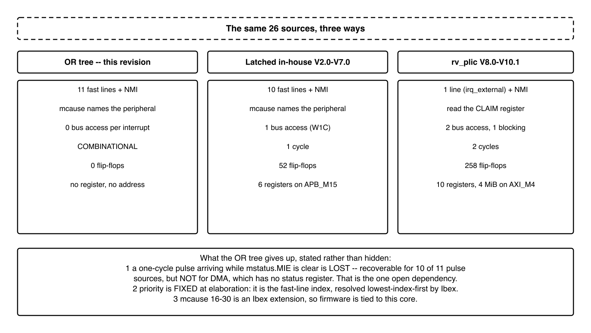

# QNSC_Interrupt_Map — design decisions and record

**This is not the specification.** The specification is
[`QNSC_Interrupt_Map_MAS.md`](QNSC_Interrupt_Map_MAS.md): what the block is, its
ports, and its behaviour — the contract verification works from.

This file holds everything that explains *why* the specification says what it
says: the revision history, the two designs that were tried and dropped, the
evidence read out of Ibex and each peripheral's RTL, and the questions that were
open and how they closed.

The two are separate because they answer to different readers. Somebody building
or verifying the block needs the specification and nothing else. Somebody
challenging a decision — in review, or in a year when the reason has been
forgotten — needs this. Keeping them in one document made a 1284-line file of
which 14% was revision history, and made the contract hard to find inside it.

---

---
title: "Interrupt Controller"
subtitle: "MICRO-ARCHITECTURE SPECIFICATION -- V11.10"
author: "QUY NHON SEMICONDUCTORS -- QNSC"
---

# Reversion and History

| Version | Date       | Author/Owner | Description of Change |
|---------|------------|--------------|-----------------------|
| V1.0    | 2026-09-13 | Nghia VT     | First issue. Answered the interrupt map question from a candidate IP set that was mostly OpenTitan, giving **74** sources. |
| V2.0    | 2026-09-17 | Nghia VT     | Rewritten against the IP set the team actually selected; total fell to **28**. Proposed an in-house aggregator, `INTMAP`, mapping one line per peripheral onto Ibex's fast interrupts rather than using a PLIC. |
| V3.0    | 2026-09-17 | Nghia VT     | Corrected V2.0's central error: `INTMAP` had been specified as **combinational**, which reading the RTL showed would silently drop pulse interrupts. Added the sticky latch, the APB register file and the evidence. |
| V4.0    | 2026-09-17 | Nghia VT     | Consistency revision. Made every derived figure agree, added the port list and parameters, and recorded two findings from the Ibex documentation: the NMI is ID 31 at `mtvec + 0x7C`, and **Ibex ignores the NMI in Debug Mode**. |
| V5.0    | 2026-09-17 | Nghia VT     | Audited against the team IP assignment sheet and the real RTL of every IP on it. Found that GPIO had been read from the wrong fork, and flagged it as blocking. |
| V6.0    | 2026-09-17 | Nghia VT     | Rewritten for **`pulp-platform/apb_gpio`**, the GPIO the owner confirmed: total **27** sources. Also found that `idma`'s `irq_o` is a **pulse**, not a level, making twelve of the sources pulses. |
| V7.0    | 2026-09-17 | Nghia VT     | Corrected the claim that the assignment sheet had no interrupt controller: it gives **OpenTitan**, meaning `rv_plic`. Costed that IP and found it cannot be used as an APB slave -- its register window is **64.02 MiB** against the 16 KiB an `APB_M*` slave gets. |
| **V8.0** | 2026-09-17 | Nghia VT | **The block is no longer an in-house design: QSOC adopts `pulp-platform/rv_plic`, a real RISC-V PLIC, and this document is rewritten around integrating it.** The instructor has confirmed the IP choice is the author's provided it suits QSOC, so the question that dominated V7.0 is closed. PULP's fork keeps the standard architecture -- gateway, priority resolution, claim and complete -- but replaces TL-UL with PULP's **`reg_bus`**, for which `register_interface` already provides the adapter QSOC needs. Every statement below was read from that RTL. Section 6 justifies the choice against three alternatives and **section 6.3 keeps the in-house `INTMAP` design as the documented alternative rather than deleting it**, because the comparison is the justification. Three findings decided the integration and are specified in section 5: the register map is the standard PLIC map **hardcoded at `0x0C00_0000` spanning 2.00 MiB**, so the block is a fifth **`S_BUS`** slave and `APB_M15` is released; `le_i` lets the IP latch the twelve pulse sources, so no in-house latch is needed; and `plic_regs` is a generated file with hardcoded dimensions, which **locks `N_SOURCE = 30`, `N_TARGET = 2`, `MAX_PRIO = 7`**. **One regression is recorded in section 5.10**: the gateway has no event counter, so for an edge source an event arriving between claim and complete is dropped. All 27 sources, the GPIO analysis, the pulse-versus-level evidence and the Ibex findings of V4.0--V7.0 are retained, because the PLIC needs every one of them -- they are what `le_i`, the source numbering and the priority defaults derive from. |
| V9.0    | 2026-09-18 | Nghia VT     | **Reconciled against `QSOC_HAS` and against the DMA, timer and WDT owners' own specifications. No number is changed yet; what changes is that every disputed number is now marked as disputed, with the evidence and the outcomes.** **Corroborated:** the WDT contributes **two** sources -- bark to the NMI, wakeup expiry as an ordinary source, the bite being a reset and not an interrupt -- which `QSOC_HAS` Table 8-1 counts identically, warning that this block *"is the easiest to over-count, driving six output pins but contributing two interrupt sources"*. `apb_adv_timer`'s `events_o` being a **pulse** is confirmed by the timer owner's specification as a rising-edge detection on a selected compare output. `MSIP` and `MTIP` unconnected is confirmed by `QSOC_HAS`. **Disputed, and marked so in Table 2:** the timer IP itself. This document assumes `apb_timer_unit` for TIMER 0 and TIMER 1 plus a separate `apb_adv_timer` for PWM, seven sources; `QSOC_HAS` and the timer owner's specification both describe **`apb_adv_timer` instances only** -- eight sources -- and neither mentions `apb_timer_unit`. `QSOC_HAS` further **contradicts itself** on the total, saying **28** in its detailed Table 8-1 and **32** in its `INTMAP` description and block diagram, a difference of exactly one instance's four event lines; it marks the `APB_M13` PWM slot **TBD** and has no PWM clock domain. Question 7 is rewritten around the three possible answers for `APB_M13`, giving totals of **28, 32 or 29--30**, and explains why this block cares beyond the count: `le_i` is a compile-time tie-off, and section 5.9's `MTIP` reasoning is written about an IP that may not exist. **Disclosed rather than buried:** `QSOC_HAS` *rejects* a standard PLIC and specifies the in-house aggregator of V7.0 on `APB_M15`, so V8.0's choice is a departure this document owns -- new text in section 6 sets the two side by side. Against that, the DMA owner's specification says to *"route the iDMA interrupt into the PLIC"* and the WDT owner's says both watchdog interrupts are *"routed to the PLIC"*, so two peripheral owners already expect one. The DMA row now cites `QSOC_HAS` selecting the register front end and recording its interrupt as *"must be added: TBD"*. |
| V10.0   | 2026-09-18 | Nghia VT     | **`QSOC_HAS` v4_r1 settles four of the twelve open items, and settles all four in favour of this document.** Timer structure is confirmed as Table 2 always had it: **TIMER 0 and TIMER 1 are `apb_timer_unit`** -- TIMER 0 in `MODE_64_BIT` giving one source, TIMER 1 as two 32-bit timers giving two -- and **PWM is a separate `apb_adv_timer` instance** at `APB_M13` with its own clock domain `D18`, not a pad function of the other two. Seven timer sources, total **27**, unchanged. The earlier HAS revision had said the opposite -- two advanced timer instances and no separate PWM block -- so the four Table 2 rows marked *contradicted* in V9.0 are now marked **corroborated**, and question 6 is closed. The conditional warning V9.0 added to section 5.9 is **removed**: `apb_timer_unit` exists, `MODE_64_BIT` exists, and the `MTIP` argument written there stands as first written. **The DMA front end is `desc64`**, which the HAS now selects and describes as the AXI B-channel handshake on descriptor write-back -- the same wire this document read from the RTL -- so that row is corroborated too, with only the owner's confirmation outstanding. **The bus items are accepted**: `AXI_M4` at `0x0C00_0000` -- `0x0C3F_FFFF`, the shared top nibble with the ROM, and `APB_M15` released; the HAS adds that a fifth *master* port does not widen the crossbar's ID width. **And `QSOC_HAS` has adopted the PLIC**, reversing its earlier rejection and reproducing this document's source-ID assignment and `le_i` tie-off as its own Tables 8-1 and 8-2; section 6 is rewritten from *disagreement* to *agreement*, keeping one sentence of record on why the change went this way. **One correction is owed back to the HAS**: it warns that the IP's register layout is not the standard PLIC layout, citing strides of `0x80` and `0x1000` as non-standard. The **ratified** RISC-V PLIC specification gives exactly those strides, and every offset in Table 9 matches it, so the layout **is** standard and a stock driver does work -- which is the reason section 5.1 chose this top level. Open questions renumbered 1--9 and every cross-reference re-checked. |
| V10.1   | 2026-09-18 | Nghia VT     | **Two source-count questions closed against `QSOC_HAS`, and one correction to this document.** The register tables the HAS publishes for `SYSCTL` and `SYSCSR` contain no interrupt register, which settles the last candidate this document could not rule out from block scope alone, so both rows of Table 2 become a confirmed **0** and the question is withdrawn -- nine open items become eight. The `SPI device` entry is **corrected**: the RTL groups its eight outputs as **five flash mode and three TPM**, not the six-plus-two this document had assumed, so the question now has two levels giving totals of 24 or 21. Recorded also that the HAS commits to the TL-UL adapter but that its own Table 5-5 implies two adapters rather than one, since `SPI device` declares buffer windows the other two blocks do not |
| **V11.0** | 2026-09-21 | Nghia VT | **The block is no longer a controller at all. `INTMAP` becomes an OR tree with no state**, following the instructor's direction that it need not be a peripheral and need not have an address. The premise both earlier designs rested on turned out to be narrower than written: twelve sources do emit one-cycle pulses and Ibex does latch nothing -- both verified -- but **ten of the eleven pulse sources keep their own record**, so a missed interrupt is not a lost event. And **Ibex has 15 fast lines for the 11 QSOC needs**, so there was never a shortage to solve. The design now drives **one fast line per peripheral**; `mcause` `16 + n` with permanently vectored `mtvec` sends the core **straight to that peripheral's handler**, so the identification a claim register used to do is done by an address. Result: **zero flip-flops** against 258, **combinational** delay against two cycles, **no bus port** so `AXI_M4` is released, ten verification checks instead of eighteen, and **no dependency on an IP that had never been elaborated** -- which removes the largest schedule risk of V10.1. Three losses are stated rather than hidden, section 5.7: a pulse arriving while `mstatus.MIE` is clear is lost and for **DMA** that destroys information, priority is **fixed at elaboration**, and `mcause` 16 -- 30 is an **Ibex extension**. Both earlier designs are kept in section 6 |
| V11.1   | 2026-09-21 | Nghia VT     | **Ownership of TIMER 0, TIMER 1 and PWM transfers to this author**, and each now has its own specification: `QNSC_TIMER_MAS` and `QNSC_PWM_MAS`. Three corrections follow from reading those IPs' RTL. The PWM event source is a **4-of-16 multiplexer over the channel outputs**, not a raw compare output. The one-shot timer level is held for a stronger reason than previously recorded: the comparator flop is **not gated by the counter enable**. And section 4.6 now separates the two recovery mechanisms -- GPIO keeps a **record**, while the timers and PWM merely **repeat** -- because neither timer IP has a software-readable interrupt flag. |
| V11.2   | 2026-09-21 | Nghia VT     | **Closes the GPIO action item from the Day005 review of 2026-09-18**, which ruled that GPIO needs **one** interrupt rather than the four with IDs 22 to 25 that an earlier revision showed. The design already satisfied it -- four wires OR into one fast line -- but the table could be misread, so section 5.3 now separates **wires in** from **interrupts out**: twenty-six wires, eleven interrupts. Day005 also confirms the architecture of this revision in its own words: no PLIC, peripheral interrupts wired straight to the CPU with at most an OR gate to combine them, and the interrupt map removed from the memory map because it is not a peripheral. |
| V11.3   | 2026-09-21 | Nghia VT     | **Five open questions resolved without needing another owner.** Questions 3 and 4 are closed **from Ibex's RTL and the privileged specification** rather than by asking: `irq_fast_i` is 15 bits unconditional, vectored mode is not configurable, and tying `irq_software_i` to 0 is explicitly permitted on a single-hart system. Question 5 is adopted as written but now asks for one deliberate agreement, since the order is fixed at elaboration. Question 7 is reclassified as a firmware acknowledgement rather than a design question. Question 8 takes a **position** -- the watchdog should be stoppable during a halt, or firmware must be told to disable it -- matching `QNSC_SYSDBG_MAS` question 4. |
| V11.4   | 2026-09-22 | Nghia VT     | **Question 2 reframed after reading the bus owner's three specifications, which turn out to mention **TL-UL nowhere**.** The question is no longer *is a bridge planned* but *the three OpenTitan blocks have no bus path in any document, and eleven of the 27 sources depend on them*. The rewrite also separates what does and does not affect this block: the **protocol** does not, because `intr_*_o` are direct wires; the blocks' **existence** does, by eleven sources; and **firmware's ability to read their status registers** does, because section 5.1 delegates *which event fired*, *acknowledge* and *keeping the record* to exactly those registers and this block holds no substitute. |
| V11.5   | 2026-09-22 | Nghia VT     | **Question 2 rewritten from the IPs' own RTL rather than from `QSOC_HAS`, which is behind on this point.** The count is now stated **with its denominator**: **11 of the 26 aggregated** sources, or **12 of the 27** including the NMI. Reading `aon_timer.sv` shows **five** outputs rather than the three this document listed, that the bark exists as an ordinary interrupt as well as an NMI with QSOC connecting the NMI form, and that the watchdog's `enable` lives in `WDOG_CTRL` at offset `0x1C` -- so with no bus path the block **cannot be enabled and never barks**, which is why the NMI belongs in the count. Losing it matters more than losing the ten SPI sources: `QNSC_SYSDBG_MAS` has since removed the debug reset, so with no NMI the only recovery from a wedged core is the power switch. |
| V11.6   | 2026-09-22 | Nghia VT     | **Two questions closed and one narrowed by five sixths, after reading the SPI owner's two specifications.** The SPI pair keeps **separate interrupt sources** -- stated in `VuBuiMinhHieu_OpenTitan_SPI_Device` -- so the ten SPI wires and Table 6 are unaffected, and the command upload path **is** in use, so all eight `spi_device` wires are live. The bus-path question was looking in the wrong place: the APB-to-TL-UL adapters are not the interconnect's job but the peripheral wrapper's, and the SPI wrapper specifies **two adapters behind one APB4 slave** -- which also settles the one-versus-two adapter contradiction in `QSOC_HAS`. Exposure to an unspecified bus path drops from **twelve sources to two**, both belonging to `aon_timer`, one of which is **the NMI**. |
| V11.7   | 2026-09-22 | Nghia VT     | Corrects a **stale reference**: a table still listed the reset causes as power-on, watchdog and `ndmreset`, but the Day005 review removed debug reset and the three causes are **power-on, watchdog and software**. |
| V11.8   | 2026-09-22 | Nghia VT     | Question 2 restated as **a shaped request rather than a gap**. All three OpenTitan blocks need an APB-to-TL-UL wrapper; SPI has one, `aon_timer` does not, and its version is the **simpler case** -- one adapter, no internal address split, no response multiplexer. OpenTitan also ships `tlul_adapter_host`, whose host side is a memory-style port, so what remains to write is APB to `req`/`gnt`. The item now also lists the **non-bus tie-offs** the wrapper owes -- `alert_*`, `racl_*`, `lc_escalate_en_i` and the AON clock pair -- because QSOC has no counterpart for any of them and none appears on a block diagram. |
| V11.9   | 2026-09-22 | Nghia VT     | **The last two open questions take positions, so the specification is complete.** The DMA is assumed to have an interrupt via the **`desc64`** front end, which the RTL confirms carries `irq_o` and an **APB slave** needing no bridge; the `reg` front end has **no `irq` at all** and only `done_id`/`busy` to poll. `desc64` is the **conservative** assumption because it keeps the harder case -- a pulse with no status register, the one source that destroys information -- and the cost of the alternative is stated: line 0 frees, ten lines shift, `mcause` and the vector table follow. The `aon_timer` wrapper closes as **not a question of whether but of who**, since Day005 made the watchdog one of three reset sources; it moves to **new section 9.5**, a table of requirements on other blocks, together with the DMA status bit, the watchdog-during-halt rule and the `APB_M11`/`APB_S11` naming. |
| V11.10  | 2026-09-22 | Nghia VT     | **The DMA question is answered by its owner, and the answer removes this document's central limitation.** `QNSC_iDMA` V2.0 uses **neither `desc64` nor `reg`** -- `desc64`'s CSRs are hardwired to a 64-bit APB against QSOC's 32-bit -- and drives a single `dma_irq_o` from **`DMA_ISR` flags that are write-1-to-clear**. So the DMA is a **held level with a readable record**, not a pulse that destroys information. Eleven places are updated: Tables 2, 5, 6, 7, the Appendix C evidence, limit 1 in section 5.7, section 6, the summary and question 1. **Limit 1 becomes a latency limit rather than a correctness one**, and the source count is unchanged at one -- though V1 of that design carried **eleven** DMA IRQ wires, which would have made this document wrong by ten. Its RTL is **not yet simulated**. |

# Table of Tables

| Table | Title |
|-------|-------|
| Table 1 | Direct answer in numbers |
| Table 2 | QSOC interrupt sources, counted from the selected IPs |
| Table 3 | Why the counts changed from V1.0 |
| Table 4 | CPU interrupt inputs of the Ibex hart, in priority order |
| Table 5 | Shape of each interrupt output, and whether the event survives |
| Table 6 | Fast line assignment |
| Table 7 | `INTMAP` port list |
| Table 8 | Paths outside the OR tree |
| Table 9 | The three designs this document has specified |
| Table 10 | Two levels of masking |
| Table 11 | Requirements on other blocks |
| Table 12 | Acronyms |

# Table of Figures

| Figure | Title |
|--------|-------|
| Figure 1 | INTMAP: 27 sources, one OR per peripheral, 12 wires to the CPU |
| Figure 2 | The three designs, and what this one trades |

---

# 1. Overview

## 1.1 Scope of this document

This document answers the interrupt question for **QSOC**, the MCU being built in
this training project, and specifies **`INTMAP`**: an **OR tree** that groups the
sources by peripheral and drives one Ibex fast interrupt line each, together with the
line assignment and the one interrupt path that bypasses it.

Two things must be kept separate, because confusing them is the easiest way to get
the numbers wrong.

| | What it defines | Source |
|---|---|---|
| **QSOC** | The architecture: which blocks exist, how they connect | Instructor's block diagram |
| **The selected IPs** | How many interrupt lines each block actually drives, and whether each is a pulse or a level | Each IP's own RTL port list |

The architecture says *which* blocks; the IP says *how many* lines each one has and
*what shape* they are. Every number in section 4 is read from a port list, and every
behavioural claim from the logic itself, because datasheet summaries and RTL disagree
more often than one would like.

**The block is small, and section 4 is long anyway.** The numbers section 4 fixes --
how many sources, which are pulses, which source gets which line -- are what the RTL is
built from, and getting one wrong produces a handler
running for the wrong peripheral with no error anywhere.

## 1.2 The question and the answer

**Question.** *"Number of peripheral interrupts is different from the CPU
interrupt inputs?"*

**Answer.** Yes. QSOC has **27 peripheral interrupt sources** and the Ibex core has
**19 interrupt input bits**. The sources do not need reducing to one: Ibex provides
**15 fast interrupt lines**, and QSOC needs **11**. So `INTMAP` groups the 27 sources
by peripheral with an **OR per peripheral** and drives one fast line each. The
twenty-seventh source is the watchdog bark, which goes straight to `irq_nm_i`.

`mcause` then **names the peripheral by itself**: fast line *n* raises `mcause`
`16 + n`, and Ibex is permanently in vectored mode, so the core jumps **directly to
that peripheral's handler** with no register read anywhere on the path.

Two properties of the source set make this work. **Every peripheral already reports
which of its own events fired** in its own status register, so `INTMAP` only has to
say *which peripheral* -- and `mcause` does that for free. And **the CPU has enough
inputs**, which is the fact that removes the need for a controller at all.

**Table 1 -- Direct answer in numbers**

| Quantity | Value |
|----------|-------|
| Peripheral interrupt sources in QSOC | **27** |
| Peripherals that drive at least one | **14** |
| Fast interrupt lines QSOC drives | **11** -- `irq_fast_i[10:0]`, section 5.3 |
| Of the 15 Ibex provides, spare | **4** |
| `irq_nm_i` | **1** -- WDT bark, feed-through |
| **Total wires into the CPU** | **12** |
| `irq_external_i`, `irq_timer_i`, `irq_software_i` | **tied to 0**, sections 5.6 and 6 |
| `mcause` values used | **16 -- 26** for the fast lines, **31** for the NMI |
| Trap vector entries used | `mtvec + 0x40` .. `mtvec + 0x68`, and `mtvec + 0x7C` |
| `mie` bits firmware must set | **16 -- 26** |
| **Flip-flops in `INTMAP`** | **zero** -- the block is combinational, section 5.2 |
| Latency, source pin to CPU pin | **combinational**; gate delay, not a clock cycle |
| Register window | **none.** No registers, no address, no bus port |
| Bus ports consumed | **none.** `AXI_M4` is released and `APB_M15` stays free |
| RTL QSOC writes | an **OR tree** and a concatenation. No state |

The number that matters is **not** the ratio of 27 to 19. It is that 27 sources reduce
to **14 peripherals**, that each already says which of its own events fired, and that
**Ibex has 15 lines for 11 of them**. Once those three facts are on the table, the
block stops needing to be a block: it needs to be wires and OR gates. Section 6
records the two controller designs this replaced and why each was set aside.

# 2. Feature

## 2.1 Feature 1 -- Why the counts cannot match

**Architectural reason.** RISC-V defines `mip` and `mie` with one bit per interrupt
*cause* -- software, timer, external -- not one bit per device. A compliant core
cannot grow a new architectural input every time a chip integrator adds a UART.
Everything device-specific must arrive through inputs the platform provides, and the
platform's answer is the **external** interrupt: one bit, behind a controller.

**Engineering reason.** A core cannot offer an architectural input per device: the
trap-entry path would need a priority encoder as wide as the device count, sized for
the widest chip anyone might build. So the architecture offers a **fixed, small** set
of inputs and leaves grouping to the platform. Ibex's 15 fast lines are already a
generous reading of that rule, and they are what makes this block an OR tree.

**Separation of concerns.** The peripherals already know which of their own events
fired; every one of them has a status register for it. What they cannot do is say
*which peripheral* is asking, or rank themselves against each other. That is the
whole of the interrupt controller's job.

## 2.2 Feature 2 -- What `INTMAP` is

- **An OR tree, and nothing else.** One OR per peripheral: the eight `spi_device`
  outputs become one line, the four PWM events become one line, the four GPIO
  instances share one line. Eleven lines out. Section 5.2.
- **No state.** No pending latch, no register, no address, no bus port. The block is
  **purely combinational**, so it contains **zero flip-flops** and adds **no clock
  cycle** between a peripheral raising its line and the core seeing it.
- **`mcause` does the identifying.** Fast line *n* gives `mcause` `16 + n`, and Ibex
  is always in vectored mode, so the core vectors **straight to that peripheral's
  handler**. There is no claim register to read, because there is nothing to ask.
- **The peripheral answers "which event".** Once inside the handler, firmware reads
  that one peripheral's own status register to find which of its events fired --
  `INTSTATUS` for GPIO, `intr_state` for the OpenTitan blocks. That register already
  exists and is already needed; `INTMAP` does not duplicate it.
- **One source bypasses even this**, because QSOC's watchdog requires it to be
  unmaskable: the bark goes to `irq_nm_i`. Section 5.6.

**Three things this design does not have, stated up front** because each is a real
loss and section 5.7 works through them:

1. **No pending latch.** A one-cycle pulse arriving while interrupts are disabled is
   **lost**, and nothing records that it happened.
2. **Priority is fixed in RTL.** It is the fast-line index, and Ibex resolves lower
   index first. Changing the order is a re-synthesis, not a register write.
3. **`mcause` 16 to 26 is platform-use space, not a standard cause.** The privileged
   spec reserves causes 16 and above for the platform, so the numbering is legitimate;
   what is Ibex-specific is the line count and the priority direction -- section 5.7.

**`INTMAP` is the name on the QSOC block diagram and it is kept.** Two earlier
revisions gave the name to a controller with state and a register interface; **section 6
is the only place in this document that describes them**, because the comparison is
what justifies arriving here and is the route back if an assumption fails. Everything
outside section 6 describes the design as it now is.

# 3. Block Diagram

{width=6.5in}

# 4. The Two Sides of the Count

## 4.1 The peripheral side

Every count below is read from the interrupt output ports of the IP the team
selected, in that IP's own RTL. **The IP column is taken from the team's IP
assignment sheet**, and Appendix C records which claim was verified where.

**Table 2 -- QSOC interrupt sources, counted from the selected IPs**

| Block | IP, per the assignment sheet | Owner | Interrupt outputs | Inst | Total |
|---|---|---|---|---:|---:|
| UART 0/1 | `pulp-platform/apb_uart` | The Tran Van | `INT` -- 1, a 16550-style line; `IIR` says which event | 2 | **2** |
| GPIO 0/1/2/3 | `pulp-platform/apb_gpio` | Hieu Vu Minh Bui | `interrupt` -- **1, one wire per instance**. Per-pin identity is in the IP's own `INTSTATUS`; section 4.5 | 4 | **4** |
| I2C | `pulp-platform/apb_i2c` | Vinh Ong Bao | `interrupt_o` -- 1 | 1 | **1** |
| SPI host | OpenTitan `spi_host` | Hieu Vu Minh Bui | `intr_error_o`, `intr_spi_event_o` -- 2 | 1 | **2** |
| SPI device | OpenTitan `spi_device` | Hieu Vu Minh Bui | 8 `intr_*_o`, grouped by the RTL as 5 flash and 3 TPM, question 5 | 1 | **8** |
| TIMER 0 | `pulp-platform/timer_unit` `apb_timer_unit`, `MODE_64` | **Nghia VT**, `QNSC_TIMER_MAS` | `irq_lo_o` only -- the 64-bit branch never assigns `irq_hi_o`, so it stays 0. **`QSOC_HAS` v4_r1 confirms the IP and the mode** | 1 | **1**, corroborated |
| TIMER 1 | `pulp-platform/timer_unit` `apb_timer_unit`, two 32-bit timers | **Nghia VT**, `QNSC_TIMER_MAS` | `irq_lo_o`, `irq_hi_o` -- 2. **`QSOC_HAS` v4_r1 confirms the IP and the mode** | 1 | **2**, corroborated |
| PWM | `pulp-platform/apb_adv_timer` | **Nghia VT**, `QNSC_PWM_MAS` | `events_o[3:0]` -- 4, **rising-edge detected on a channel output selected by a 4-of-16 multiplexer, so a pulse**. `QNSC_PWM_MAS` section 4.5 gives the RTL: the event source is `{ch_3_o, ch_2_o, ch_1_o, ch_0_o}`, the channel outputs, not the raw comparators. **`QSOC_HAS` v4_r1 confirms this is a separate instance at `APB_M13` with its own clock domain `D18`**, not a pad function of TIMER 0/1 | 1 | **4**, corroborated |
| WDT | OpenTitan `aon_timer` | Tai Quach Huynh Huu | **Five outputs**, two connected as interrupts: `intr_wkup_timer_expired_o` and `nmi_wdog_timer_bark_o`. `intr_wdog_timer_bark_o` is left open because it is **the same wire** as the NMI -- section 5.6. **`QSOC_HAS` Table 8-1 counts the same two and excludes the bite, which is a reset** | 1 | **2**, corroborated |
| DMA | `pulp-platform/idma` backend with a **unified in-house frontend**, `QNSC_iDMA` V2.0 | Vinh Ong Bao | **`dma_irq_o` -- 1, and it is a level held by `DMA_ISR`**, Table 5. **`QSOC_HAS` v4_r1 selects `desc64` and describes this source as the AXI B-channel handshake on descriptor write-back**, matching the RTL read here. Still to be confirmed by the DMA owner -- question 2 | 1 | **1**, corroborated |
| `SCRC` | self-designed | Nam Nguyen Hao | **No interrupt of any kind** -- reasoned below, then confirmed against the register table in `QSOC_HAS` | 1 | **0** |
| SYSCSR | `nguyenquanicd/APB-CSR-Generator` | -- | A generated register file, and its register table in `QSOC_HAS` is status only | 1 | **0** |
| ROM | `nguyenquanicd/AXI4-SRAM-CONTROLLER` | Nam Nguyen Hao | none -- memories raise no interrupts | 1 | 0 |
| ISRAM, DSRAM | `nguyenquanicd/AXI4-SRAM-CONTROLLER` | Nghia Van Trong | none | 2 | 0 |
| SYSDBG | self-designed | Nghia Van Trong | none | 1 | 0 |
| S_BUS | `pulp-platform/axi` | Tai Quach Huynh Huu | none | 1 | 0 |
| P_BUS | `nguyenquanicd/APB-BUS-Generator` | Tai Quach Huynh Huu | none | 1 | 0 |
| **Interrupt controller** | **designed in house** -- an OR tree, section 5.1 | Nghia Van Trong | This block | 1 | -- |
| **Total** | | | | | **27** |

**`SCRC` raises nothing, and the reason is worth recording** because a clock and
reset controller usually does. The instructor's assignment scopes `SCRC` -- `SCRC`
on the IP sheet -- as three sub-modules: a **clock divider**, a **reset filter** and
a **main FSM controller**. **QSOC has no PLL**, confirmed on the sheet. Each event
such a block might report was checked against that scope:

| Candidate event | Is it an interrupt in QSOC? |
|---|---|
| PLL unlock | **Does not exist.** There is no PLL |
| Loss of the input clock | **Not serviceable.** One clock source, a divider and no fallback. If it stops, the CPU stops with it and nothing can be serviced. An interrupt nobody can be alive to take is not an interrupt |
| Reset cause -- power-on, watchdog, software | **A status register**, read once by the boot code. Nothing is time-critical |
| Clock divider ratio changed | **A status bit** to poll. Not time-critical |
| Bus error raised by the CPU | **Already an exception.** `axi_err_slv` answers `DECERR` and Ibex traps it as a load or store access fault |
| Bus error raised by the DMA | **Already counted** -- `idma`'s `irq_o`, one row above |
| Bus error raised by `SYSDBG` | **Read over JTAG** as `STATUS[1]`, `QNSC_SYSDBG_MAS` section 4.7 |

So the count is **0**, and the total stands at 27.

**This is now confirmed rather than argued.** `QSOC_HAS` publishes the register
tables of both blocks, and neither contains an interrupt register of any kind.
`SCRC` has `SOFT_RST_CTRL` and a read-only `CLK_EN`; `SYSCSR` has `RESET_CAUSE`
as write-one-to-clear, plus read-only `DOMAIN_RST_STATUS` and `CHIP_ID_REV`. Five
registers, all of them either written by software or polled by it. In particular
there is no completion or *done* flag for a divider change, which was the one
candidate this document could not rule out from the block's scope alone: a clock
and reset controller on another SoC might well have one, but this one has no PLL
to wait for, so a poll of `CLK_EN` is the whole of what software needs.

## 4.2 Why the total fell from 74 to 27

V1.0 of this document computed **74** from a candidate IP set that was mostly
OpenTitan. The count is now **27**. QSOC did not lose peripherals -- the IPs changed,
and the two families take opposite approaches.

**Table 3 -- Why the counts changed from V1.0**

| | OpenTitan | The selected IPs |
|---|---|---|
| Philosophy | **one line per event** | **one line per block** |
| UART | 9 lines | **1**; software reads `IIR` |
| GPIO | 1 line **per pin**, `width: 32` with `auto_split` | **1 line per instance**, with a per-pin `INTSTATUS` to say which pin, section 4.5 |
| I2C | 15 lines | **1** |
| Who disambiguates | a controller register, one per event | the peripheral's own status register, **including GPIO** |

**This is the fact that shapes the design.** Because the selected IPs raise one line
per block and each already records which of its own events fired, `INTMAP` never has to
answer *what* happened -- only *which peripheral*. And `mcause` answers that by itself,
section 4.3. Had the IPs been per-event, 27 lines would not have fitted and a controller
would have been unavoidable.

## 4.3 The CPU side

**Table 4 -- CPU interrupt inputs of the Ibex hart, in priority order**

| Priority | Ibex port | Width | `mcause` | What QSOC connects |
|---:|---|---:|---|---|
| 1 | `irq_nm_i` | 1 | **31**, `0x8000001F` | WDT `nmi_wdog_timer_bark_o`, feed-through. Outside `mstatus.MIE` and `mie` |
| 2 | `irq_fast_i` | 15 | 16 .. 30 | **11 driven** -- one per peripheral, section 5.3. Four spare |
| 3 | `irq_external_i` | 1 | 11 | **tied to 0.** Nothing aggregates onto it |
| 4 | `irq_timer_i` | 1 | 7 | **tied to 0.** TIMER 0 is an ordinary fast line instead |
| 5 | `irq_software_i` | 1 | 3 | **tied to 0.** QSOC has no CLINT |
| | **Total 19 bits** | | | **12 driven** |

The order is Ibex's, not this document's: *"The fast interrupts have a platform
defined priority. In Ibex they take priority over all other interrupts and between
fast interrupts the highest priority is given to the interrupt with the lowest ID."*

**That second sentence is the priority mechanism of this design**, and it is visible
in the RTL rather than inferred from the prose. `ibex_controller.sv` resolves which
fast line wins with a loop that counts **down**, so the last assignment to survive is
the **lowest** index:

```systemverilog
// generate ID of fast interrupts, highest priority to lowest ID
always_comb begin : gen_mfip_id
  mfip_id = 4'd0;
  for (int i = 14; i >= 0; i--) begin
    if (irqs_i.irq_fast[i]) mfip_id = i[3:0];
  end
end
```

So **the line number *is* the priority**, fixed at elaboration. Section 5.3 assigns the
numbers, and section 5.7 states plainly what is lost by not being able to change them
at run time.

**Why `irq_fast_i` and not `irq_external_i`: `mcause` becomes the answer.** The cause
for fast line *n* is built as `{1'b1, mfip_id}`, which is **`16 + n`**. And Ibex is
**permanently in vectored mode** -- `ibex_cs_registers.sv` forms `mtvec` with bit 0
set, and that bit is not a configuration this project can change. So the trap address
is computed directly from the cause:

```systemverilog
// ibex_if_stage.sv
EXC_PC_IRQ: exc_pc = {csr_mtvec_i[31:8], 1'b0, irq_vec, 2'b00};
```

which is **`mtvec + 4 × mcause`**. Fast line 0 lands at `mtvec + 0x40`, line 10 at
`mtvec + 0x68`. The core therefore arrives **inside the right peripheral's handler**
with no dispatch code and no register read on the path. That is the whole reason this
design can afford to have no state: the identification that a controller would do with
a claim register, `mcause` does with an address.

**`irq_vec` is five bits**, so the vector table is **32 entries of four bytes = 128
bytes**. That is exactly the table at the bottom of the ROM in `QNSC_RAM_MAS` Table 16,
and it is why that table has 32 entries and not 31.

**What firmware owes.** `mie` bits **16 to 26** must be set, one per line in use, and
`mstatus.MIE` must be set. Those are the only two masking levels in this design --
there is no third level inside `INTMAP`, because `INTMAP` has no registers.

**The NMI has an identity, and it needs an entry in the same table.** It is
**interrupt ID 31**, `mcause` **`0x8000001F`**, vectored to **`mtvec + 0x7C`** -- the
thirty-second and last entry. The NMI is **not visible in `mip`**, so a handler cannot
poll for it, and **nested NMIs are not supported**.

**Ibex also ignores the NMI in Debug Mode** -- *"In Debug Mode, all interrupts
including the NMI are ignored independent of `mstatus`.MIE and the content of the
`mie` CSR."* So while `SYSDBG` has the core halted the bark does not trap; it traps
when the core resumes, and only because `aon_timer` holds it as a level. **The
unlatched NMI is safe because its source latches.** Question 8 asks whether the
watchdog should be stopped while halted.

**And here is the property of Ibex that this design has to answer for.** *"All
interrupt lines are level-sensitive. It is assumed that the interrupt handler signals
completion of the handling routine to the interrupt source ... which then deasserts
the corresponding interrupt line."* Ibex expects every input to be **held by something
outside the core** until a handler clears it.

**Six of QSOC's fourteen peripherals do that** -- the two UARTs, I2C, the SPI host,
the SPI device and the watchdog. For the other eight, nothing holds the line, and
`INTMAP` does not hold it either. Section 4.4 sets out exactly which sources those are
and what the consequence is; section 5.7 says why it is accepted.

## 4.4 The shape of each source, and what it costs

Ibex expects every interrupt input to be **held until a handler clears it**, section
4.3. `INTMAP` has no state, so whatever the peripheral does is what the core sees.
This section is therefore the risk register of the design: it says, source by source,
whether the line is held or is a single pulse, and if it is a pulse, whether the event
can be recovered afterwards.

**The distinction that matters is not pulse against level. It is whether the peripheral
keeps a record.** A pulse whose peripheral latches the event in its own status register
costs a missed interrupt but no lost information -- firmware can still find out by
reading. A pulse whose peripheral keeps no record is **information destroyed**.

**Table 5 -- Shape of each interrupt output, and whether the event survives**

| Source | Shape | Record kept? | Evidence, read from the RTL |
|---|---|---|---|
| UART -- `apb_uart` `INT` | **level** | held | `assign INT = ~iIIR[0];`, and `iIIR` is a register holding the cause |
| I2C -- `apb_i2c` `interrupt_o` | **level** | held | `irq_flag` is the OR of `s_done`, `i2c_al` and its own value, gated `& ~iack` -- self-holding until acknowledged |
| SPI host -- `intr_error_o`, `intr_spi_event_o` | **level** | held | Both from `prim_intr_hw`; `INTR_STATE` is write-one-to-clear |
| SPI device -- the eight `intr_*_o` | **level** | held | Eight `prim_intr_hw` instances, same structure |
| WDT -- `intr_wkup_timer_expired_o` | **level** | held | `prim_intr_hw` with `Width(2)`; the bark is `intr_out[AON_WDOG]` |
| GPIO -- `apb_gpio` `interrupt` | **one-cycle pulse** | **recoverable** | `assign interrupt = s_rise_int;` -- an unlatched OR of one-cycle edge detectors. But `INTSTATUS` at offset `0x24` **does** latch per pin, section 4.5 |
| TIMER 0, TIMER 1 -- `apb_timer_unit`, periodic | **one-cycle pulse** | **repeats** | `irq_lo_o` is `s_target_reached_lo` ANDed with `IRQ_BIT`; with `CMP_CLR` the counter resets as the target is reached. Missing one tick means the next arrives a period later |
| TIMER -- `apb_timer_unit`, one-shot | **level** | held | `ONE_SHOT` clears `ENABLE` at the target, so the counter **stops on** the compare value; and the comparator flop is **not gated by the counter enable**, so `s_count == compare_value_i` stays true indefinitely. `QNSC_TIMER_MAS` section 4.7 |
| PWM -- `apb_adv_timer` `events_o[3:0]` | **one-cycle pulse** | **repeats** | `assign events_o[0] = s_event_en[0] & r_event_sync_0[1] & ~r_event_sync_0[0];` -- an edge detector. The next PWM cycle produces the next event |
| DMA -- `QNSC_iDMA` `dma_irq_o` | **level** | held | `dma_irq_o = error_irq OR (DMA_GCTRL.IRQ_MODE AND completion_irq)`, both built from **`DMA_ISR` flags that are write-1-to-clear** -- so the line stays asserted until firmware clears the flag. Superseded reading: AXI B-channel handshake, true for one cycle. **The front end has no interrupt status register at all** |

**Eleven of the twenty-six are pulses**, and ten of those eleven are survivable -- but
**by two different mechanisms, and the difference matters.**

**GPIO keeps a record.** `INTSTATUS` latches the pin, so firmware can read it later and
learn what happened even though the interrupt was missed.

**The timers and PWM keep no record at all. They recover because the event repeats.**
`apb_timer_unit` exposes no interrupt flag -- its read map returns only `CFG`, `VAL` and
`CMP`. `apb_adv_timer` has a per-timer `status_o` that is **connected to nothing
readable**: the signal appears only at its declaration and its port connection, and
`adv_timer_apb_if` has no status port at all. So for these sources recovery is a
property of the **waveform**, not of the hardware, and it holds only while the source is
periodic. `QNSC_TIMER_MAS` section 4.4 and `QNSC_PWM_MAS` section 4.6 carry the evidence.

**Two consequences follow.** A timer in **one-shot** mode is not periodic, and the IP
covers exactly that case by holding the line instead of pulsing it -- the row above. A
**PWM channel used as a one-off notification** has no such cover: its event is always a
one-cycle pulse and nothing records it. Firmware must not use a PWM event as a
single-shot notification.

**DMA is the remaining exception, and it is the one that decides whether this design is
acceptable.**

**Why the pulse is lost at all.** `ibex_cs_registers.sv` carries a comment from Ibex's
own authors:

```systemverilog
// mip CSR is purely combinational - must be able to re-enable the clock upon WFI
assign mip.irq_fast = irq_fast_i;
```

`mip` is a **wire from the pins**, not a register. The core keeps no pending bit. So a
one-cycle pulse is visible for exactly one cycle, and if `mstatus.MIE` is clear at that
moment -- inside another handler, or in a critical section -- it is **gone with no
record anywhere**.

**No source in QSOC is in that position any longer.** Earlier revisions of this document
recorded the DMA as the one exception -- a pulse with nothing to read afterwards, so a
missed completion was information destroyed. `QNSC_iDMA` **V2.0** closes it: the single
`dma_irq_o` is driven from `DMA_ISR` flags that are **write-1-to-clear**, so the line
stays asserted until firmware clears it, and the flag is readable whether or not the
interrupt was ever taken. **Every source in Table 5 now either holds its line or keeps a
record.**

**This is the one open dependency of the whole design, and it is question 2.** Three
outcomes, and all three are acceptable:

1. The DMA uses the **`reg` front end**, which has **no interrupt output at all** --
   then the source does not exist, and every remaining pulse is recoverable.
2. The DMA owner adds a **sticky status bit** for `irq_o` -- then it joins the
   recoverable group.
3. Firmware **polls** the descriptor write-back and the interrupt is a convenience --
   then losing it costs nothing.

What is **not** acceptable is `desc64` with no status bit and firmware relying on the
interrupt. Section 5.7 records this as the condition on which the design rests.

## 4.5 GPIO, and what `apb_gpio` holds

One row of Table 2 needs its own section, because two earlier revisions of this
document got it wrong in opposite directions, and because GPIO is the source whose
behaviour this design depends on most: it is a pulse, but it is a **recoverable** one,
and that distinction is what makes section 5.7's limit 1 acceptable. The team's
assignment sheet specifies **`pulp-platform/apb_gpio`**,
whose port list is:

```systemverilog
module apb_gpio #(
    parameter APB_ADDR_WIDTH = 12,
    parameter PAD_NUM        = 32,
    parameter NBIT_PADCFG    = 4
) (
    ...
    output logic interrupt        // ONE bit per instance
);
```

**One wire per instance, so four instances are four sources**, not 32. And it **does**
have a per-pin interrupt status register, `REG_INTSTATUS_00_31` at offset `0x24`,
backed by `logic [PAD_NUM-1:0] r_status`. So `INTMAP` needs no per-pin state and no
per-instance state either: `mcause` tells the handler it was GPIO, and the instances'
own `INTSTATUS` registers tell it which instance and which pin. That is the same
two-step every other multi-source peripheral needs.

**But the interrupt output does not come from `r_status`:**

```systemverilog
assign s_gpio_rise =  r_gpio_sync1 & ~r_gpio_in;   // one-cycle edge detect
assign s_gpio_fall = ~r_gpio_sync1 &  r_gpio_in;

s_is_int_fall[i] = ~inttype[i][1] & ~inttype[i][0] & s_gpio_fall[i];             // 00 fall
s_is_int_rise[i] = ~inttype[i][1] &  inttype[i][0] & s_gpio_rise[i];             // 01 rise
s_is_int_rifa[i] =  inttype[i][1] & ~inttype[i][0] & (s_gpio_rise[i] | s_gpio_fall[i]);

assign s_is_int_all = r_gpio_inten & r_gpio_en &
                      (s_is_int_rise | s_is_int_fall | s_is_int_rifa);
assign s_rise_int   = |s_is_int_all;
assign interrupt    = s_rise_int;          // <-- the output, straight off the edge detectors
```

`r_status` is a sticky latch of `s_is_int_all`, but `interrupt` is the **unlatched OR
of one-cycle edge pulses**. So the block **records which pin moved and keeps that
record, while announcing that something moved for exactly one cycle.**

**That combination is exactly what this design needs.** The one-cycle announcement can
be missed if `mstatus.MIE` is clear, but `INTSTATUS` still says which pin moved -- so
the interrupt is lost and the information is not. GPIO is therefore in the recoverable
group of Table 5, and it is the reason four instances can share one fast line at all.

**There is no level mode to fall back on.** `inttype` has three meaningful encodings
-- `00` falling, `01` rising, `10` either -- and `11` matches none of the three, so it
disables the pin's interrupt entirely. **Every GPIO interrupt in this IP is an edge.**

**`INTSTATUS` is read-to-clear, and set beats clear:**

```systemverilog
if (s_rise_int)                                   r_status <= r_status | s_is_int_all;
else if (PSEL && PENABLE && !PWRITE &&
         (s_apb_addr == `REG_INTSTATUS_00_31))    r_status[i] <= 1'b0;
```

Two consequences for firmware, both in section 9.2. **Reading `INTSTATUS` clears
it**, so the handler gets exactly one look: whatever it does with the value, it
cannot ask again. And a new edge arriving in the same cycle as the read **wins** --
the clear branch is skipped entirely -- so no edge is lost to a coincident read.

**`PAD_NUM` does not concern this specification.** Whether an instance carries 8 pins
or 32, `INTMAP` sees one wire from it. The pin count belongs to the GPIO driver and
the pad ring.

# 5. The Design

## 5.1 Structure

`INTMAP` is **one OR per peripheral and nothing else**. It has no clock, no reset, no
register, no address and no bus port, and it contains **zero flip-flops**.

Written out, the whole block is of this shape:

```systemverilog
assign o_irq_fast[0]  = i_dma_int;                       // 1 source
assign o_irq_fast[1]  = |i_spi_dev_int;                  // 8 sources OR'd
assign o_irq_fast[2]  = |i_spi_host_int;                 // 2
assign o_irq_fast[3]  = i_i2c_int;                       // 1
assign o_irq_fast[4]  = i_uart0_int;                     // 1
assign o_irq_fast[5]  = i_uart1_int;                     // 1
assign o_irq_fast[6]  = |i_timer1_int;                   // 2
assign o_irq_fast[7]  = |i_pwm_int;                      // 4
assign o_irq_fast[8]  = i_wdt_wkup_int;                  // 1
assign o_irq_fast[9]  = |i_gpio_int;                     // 4 instances OR'd
assign o_irq_fast[10] = i_timer0_int;                    // 1
assign o_irq_fast[14:11] = 4'b0;                         // spare
assign o_irq_nm       = i_wdt_nmi;                       // feed-through
```

Eleven lines, twenty-six sources, **no state**. That listing is close to the entire
RTL of the block, which is the point of the design rather than an accident of it.

**Everything the block does not contain is deliberate**, and each omission is paid for
somewhere else:

| Not present | Who does it instead |
|---|---|
| Pending latch | The peripheral's own status register, or nothing -- section 4.4 |
| "Which event fired" | The peripheral's own status register, read inside the handler |
| "Which peripheral fired" | **`mcause`**, through the vectored trap address, section 4.3 |
| Priority resolution | Ibex, by fast-line index, section 4.3 |
| Enable per source | `mie` bits 16 to 26, in the core |
| Acknowledge | Writing the peripheral's own status register, as firmware already must |

## 5.2 Why the sources group this way

The grouping follows one rule: **one line per peripheral, because `mcause` can only
identify as finely as the lines are split.** Anything OR'd onto the same line becomes
indistinguishable to the trap, and the handler has to read a status register to tell
them apart -- which is exactly what the peripheral's register is for.

So sources are merged **only when they belong to the same block** and that block
already reports which of its own events fired:

**`spi_device`'s eight** become one line. The block has eight `prim_intr_hw`
instances behind one `INTR_STATE` register, so the handler reads that register and
learns which of the eight fired. Splitting them across eight fast lines would consume
more than half the available lines to duplicate information the block already holds.

**`apb_adv_timer`'s four PWM events** become one line, and **`apb_timer_unit`'s two
compare outputs on TIMER1** become one line, for the same reason.

**The four GPIO instances share one line**, and this one is a judgement rather than a
consequence. Each instance has its own `INTSTATUS`, so a shared line means the handler
reads up to four registers to find the source. Giving each instance its own line would
cost three more lines and leave only one spare. Four spare lines are worth more than
three saved register reads on a chip where `SCRC` and `SYSCSR` are confirmed to add
none, but where the SPI and TL-UL questions are still open. **If the spares are never
needed, splitting GPIO later is a four-line edit and no change to anything else.**

## 5.3 Fast line assignment

**This table is the contract.** It fixes both the wiring and, because the index *is*
the priority, the default priority order. Firmware's vector table depends on it.

**Table 6 -- Fast line assignment**

| Line | `mcause` | Vector | Peripheral | Sources OR'd | Shape |
|---:|---:|---|---|---:|---|
| `0` | 16 | `mtvec + 0x40` | **DMA** | 1 | level |
| `1` | 17 | `mtvec + 0x44` | **SPI device** | 8 | level |
| `2` | 18 | `mtvec + 0x48` | **SPI host** | 2 | level |
| `3` | 19 | `mtvec + 0x4C` | **I2C** | 1 | level |
| `4` | 20 | `mtvec + 0x50` | **UART0** | 1 | level |
| `5` | 21 | `mtvec + 0x54` | **UART1** | 1 | level |
| `6` | 22 | `mtvec + 0x58` | **TIMER1** | 2 | pulse |
| `7` | 23 | `mtvec + 0x5C` | **PWM** | 4 | pulse |
| `8` | 24 | `mtvec + 0x60` | **WDT wakeup** | 1 | level |
| `9` | 25 | `mtvec + 0x64` | **GPIO0 -- GPIO3** | 4 | pulse |
| `10` | 26 | `mtvec + 0x68` | **TIMER0** | 1 | pulse |
| `11` -- `14` | 27 -- 30 | -- | **spare**, tied 0 | 0 | -- |
| -- | **31** | `mtvec + 0x7C` | **WDT bark** on `irq_nm_i` | 1 | level |

**Total 26 sources on 11 lines, plus the NMI. Twenty-seven.**

**On GPIO, and the way the counts should be read.** The Day005 review of 2026-09-18
recorded that an earlier revision of the interrupt table was wrong to give GPIO **four**
interrupts with IDs 22 to 25, and ruled that **GPIO needs one interrupt in total**. This
design satisfies that ruling, and the numbers in the table should be read accordingly:

| | |
|---|---|
| Wires **into** `INTMAP` | **4** -- `apb_gpio` emits one `interrupt` per instance and QSOC has four instances |
| Interrupts **out** to the CPU | **1** -- line 9, `mcause` 25, one vector |
| What firmware sees | **one** GPIO interrupt, then `INTSTATUS` of the instances to find the pin |

So the *source* column counts wires arriving at the OR gate, not interrupts arriving at
the core. Every peripheral in Table 6 with more than one source works the same way: the
eight SPI-device wires, the four PWM events and the two TIMER1 compares each reduce to
**one** interrupt. **Twenty-six wires in, eleven interrupts out.**

Reading the column as interrupts is exactly the mistake Day005 corrected, which is why
it is spelled out here rather than left to the reader.

**The order is the same order the previous two revisions used**, and it follows the
rule *data loss first, human time last*. A missed SPI or UART event loses a byte that
cannot be recovered; a missed PWM event or timer tick arrives again next period; a GPIO
edge is recorded in `INTSTATUS`. DMA holds line 0 because a completion that goes
unnoticed stalls whatever was waiting on the transfer.

Keeping the order unchanged also means `QSOC_HAS` does not have to re-argue it -- only
the mechanism changed, not the ranking.

## 5.4 Block interface

**Table 7 -- `INTMAP` port list**

| Group | Signal | Dir | Width | Notes |
|---|---|---|---:|---|
| DMA | `i_dma_int` | in | 1 | `dma_irq_o`. **Level, held by `DMA_ISR`**, section 4.4 |
| SPI device | `i_spi_dev_int` | in | 8 | the eight `intr_*_o`, declaration order |
| SPI host | `i_spi_host_int` | in | 2 | `intr_error_o`, `intr_spi_event_o` |
| I2C | `i_i2c_int` | in | 1 | `interrupt_o` |
| UART | `i_uart0_int`, `i_uart1_int` | in | 1 each | `INT` |
| TIMER1 | `i_timer1_int` | in | 2 | `irq_lo_o`, `irq_hi_o` |
| PWM | `i_pwm_int` | in | 4 | `events_o[3:0]` |
| WDT | `i_wdt_wkup_int` | in | 1 | `intr_wkup_timer_expired_o` |
| WDT NMI | `i_wdt_nmi` | in | 1 | `nmi_wdog_timer_bark_o`. Feed-through only |
| GPIO | `i_gpio_int` | in | 4 | one `interrupt` per instance |
| TIMER0 | `i_timer0_int` | in | 1 | `irq_lo_o`. `MODE_64_BIT`, so one source |
| CPU | `o_irq_fast` | out | 15 | to `irq_fast_i`. `[14:11]` tied 0 |
| CPU | `o_irq_nm` | out | 1 | to `irq_nm_i` |

**Twenty-seven inputs, sixteen outputs, and no other ports.** There is no `clk_i` and
no `rst_ni` because there is nothing to clock or reset.

**Every input is already on the system clock**, so no synchroniser is needed. The one
that would be worth checking is the watchdog, since `aon_timer` is an always-on block
by name -- and its three interrupt outputs are annotated `clk_i` in the RTL, the same
domain as everything else. QSOC has a single clock, which is what makes this safe;
section 9.3 records that adding a second clock domain later would invalidate it.

## 5.5 What the interrupt handler must do

The sequence is shorter than a controller-based design, and the shortening is the
benefit being bought:

1. **The trap arrives already dispatched.** `mcause` is `16 + n`, and the vectored
   `mtvec` has sent the core to `mtvec + 4 × mcause`, so execution is inside that
   peripheral's handler. **No claim register, no dispatch switch.**
2. **Read that peripheral's own status register** to find which of its events fired --
   `INTR_STATE` for the OpenTitan blocks, `INTSTATUS` for GPIO, `iIIR` for the UART.
   For a peripheral with one source this step can be skipped.
3. **Service the event.**
4. **Clear it in the peripheral**, which is what deasserts the line. Write-one-to-clear
   for `prim_intr_hw`, `iack` for I2C, read-to-clear for GPIO.
5. **`mret`.**

**There is no acknowledge owed to `INTMAP`**, because `INTMAP` holds nothing. Step 4 is
the only acknowledge in the system, and firmware would have to do it anyway.

**Two cautions for whoever writes this code.**

**GPIO's `INTSTATUS` is read-to-clear**, and reading it clears **every** pending pin
bit at once. So the handler must read it **once** and service every bit it found; a
second read returns zero and the events are gone. Because the four instances share line
9, the handler reads up to four of these registers, and each read is destructive for
that instance.

**A line can be asserted with nothing to service.** For a pulse source the line is
already low again by the time the handler runs, so a handler that loops *while the line
is high* would never run at all, and one that assumes the status register is non-zero
will find zero. Handlers must tolerate a spurious entry.

## 5.6 Paths `INTMAP` does not carry

**Table 8 -- Paths outside the OR tree**

| Path | Where it goes | Why |
|---|---|---|
| Machine software interrupt | `irq_software_i`, **tied 0** | Software interrupts are core-local and come from a CLINT. QSOC has none |
| Machine timer | `irq_timer_i`, **tied 0** | Same: `mtime`/`mtimecmp` belong to a CLINT. **TIMER0 is an ordinary fast line instead**, so `mip.MTIP` is never set in QSOC |
| Machine external | `irq_external_i`, **tied 0** | Nothing aggregates onto it. It is the line a single-line controller would have used, section 6.3 |
| WDT bark | `irq_nm_i`, **feed-through** | The watchdog must interrupt **even when interrupts are masked**. An NMI that could be masked would be useless exactly when it is needed |

**`mip.MTIP` is never set, and that must be told to whoever ports an RTOS.** Most
RTOS ports assume the tick arrives on the standard machine timer path. In QSOC it
arrives as `mcause` 26, an ordinary peripheral interrupt. The tick still works; the
code that installs it does not.

**The NMI is a wire and nothing else.** It is not latched, not maskable and not
routed through any gate in this block. It is safe unlatched only because
`aon_timer` holds it as a level, section 4.4.

## 5.7 The three limits, and why each is accepted

This design buys its simplicity with three specific losses. None is hidden, and one is
conditional on an answer from another owner.

**Limit 1 -- a pulse can be lost, but no information is.** `mip` is combinational, so a
one-cycle pulse arriving while `mstatus.MIE` is clear leaves no trace in the core. What
matters is whether the peripheral still knows, and **every one of them does**: GPIO
records the pin in `INTSTATUS`, the timers and PWM produce the event again on the next
period, and the DMA holds `dma_irq_o` from a write-1-to-clear flag in `DMA_ISR`.

**This is weaker than it was, and the reason is worth recording.** Until `QNSC_iDMA`
V2.0 the DMA was the exception, and this document stated that the design was correct
only once that one source was resolved. It has been, in the strongest of the three ways
available -- a sticky status flag rather than a policy about how firmware should behave.
**What remains is a latency limit, not a correctness one:** an interrupt taken late is
still taken, and a handler that runs late can still find out what happened.

**Limit 2 -- priority is fixed at elaboration.** It is the fast-line index, resolved
by Ibex's own down-counting loop, so changing the order means re-synthesising. A
controller with a programmable priority register would let firmware re-rank during
bring-up, which is when starvation is usually discovered. The mitigation is that the
order was chosen by an explicit rule, section 5.3, and that QSOC's interrupt rates are
low: a 115 200 baud UART offers a byte every 87 microseconds, and the timers and PWM
are firmware-programmed.

**Limit 3 -- the cause numbers are platform-use space, and only two properties of them
are Ibex-specific.** The ratified privileged specification allocates `mcause` 0 to 15 to
standard interrupt causes and states that **bits 16 and above are designated for platform
use**, so numbering eleven peripheral interrupts 16 to 26 is the architecture being used
as intended rather than an extension bolted onto it. The specification's own rationale
goes further: the platform-specific sources in bits 16 and above *"have platform-specific
priority, but are typically chosen to have the highest service priority to support very
fast local vectored interrupts"* -- which is this design. What is genuinely Ibex-specific
is narrower: **how many** such lines exist, fifteen in Ibex, and **which direction**
priority runs, lower index first in Ibex but higher index first in `cv32e40s`. Firmware
moved to another core would keep its cause numbering and its handler structure, and would
have to re-check those two properties. Section 6.2 weighs that against the alternative.

**What is bought for those three.** No bus port, so `AXI_M4` is released and
`APB_M15` stays free. No register file to specify, write or verify. **Zero flip-flops**
and **combinational** delay from source pin to CPU pin. Ten verification checks, none
of which needs a bus model. And no dependency on any third-party IP. Section 6 puts
numbers on all of that against the two alternatives.

# 6. Why an OR tree, and what it replaced

This block was specified three times. The first two versions were interrupt
controllers with state and a register interface; this one is wires. The comparison is
kept because it is the justification, and because if any assumption here fails the
earlier designs are the documented route back.

**Table 9 -- The three designs this document has specified**

| | **OR tree** (this revision) | Latched in-house, V2.0 -- V7.0 | `pulp-platform/rv_plic`, V8.0 -- V10.1 |
|---|---|---|---|
| CPU inputs used | **12** -- 11 fast, 1 NMI | 11 -- 10 fast, 1 NMI | 2 -- `irq_external_i`, NMI |
| Which peripheral fired | **`mcause`, free** | `mcause`, free | read the **claim** register |
| Bus accesses per interrupt | **0** | 1 -- a W1C write | 2 -- claim read, complete write |
| Of which blocking reads | **0** | 0 | **1** |
| Trap dispatch | **vectored, direct** | vectored, direct | one handler, then a switch |
| Latency, source to CPU pin | **combinational** | 1 cycle | 2 cycles |
| Flip-flops | **0** | 52 | **258** |
| Registers | **none** | 6, 24 bytes | 10, standard PLIC map |
| Bus port | **none** | `APB_M15`, 16 KiB | `AXI_M4`, 4 MiB |
| Pending latch | **no** | yes | yes |
| Pulse lost if `MIE` clear | **yes** -- section 5.7 | no | no |
| Edge event during handling | n/a, nothing to lose it in | captured | **dropped** in the claim-to-complete window |
| Priority | **fixed**, fast-line index | fixed in RTL | **programmable**, 8 levels plus threshold |
| Out of reset | **transparent**, every source live | transparent | **silent** until `PRIO` and `IE0` are written |
| Firmware portability | `mcause` 16 -- 26, **platform-use space**; count and priority direction Ibex-specific | same | `mcause` 11, fully standard |
| RTL to write and verify | **an OR tree** | the whole controller | a wrapper |
| Depends on unproven IP | **no** | no | **yes** -- never elaborated |

{width=6.4in}

## 6.1 Why the OR tree wins for QSOC

**It is the fastest of the three and the smallest.** Zero flip-flops, combinational
delay, no bus access in the interrupt path at all. Both controllers are slower, and the
PLIC is slower by a blocking read the core stalls on.

**The premise that made a controller necessary turned out to be narrower than written.**
The earlier revisions argued that because twelve sources emit one-cycle pulses and Ibex
latches nothing, a pending latch was unavoidable. The first half is true and verified
from Ibex's RTL. The second half does not follow: **ten of the eleven pulse sources
survive a missed interrupt** -- GPIO because `INTSTATUS` records the pin, the timers and
PWM because the event repeats on the next period -- so a missed interrupt is not a lost
event. Section 4.6 separates those two mechanisms, because only the first is a record. **The DMA
was the one exception and is no longer one**: `QNSC_iDMA` V2.0 holds `dma_irq_o` from a
write-1-to-clear flag, so nothing in QSOC destroys information when an interrupt is
missed.

**The CPU has enough inputs.** This is the fact the earlier revisions did not act on.
Ibex offers 15 fast lines; QSOC needs 11. There was never a shortage to solve, and
aggregating 26 sources onto one line was solving a problem QSOC does not have.

**It removes the largest schedule risk.** The previous revision rested on `plic_top`
plus `axi_to_reg_v2` elaborating cleanly with `N_SOURCE = 30`, and that had **never
been tried** -- the fork was last pushed in 2024-04 and `plic_regs` has hardcoded port
widths. That was the single item most likely to cost weeks. An OR tree cannot fail to
elaborate.

**And it is what the block was asked to be.** The instructor's direction was that
`INTMAP` does not need to be a peripheral, does not need an address, and is at most an
OR gate. Given the confirmed peripheral count that direction is correct, and this
revision follows it.

## 6.2 What was given up, and to whom it matters

**Programmable priority is the real loss.** The PLIC would let firmware re-rank sources
at run time with a register write; here the ranking is the line index and changing it
is a re-synthesis. The mitigation is in section 5.3 -- the order follows an explicit
rule -- and in the traffic: QSOC's fastest interrupt source offers a byte every 87
microseconds at 115 200 baud.

**The second loss is smaller than it first looked.** `irq_external_i` with `mcause` 11
is what a platform *with a controller* does, and an off-the-shelf PLIC driver would have
worked against it. But `mcause` 16 to 26 is **not** off-specification: the privileged
spec designates causes 16 and above for platform use and recommends exactly this use for
fast local vectored interrupts, section 5.7. The reverse argument also holds -- the spec
says `mip.MEIP` *"is set and cleared by a platform-specific interrupt controller"*, so
OR-ing every source onto `irq_external_i` would use the machine external interrupt
**without** the controller that cause number implies. What is genuinely lost is the
ability to reuse a driver written for a controller QSOC does not have, plus a re-check of
line count and priority direction if the core ever changes.

**Neither loss is silent**, which is the requirement. Both are in Table 1, in section
5.7 and here.

## 6.3 Against aggregating onto one line instead

A fourth design was considered and rejected: **OR all 26 sources onto
`irq_external_i`**, keeping `mcause` 11 and standard RISC-V, with no state and no
registers either.

It fails on the handler. With one line and no claim register, `mcause` says only *"an
external interrupt happened"*, so the handler must **poll the status register of every
peripheral in turn** until it finds the source -- up to **14 blocking APB reads** for
one interrupt. That is worse than the PLIC's single claim read, which this document
criticised, while also giving up the programmable priority that justified it. The
polling order also becomes the priority order, fixed in firmware rather than in RTL,
which is not an improvement over fixing it in RTL.

**It keeps standard `mcause` and loses everything else**, so it was set aside.

## 6.4 Against the two PLIC tops, for the record

Both were evaluated while the PLIC was the chosen design, and the analysis is kept
because it would apply again if the decision were revisited.

**OpenTitan's `rv_plic`** is ruled out by arithmetic, not preference: its register
window is **64.02 MiB**, which cannot sit behind the APB bridge, and it speaks TL-UL.

**`pulp-platform/rv_plic`** has two tops. `rv_plic.sv` uses TL-UL with a compact
**non-standard** register map; `plic_top.sv` uses `reg_bus` and **does** implement the
standard PLIC layout -- priority at the base with source 0 reserved, pending at
`0x1000`, enables at `0x2000` with an `0x80` stride, context blocks at `0x200000` with
an `0x1000` stride, all matching the ratified specification. `plic_top` was the one
selected, and the reason was exactly that standard layout.

**`apb_interrupt_cntrl`** is APB, which would have been convenient, but it uses RI5CY's
`core_irq_req_o` / `core_irq_ack_i` protocol. **Ibex has no acknowledge input**, so it
cannot be connected.

**`pulp-platform/clic`** needs a CLIC-capable core. Ibex is not one.

# 7. Status and Event Interrupts

Most peripheral IPs expose a comparable set of registers: a **pending** register, an
**enable** mask, and often a **test** register that raises the interrupt from software.
The wired output is the pending state masked by the enable. Names differ between IP
families -- OpenTitan calls them `INTR_STATE`, `INTR_ENABLE` and `INTR_TEST`; the PULP
IPs use their own -- but the structure is near-universal.

Interrupts fall into two behavioural types, and the difference changes the handler.

| Type | Behaviour | What the handler must do |
|---|---|---|
| **Status** | Asserted while the condition is true. Example: a receive FIFO above its threshold | **Fix the condition**, for example drain the FIFO. Writing 1 to the pending bit will not clear it; it re-asserts immediately |
| **Event** | Latched when the event occurs. Example: a receive overrun | Write 1 to the bit to clear it |

**Why this matters here.** Several of QSOC's peripherals put more than one event behind
one wire, and this design puts more than one wire behind one fast line -- so a handler
may be entered for a peripheral with several possible causes. It must deal with
**every** event the peripheral reports, not just the first: leaving one set on a
status-type source holds the line high, and the core re-enters the handler as soon as
it returns.

`spi_device` is the extreme case, with eight events behind one line, and it is why
step 2 of section 5.5 is not optional for that peripheral. The compensation is that
reading `INTR_STATE` once tells the handler all eight at a stroke.

# 8. End-to-End Flow

**Table 10 -- Two levels of masking**

| Level | Where | Control | Effect |
|---|---|---|---|
| 1 | **Peripheral** | its own interrupt enable | Whether the event drives the wire at all. **The only place a source can be individually disabled** |
| 2 | **CPU** | `mie[16 + n]` and `mstatus.MIE` | Whether the hart takes that fast line |

**There are only two levels, because `INTMAP` has no registers.** One consequence is
worth stating: **masking a single source means writing that peripheral's own enable
register**, in whichever owner's block it lives. There is no central place to do it.

**And masking at level 2 can lose a pulse.** Clearing `mie[16 + n]` while a one-cycle
pulse arrives means the pulse is simply not taken and nothing records it, section 5.7.

**Out of reset the block is transparent.** Every source is wired straight through, so
`INTMAP` can never be the reason an interrupt fails to arrive -- a useful property when
something does not work. The matching hazard is the opposite one: if firmware sets
`mstatus.MIE` before configuring the peripherals, it can take an interrupt for which no
handler is installed. Section 9.2 makes that a firmware rule.

A complete `uart0` receive interrupt travels:

1. The UART receives a byte; its pending bit sets and `INT` rises. `INT` is wired to
   **fast line 4**.
2. `INTMAP` passes it through -- one OR gate with one input, **combinational**.
3. `irq_fast_i[4]` is high. Ibex resolves it against any other pending fast line;
   lower index wins, so lines 0 to 3 would go first.
4. `mie[20]` and `mstatus.MIE` are set, so the hart traps with `mcause` = **20** and
   vectors to **`mtvec + 0x50`** -- **the UART0 handler, directly**.
5. The handler reads `iIIR` to learn which UART condition fired, drains the FIFO, and
   `mret`. **Nothing is written back to `INTMAP`**; draining the FIFO is what lowers
   `INT`.

**Five steps, no bus access anywhere on the path, and no dispatch code.** Steps 1 to 4
are the whole of what the hardware contributes; step 5 is work firmware would owe the
UART in any design.

# 9. Design and Verification Implications

## 9.1 What the integration must be verified for

**The block is combinational and has eleven outputs, so the verification is short** --
which is itself one of the arguments for it. There is no register file to sweep, no
handshake to prove, no reset state to check. What remains is the wiring, and wiring is
exactly where this project's mistakes will be.

| Check | How |
|---|---|
| **Every source reaches the right line** | Assert one source at a time, all 26, and check exactly one bit of `o_irq_fast` rises and it is the bit in Table 6. **This is the single most valuable test in the block**: it is the only thing that catches a mistake in the concatenation, and such a mistake sends the core to the wrong peripheral's handler with no error reported anywhere |
| **Nothing else rises** | For each source, check the other ten lines stay low. An OR tree with a source wired into two groups passes the test above and fails this one |
| **The OR really ORs** | For each multi-source line, assert each of its sources in turn and check the line rises every time; then assert two at once and check it stays high |
| **The four spare lines are dead** | Check `o_irq_fast[14:11]` is never anything but 0 |
| **The block is combinational** | An assertion that `o_irq_fast` changes in the same cycle its inputs change, with no clock edge between. This is the property that distinguishes this design from both predecessors, so it is worth asserting rather than assuming |
| **The NMI is a wire** | Assert the bark and check `o_irq_nm` follows in the same cycle. Then assert every other input: `o_irq_nm` must track its own input and nothing else |
| **No clock, no reset** | A lint check that the module has no `clk_i`, no `rst_ni`, and **no `always_ff`**. If any appears, the design has drifted back into being a controller |
| **`mcause` lands on the right vector** | At system level, assert one source and check the core begins executing at `mtvec + 4 × (16 + n)` for the `n` in Table 6. This is what proves the vectored dispatch actually works end to end, and it needs the CPU in the testbench |
| **The pulse loss is real and bounded** | Drive a one-cycle pulse with `mstatus.MIE` clear and check the interrupt is **not** taken -- then check the peripheral's own status register still reports the event for the ten recoverable sources. This test documents section 5.7 as intended behaviour rather than letting it be found as a bug |
| **Equal-index priority** | Assert two lines at once and check Ibex takes the **lower** index. This tests the assumption of section 4.3 rather than this block, and it is worth having because the whole priority scheme rests on it |

**Two of those checks test a *decision* rather than a function** -- the pulse-loss test
and the lower-index tie-break. Both are properties this document commits to in writing,
and a test that fails on them is telling the team the specification changed rather than
that the RTL is wrong.

**Ten checks, and none of them needs a bus model.** There is no register file to sweep,
no bus response to check, no reset state to verify and no acknowledge handshake to
prove, because the block has none of those things. Section 6 compares this against what
the two controller designs would have required.

## 9.2 What the firmware owes

**This design moves work from hardware into the vector table, so the firmware list is
where the cost shows up.** There is no controller to initialise, but there are eleven
handler entry points instead of one.

- **A vector table at `mtvec`, the first 128 bytes of the ROM** (`QNSC_RAM_MAS`,
  Table 16). Thirty-two causes at four bytes each is exactly `0x80`, which is why Ibex
  begins execution at `boot_addr_i + 0x80`.
- **Eleven handler entry points, at `mtvec + 0x40` through `mtvec + 0x68`**, one per
  line in Table 6, **plus an NMI handler at `mtvec + 0x7C`**. Entries for causes 27 to
  30 should trap to a safe default: those lines are tied 0, so reaching them means
  something is wired wrong.
- **`mie` bits 16 to 26, and `mstatus.MIE`.** That is the whole initialisation --
  **there is no controller to configure**, no priority to write and no threshold to
  set. A peripheral is masked by its own enable register, not by anything central.
- **No acknowledge to `INTMAP`.** Clearing the peripheral's own status is what lowers
  the line, and firmware would have to do that anyway.
- **Service every event a source reports, not just one.** A GPIO handler reads
  `INTSTATUS` -- which **clears** it -- so it gets one look and must service every bit
  in the value it read, for each of the four instances behind line 9. A UART handler
  loops on `IIR` until it reports no interrupt. `spi_device` reads `INTR_STATE` once and
  handles all eight bits.
- **Tolerate a handler entered with nothing to service.** For a pulse source the line
  is already low by the time the handler runs, and the status register may read zero. A
  handler that loops while the line is high would never run at all.
- **Do not enable `mstatus.MIE` before the peripherals are configured.** The block is
  transparent out of reset, so every source is live from the first cycle. A handler must
  be installed before `mstatus.MIE` is set.
- **The NMI handler must clear the watchdog at `aon_timer`.** There is no pending bit
  anywhere to clear, and none in `mip` to poll.
- **If the DMA keeps an interrupt, its handler must not assume one interrupt is one
  completion**, and it must have a polling fallback for the descriptor write-back.
  That is the mitigation for section 5.7, limit 1.

## 9.3 Consequences to watch

- **Table 6 is the contract.** The RTL concatenation, the testbench and the firmware
  vector table should all be generated from it, so the three cannot disagree about which
  line is UART0. The sweep in 9.1 is what catches it if they do.
- **`mip.MTIP` never sets in QSOC.** TIMER0 is an ordinary fast line, section 5.6. Any
  code that polls `MTIP` or expects `mtimecmp` semantics will wait forever.
- **`mip` is the whole debug view, and it only shows levels.** `SYSDBG` can read `mip`
  through the CPU-register path and see which fast lines are currently asserted -- which
  answers *"which peripheral is holding its line high"*. It cannot show a pulse, because
  a pulse is gone, and there is **no pending register anywhere** to consult. When the
  question is *"did that DMA completion ever happen"*, this design has no way to answer
  it, and that is the price of having no state.
- **Adding a second clock domain later would break this block.** Every input is on the
  system clock today, so the OR tree is safe combinationally. A peripheral moved to
  another clock -- an always-on domain, a slower peripheral clock -- would need a
  synchroniser, and a synchroniser is state. The block would stop being an OR tree.
- **Splitting GPIO is the cheapest expansion.** Four spare lines exist. Giving each GPIO
  instance its own line removes up to three destructive `INTSTATUS` reads per interrupt
  and costs only lines, nothing else.
- **Priority cannot be got wrong at run time, but also cannot be fixed at run time.**
  The risk to watch is discovering during bring-up that the elaborated order is wrong,
  because the remedy is a re-synthesis rather than a register write.

## 9.4 Open questions

They are grouped by who has to answer. **All of them now carry a position rather than a
blank**, so this specification is complete and can be reviewed; what each position costs
if the owner decides otherwise is stated with it.

**For the DMA owner -- Vinh Ong Bao. This is the condition the design rests on:**

1. **Answered by the owner, and in the best of the three ways this document offered.**
   `QNSC_iDMA` **V2.0** supersedes the position an earlier revision took here. Three
   things changed, and all three help:

   | | Assumed here | `QNSC_iDMA` V2.0 |
   |---|---|---|
   | Front end | `desc64` | **neither `desc64` nor `reg`** -- a unified in-house frontend, because `desc64`'s CSRs are hardwired to a **64-bit APB** and QSOC's is 32-bit |
   | Interrupt wires | 1 | **1** -- `dma_irq_o`, replacing the **eleven** per-peripheral wires of V1 |
   | Shape | pulse, no record | **level**, held by **`DMA_ISR`** flags that are write-1-to-clear |

   **The source count was right and the shape was wrong.** One source on line 0 stands,
   so Table 6 needs no change. But the DMA is no longer a pulse and no longer the one
   source that destroys information: `dma_irq_o = error_irq OR (DMA_GCTRL.IRQ_MODE AND
   completion_irq)`, and both terms are built from sticky flags. That is the **first** of
   the three exits this document named -- a status bit in the wrapper -- and it is the
   strongest, because it is hardware rather than a rule about firmware behaviour.

   **Two notes for the record.** V1 of that design carried **eleven** separate DMA IRQ
   wires, one per peripheral; had it survived, this document's DMA row would have been
   wrong by ten sources. And `QNSC_iDMA` V2.0 states its RTL is **not yet simulated** --
   reviewed by hand only -- so these are design facts, not observed behaviour.

2. **Closed: not a question of whether, only of who and when -- moved to the
   integration list of section 9.5.** The Day005 review of 2026-09-18 fixed the chip's
   three reset sources as power-on, **watchdog** and software, which makes `aon_timer`
   load-bearing for the reset architecture rather than an optional peripheral. It cannot
   be dropped, so neither can its wrapper. Everything this document can say about that
   wrapper is said in section 9.5: the precedent to copy, the adapter OpenTitan already
   ships, and the tie-offs QSOC has no counterpart for.

**For the CPU owner -- Sinh Huynh Phuoc Truong:**

3. **Closed against Ibex's RTL, not against a document.** `irq_fast_i` is **15 bits, unconditional**, in `ibex_top.sv`; `mtvec` bit 0 is forced to 1 for a plain RV32IMC in `ibex_cs_registers.sv`, so **vectored mode is not configurable**; and the trap address is `{csr_mtvec_i[31:8], 1'b0, irq_vec, 2'b00}` in `ibex_if_stage.sv`. Nothing here needs another owner's agreement. The original wording, kept for the record: both are
   read from the RTL rather than assumed -- `irq_fast_i[14:0]` exists unconditionally and
   `ibex_cs_registers.sv` sets `mtvec[0]` so that vectored mode is not configurable for
   a plain RV32IMC build. What is worth confirming is that **nothing in the integration
   overrides `mtvec` after reset**, because a firmware write to `mtvec` with bit 0 clear
   would turn every one of the eleven lines into a single shared handler and silently
   undo the whole design.

4. **Closed, and the reset-source decision of 2026-09-18 confirms it.** `irq_timer_i` is tied 0 because QSOC has no `mtime` -- `QNSC_TIMER_MAS` section 5.5 -- and `irq_software_i` is tied 0 because the privileged specification permits exactly that on a **single-hart** system: *"If a system has only one hart... `mip.MSIP` and `mie.MSIE` may both be read-only zeros."* Original wording: confirm that
   no other block expects to drive them.

**For the team -- the priority order:**

5. **Adopted as written, with one explicit agreement asked for.** The order is unchanged from the two previous revisions, so nothing is being introduced -- but because it is now **fixed at elaboration** rather than programmable, section 5.7, it should be agreed once deliberately instead of inherited silently. It follows *data loss first, human time
   last*. But it now **cannot be changed without re-synthesis**, section 5.7, so it
   deserves one explicit agreement rather than being inherited.
   5.7, so it deserves one explicit agreement rather than being inherited.

**For the SPI owner -- Hieu Vu Minh Bui:**

6. **Closed: it does.** `VuBuiMinhHieu_OpenTitan_SPI_Device` states that the five Flash
   and Passthrough interrupts report a non-empty uploaded-command FIFO, a completed
   uploaded payload, payload overflow, a read-buffer watermark crossing and a read-buffer
   flip. The command upload path is in use, so the grouping recorded in Table 2 -- five
   Flash and three TPM -- is correct and **all eight wires are live**.

7. **Documented here; acknowledgement owed by the firmware owner.** This is not a design question -- the behaviour is fixed in `apb_gpio` -- but it is the one that most easily produces a lost GPIO event in firmware, so it is listed until someone confirms they have read it. Is the read-to-clear behaviour of `INTSTATUS` understood by whoever writes the
   driver, and is one shared line acceptable?** Reading `INTSTATUS` clears **every**
   pending pin bit, so a handler gets exactly one look and must service all of them.
   **This matters more in this design than in the previous one**, because all four
   instances share fast line 9, so the handler may read up to four of these registers and
   each read is destructive for its instance. If that is unwelcome, **splitting GPIO into
   four lines costs four of the eleven spare `mcause` values and nothing else**, section
   5.2.

   Two further observations from the RTL, unchanged: `apb_gpio` decodes only
   `PADDR[6:2]`, so offsets above `0x7C` **alias** onto real registers; and the interrupt
   is gated by `GPIOEN` **and** `INTEN`, so both must be set.

**For the `SYSDBG` and WDT owners -- Nghia Van Trong and Tai Quach Huynh Huu:**

8. **Position taken: yes, and it is the watchdog owner's to implement.** `QNSC_SYSDBG_MAS` open question 4 asks for the same thing from the debug side: either a way to stop the watchdog while `debug_mode` is asserted, or an explicit instruction that firmware disables it before a debug session. Either is acceptable; silence is not, because the failure is a reset with nothing recording the reason. Ibex ignores the NMI in
   Debug Mode, section 4.3, so a bark during a halt does not trap; it traps on resume,
   and only because `aon_timer` holds it as a level. A long debug session therefore ends
   in a reset with nothing recorded. `aon_timer` has a configuration lock, so whether
   the debugger *can* stop it needs checking as well as whether it *should*.

## 9.5 What this block needs from other owners

These are not questions. Each is a requirement this document can state completely, and
each is listed so that nothing depends on a conversation nobody wrote down.

**Table 11 -- Requirements on other blocks**

| Requirement | Owner | Why this block cares |
|---|---|---|
| An **APB-to-TL-UL wrapper for `aon_timer`** | watchdog owner | Two of the 27 sources are behind it: the wakeup on line 8 and **the NMI** |
| The wrapper ties off `alert_rx_i`/`alert_tx_o`, `racl_policies_i`/`racl_error_o`, `lc_escalate_en_i` | watchdog owner | QSOC has no alert handler, no RACL and no life-cycle controller; none of these appears on a block diagram |
| `clk_aon_i`/`rst_aon_ni` tied to the main domain | clock and reset owner | Already settled by SCRC: **AON tie = main**, since QSOC has no always-on domain |
| The two unwired DMA peripheral channels, SPI TX and RX | DMA owner | `QNSC_iDMA` section 4.4 records them as not yet connected. No effect on this block's source count -- the DMA contributes **one** interrupt regardless -- but it is the last open wiring in the DMA path |
| The watchdog is **stoppable while `debug_mode` is asserted**, or firmware is told to disable it | watchdog owner | Ibex ignores the NMI in Debug Mode, so a bark during a halt resets the chip on resume with nothing recording why |
| One name for the SPI port: `APB_M11` or `APB_S11` | bus owner | The SPI specifications and this document currently differ |

**On the `aon_timer` wrapper specifically, there is a worked example to copy and the
adapter is not written from scratch.** Section 9.4 question 2 records why it is certain
to happen: Day005 made the watchdog one of the chip's three reset sources, so the block
is load-bearing. What it needs is the **simpler half** of what the SPI owner has already
specified -- one adapter, no internal address split, no response multiplexer -- and
OpenTitan ships `hw/ip/tlul/rtl/tlul_adapter_host.sv`, whose host side is a memory-style
`req`/`gnt` port. The part left to write is APB to `req`/`gnt`.

# 10. Summary Answer

- **27** peripheral interrupt sources in QSOC, from **14** peripherals that raise at
  least one. Every count is read from the port list of the IP named on the team's
  assignment sheet, Table 2.
- **The counts do not need reconciling, because Ibex has enough inputs.** It provides
  **15 fast interrupt lines** and QSOC needs **11**. `INTMAP` groups the 26 sources by
  peripheral -- one OR per peripheral -- and drives one line each. The twenty-seventh,
  the watchdog bark, goes to `irq_nm_i`. **Twelve wires into the CPU.**
- **`INTMAP` is an OR tree with no state.** No pending latch, no register, no address,
  no bus port, **zero flip-flops**, and **combinational** delay from source pin to CPU
  pin. `AXI_M4` is released and `APB_M15` stays free.
- **`mcause` does the identifying, for free.** Fast line *n* raises `mcause` `16 + n`,
  and Ibex is permanently in vectored mode, so the trap address is `mtvec + 4 × mcause`
  and the core arrives **inside that peripheral's handler** -- no claim register, no
  dispatch switch, **no bus access anywhere in the path**.
- **The peripheral answers "which event".** Each block already latches which of its own
  events fired, in a register firmware must read anyway. `INTMAP` does not duplicate it.
- **Three losses, all stated rather than hidden**, section 5.7: a **one-cycle pulse
  arriving while `mstatus.MIE` is clear is lost**, though **no information is** -- every
  source either holds its line or keeps a record, the DMA included since `QNSC_iDMA`
  V2.0; **priority is fixed at
  elaboration** as the fast-line index; and **`mcause` 16 to 26 sits in the platform-use
  space the privileged spec reserves**, whose line count and priority direction are Ibex's,
  so firmware is tied to this core.
- **What those three buy:** zero flip-flops, combinational delay, no register file to
  specify or verify, ten verification checks none of which needs a bus model, and no
  dependency on any third-party IP.
- **Two controller designs were specified before this one, and both are kept in
  section 6 and nowhere else.** Nothing was deleted: the comparison is what justifies
  arriving here, and it is the route back if an assumption fails.

# Appendix A. Acronyms

**Table 12 -- Acronyms**

| Acronym | Description |
|---------|-------------|
| APB | Advanced Peripheral Bus |
| AXI | Advanced eXtensible Interface |
| CLINT | Core Local Interruptor -- the block that normally holds `mtime` and `mtimecmp` |
| CSR | Control and Status Register |
| DMA | Direct Memory Access |
| IP | Intellectual Property block |
| ISR | Interrupt Service Routine |
| `mcause` | RISC-V CSR holding the cause of the current trap |
| `mie` / `mip` | RISC-V interrupt enable and pending CSRs |
| `MEIP` / `MTIP` / `MSIP` | Machine external, timer and software interrupt pending bits |
| `mtvec` | RISC-V CSR holding the trap vector base |
| NMI | Non-Maskable Interrupt |
| NVIC | Nested Vectored Interrupt Controller, the ARM Cortex-M aggregator |
| PLIC | Platform Level Interrupt Controller, the standard RISC-V aggregator. **Not used in QSOC** -- section 6 |
| QSOC | The MCU built in this training project |
| `reg_bus` | PULP's lightweight register bus, `reg_req_t` / `reg_rsp_t` |
| `SCRC` | System Clock and Reset Control. Formerly `SYSCTL` on the block diagram |
| TL-UL | TileLink Uncached Lightweight, OpenTitan's register bus |
| W1C | Write 1 to Clear |
| WDT | Watchdog Timer |

# Appendix B. First Review

| Item | Reviewer | Response |
|------|----------|----------|
|      |          |          |
|      |          |          |

# Appendix C. References

1. **PULP Platform, `rv_plic`** -- **evaluated and not used**, section 6.4.
   `rtl/plic_top.sv`, `rtl/plic_regmap.sv`, `rtl/rv_plic_gateway.sv`,
   `rtl/rv_plic_target.sv`. <https://github.com/pulp-platform/rv_plic>
2. **PULP Platform, `register_interface`** -- **not used**; it was the adapter the PLIC
   would have needed. `src/axi_to_reg_v2.sv`.
   <https://github.com/pulp-platform/register_interface>
3. lowRISC, *Ibex* RTL and *Ibex Reference Guide -- Exceptions and Interrupts*, the
   source for the trap priority, the NMI's ID 31 / `mcause` `0x8000001F` /
   `mtvec + 0x7C` vector, the level-sensitivity of every input and the masking of the
   NMI in Debug Mode -- section 4.3.
   <https://ibex-core.readthedocs.io/en/latest/03_reference/exception_interrupts.html>
4. RISC-V Foundation, *RISC-V Privileged Architecture Specification*
5. RISC-V Foundation, *RISC-V Platform-Level Interrupt Controller Specification*,
   <https://github.com/riscv/riscv-plic-spec>
6. PULP Platform, *apb_uart*, *apb_gpio*, *apb_i2c*, *idma*, *axi*,
   <https://github.com/pulp-platform>
7. OpenHW Foundation, *core-v-mcu*: `apb_timer_unit/rtl/timer_unit.sv`,
   `apb_adv_timer`. The `openhwgroup` URL on the assignment sheet redirects here.
   <https://github.com/openhwfoundation/core-v-mcu>
8. lowRISC, *OpenTitan*: `spi_host`, `spi_device`, `aon_timer`, and `rv_plic` --
   the PLIC rejected in section 6.1. <https://github.com/lowRISC/opentitan>
9. PULP Platform, *apb_interrupt_cntrl* and *clic* -- the candidates rejected in
   section 6.2. <https://github.com/pulp-platform/apb_interrupt_cntrl>
10. ARM, *AMBA AXI and APB Protocol Specifications*
11. **The team IP assignment sheet**, the authority for the IP column of Table 2 and
    for every owner named in section 9.4
12. QSOC block diagram
13. `QNSC_RAM_MAS`, `QNSC_SYSDBG_MAS` -- the author's other two blocks

**What has been verified against RTL.** The authority of this document rests on port
lists and logic rather than datasheets. Every claim below was read from the RTL of the
IP named on the assignment sheet; the evidence is quoted in the section given, not
repeated here.

| Claim | Where the evidence is |
|---|---|
| **Ibex `mip` is purely combinational** -- `assign mip.irq_fast = irq_fast_i;` with the authors' own comment. The core keeps **no pending bit** | 4.4, and 5.7 for the consequence |
| **Ibex resolves fast lines lowest-index-first** -- `for (int i = 14; i >= 0; i--)` in `gen_mfip_id`, so the last write wins and it is the lowest index | 4.3, 5.3 |
| **`mcause` for fast line *n* is `16 + n`** -- `exc_cause_o = '{..., lower_cause: {1'b1, mfip_id}}` | 4.3 |
| **Vectored mode is not configurable** -- `ibex_cs_registers.sv` forms `mtvec` with bit 0 set for a plain RV32IMC build | 4.3 |
| **Trap address is `mtvec + 4 x mcause`** -- `exc_pc = {csr_mtvec_i[31:8], 1'b0, irq_vec, 2'b00}` with `irq_vec` five bits, so the table is 32 entries of four bytes | 4.3, Table 6 |
| **`irq_fast_i` is 15 bits wide**, unconditional in `ibex_top.sv` | Table 4 |
| **`mcause` 16 and above is architecturally reserved for the platform** -- privileged spec, Machine ISA 1.13 ratified, section 3.1.9 and Table 14: *"bits 16 and above are designated for platform use"* | sections 4.3, 5.7, 6.2 |
| **The spec recommends this exact use** -- same section: platform sources in bits 16 and above *"are typically chosen to have the highest service priority to support very fast local vectored interrupts"* | section 5.7 |
| **Priority direction is implementation-specific** -- Ibex takes the lowest fast index first; `cv32e40s` takes the highest `irq_i` index first, and its manual calls the upper `mie`/`mip` bits *"an intended custom extension in the RISC-V CLINT mode interrupt architecture"* | sections 5.7, 6.2 |
| **`apb_timer_unit` has no interrupt flag** -- its APB read path returns only `CFG_REG_*`, `TIMER_VAL_*` and `TIMER_CMP_*` | `QNSC_TIMER_MAS` section 4.4 |
| **The one-shot level is held because the comparator is ungated** -- `target_reached_o` follows `s_count == compare_value_i` every cycle regardless of `enable_count_i`, and a stopped counter holds `s_count` | `QNSC_TIMER_MAS` section 4.7, `rtl/timer_unit_counter.sv` |
| **`apb_adv_timer` status is unreachable by software** -- `s_timer0_status` appears only at its declaration and its port connection; `adv_timer_apb_if` has no status port | `QNSC_PWM_MAS` section 4.6 |
| **`aon_timer` has five outputs, not three** -- `intr_wkup_timer_expired_o`, `intr_wdog_timer_bark_o`, `nmi_wdog_timer_bark_o`, `wkup_req_o`, `aon_timer_rst_req_o` | OpenTitan `hw/ip/aon_timer/rtl/aon_timer.sv`, port list |
| **The bark exists as an ordinary interrupt as well as an NMI**, and QSOC connects the NMI form; `intr_wdog_timer_bark_o` is left unconnected | same file |
| **The watchdog must be enabled over the bus before it can bark** -- the `enable` field is in `WDOG_CTRL`, offset `0x1C` | OpenTitan `aon_timer_reg_pkg.sv` |
| **All three OpenTitan blocks are TL-UL** -- `aon_timer.sv` takes `tlul_pkg::tl_h2d_t` directly | same file, and `spi_host.sv` / `spi_device.sv` |
| **PWM events are a 4-of-16 mux over channel outputs** -- `assign s_event_signals = {ch_3_o, ch_2_o, ch_1_o, ch_0_o};` | `QNSC_PWM_MAS` section 4.5 |
| `apb_gpio`: **one** `interrupt` per instance; per-pin `INTSTATUS` at `0x24`, **read-to-clear**, set beats clear; output is the unlatched OR of one-cycle edge detectors; **edge-only**; two-flop input synchroniser | 4.5 |
| **`QNSC_iDMA` V2.0 replaces the eleven per-peripheral DMA IRQ wires of V1 with one `dma_irq_o`**, and drives it from `DMA_ISR` flags that are **write-1-to-clear** -- so it is a held level with a readable record | Table 5, and `QNSC_iDMA` sections 2.4 and 4.3 |
| **`desc64` is not used**: its internal CSRs are hardwired to a 64-bit APB and QSOC's APB is 32-bit, so the descriptor engine is new and 32-bit native | `QNSC_iDMA` section 4.4 |
| `aon_timer`: three outputs, all `clk_i`; `nmi_wdog_timer_bark_o` is the **same wire** as `intr_wdog_timer_bark_o`; the bark is a held level | 5.9, Table 5 |
| `spi_device` 8 sources in **declaration order**; `spi_host` 2; `apb_uart` `INT = ~iIIR[0]`; `apb_i2c` `irq_flag` self-holding; `apb_adv_timer` 4 edge-detected; `timer_unit` 64-bit branch leaves `irq_hi_o` at 0 | Table 5, Table 8 |
| Ibex: trap priority, NMI ID 31 / `mcause` `0x8000001F` / `mtvec + 0x7C`, level-sensitive inputs, NMI ignored in Debug Mode | 4.3 |
| OpenTitan `rv_plic`: TL-UL, `LevelEdgeTrig`, **64.02 MiB** window | 6.1 |
| `apb_interrupt_cntrl`: `core_irq_ack_i` -- the RI5CY protocol, incompatible with Ibex | 6.2 |

**Nothing is pinned to a commit.** The RTL was read from the default branch of each
repository in September 2026. Line numbers are deliberately **not** cited because they
drift; the logic is quoted instead. `pulp-platform/rv_plic` was last pushed
**2024-04**. Pinning commit hashes is recommended and not yet done -- question 8.

## Why only the fast lines are used

Asked in review, and the answer is rationale rather than specification, so it lives
here. The specification states the outcome in section 10: three of the core's five
interrupt inputs are tied off, with the reason against each.

Ibex has five interrupt inputs, and four of them are the RISC-V standard ones.
Each of the three standard lines needs a block QSOC does not have.

| Input | mcause | What it needs before it can be used | In QSOC |
|---|---:|---|---|
| `irq_software_i` | 3 | another hart to send the inter-processor interrupt | single hart, so nothing could ever drive it |
| `irq_timer_i` | 7 | a **CLINT**: `mtime` and `mtimecmp` as memory-mapped registers | no CLINT. TIMER0 is on a fast line instead |
| `irq_external_i` | 11 | a **PLIC**: a bus slave with priority, per-source enable and claim/complete registers | no PLIC. V8.0 adopted `pulp-platform/rv_plic` and it was dropped again |
| `irq_fast_i[14:0]` | 16-30 | **nothing** -- fifteen wires straight into the core | all eleven QSOC lines |
| `irq_nm_i` | 31 | nothing | the watchdog bark |

The fast lines are Ibex's own extension, not part of the RISC-V standard, and need
no supporting block: the core resolves priority in hardware and dispatches through
the vector table. Twenty-seven sources reduce to eleven and Ibex offers fifteen, so
the whole job fits in wires and OR gates. A PLIC would add a bus slave, a register
file, a clock domain and an acknowledge protocol to achieve the same thing.

Had QSOC more than fifteen interrupt lines, or needed software-settable priority, a
PLIC would be the answer and `INTMAP` would not exist.

Every number here is from the vendored RTL rather than a manual: the five input
ports from `ibex_top.sv` lines 117 to 122, the `mcause` values 3, 7, 11 and 31 from
the `ExcCauseIrq*` parameters in `ibex_pkg.sv`, and bits 16 to 30 from
`CSR_MFIX_BIT_LOW` and `CSR_MFIX_BIT_HIGH`.

# V2.1 cuts (2026-09-24)

The MAS went from 372 to 283 lines in V2.1. What left it, and what it corrected:

**Decisions and corrections**

- **The NMI passes through `INTMAP` as a wire**, `i_int_wdt_bark` to `o_int_nm`, never
  ORed. The ports were already in the MAS, and the chip block diagram shows 27 sources
  into `INTMAP`. The old text ("bypasses this block"), the figure, the contract note and
  HAS lines 69 and 155 said otherwise. The HAS alignment is a request on its owner. The
  "feed-through" wording earlier in this file records the older view.
- "11 OR gates" was wrong: 5 groups are OR reductions and 6 are wires, plus the NMI wire.
- "Acknowledge by writing the status register" was wrong: GPIO `INTSTATUS` clears on
  read, the UART clears on a register read, and I2C clears through `IACK` in `CMD`.
- The timer shape is "pulse; level in one-shot with prescaler or ref clock", to agree
  with the TIMER MAS. In one-shot without a prescaler, `apb_timer_unit` gives a one-cycle pulse.
- "No source destroys information" overclaimed: a missed TIMER or PWM pulse is lost and
  only comes back on the next period. `apb_adv_timer` keeps no event status.
- "One layer of logic" contradicted the 8-input OR, which is three levels of 2-input gates.
- "Eleven peripherals, one line each" was replaced by "11 source groups": GPIO0-3 are
  four instances on one line, and the WDT drives line 8 and the NMI.

**Reasoning moved out of the MAS**

- Line order follows "data loss first, human time last": a missed SPI or UART event
  loses a byte, while a missed timer tick comes back next period. DMA takes line 0
  because the rest of the system waits on a transfer completing.
- One line per group, so a handler never has to ask which block interrupted.
- The bark goes to `irq_nm_i` so it still lands if firmware hangs with interrupts
  disabled. In Debug Mode it traps on resume only because `aon_timer` holds it as a level.
- Tie-offs: `irq_external_i` would need a PLIC, `irq_timer_i` a CLINT (`mtime`,
  `mtimecmp`), and `irq_software_i` a CLINT `msip`. 11 lines fit in the 15 fast lines
  without either. An RTOS ported to QSOC supplies its own timer driver.
- The gating hazard is the interrupt-path version of the PWM rule "never gate a running
  block". Whether `SCRC` refuses to gate a peripheral with its interrupt asserted is for
  the SCRC owner to decide.

**Items moved to the WDT owner's documents**

- `aon_timer` needs an APB-to-TL-UL wrapper. Its enable is in `WDOG_CTRL` at `0x1C`, so
  without a bus path the watchdog cannot be enabled and never barks.
- Ibex does not export `debug_mode`, so firmware disables the watchdog for a debug
  session. Otherwise a long halt ends in a bite reset.

**Dropped as repetition or speculation**

- The "accepted limits" list, which repeated MAS 7.2, 7.4 and 7.5.
- "At 20 MHz on 28 nm the OR tree is expected to be far inside the period". This is not
  a number until the first synthesis run.
- Version references in the acronyms and review tables (PLIC "considered in V7.0",
  SCRC "formerly SYSCTL", "closed in V11.x").

## Decided 2026-09-24

- A gated peripheral with its line high is handled by a firmware rule, clear before gating, not by `SCRC` refusing to gate. It is simplest and needs no RTL in `SCRC`.
- GPIO3 is dropped (GPIO MAS V1.2 and the 40-pin pad list, 2026-09-23/24). Line 9 now ORs three instances; the totals become 26 sources, 25 maskable and 10 pulse sources. `APB_M6` at `0x8001_8000` is left unused so no other address moves.
