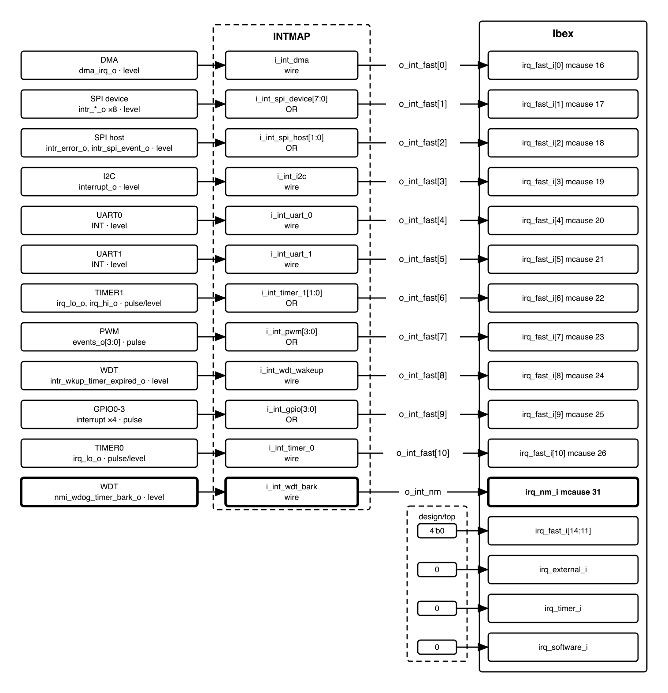

# QNSC_Interrupt_Map_MAS

**Block** `intmap` · **Owner** Nghia Van Trong · **Version** 2.0 · **2026-09-23**

Twenty-seven interrupt sources reach the CPU as twelve wires. `INTMAP` is the
combinational OR tree that does the reduction.

Why the specification says what it says — the two designs that were dropped, the
evidence read out of Ibex, the questions that closed — is in
[`QNSC_Interrupt_Map_DECISIONS.md`](QNSC_Interrupt_Map_DECISIONS.md). This file is
the contract.

---

## Revision history

One line per version. The reasoning behind each change, and the evidence it rests
on, is in [`QNSC_Interrupt_Map_DECISIONS.md`](QNSC_Interrupt_Map_DECISIONS.md).

| Version | Date | Author | Reviewer | Description of change |
|---|---|---|---|---|
| V1.0 | 2026-09-13 | Nghia VT | -- | First issue, against a candidate IP set: 74 sources |
| V2.0 | 2026-09-17 | Nghia VT | -- | Rewritten for the IP set actually selected: 28 |
| V3.0 | 2026-09-17 | Nghia VT | -- | Specified as registered, wrongly -- see V11.3 |
| V4.0 | 2026-09-17 | Nghia VT | -- | Port list and parameters added; derived figures reconciled |
| V5.0 | 2026-09-17 | Nghia VT | -- | Audited against the IP assignment sheet and each IP's RTL |
| V6.0 | 2026-09-17 | Nghia VT | -- | GPIO corrected to `pulp-platform/apb_gpio`: total 27 |
| V7.0 | 2026-09-17 | Nghia VT | -- | `rv_plic` considered and rejected; Ibex fast lines kept |
| V9.0 | 2026-09-18 | Nghia VT | -- | Reconciled against `QSOC_HAS` and the DMA, TIMER, WDT specs |
| V10.0 | 2026-09-18 | Nghia VT | -- | `QSOC_HAS` v4_r1 settles four open items, all in favour of this |
| V10.1 | 2026-09-18 | Nghia VT | -- | Two source counts closed; one correction here |
| V11.1 | 2026-09-21 | Nghia VT | -- | TIMER0, TIMER1, PWM ownership transfers in; each gets its own MAS |
| V11.2 | 2026-09-21 | Nghia VT | Day005 | GPIO ruled one line for four instances -- action item closed |
| V11.3 | 2026-09-21 | Nghia VT | -- | Five questions closed from Ibex RTL. **Block is combinational** |
| V11.4 | 2026-09-22 | Nghia VT | -- | Question 2 reframed after reading the bus owner's three specs |
| V11.5 | 2026-09-22 | Nghia VT | -- | Question 2 rewritten from the IPs' RTL, not `QSOC_HAS` |
| V11.6 | 2026-09-22 | Nghia VT | -- | Two questions closed, one narrowed, from the SPI owner's specs |
| V11.7 | 2026-09-22 | Nghia VT | -- | Stale reset-cause table corrected: `ndmreset` is gone |
| V11.8 | 2026-09-22 | Nghia VT | -- | Question 2 restated as a shaped request, not a gap |
| V11.9 | 2026-09-22 | Nghia VT | -- | Last two questions take positions; specification complete |
| V11.10 | 2026-09-22 | Nghia VT | -- | DMA answered by its owner: level, not pulse. Central limit removed |
| **V2.0** | **2026-09-23** | **Nghia VT** | -- | **Rewritten as specification only: 1284 lines to 220. History and rationale moved to `_DECISIONS`. Tables in 6.2, 6.3 and 9 are now generated from `util/qsoc_contract.yml`** |

## 1. Scope

`INTMAP` groups the interrupt sources of fourteen blocks onto the CPU's fast
interrupt lines, one line per peripheral, and passes the watchdog bark straight
through to the non-maskable input.

**It does not**: hold state, decode an address, appear on any bus, prioritise
(the core does that), or latch a pulse. It has no clock and no reset.

## 2. Block diagram



One combinational layer. No sub-blocks, no clock domain, no reset domain.

## 3. IP used

: Upstream IP used

| From | Module | Commit |
|------|--------|--------|
| — | — | — |

**Designed in house.** The block instantiates nothing; it is `assign` statements.

## 4. Interface

Every port. Naming follows `QNSC_RTL_Design_Naming_Rule` V1.0 section 3.6,
`i_int_<source>` / `o_int_<source>`.

: Interrupt map interface

| Signal | Dir | Width | Description |
|---|---|---:|---|
| `i_int_dma` | in | 1 | DMA completion. Level, held by `DMA_ISR` |
| `i_int_spi_dev` | in | 8 | `spi_device` `intr_*_o`, in declaration order |
| `i_int_spi_host` | in | 2 | `spi_host` error, event |
| `i_int_i2c` | in | 1 | I²C |
| `i_int_uart_0` | in | 1 | UART0. Driven by the IP's `INT` port |
| `i_int_uart_1` | in | 1 | UART1 |
| `i_int_timer_1` | in | 2 | TIMER1 `irq_lo_o`, `irq_hi_o` |
| `i_int_pwm` | in | 4 | PWM `events_o` |
| `i_int_wdt_wkup` | in | 1 | `aon_timer` wake-up expiry |
| `i_int_gpio` | in | 4 | one per GPIO instance |
| `i_int_timer_0` | in | 1 | TIMER0 `irq_lo_o` only — 64-bit mode |
| `i_int_wdt_bark` | in | 1 | `aon_timer` `nmi_wdog_timer_bark_o` |
| `o_int_fast` | out | 11 | to Ibex `irq_fast_i[10:0]` |
| `o_int_nm` | out | 1 | to Ibex `irq_nm_i` |

**27 inputs, 12 outputs, and no other ports.** No `i_clk_*`, no `i_rst_n_*`.

## 5. Register map

None. The block has no address and is not a bus slave, so there is nothing for
software to read or write.

Enabling and masking is done in the core: `mie` bits 16–26 for the fast lines.
Acknowledging is done at each peripheral's own status register.

## 6. Functional behaviour

### 6.1 One OR gate per peripheral

```systemverilog
assign o_int_fast[0]  =  i_int_dma;
assign o_int_fast[1]  = |i_int_spi_dev;
assign o_int_fast[2]  = |i_int_spi_host;
assign o_int_fast[3]  =  i_int_i2c;
assign o_int_fast[4]  =  i_int_uart_0;
assign o_int_fast[5]  =  i_int_uart_1;
assign o_int_fast[6]  = |i_int_timer_1;
assign o_int_fast[7]  = |i_int_pwm;
assign o_int_fast[8]  =  i_int_wdt_wkup;
assign o_int_fast[9]  = |i_int_gpio;
assign o_int_fast[10] =  i_int_timer_0;
assign o_int_nm       =  i_int_wdt_bark;
```

A peripheral with one source is wired straight through; one with several is
OR-reduced. **Zero flip-flops**, so the delay from a source asserting to the core
seeing it is combinational.

### 6.2 Line assignment

The line index **is** the priority: Ibex resolves the lowest index first. This
table therefore fixes the default priority order as well as the wiring, and
changing it requires re-synthesis.

<!-- gen:interrupt_lines -->
: Fast interrupt line assignment

| Line | mcause | Vector | Peripheral | Sources | Shape |
|---:|---:|---|---|---:|---|
| 0 | 16 | `mtvec + 0x40` | dma | 1 | level |
| 1 | 17 | `mtvec + 0x44` | spi_device | 8 | level |
| 2 | 18 | `mtvec + 0x48` | spi_host | 2 | level |
| 3 | 19 | `mtvec + 0x4C` | i2c | 1 | level |
| 4 | 20 | `mtvec + 0x50` | uart_0 | 1 | level |
| 5 | 21 | `mtvec + 0x54` | uart_1 | 1 | level |
| 6 | 22 | `mtvec + 0x58` | timer_1 | 2 | pulse |
| 7 | 23 | `mtvec + 0x5C` | pwm | 4 | pulse |
| 8 | 24 | `mtvec + 0x60` | wdt_wakeup | 1 | level |
| 9 | 25 | `mtvec + 0x64` | gpio | 4 | pulse |
| 10 | 26 | `mtvec + 0x68` | timer_0 | 1 | pulse |
| 11-14 | 27-30 | -- | spare, tied to 0 | 0 | -- |
| -- | **31** | `mtvec + 0x7C` | **wdt_bark**, on `irq_nm_i` | 1 | level |
<!-- /gen -->

<!-- gen:interrupt_totals -->
: Interrupt source totals

|  | Count |
|---|---:|
| Sources aggregated onto fast lines | 26 |
| Sources on the non-maskable input | 1 |
| **Total interrupt sources** | **27** |
| Fast lines driven | 11 |
| Fast lines Ibex provides | 15 |
| Fast lines spare | 4 |
<!-- /gen -->


Order follows one rule: **data loss first, human time last.** A missed SPI or UART
event loses a byte that cannot be recovered; a missed timer tick arrives again next
period. DMA takes line 0 because the rest of the system waits on a transfer
completing.

### 6.3 The core identifies the source, not a register

Fast line *n* raises `mcause` `16 + n`, and Ibex is permanently in vectored mode,
so the trap address is `mtvec + 4 × mcause`. The core therefore enters the
peripheral's own handler directly. **No claim register is read and no bus
transaction occurs on the interrupt path.**

`mcause` 16 and above is platform-use space in the RISC-V privileged
specification, so this numbering is a local convention the specification permits.

### 6.4 The NMI bypasses this block

`i_int_wdt_bark` goes to `o_int_nm` unmodified. The bark must reach the core even
if firmware has hung with interrupts disabled, and `irq_nm_i` is outside
`mstatus.MIE` and `mie`.

Ibex ignores the NMI in Debug Mode. A bark raised while `SYSDBG` has the core
halted therefore traps on resume, not when it occurs — and only because
`aon_timer` holds the bark as a level.

### 6.5 A pulse can be missed, and what that costs

`mip` in Ibex is combinational: `assign mip.irq_fast = irq_fast_i`. The core
latches nothing, and neither does this block. A one-cycle pulse arriving while
`mstatus.MIE` is clear is therefore **not seen**.

That costs an interrupt but not information, because every source either holds its
line or keeps a record:

: How each source recovers a missed pulse

| Source | Shape | Recovery |
|---|---|---|
| DMA | level | held by `DMA_ISR`, write-1-to-clear |
| SPI ×2, I²C, UART ×2, WDT wake-up | level | held until the handler clears it |
| GPIO | pulse | which pin fired is in the instance's own `INTSTATUS` |
| TIMER0, TIMER1, PWM | pulse | the event repeats next period |

**No source destroys information.** This is the condition the design depends on.

## 7. Instances

One. It is instantiated in `design/top` and has no parameters.

## 8. What is not provided here, and who provides it

: Functions this block does not provide

| Function | Where it lives |
|---|---|
| Pending latch | the peripheral's status register, or nowhere — 6.5 |
| Which event fired | the peripheral's status register |
| Which peripheral fired | `mcause`, via the vectored trap address |
| Priority resolution | Ibex, by fast-line index |
| Per-source enable | `mie` bits 16–26, in the core |
| Acknowledge | writing the peripheral's status register |

## 9. Tie-offs

<!-- gen:core_tie_offs -->
: Core interrupt inputs tied off

| Port | Tied to | Why |
|---|---|---|
| `irq_fast_i[14:11]` | `4'b0` | QSOC drives 11 of the 15 lines |
| `irq_external_i` | `0` | nothing aggregates onto it; there is no external interrupt controller |
| `irq_timer_i` | `0` | no CLINT, so `mip.MTIP` is never set -- TIMER0 is an ordinary fast line |
| `irq_software_i` | `0` | permitted on a single-hart system |
<!-- /gen -->

**Consequence for firmware:** an RTOS ported to QSOC must supply its own timer
driver rather than the standard `mtime`/`mtimecmp` one.

## 10. Requirements on others, and open items

: Requirements on other owners

| Item | Owner | What it blocks |
|---|---|---|
| APB-to-TL-UL wrapper for `aon_timer` | WDT owner | two of the 27 sources, one being the NMI. Its enable is in `WDOG_CTRL` offset `0x1C`, so without a bus path the watchdog cannot be enabled and never barks |
| Watchdog stoppable while `debug_mode` is asserted, **or** firmware told to disable it | WDT owner | a long debug session otherwise ends in a reset with nothing recording why |
| Vector table at `mtvec + 0x40` … `+0x68`, plus `+0x7C`; `mie` bits 16–26 | firmware owner | — |
| Handlers installed **before** `mstatus.MIE` is set | firmware owner | the block is transparent out of reset, so every source is live from the first cycle |

**Accepted limits**, stated rather than hidden:

1. A pulse arriving while `mstatus.MIE` is clear is lost. Recoverable for every
   source — 6.5.
2. Priority is fixed at elaboration. Changing it is a re-synthesis.
3. `mcause` 16–30 is platform-use space, so the numbering is a local convention
   rather than a portable one.

## Verification

Ten checks, none requiring a bus model:

1. Each single-source input raises exactly its own line.
2. Each OR group raises its line for every member, individually.
3. No input raises a line other than its own.
4. Spare lines `[14:11]` are always 0.
5. `i_int_wdt_bark` reaches `o_int_nm` and no fast line.
6. Simultaneous inputs on one group raise the line once.
7. Simultaneous inputs on different groups raise both lines.
8. Output follows input combinationally, with no cycle of delay.
9. `mcause`/vector mapping matches section 6.2 against `qnsc_pkg`.
10. **Lint check**: the module contains no `i_clk_`, no `i_rst_n_`, and no
    `always_ff`. If any appears, the design has drifted back into being a
    controller.

## Appendix A. Acronyms

: Acronyms

| Acronym | Description |
|---|---|
| CLINT | Core Local Interruptor -- the RISC-V standard timer and software interrupt block. **Not present in QSOC** |
| INTMAP | Interrupt Map -- this block |
| ISR | Interrupt Service Routine |
| `mcause` | Machine Cause register: why the core trapped |
| `mie` | Machine Interrupt Enable register: per-source mask |
| `mip` | Machine Interrupt Pending register |
| `mstatus.MIE` | The global interrupt enable bit |
| `mtvec` | Machine Trap Vector: base of the trap table |
| NMI | Non-Maskable Interrupt -- `irq_nm_i` on Ibex |
| PLIC | Platform Level Interrupt Controller. Considered in V7.0 and **rejected** |
| SCRC | System Clock Reset Control. Formerly `SYSCTL` on the block diagram |
| W1C | Write-1-to-Clear |
| WDT | Watchdog Timer |

## Appendix B. First review

: First review

| Item | Reviewer | Response |
|---|---|---|
| GPIO: one line for four instances, or four lines? | Day005, 2026-09-18 | One line. Which pin fired is in the instance's `INTSTATUS`. Closed in V11.2 |
| Is the DMA interrupt a pulse or a level? | DMA owner | Level, held by `DMA_ISR` W1C. Closed in V11.10 |
| Does this block need to latch pending? | -- | No. Section 6.5: no source destroys information |
| Priority order justified? | -- | Section 6.2: data loss first, human time last |
| Open | | |
