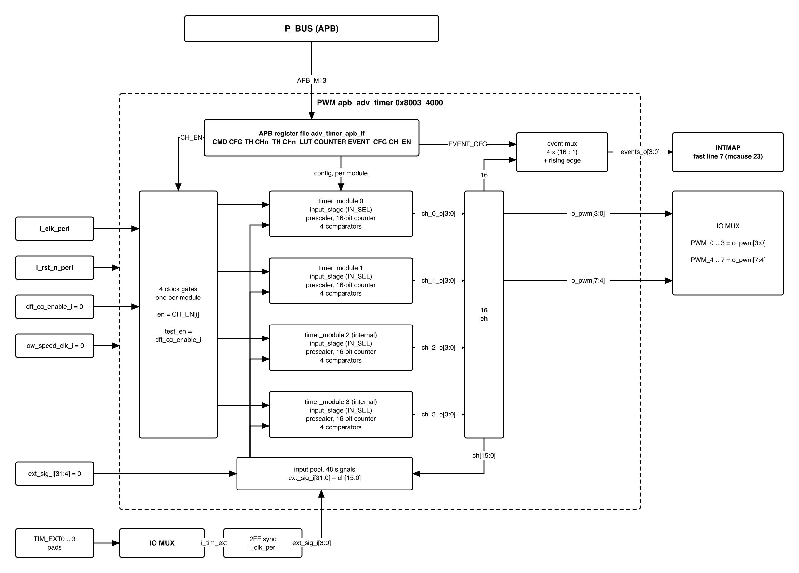

# Reversion and History

| Version | Date       | Author/Owner | Description of Change |
|---------|------------|--------------|-----------------------|
| V1.0    | 2026-09-21 | Nghia VT     | First issue. Covers the single `apb_adv_timer` instance that provides QSOC's PWM outputs. The companion document is `QNSC_TIMER_MAS`, which covers TIMER0 and TIMER1 -- **a different IP at different APB ports**. Two findings in this document were read from the RTL and are not in any datasheet: the four event lines are a **4-of-16 multiplexer over the channel outputs**, section 4.5, and the per-timer status output is **not reachable by software**, section 4.6. |
| V1.1    | 2026-09-21 | Nghia VT     | **`dft_cg_enable_i` position corrected against the Day005 review.** v1 ties it **0** because the review found the combined *test mode / JTAG* pad entry was copied from another chip and removed it -- so the earlier requirement to drive it from a test-mode pin was unsatisfiable. The same review ruled the spec must **not assert** that QSOC has no scan, so section 5.4 now records a tie-off plus the condition for revisiting it, rather than either a hard requirement or a claim of no DFT. |
| V1.2    | 2026-09-21 | Nghia VT     | **External triggers settled against the team's `IOPAD_Pin_Summary` and the IP's own RTL.** Four pads already exist -- `TIM_EXT0`--`3` on `PIN_37`--`40` -- so the open question narrows to which `ext_sig_i` bits they attach to. The **selection register this document previously proposed is dropped**: `input_stage.sv` shows each module already selects one signal with an 8-bit `cfg_sel`. Reading that code also found the pool is **48 signals, not 32** (`EXTSIG_NUM + 16`), because it includes the sixteen channel outputs -- so a module can be triggered by another module's channel, which qualifies the independence claim in section 4.1. Table 7 now cites the pad list as independent confirmation. |
| V1.3    | 2026-09-21 | Nghia VT     | **Three open questions closed, one narrowed.** The eight pad channels are fixed as `ch_0_o` and `ch_1_o` of **each** module, for four independent frequencies at the pins rather than two; the four `TIM_EXT` pads attach to `ext_sig_i[3:0]` **in pad order**, so the mapping reads off the pinout; and centre-aligned output is recorded as **available but unverified** -- `up_down_counter.sv` shows it is one bit, `cfg_sawtooth_i`, so removing it would be work rather than saving. The idle-level question is narrowed to a proposal plus the RTL reason it matters: `out_filter.sv` only updates while `ctrl_active_i` is high, so a stopped or gated channel **holds its last level** and does not return to a safe one by itself. |
| V1.4    | 2026-09-21 | Nghia VT     | The idle-level item is closed by **changing whose problem it is**. `out_filter.sv` only updates its stored output while `ctrl_active_i` is high, so the block has **no idle level to configure** -- a stopped channel holds the last level it drove. Section 5.9 therefore specifies a **four-step firmware procedure** ending in *never gate a running block*, and what remains for the pad owner shrinks to a one-line check that no pad pull fights the rest level. The document now has **no open questions**. |
| V1.5    | 2026-09-22 | Nghia VT     | Removes an internal inconsistency: section 5.6 still called the `ext_sig_i` bit mapping a *proposal* left to settle, while section 5.9 had already **decided** it as `ext_sig_i[3:0]` in pad order. Section 5.6 now points at the decision. |
| V1.6    | 2026-09-22 | Nghia VT     | **Corrects the pad-channel mapping against the RTL.** V1.3 stated the eight pad channels were `ch_0_o` and `ch_1_o` *of each of the four modules*, for **four** independent frequencies. Reading `apb_adv_timer.sv` shows the channels are grouped **by module** -- `u_tim0.pwm_o -> ch_0_o`, `u_tim1.pwm_o -> ch_1_o`, `u_tim2.pwm_o -> ch_2_o`, `u_tim3.pwm_o -> ch_3_o` -- so `ch_i_o[3:0]` is the four channels of module `i`. Bringing out `ch_0_o` and `ch_1_o` is therefore **all four channels of modules 0 and 1**, giving **two** independent base frequencies (four channels each), not four. Sections 4.x pad-mapping paragraph, 5.9 and the requirements table are corrected; `QSOC_HAS` already uses the two-frequency figure. |

# Table of Tables

| Table | Title |
|-------|-------|
| Table 1 | IP sourcing decision |
| Table 2 | What this block is not |
| Table 3 | Achievable PWM frequency and resolution at 20 MHz |
| Table 4 | Block interface |
| Table 5 | Register map |
| Table 6 | Registers of one timer module |
| Table 7 | What firmware must program before any interrupt occurs |
| Table 8 | Address decode against region size |
| Table 9 | Channel outputs against pads |
| Table 10 | Clock and reset domain |
| Table 11 | Interrupt sources contributed to INTMAP |
| Table 12 | Verification QSOC must add |
| Table 13 | Interfaces to agree with the team |
| Table 14 | Acronyms |

# Table of Figures

| Figure | Title |
|--------|-------|
| Figure 1 | The PWM block and where its outputs go |

---

# 1. Overview

## 1.1 Scope

This document specifies the integration of **one `apb_adv_timer` instance** as QSOC's
PWM block: its register map, the channel outputs and how many reach pads, the event
lines it contributes to `INTMAP`, the clock and reset domain, and the address decode.

**It does not cover TIMER0 or TIMER1.** Those are two instances of a different IP,
`apb_timer_unit`, at `APB_M7` and `APB_M8`, specified in `QNSC_TIMER_MAS`. The
distinction is stated first because confusing the two is exactly what `QSOC_HAS`
records as a disagreement between documents, and because the confusion is easy to
make: the PWM IP is *called* a timer and contains four of them.

**Table 1 -- IP sourcing decision**

| Item | Value |
|---|---|
| IP | `pulp-platform/apb_adv_timer` |
| Sub-modules | `timer_module`, `up_down_counter`, `comparator`, `prescaler`, `lut_4x4`, `out_filter`, `input_stage`, `timer_cntrl`, `adv_timer_apb_if` |
| Instances | **one** |
| Bus | APB slave, plain signals, no adapter required |
| Parameters | `APB_ADDR_WIDTH = 12`, `TIMER_NBITS = 16`, `EXTSIG_NUM = 32` |
| Written by QSOC | instantiation, tie-off and the pad mux; no RTL inside the block |

**Table 2 -- What this block is not**

| | |
|---|---|
| Not the timebase | its counters are 16-bit and wrap every 3.2768 ms at 20 MHz |
| Not TIMER0 or TIMER1 | different IP, different ports, different clock gates |
| Not a source of `mtime` | QSOC has no machine timer; see `QNSC_TIMER_MAS` section 5.5 |
| Not readable for "which event fired" | section 4.6 |

## 1.2 Position in the system

The block is an APB slave on `P_BUS`, reached from the CPU through `AXI2APB` on
`AXI_M3`. Unlike the timers, it **does drive pads**: eight of its sixteen channel
outputs leave the chip through the IO mux. It also contributes four event lines to
`INTMAP`.

{width=6.4in}

# 2. Feature

## 2.1 Feature -- PWM

- One `apb_adv_timer` instance containing **four independent timer modules**.
- Each module has a **16-bit up or up-down counter**, an 8-bit prescaler and **four
  comparators**, giving **sixteen channel outputs** in total.
- Each channel has a **4-entry lookup table** that combines the comparator result with
  the previous channel state, which is how the IP produces the different output shapes
  from one compare.
- **Eight of the sixteen channels reach pads** as `PWM_0` to `PWM_7`, each shared with
  a GPIO function through the IO mux.
- **Four event lines** to `INTMAP`, each a one-cycle pulse, each selected from any one
  of the sixteen channel outputs.
- **32 external signal inputs** able to start, stop or gate a module without CPU
  action; QSOC wires a subset, section 5.6.

**What the block does not provide:**

- **No software-readable event status.** Section 4.6 shows the RTL evidence. Firmware
  cannot ask the block which event fired or whether one was missed.
- **No interrupt on its own.** Out of reset the four event lines are inert until
  firmware programs the event configuration, section 4.5.
- **No error reporting.** `PSLVERR` behaviour is as for the other APB peripherals in
  QSOC: the block cannot report a bad access.

# 3. Block Diagram

Figure 1 in section 1.2 is the block diagram: the APB register file, four timer
modules, the sixteen channel outputs, and the two destinations those outputs feed --
the pad mux and the event multiplexer.

# 4. Micro-architecture Details

## 4.1 Structure

Four `timer_module` instances, each parameterised `NUM_BITS = TIMER_NBITS = 16`, sit
behind one APB register file. Inside a module:

| Sub-module | Function |
|---|---|
| `prescaler` | 8-bit divider, field `PRESC`, ahead of the counter |
| `up_down_counter` | the 16-bit counter; counts up, or up then down for centre-aligned output |
| `comparator` x4 | one per channel, compares the count against that channel's threshold |
| `lut_4x4` x4 | turns the comparator result plus the current output into the next output |
| `out_filter` | output conditioning |
| `timer_cntrl` | start, stop and reset, from APB or from an external signal |

The four modules have **independent counters**, periods and prescalers. Two channels on
the *same* module share a time base and can therefore be phase-related; channels on
*different* modules are not phase-related unless firmware arranges it -- which it can,
because a module's trigger pool includes the other modules' channel outputs,
section 5.6.

## 4.2 Counter width, and why 16 bits is the right choice here

The counters are 16-bit. At QSOC's 20 MHz that is a maximum period of
**3.2768 ms**, so **305 Hz** is the lowest frequency reachable without the prescaler,
and **1.19 Hz** with the prescaler at its maximum divide of 256.

That range covers every use QSOC has, with resolution to spare.

**Table 3 -- Achievable PWM frequency and resolution at 20 MHz**

| Intended use | Frequency | Counts per period | Duty steps available |
|---|---|---:|---:|
| LED dimming | 1 kHz | 20 000 | **20 000** |
| Motor drive | 20 kHz | 1 000 | **1 000** |
| Audio-rate output | 44.1 kHz | 454 | **454** |
| Slowest without prescaler | 305 Hz | 65 536 | 65 536 |
| Slowest with prescaler | 1.19 Hz | 65 536 x 256 | 65 536 |

A 16-bit counter is **not** a limitation for PWM: the human eye resolves a few dozen
brightness levels and 20 000 steps is far beyond that. The same 16 bits would be a
serious limitation for a timebase, which is why the timebase is a different IP.
`QNSC_TIMER_MAS` section 4.1 carries that comparison.

## 4.3 Block interface

**Table 4 -- Block interface**

| Signal | Dir | Width | Note |
|---|---|---:|---|
| `HCLK` | in | 1 | domain clock, section 5.3 |
| `HRESETn` | in | 1 | active low |
| `PADDR` | in | 12 | decoded as a register index, section 4.7 |
| `PWDATA` | in | 32 | |
| `PWRITE`, `PSEL`, `PENABLE` | in | 1 each | |
| `PRDATA` | out | 32 | |
| `PREADY`, `PSLVERR` | out | 1 each | |
| `low_speed_clk_i` | in | 1 | **sampled as data, not used as a clock** |
| `dft_cg_enable_i` | in | 1 | bypass for the internal clock gates, section 5.4 |
| `ext_sig_i` | in | **32** | external start, stop and gate triggers |
| `events_o` | out | **4** | to `INTMAP`; one-cycle pulses |
| `ch_0_o`, `ch_1_o`, `ch_2_o`, `ch_3_o` | out | 4 each | **16 channel outputs** |

## 4.4 Register map

The block decodes an 8-bit register index. Each timer module occupies `0x40` bytes,
and two global registers follow the four modules.

**Table 5 -- Register map**

| Offset range | Contents |
|---|---|
| `0x000` -- `0x02C` | timer module 0 |
| `0x040` -- `0x06C` | timer module 1 |
| `0x080` -- `0x0AC` | timer module 2 |
| `0x0C0` -- `0x0EC` | timer module 3 |
| `0x100` | `EVENT_CFG` -- selects and enables the four event lines |
| `0x104` | `CH_EN` -- channel output enables |

**Table 6 -- Registers of one timer module**

Offsets shown relative to the module base, which is `0x000`, `0x040`, `0x080` or `0x0C0`.

| Offset | Name | Function |
|---|---|---|
| `+0x00` | `CMD` | start, stop, update, reset, arm |
| `+0x04` | `CFG` | clock source, prescaler, up or up-down mode |
| `+0x08` | `TH` | period threshold -- the value the counter counts to |
| `+0x0C` | `CH0_TH` | compare threshold, channel 0 -- the duty cycle |
| `+0x10` | `CH1_TH` | compare threshold, channel 1 |
| `+0x14` | `CH2_TH` | compare threshold, channel 2 |
| `+0x18` | `CH3_TH` | compare threshold, channel 3 |
| `+0x1C` | `CH0_LUT` | output shape, channel 0 |
| `+0x20` | `CH1_LUT` | output shape, channel 1 |
| `+0x24` | `CH2_LUT` | output shape, channel 2 |
| `+0x28` | `CH3_LUT` | output shape, channel 3 |
| `+0x2C` | `COUNTER` | current count, readable |

**Period is `TH`, duty is `CHn_TH`.** The two are separate registers, so changing the
duty of one channel does not disturb the period or the other three channels on the
same module.

## 4.5 The four event lines are a multiplexer over the channel outputs

This is the fact most likely to be assumed wrongly, so it is given its own section.
The four event lines are **not** four dedicated comparators. They are four selections
from the sixteen channel outputs, each followed by an edge detector:

```systemverilog
assign s_event_signals = {ch_3_o, ch_2_o, ch_1_o, ch_0_o};      // 16 bits

assign events_o[0] = s_event_en[0] & r_event_sync_0[1] & ~r_event_sync_0[0];
assign events_o[1] = s_event_en[1] & r_event_sync_1[1] & ~r_event_sync_1[0];
assign events_o[2] = s_event_en[2] & r_event_sync_2[1] & ~r_event_sync_2[0];
assign events_o[3] = s_event_en[3] & r_event_sync_3[1] & ~r_event_sync_3[0];
```

Three consequences follow, and all three are firmware-visible.

**An interrupt means "a channel I chose has just changed state".** It does not mean a
period elapsed, and it does not identify which module or channel unless firmware
remembers what it selected.

**The pulse is exactly one `HCLK` cycle.** The expression is the classic edge
detector -- present value AND the inverse of the previous value. `INTMAP` provides no
latch, so these are the narrowest sources in QSOC and `QNSC_Interrupt_Map_MAS`
classifies them as pulses on that basis.

**Out of reset the block raises no interrupt at all.** `s_event_en` comes from
`EVENT_CFG`, which resets to zero. Until firmware writes a selection and an enable,
the four lines stay low. This is the opposite of a fault: it means the block cannot
interrupt a system that has not asked it to.

**Table 7 -- What firmware must program before any interrupt occurs**

| Step | Register | Why |
|---:|---|---|
| 1 | `CHn_LUT`, `CHn_TH`, `TH`, `CFG` of the module | otherwise the channel never changes state |
| 2 | `CH_EN` | enable the channel output |
| 3 | `EVENT_CFG` -- selection | choose which of the 16 channels drives each event line |
| 4 | `EVENT_CFG` -- enable | set `s_event_en` for the lines wanted |
| 5 | `mie` bits for the PWM fast line, then `mstatus.MIE` | the core side, see `QNSC_Interrupt_Map_MAS` |

## 4.6 There is no software-readable event status

Each `timer_module` exposes an 8-bit `status_o`. In the top level it appears **exactly
twice** -- once declared, once connected:

```systemverilog
logic [7:0] s_timer0_status;
...
    .status_o         ( s_timer0_status       )
```

and then nothing reads it. The APB interface module `adv_timer_apb_if` has **no port
whose name contains `status`**. The signal is therefore not reachable by software in
this version of the IP.

**Consequence for QSOC.** A PWM event that arrives while `mstatus.MIE` is clear is
lost, and **nothing anywhere records that it happened**. There is no flag to poll and
no counter to compare.

**Why this is acceptable here.** A PWM channel is periodic by construction: it changes
state again on the next period, which at the frequencies in Table 3 is between 23
microseconds and 1 millisecond away. **The recovery mechanism is periodicity, not a
status register.** That distinction matters, because it fails in exactly one case: a
module configured for a single shot, or stopped immediately after the event. Firmware
that uses PWM events as one-off notifications cannot rely on them.

This finding is the reason `QNSC_Interrupt_Map_MAS` must state its pulse-recovery
argument in terms of periodicity rather than status registers.

## 4.7 Address decode against the region

The register file spans `0x000` to `0x107`, that is **264 bytes**, inside the
**16 KiB** region `QSOC_HAS` grants the block.

**Table 8 -- Address decode against region size**

| Item | Value |
|---|---|
| Registers implemented | 4 modules x 12 registers, plus 2 global |
| Span actually decoded | **264 bytes**, `0x000` to `0x107` |
| Region assigned | **16 KiB** |
| Consequence | the decoded span **aliases** across the region |

As with the timers, an access beyond the implemented span neither faults nor reports
an error. The recommendation is the same: accept the aliasing, document it, and do not
spend logic on a fault firmware cannot observe.

# 5. Integration into QSOC

## 5.1 Address and port assignment

Taken from `QSOC_HAS` and not changed by this document.

| Port | Block | Base | Region |
|---|---|---|---|
| `APB_M13` | **PWM** | `0x8003_4000` | 16 KiB |

## 5.2 Channel outputs and pads

Sixteen channels exist; eight leave the chip. The pad assignment is fixed by
`QSOC_HAS` and every one of the eight is shared with a GPIO function.

**Table 9 -- Channel outputs against pads**

| Pad name | Pin | Shared with |
|---|---|---|
| `PWM_0` | PIN_27 | `GPIO1_1` |
| `PWM_1` | PIN_28 | `GPIO1_0` |
| `PWM_2` | PIN_29 | `GPIO2_7` |
| `PWM_3` | PIN_30 | `GPIO2_6` |
| `PWM_4` | PIN_33 | `GPIO2_5` |
| `PWM_5` | PIN_34 | `GPIO2_4` |
| `PWM_6` | PIN_35 | `GPIO2_3` |
| `PWM_7` | PIN_36 | `GPIO2_2` |

**Which eight of the sixteen reach these pads is a decision this document must
record and `QSOC_HAS` does not yet fix.** In the RTL the channels are grouped **by
module**: `u_tim0.pwm_o -> ch_0_o`, `u_tim1.pwm_o -> ch_1_o`, and so on, so
`ch_i_o[3:0]` is the four channels of module `i`. Bringing out `ch_0_o` and `ch_1_o`
therefore means **all four channels of module 0 and all four of module 1** -- two
modules at the pads. Because channels within one module share that module's counter
and prescaler, this gives firmware **two independent base frequencies** at the pins,
four channels (independent duty/phase) under each.

The remaining eight channels (modules 2 and 3) stay inside the chip and are still
useful: any of the sixteen can be selected as an event source, section 4.5.

## 5.3 Clock and reset domain

**Table 10 -- Clock and reset domain**

| Item | Value |
|---|---|
| Domain | **D18** |
| Clock gate bit | bit 15 |
| Gate | own gate, independently gateable |
| Clock | 20 MHz system clock, no PLL in QSOC |
| Reset | synchronous release of the system reset, active low |
| `low_speed_clk_i` | **not a clock**: sampled as data, creates no second domain |

`QSOC_HAS` already records the treatment of `low_speed_clk_i`: the block samples it
rather than clocking from it, so it introduces no clock domain crossing and needs no
`set_false_path`. Tie it to the domain clock unless a slower counting rate is wanted.

**Closing gate bit 15 freezes the channel outputs at their current level.** For a
motor drive that is not a neutral state. Firmware should stop the modules through
`CMD` and let the outputs reach their idle level before the gate is closed, rather
than gating a running block.

## 5.4 The internal clock gates and DFT

The IP instantiates clock gating cells internally and brings out `dft_cg_enable_i` to
bypass them, so that scan can shift through logic that is otherwise gated.

**For QSOC v1 this input is tied low, because there is nothing to drive it from.**
The pad table originally listed a combined *test mode / JTAG* pin, but the Day005
review of 2026-09-18 established that this entry was **copied from another chip** and
removed it. With no test-mode pin in the pad ring, a tie-off is the only option.

**This document does not claim that QSOC has no scan.** The same review ruled that the
spec must **not assert** the absence of test mode or scan, because DFT may be added
later. The position recorded here is therefore narrower and is meant to be revisited:

| | |
|---|---|
| For v1 | `dft_cg_enable_i` tied **0**, because no test-mode signal exists |
| What is **not** claimed | that QSOC will never have scan |
| What must happen if DFT is added | this input needs a real source, and the tie-off in the PWM wrapper is one of the places that must change |
| Why it is worth recording | the tie is **harmless in simulation and only wrong on the tester** -- the same class of defect as the SRAM non-functional pins in `QNSC_RAM_MAS` |

The same applies to the four GPIO instances, which have the same input. Keeping the
requirement visible costs one row in Table 13 and saves rediscovering it during a DFT
pass.

## 5.5 Interrupt contribution

**Table 11 -- Interrupt sources contributed to INTMAP**

| Source | From | Shape | Width |
|---|---|---|---|
| PWM event 0 | `events_o[0]` | pulse | 1 `HCLK` cycle |
| PWM event 1 | `events_o[1]` | pulse | 1 `HCLK` cycle |
| PWM event 2 | `events_o[2]` | pulse | 1 `HCLK` cycle |
| PWM event 3 | `events_o[3]` | pulse | 1 `HCLK` cycle |

**Four sources on one fast line.** This matches what `QNSC_Interrupt_Map_MAS` already
assumes, so the interrupt contract needs no change from this document.

Because all four share one line, `mcause` identifies the block and not the event.
The handler must know which channel it selected into which event slot; the block
cannot tell it, section 4.6.

## 5.6 External triggers

`ext_sig_i` is 32 bits wide. **Four of them reach pads**, confirmed by the team's
`IOPAD_Pin_Summary`: `TIM_EXT0` to `TIM_EXT3` on `PIN_37` to `PIN_40`, each sharing its
pad with a GPIO function through the IO MUX.

| Pad | Pin | Shared with |
|---|---|---|
| `TIM_EXT0` | PIN_37 | `GPIO2_1` |
| `TIM_EXT1` | PIN_38 | `GPIO2_0` |
| `TIM_EXT2` | PIN_39 | `GPIO3_7` |
| `TIM_EXT3` | PIN_40 | `GPIO3_6` |

**The IP already selects per module, so no selection register is needed in the
wrapper.** An earlier revision of this document proposed one; reading the RTL shows it
would duplicate what the IP does. Each `timer_module` takes an 8-bit `cfg_sel` and picks
**one signal out of a pool**:

```systemverilog
localparam N_TIMEREXTSIG = EXTSIG_NUM + 16;                          // 32 + 16 = 48
assign s_timer0_signal = {ch_3_o, ch_2_o, ch_1_o, ch_0_o, ext_sig_i};
```

and inside `input_stage.sv` the select walks that pool. The pool is **48 signals wide,
not 32**: the 32 external inputs **plus the 16 channel outputs**. Two consequences.

**Any module can be triggered by any of the four pads, chosen at run time.** The
design-time decision is only *which `ext_sig_i` bit each pad attaches to* -- the
`IOPAD_Pin_Summary` left that unfixed, and **section 5.9 fixes it**: the lowest four,
`ext_sig_i[3:0]`, in pad order, so the mapping is guessable from the pin number rather
than needing a table.

**A module can also be triggered by another module's channel output**, because the pool
includes all sixteen. This qualifies section 4.1: the four modules have independent
counters, but they are **not obliged to run unsynchronised** -- one can start another.
No QSOC use needs it today, and it costs nothing to leave available.

**The remaining 28 bits of `ext_sig_i` must be tied low**, not left unconnected.

## 5.7 Verification QSOC must add

**Table 12 -- Verification QSOC must add**

| # | Check | Why it is here |
|---:|---|---|
| 1 | Every register reads back what was written, at the documented offset | basic |
| 2 | The decoded span aliases as Table 8 states | pins the decode |
| 3 | `TH` sets the period and `CHn_TH` sets the duty, independently, on one module | the core function |
| 4 | Changing the duty of one channel disturbs neither the period nor the other three | the claim made in section 4.4 |
| 5 | Four modules run at four different frequencies simultaneously | the reason for the pad grouping in 5.2 |
| 6 | **Out of reset, with `EVENT_CFG` untouched, `events_o` stays 0** | the inert-out-of-reset claim of 4.5 |
| 7 | Each event line can be selected from any of the 16 channels | proves the 4-of-16 mux |
| 8 | **Every event pulse is exactly one `HCLK` cycle** | the number `INTMAP` depends on |
| 9 | `ext_sig_i` starts and stops a module as configured | otherwise the input is untested |
| 10 | Eight channels reach the correct pads and the IO mux selects between PWM and GPIO | the only pad-facing path in this block |
| 11 | With `dft_cg_enable_i` tied 0, the block still functions normally; the input is **proven reachable** in RTL so a future DFT pass can drive it | section 5.4 -- v1 has no scan, but the path must not be optimised away |
| 12 | Closing gate bit 15 freezes outputs; stopping via `CMD` first leaves them idle | the motor-drive hazard of 5.3 |

Test 6 asserts that **nothing** happens, and like test 7 in `QNSC_TIMER_MAS` it is the
one most likely to be dropped. It is also the one that protects the boot sequence: a
block that interrupts before firmware is ready is hard to debug from the symptom.

## 5.8 Interfaces to agree with the team

**Table 13 -- Interfaces to agree with the team**

| Item | Owner | What this document proposes |
|---|---|---|
| Which 8 of 16 channels reach pads | pad and IO mux owner | `ch_0_o` and `ch_1_o` -- all four channels of modules 0 and 1, for two independent base frequencies |
| `ext_sig_i` wiring | pad / IO MUX owner | **Four pads already exist** (`TIM_EXT0`--`3`, `PIN_37`--`40`). This block proposes they attach to `ext_sig_i[3:0]` in pad order; remaining 28 bits tied low. No selection register needed -- the IP selects per module |
| `dft_cg_enable_i` | DFT owner | **tie 0 for v1** -- no test-mode pin exists, Day005. Revisit if a DFT strategy is adopted; do not record QSOC as having no scan |
| `low_speed_clk_i` | `SCRC` | tie to the domain clock; the IP samples it |
| Clock gate bit 15 | `SCRC` | may start **closed**; the block does nothing useful until programmed |
| **No pad pull fights the rest level** | pad owner | Section 5.9 -- firmware leaves each channel at a chosen level before the gate closes; a pull in the opposite direction would fight it. One-line check against the pad list |
| Four interrupt sources on one line | `INTMAP` | already assumed by `QNSC_Interrupt_Map_MAS`; no change |

## 5.9 Decisions taken

**Decided -- the eight pad channels are `ch_0_o` and `ch_1_o`, i.e. all four channels
of module 0 and all four of module 1.** In the RTL each module drives its own
`ch_i_o` bus (`u_tim0.pwm_o -> ch_0_o`, `u_tim1.pwm_o -> ch_1_o`), so `ch_i_o[3:0]`
is the four channels of module `i`. Channels within a module share that module's
counter, so two modules at the pads give firmware **two independent base frequencies**,
four channels each. The eight that stay inside (modules 2 and 3) are not wasted: any of
the sixteen can still be selected as an event source, section 4.5, or as another
module's trigger, section 5.6.

**Decided -- the four `TIM_EXT` pads attach to `ext_sig_i[3:0]` in pad order.** So
`PIN_37` is bit 0, `PIN_38` bit 1, `PIN_39` bit 2, `PIN_40` bit 3, and the remaining 28
bits are tied low. The reason is legibility rather than function: any four bits work
electrically, but a mapping that follows pin order can be read off the pinout without a
table, and firmware's `cfg_sel` values become guessable instead of memorised.

**Decided -- centre-aligned output stays available but is not verified exhaustively.**
The mode is one configuration bit: `up_down_counter.sv` carries `r_direction` and
`r_sawtooth`, so `cfg_sawtooth_i = 1` gives edge-aligned sawtooth and `0` gives the
up-then-down count that produces centre-aligned PWM. Since the capability costs nothing
in an IP QSOC does not modify, removing it would be work rather than saving. **QSOC's
default is sawtooth**, the verification of Table 12 covers that, and centre-aligned is
recorded here as *available and unverified* rather than claimed as supported.

**Proposed, and needing the pad owner -- the idle level of each PWM pad is low.** This
is the one question with a consequence outside the chip, so it is stated as a proposal
rather than a decision. Two facts frame it:

- **Stopping a module freezes its pad.** `out_filter.sv` updates its stored output only
  while `ctrl_active_i` is high, so an inactive channel holds whatever level it last
  drove.
- **Gating the domain freezes it too**, section 5.3, and for the same reason.

So the pad does **not** return to a safe level by itself, and "safe" is a board
question: for an LED either level is harmless, for a motor driver one of them may mean
*conducting*. The operational rule this document asks for is therefore: **stop the
module through `CMD` and let the channel reach its idle level before the clock gate is
closed**, never gate a running block. Whether idle is low or high per pad is for the pad
and board owners to fix before the IO MUX is frozen.

**Decided, because the block cannot provide an idle level and firmware must.** The
earlier wording asked the pad owner to fix an idle level per pad. Reading the RTL shows
that is the wrong request: `out_filter.sv` updates its stored output **only while
`ctrl_active_i` is high**, so a stopped or gated channel holds whatever it last drove.
**No level is "the idle level" from the block's point of view** -- there is only the last
one driven.

So the rule is a firmware procedure, and it is the same for every pad:

| Step | Action |
|---|---|
| 1 | Set the channel's `CHn_TH` so the output reaches its intended rest level |
| 2 | Let at least one full period elapse, so the level is actually driven |
| 3 | Stop the module through `CMD` |
| 4 | Only then may `SCRC` close the domain gate |

**Never gate a running block.** Doing so freezes the pad at an arbitrary point in the
waveform, which for an LED is harmless and for a motor driver may mean *conducting*.

**What the pad owner still needs to confirm is narrower**: that none of the eight pads
carries a pull-up or pull-down that fights the level firmware leaves behind. That is a
one-line check against the pad list, not a design decision, and it is recorded in
Table 13 rather than here.

# 6. Observations

**The IP's name is the main hazard in this block.** It is called an advanced *timer*,
it contains four *timers*, and it is not the timer. The previous document for these
blocks specified this IP for the timer role, and `QSOC_HAS` still carries the
resulting disagreement. The clearest defence is the one in section 4.2: 16 bits wrap
in 3.28 ms, which is ample for a waveform and useless for a timebase.

**Two facts in this document are not in any datasheet and change what firmware must
do.** The four event lines are a multiplexer over the channel outputs rather than four
independent comparators, so an interrupt means a chosen channel toggled and firmware
must have programmed the choice. And the per-timer status output is connected to
nothing, so software cannot ask what happened. Both were found by reading the RTL
rather than the documentation, and both would have been discovered late and expensively
otherwise.

**The absence of a status register is what forces a correction elsewhere.**
`QNSC_Interrupt_Map_MAS` argues that losing a pulse is mostly harmless because the
sources keep their own record. For GPIO that is true and the register is named. For
PWM it is not: the recovery mechanism is that the waveform repeats. The argument
survives, but it has to be stated in terms of periodicity, and it then has a visible
exception in single-shot use. A specification that had assumed a status register would
have been wrong in a way no test would catch.

# Appendix A. Acronyms

**Table 14 -- Acronyms**

| Term | Meaning |
|---|---|
| APB | Advanced Peripheral Bus, the AMBA bus used for QSOC's slow peripherals |
| CDC | Clock Domain Crossing |
| `CH_EN` | Channel enable register, offset `0x104` |
| DFT | Design For Test |
| Duty cycle | The fraction of one period for which the output is high |
| `EVENT_CFG` | Event configuration register, offset `0x100` |
| `HCLK` | The APB clock, named by AMBA convention |
| LUT | Look-Up Table -- here the 4-entry table that shapes one channel output |
| MAS | Micro-Architecture Specification |
| `mcause` | RISC-V CSR reporting the cause of a trap |
| Prescaler | 8-bit divider ahead of a counter, field `PRESC` |
| PWM | Pulse Width Modulation |
| `TH` | Threshold -- the period register of a module |

# Appendix B. First Review

Points the author expects to be challenged on, with the answer held ready.

1. **Sixteen channels for eight pads -- is half the block wasted?**
   No. Any of the sixteen can be selected as an event source, and the eight that stay
   inside cost nothing beyond the area already committed by choosing the IP.
2. **Why not a smaller PWM IP, or one written in house?**
   The alternatives on APB are not comparable: OpenTitan's PWM is TL-UL and would need
   a bridge. An in-house block would have to reproduce the per-channel LUT and the
   up-down mode to match, which is not the small job that `INTMAP` was.
3. **Why does the block not interrupt out of reset?**
   Because `EVENT_CFG` resets to zero, so the event enables are clear. This is
   desirable and section 5.7 test 6 protects it.

# Appendix C. References

| Claim | Where the evidence is |
|---|---|
| Module name, parameters, ports | `pulp-platform/apb_adv_timer`, `rtl/apb_adv_timer.sv` |
| `TIMER_NBITS = 16`, `EXTSIG_NUM = 32` | same file, parameter list |
| Four `timer_module` instances, 16 channel outputs | same file, the four instantiations |
| **Events are a 4-of-16 mux over channel outputs** | same file: `assign s_event_signals = {ch_3_o, ch_2_o, ch_1_o, ch_0_o};` |
| **Event pulse is one cycle** | same file: `events_o[0] = s_event_en[0] & r_event_sync_0[1] & ~r_event_sync_0[0];` |
| **`status_o` is connected to nothing readable** | same file: `s_timer0_status` appears only at its declaration and its connection; `rtl/adv_timer_apb_if.sv` has no `status` port |
| Register offsets, module stride `0x40`, `EVENT_CFG` at `0x100`, `CH_EN` at `0x104` | `rtl/adv_timer_apb_if.sv`, the `` `define REG_ `` block |
| 8-bit prescaler | `rtl/prescaler.sv`: `input logic [7:0] cfg_presc_i` |
| Port, address, domain D18, gate bit 15 | `QSOC_HAS` Table 9-1, the APB port table and the clock domain table |
| `PWM_0` to `PWM_7` pad and pin assignment | `QSOC_HAS` pad table, PIN_27 to PIN_36 |
| `low_speed_clk_i` sampled as data, no second domain | `QSOC_HAS` clock list |
| Four external triggers from GPIO proposed | `QSOC_HAS`, timer external triggers row |
| Four interrupt sources, all pulses, one fast line | `QNSC_Interrupt_Map_MAS`, Table 3 |
| Most STM32 timers are 16-bit, a few 32-bit | STMicroelectronics STM32G4 general purpose timer training material |
