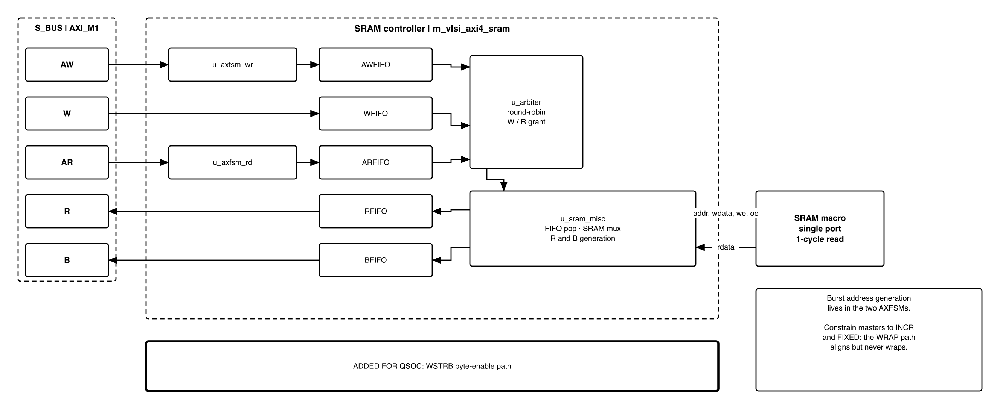

# Revision history

`V2.0` is a rewrite. The nine versions before it, the memory map as it was proposed
and argued before `util/qsoc_contract.yml` became the authority, and the reasoning
behind every parameter are in [`QNSC_RAM_DECISIONS.md`](QNSC_RAM_DECISIONS.md).

| Version | Date | Author | Reviewer | Description of change |
|---|---|---|---|---|
| V2.0 | 2026-09-23 | Nghia VT | -- | Rewritten as specification only. The 300-line memory-map proposal is replaced by the table generated from the contract, which is now the authority. Tables and figures are numbered by the build |

# 1. Overview

`ISRAM` and `DSRAM` are the on-chip memories of QSOC, each an **integration** of
`AXI4-SRAM-CONTROLLER` in front of an SMIC 28 nm single-port SRAM macro. QSOC has no
flash, so the application is downloaded into `ISRAM` after every reset and runs from
there.

This block is the counterpart of `SYSDBG`, which is designed in house: here the
controller is **existing IP and none of it is rewritten**. The only RTL this project
contributes is the byte-enable path of section 7.3, which the IP does not provide and
RV32 cannot do without.

**Two instances, not one.** `ISRAM` answers on `AXI_M1` and `DSRAM` on `AXI_M2`. They
differ in exactly one thing, the depth of the macro behind them -- section 8.

<!-- gen:memory_map -->
: QSOC memory map

| Base | Size | Region | Port | Kind | Note |
|---|---|---|---|---|---|
| `0x00000000` | 2 KiB | `rom` | AXI_M0 | memory | Boot code, read-only, executable |
| `0x20000000` | 4 KiB | `isram_dbg` | AXI_M1 | memory | The debug window: the first 4 KiB of ISRAM, not a block of its own |
| `0x20001000` | 60 KiB | `isram` | AXI_M1 | memory | The downloaded application |
| `0x30000000` | 32 KiB | `dsram` | AXI_M2 | memory | Stack, heap and variables |
| `0x80000000` | 16 KiB | `scrc` | APB_M0 | peripheral | System clock and reset control registers |
| `0x80004000` | 16 KiB | `syscsr` | APB_M1 | peripheral |  |
| `0x80008000` | 16 KiB | `wdt` | APB_M2 | peripheral |  |
| `0x8000C000` | 16 KiB | `gpio_0` | APB_M3 | peripheral |  |
| `0x80010000` | 16 KiB | `gpio_1` | APB_M4 | peripheral |  |
| `0x80014000` | 16 KiB | `gpio_2` | APB_M5 | peripheral |  |
| `0x80018000` | 16 KiB | `gpio_3` | APB_M6 | peripheral |  |
| `0x8001C000` | 16 KiB | `timer_0` | APB_M7 | peripheral | apb_timer_unit in 64-bit mode; QSOC's timebase |
| `0x80020000` | 16 KiB | `timer_1` | APB_M8 | peripheral | apb_timer_unit as two independent 32-bit timers |
| `0x80024000` | 16 KiB | `uart_0` | APB_M9 | peripheral | Carries the boot download |
| `0x80028000` | 16 KiB | `uart_1` | APB_M10 | peripheral |  |
| `0x8002C000` | 16 KiB | `spi` | APB_M11 | peripheral | One APB4 slave for both SPI blocks: host at wrapper offset 0x0000-0x0FFF, reserved 0x1000-0x1FFF, device at 0x2000-0x3FFF |
| `0x80030000` | 16 KiB | `i2c` | APB_M12 | peripheral |  |
| `0x80034000` | 16 KiB | `pwm` | APB_M13 | peripheral | A separate apb_adv_timer instance, not a pad function of the timers |
| `0x80038000` | 16 KiB | `dma_cfg` | APB_M14 | peripheral | Register interface of the DMA |
| `0xF0000000` | 12 B | `sysdbg` | none | jtag_only | Decoded inside the debug block and never placed on S_BUS, so software running on the core cannot halt it or grant itself debug access |
<!-- /gen -->

Block directory `design/ram`, module `m_qnsc_wrap_axi4_sram`, owner Nghia Van Trong.
`ROM` reuses the same controller with its write channel idle and is a separate block,
`design/rom`.

# 2. Features

- **AXI4 slave** on `AXI_M1` and `AXI_M2`, one outstanding read, back-pressure
  derived from FIFO occupancy alone -- no timers anywhere.
- **Bursts** of type `FIXED` and `INCR`, up to 256 beats.
- **64 KiB `ISRAM`** and **32 KiB `DSRAM`**, set by one macro parameter each.
- **Byte and halfword writes**, through the `WSTRB` path QSOC adds -- section 7.3.
- **46 directed tests arrive with the IP**, self-checking against a memory model --
  section 12.

# 3. Block diagram

{width=6.5in}

: RAM controller sub-modules

| Module | Role |
|---|---|
| `m_vlsi_axi4_sram` | Top level. Instantiates and wires everything below |
| `m_vlsi_axfsm` | AXI address FSM. **Two instances**, one for `AW`, one for `AR`. Handles the address handshake, generates one address per beat, pushes address, ID and a last-beat flag into a FIFO |
| `m_vlsi_fifo` | Parameterised synchronous FIFO. **Five instances**. Full and empty detected with an extra pointer MSB |
| `m_vlsi_arbiter` | Round-robin arbiter between read and write for the single SRAM port |
| `m_vlsi_sram_misc` | FIFO pop logic, the SRAM address and data mux, and generation of the `R` and `B` responses |

All five are IP. Each address FSM has two states: `S_IDLE` waits for `AxVALID` and
`AxREADY`, `S_ADDR` emits one beat per cycle for as long as the FIFO can accept one.
`AxREADY` is combinational, asserted when the FSM is idle **and** the FIFO is not
full, so a handshake never promises a beat the FIFO cannot take.

# 4. IP used

: Upstream IP used

| From | Module | Commit | Licence |
|---|---|---|---|
| `nguyenquanicd/AXI4-SRAM-CONTROLLER` | `m_vlsi_axi4_sram` and four sub-modules | pinned in `vendor/manifest.yml` | MentorProvided-QNSC-Course |
| SMIC 28 nm | single-port SRAM macro | PDK | foundry |

The behavioural model `m_vlsi_sram_sp.sv` in the IP's simulation environment stands
in for the macro. **It is not the macro** -- see section 10.

# 5. Interface

Reading the port list is the fastest way to understand this block's scope: the top
module has **33 ports**, and the absences matter as much as the presences.

: AXI interface signals present and absent

| Channel | Present | Absent |
|---|---|---|
| `AW` | `awaddr`, `awvalid`, `awready`, `awburst`, `awlen`, `awid` | `awsize`, `awprot`, `awcache`, `awlock`, `awqos` |
| `W` | `wdata`, `wvalid`, `wready`, `wlast` | **`wstrb`** |
| `B` | `bid`, `bresp`, `bvalid`, `bready` | -- |
| `AR` | `araddr`, `arvalid`, `arready`, `arburst`, `arlen`, `arid` | `arsize`, and the same qualifiers as `AW` |
| `R` | `rid`, `rdata`, `rresp`, `rvalid`, `rlast`, `rready` | -- |
| SRAM | `sram_addr`, `sram_wdata`, `sram_we`, `sram_oe`, `sram_rdata` | byte write enables |

Three consequences, each addressed below: **no byte-enable path** (7.3), **transfer
size fixed at the data width** because `AxSIZE` is not read (7.4), and **`BRESP` and
`RRESP` tied to `OKAY`** so the RAM never reports an error (7.6).

`i_wlast` is in the port list but is **not used internally** -- the last beat is
tracked by the address FSM's own counter, not by the master's flag.

: RAM configuration parameters

| Parameter | Default | Meaning | `ISRAM` | `DSRAM` |
|---|---:|---|---|---|
| `PARA_DATA_WD` | 32 | Data width in bits | 32 | 32 |
| `PARA_ADDR_WD` | 32 | **AXI address bus width**, not a statement about how much memory is present | 32 | 32 |
| `PARA_ID_WD` | 4 | AXI ID width, set by the interconnect, which widens master IDs to keep them unique | same | same |
| `PARA_LEN_WD` | 8 | `AxLEN` width; 8 gives 256 beats | 8 | 8 |
| `PARA_FIFO_DEPTH` | 8 | Depth of **all five** FIFOs, a power of two | 8 | 8 |
| `PARA_SRAM_DEPTH` | 1024 | **Belongs to the macro, not the controller.** The only thing that sets how much memory is present | 16384 words, 64 KiB | 8192 words, 32 KiB |

`PARA_FIFO_DEPTH` sets all five FIFOs at once: deeper absorbs longer bursts without
back-pressure and costs registers, and there is no way to size the write and read
paths differently without editing the top level.

# 6. Register map

**None.** A RAM has no control registers: it answers bus transactions and nothing
else. There is nothing for software to configure, and nothing to save or restore.

# 7. Functional behaviour

## 7.1 FIFOs and flow control

: FIFO buffers

| FIFO | Width | Contents |
|---|---|---|
| `AWFIFO` | `ADDR + ID + 1` | write address, ID, last flag |
| `WFIFO` | `DATA` | write data |
| `ARFIFO` | `ADDR + ID + 1` | read address, ID, last flag |
| `RFIFO` | `DATA + ID + 2 + 1` | read data, ID, `RRESP`, last flag |
| `BFIFO` | `ID + 2` | ID, `BRESP` |

Every `READY` on the AXI side is derived from FIFO occupancy -- `o_wready =
~wfifo_full` is the clearest case -- so **back-pressure propagates naturally and no
timer or counter is involved anywhere in the block**.

A write executes when the arbiter grants and **both** `AWFIFO` and `WFIFO` are
non-empty; the two are popped together, and when the popped entry carries the last
flag a `BRESP` entry is pushed into `BFIFO`.

A read issues when `ARFIFO` is non-empty, `RFIFO` is not full, and no read is
already pending. **Only one SRAM read is in flight at a time** (`reg_rd_pending` in
`m_vlsi_sram_misc`): the address is presented in one cycle, the data captured and
pushed in the next. This costs read throughput -- a burst read cannot issue a new
address every cycle -- and **is the first thing to revisit if the RAM becomes a
bottleneck**.

## 7.2 Burst address generation

: Burst address generation

| Burst type | Next address |
|---|---|
| `FIXED` (`00`) | unchanged |
| `INCR` (`01`) | `addr + DATA_WD/8` |
| `WRAP` (`10`) | declared, **not implemented** -- 7.5 |

The increment is **hardwired to the full data width**. `AxSIZE` is not a port, so a
master requesting a narrower transfer is not refused, it is **ignored**, and the
addresses advance by four bytes regardless. QSOC must therefore treat the transfer
size as fixed at 32 bits.

Addresses must be aligned to the data width: the stride is a constant, so an
unaligned start address stays unaligned for the whole burst.

**`o_sram_addr` is a byte address.** A real macro is word-addressed, so the
integration connects `o_sram_addr[ADDR-1:2]`. The behavioural model indexes with the
byte address directly, which is harmless in simulation and is **not how a macro is
wired**.

## 7.3 The byte-enable path -- the RTL QSOC adds

**This is the one functional gap, and the only RTL this project contributes.**

The controller has no `WSTRB` input and the SRAM interface has no byte write enables,
so every write is full width. That is a **stated boundary of the IP, not a defect**
-- its README says so -- and for `ROM` it does not matter at all, a ROM never being
written.

For RAM it matters, because RV32 has `sb` and `sh`. Any C code touching a `uint8_t`,
a packed struct field or a string emits them. Without this path such a store writes
the whole 32-bit word and **destroys the three bytes beside the one the program meant
to change -- silently, with no error response**.

The information does reach this block; it is dropped **here and nowhere earlier**,
which is worth checking rather than assuming:

: Where the byte enables are lost

| Stage | Signal | Present |
|---|---|---|
| Ibex core | `data_be_o`, 4 bit | yes, `ibex_top.sv` |
| `CPU2AXI` over `axi_from_mem` | `mem_be_i`, 4 bit, becomes AXI `wstrb` | yes, provided the merge carries it |
| `S_BUS` crossbar | `wstrb` | yes, AXI4 requires it |
| **This controller** | -- | **no input for it** |
| SRAM macro | byte write enables | yes, the macro has them |

So the chain is intact from the core to this block's boundary, and intact again from
the macro's boundary inwards. **Only the controller drops it**, and the wrapper is
where it is put back.

## 7.4 WRAP is declared but not implemented

`WRAP` is listed as supported. The calculation is:

```systemverilog
// m_vlsi_axfsm.sv
assign addr_wrap = (reg_axaddr + PARA_BYTE_COUNT) & ~(PARA_BYTE_COUNT - 1);
```

With a 32-bit data width `PARA_BYTE_COUNT` is 4, so the mask clears the low two
address bits. That **aligns** the address; it does not wrap it. A correct `WRAP`
returns to the start of a block of `(AxLEN + 1) x size` bytes, which needs `AxLEN`
retained -- and the FSM keeps only a down-counter, not the length. **For an aligned
start address, `WRAP` is identical to `INCR`.**

The IP's own regression does not catch this, because its reference model computes the
same thing:

```systemverilog
// sim/vcs/env/axi_svt_basic_env.sv
default: next_addr = (curr_addr + 4) & 32'hFFFF_FFFC;
```

The four `wrap_*` tests pass because **the checker agrees with the design under
test**, not because the addresses are right. Recorded because it is the kind of
agreement a passing regression cannot reveal.

**Consequence for QSOC: none today.** `WRAP` exists for cache line fills, and two of
the three masters cannot issue one -- `axi_from_mem` on the CPU path emits
single beats, and `SYSDBG` issues single beats too. The **DMA** is the only master
that could, and that is a question for its owner, listed in section 11.

If one ever appears the fix needs no change to this IP: **`axi_burst_unwrap.sv`**, in
the same `pulp-platform/axi` library already chosen for `S_BUS`, splits wrapping
bursts into incremental ones. Placing it in front of this controller converts the one
burst type it gets wrong into the one it gets right.

## 7.5 Error handling

`BRESP` and `RRESP` are always `2'b00` (`OKAY`). They are not tied off at the port --
both are read out of their response FIFOs -- but `2'b00` is what `m_vlsi_sram_misc`
pushes in, so **the RAM can never report `SLVERR` or `DECERR`**. Two consequences:

1. **An out-of-range address is not refused.** Address decoding is the bus's
   responsibility; anything arriving here is assumed in range. The `S_BUS` decoder
   must return `DECERR` itself rather than routing an unmapped address here.
2. **There is no error detection in the memory.** Without SECDED there is nothing to
   report, so the constant is consistent with the current scope rather than a
   shortcut. If integrity is added later, `RRESP` becomes a real signal and `RFIFO`
   already carries the two bits for it.

# 8. Instances

**Two, differing in one parameter.** Every controller parameter is identical,
`PARA_ADDR_WD` included -- it is the width of the AXI address bus, not a statement
about capacity. The size comes from `PARA_SRAM_DEPTH` on the macro, so changing
either RAM's capacity is a **one-parameter edit with no RTL change**.

: The two instances

| Instance | Port | Macro depth | Size |
|---|---|---:|---|
| `ISRAM` | `AXI_M1` | 16384 words | 64 KiB |
| `DSRAM` | `AXI_M2` | 8192 words | 32 KiB |

What it does change outside this block is the decode window the interconnect hands
that slave.

**`ISRAM` is one 64 KiB macro, and the memory map splits it in two.** The map shows
`isram_dbg` at 4 KiB and `isram` at 60 KiB because the first 4 KiB is the `SYSDBG`
debug window; both are the same macro on the same port, and this block sees one
region. The split is a firmware and PMP boundary, not a hardware one.

**The decode window and the memory present are not the same thing.** If the window is
larger than the macro, an access above the depth **aliases** -- the high address bits
are silently dropped and it lands back inside real memory, with no error, because of
7.5. The reserved space above each RAM in the memory map is the growth path, and until
it is populated the interconnect must not hand it to this slave.

# 9. What is not provided here, and who provides it

: Functions this block does not provide

| Function | Where it lives |
|---|---|
| Byte-enable path | **Here**, as the wrapper of 7.3 -- the only RTL this project adds |
| Address decode, and `DECERR` for unmapped addresses | `S_BUS` decoder -- 7.5 |
| `WRAP` handling, if a master ever issues one | `axi_burst_unwrap.sv` in front of this block -- 7.4 |
| Error detection, SECDED | Nowhere. Out of scope |
| Macro margin, retention and test pins | Physical design, to the databook defaults -- section 10 |
| Contents of `ISRAM` at boot | The bootloader in `ROM`, and `SYSDBG` |

# 10. Constraints this block imposes

: Constraints on integration and physical design

| On | Constraint | Consequence if missed |
|---|---|---|
| Integration | Connect `o_sram_addr[ADDR-1:2]` to the macro | A word-addressed macro indexed by a byte address |
| `S_BUS` | Return `DECERR` for unmapped addresses; do not route them here | An out-of-range access succeeds silently |
| `S_BUS` | Decode window no larger than the macro depth | Aliasing, silent, because `RRESP` is always `OKAY` |
| Masters | Transfer size fixed at 32 bits; `AxSIZE` is ignored, not refused | A narrower transfer is executed at full width |
| Physical design | **Every macro pin the controller does not drive is tied to its databook default** -- margin at default, retention off, test off | See below |

**The real macro has pins the behavioural model does not.** `m_vlsi_sram_sp.sv` has a
functional port list only; the SMIC 28 nm macro carries margin, retention and test
pins, and the controller drives none of them because it does not know they exist. All
three are **harmless in simulation and wrong only in silicon**: the model has no
margin pin to mis-drive, so no simulation can fail because of it, and a test pin left
floating or asserted appears as a memory that reads back its own previous contents.
That is why it is a written constraint rather than left to physical design.

# 11. Requirements on others, and open items

: Requirements on other owners

| Item | Owner | What it blocks |
|---|---|---|
| `CPU2AXI` merge must carry `mem_be_i` through to `wstrb` | bus owner | Every sub-word store from the CPU -- 7.3 |
| `DECERR` for unmapped addresses, and decode windows matching the macro depths | bus owner | Silent aliasing and silent out-of-range success -- 10 |
| **Does the DMA issue `WRAP` bursts?** | DMA owner | If yes, `axi_burst_unwrap.sv` goes in front of this block -- 7.4 |
| `PARA_ID_WD` = the width the interconnect widens master IDs to | bus owner | Response ID matching |
| First 4 KiB of `ISRAM` reserved, main image linked at `0x20001000` | firmware owner | The `SYSDBG` debug window |
| Macro pin tie-offs to databook defaults | physical design | Silicon-only failures -- 10 |

**Accepted limits**, stated rather than hidden:

1. One SRAM read in flight, so a burst read cannot issue an address every cycle --
   7.1.
2. Transfer size fixed at 32 bits; `AxSIZE` ignored -- 7.2.
3. `WRAP` is `INCR` for aligned addresses -- 7.4.
4. No error reporting of any kind -- 7.5.
5. One FIFO depth for all five FIFOs -- section 5.

**Open on this block:** the finding of 7.4 should go back to the IP's authors, and
timing and area both wait on synthesis.

# 12. Verification

**The IP ships more verification than RTL, and reusing it is part of why it was
chosen.**

- **46 directed tests** driven by the Synopsys AXI VIP: bursts of every type and
  length, back-pressure, arbiter fairness and starvation, ID reuse and wrap-around,
  reset mid-burst, FIFO near-full, and long random soak runs.
- **Self-checking**, not merely protocol-legal: the environment keeps a memory model
  and compares every read beat against it.
- **Lint scripts** for Synopsys VC Static and for Verilator.

: Verification QSOC must add

| What is checked | Why the IP's tests do not cover it |
|---|---|
| **`WSTRB` path**: every one of the 15 non-zero strobe patterns writes exactly its own bytes and leaves the others untouched | The IP has no `WSTRB` input, so no test of it can exist -- 7.3 |
| `sb` and `sh` from real compiled code reach memory correctly | Same reason, at system level |
| `WRAP` against an **independent** address model, not the IP's | The IP's checker computes the same wrong value -- 7.4 |
| Aliasing above the macro depth is unreachable in the final decode | The window is an integration choice, not an IP property -- 8 |
| Macro pin tie-offs match the databook | The behavioural model has no such pins -- 10 |

The acceptance criterion is the byte-enable path: **a C program that writes a
`uint8_t` array leaves its neighbours intact.** Everything the IP tests is about the
controller; that test is about the block QSOC ships.

# Appendix A. Acronyms

: Acronyms

| Acronym | Description |
|---|---|
| `AxSIZE` | AXI transfer size field, `AWSIZE` or `ARSIZE`. **Not a port on this IP** |
| `DECERR` | AXI decode error response |
| `DSRAM` | Data RAM, 32 KiB on `AXI_M2` |
| FIFO | First In First Out buffer |
| `INCR` | Incrementing AXI burst |
| `ISRAM` | Instruction RAM, 64 KiB on `AXI_M1` |
| SECDED | Single Error Correct, Double Error Detect |
| `SLVERR` | AXI slave error response |
| SRAM | Static RAM; here the compiled SMIC 28 nm macro |
| VIP | Verification IP |
| `WRAP` | Wrapping AXI burst -- declared by this IP, not implemented, 7.4 |
| `WSTRB` | AXI write strobes, the byte enables -- 7.3 |

# Appendix B. First review

: First review

| Item | Reviewer | Response |
|---|---|---|
| Too long, and the redundancy causes wrong information | Teacher, 2026-09-23 | V2.0: 910 lines to this. The 300-line memory-map proposal is now a table generated from `util/qsoc_contract.yml`, so it cannot disagree with the contract |
| Is the missing `WSTRB` a defect in the IP? | -- | No. The IP's README states it as a boundary. It is a gap for QSOC because RV32 has `sb` and `sh`, and the wrapper closes it -- 7.3 |
| Do the four passing `wrap_*` tests prove `WRAP` works? | -- | No. The reference model computes the same wrong address -- 7.4 |
| Is ROM the same block? | Teacher | No. Separate block `design/rom`, same controller with the write channel idle |
