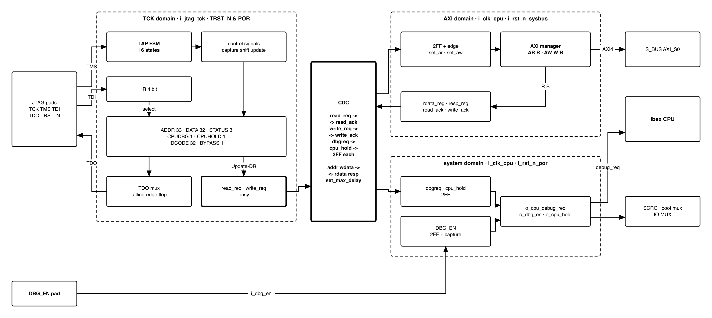
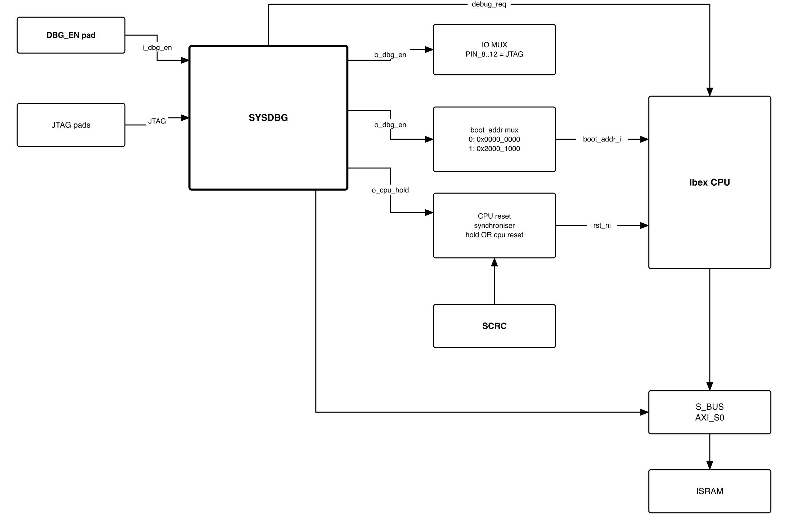
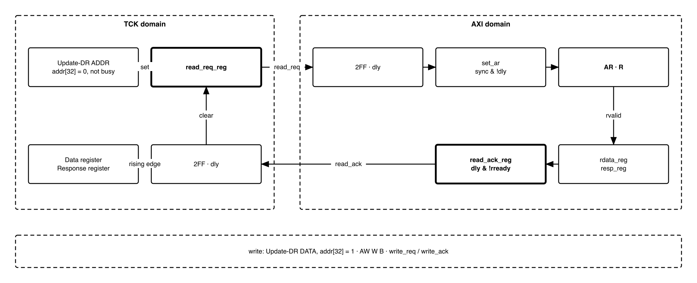

# Revision history

The reasoning behind each change, and every version before V3.0, is in
[`QNSC_SYSDBG_DECISIONS.md`](QNSC_SYSDBG_DECISIONS.md).

| Version | Date | Author | Reviewer | Description of change |
|---|---|---|---|---|
| V3.0 | 2026-09-23 | Nghia VT | -- | Rewritten after the teacher's reference design: JTAG data registers, native AXI4 manager, 4-phase handshake. Adds the `DBG_EN` pin and CPU hold |

# 1. Overview

`SYSDBG` is the QSOC debugger. A JTAG TAP takes commands from the host. An AXI4
manager on `AXI_S0` reads and writes memory. A 4-phase handshake links the two. It
also drives the Ibex `debug_req` input.

One external pin, `DBG_EN`, decides who starts the CPU after power-on:

- `DBG_EN = 0`, **normal boot**: `SCRC` releases the CPU, which runs the ROM
  bootloader. The debugger can attach later.
- `DBG_EN = 1`, **debug boot**: the CPU stays in reset until the host has loaded the
  debug window and the program into `ISRAM` over JTAG, and then released it.

`SYSDBG` does **not** reset the chip, gate a clock, or hold a debug ROM. It has no
memory-mapped registers: everything is reached through JTAG.

Block directory `design/sysdbg`, module `m_qnsc_sysdbg`, owner Nghia Van Trong.

# 2. Features

- JTAG TAP to IEEE 1149.1, 4-bit IR, seven data registers.
- AXI4 manager: one-beat, 32-bit word reads and writes to any address, **including
  while the CPU runs**. One transaction at a time.
- 4-phase request/acknowledge handshake between the TCK and AXI clock domains.
- Halt through `debug_req`, set and cleared by the host.
- Debug boot: `DBG_EN` pin; CPU held in reset until the host clears `CPUHOLD`.

# 3. Block diagram

{width=6.5in}

Three domains, as labelled in the figure: TCK (`i_jtag_tck`, reset `i_jtag_trst_n`
AND `i_rst_n_por`), AXI (`i_clk_cpu`, reset `i_rst_n_sysbus`) and system (`i_clk_cpu`,
reset `i_rst_n_por`). `i_clk_cpu` is the `cpu` cluster clock, the same clock as
`S_BUS`, and is never gated.

# 4. IP used

: Upstream IP used

| From | Module | Commit | Licence |
|---|---|---|---|
| -- | -- | -- | -- |

In house. Nothing is instantiated.

# 5. Interface

: SYSDBG interface

| Signal | Dir | Width | Description |
|---|---|---:|---|
| `i_clk_cpu` | in | 1 | System and AXI clock, 20 MHz |
| `i_rst_n_por` | in | 1 | Power-on reset only |
| `i_rst_n_sysbus` | in | 1 | `S_BUS` domain reset. Resets the AXI domain |
| `i_jtag_tck` | in | 1 | JTAG clock. Asynchronous to `i_clk_cpu`, may stop at any time |
| `i_jtag_tms`, `i_jtag_tdi` | in | 1 | Sampled on rising `TCK` |
| `i_jtag_trst_n` | in | 1 | JTAG reset |
| `o_jtag_tdo` | out | 1 | Changes on falling `TCK` |
| `o_jtag_tdo_oe` | out | 1 | 1 in Shift-IR and Shift-DR only |
| `i_dbg_en` | in | 1 | From the `DBG_EN` pad. Asynchronous, captured once -- 7.1 |
| `o_dbg_en` | out | 1 | Captured `DBG_EN`. Selects the Ibex boot address and forces the JTAG pins |
| `o_cpu_hold` | out | 1 | 1 holds the CPU in reset. From a flip-flop, reset 1. Into the `SCRC` CPU reset synchroniser |
| `o_cpu_debug_req` | out | 1 | To Ibex `debug_req_i`. Level, from a flip-flop |
| `o_bus_axi_arvalid`, `i_bus_axi_arready` | out, in | 1 | AR handshake |
| `o_bus_axi_araddr` | out | 32 | Read address, `[1:0]` = 0 |
| `i_bus_axi_rvalid`, `o_bus_axi_rready` | in, out | 1 | R handshake |
| `i_bus_axi_rdata` | in | 32 | Read data |
| `i_bus_axi_rresp` | in | 2 | Read response |
| `o_bus_axi_awvalid`, `i_bus_axi_awready` | out, in | 1 | AW handshake |
| `o_bus_axi_awaddr` | out | 32 | Write address, `[1:0]` = 0 |
| `o_bus_axi_wvalid`, `i_bus_axi_wready` | out, in | 1 | W handshake |
| `o_bus_axi_wdata` | out | 32 | Write data |
| `i_bus_axi_bvalid`, `o_bus_axi_bready` | in, out | 1 | B handshake |
| `i_bus_axi_bresp` | in | 2 | Write response |
| Other AXI4 signals | -- | -- | Constant outputs or unused inputs -- section 10 |

: SYSDBG parameters

| Parameter | Default | Meaning |
|---|---|---|
| `IdcodeValue` | `0x0515_3001` | Part `0x5153` ("QS"), manufacturer `0x000`, bit 0 = 1 |
| `AxiIdWidth` | 5 | `S_BUS` slave-port ID width |
| `SyncStages` | 2 | Flip-flops per synchroniser |

# 6. Register map

No memory-mapped registers. The registers below are JTAG data registers,
selected by the IR and shifted LSB first.

: JTAG instructions and data registers

| IR | Name | Bits | Capture-DR loads | Update-DR does | Reset |
|---|---|---:|---|---|---|
| `0100` | `ADDR` | 33 | `addr_reg` | Load `addr_reg`. If bit 32 = 0 and not busy: start a read | 0 |
| `0101` | `DATA` | 32 | `rdata_hold`, the last read data | Load `wdata_reg`. If `addr_reg[32]` = 1 and not busy: start a write | 0 |
| `0110` | `STATUS` | 3 | {`busy`, `resp[1:0]`} | Nothing | 0 |
| `0111` | `CPUDBG` | 1 | `dbgreq` | Load `dbgreq` | 0 |
| `1000` | `CPUHOLD` | 1 | `cpu_hold` | Load `cpu_hold` | 1 |
| `1110` | `IDCODE` | 32 | `IdcodeValue` | Nothing | -- |
| `1111` | `BYPASS` | 1 | 0 | Nothing | -- |
| others | as `BYPASS` | 1 | 0 | Nothing | -- |

- `addr_reg[32]` is the direction: 0 read, 1 write. `addr_reg[1:0]` are ignored.
- `resp` is the AXI response of the last completed transaction: `00` OKAY, `10`
  SLVERR, `11` DECERR.
- IR is 4 bits. Capture-IR loads `0001`. Test-Logic-Reset loads `IDCODE`.

# 7. Functional behaviour

## 7.1 Debug enable and CPU hold

The system domain synchronises `i_dbg_en` and captures it **once**, `SyncStages` + 1
cycles after `i_rst_n_por` releases.
The captured value is `o_dbg_en`. It holds until the next power-on reset. The
`cpu_hold` data register reaches the system domain through a synchroniser whose
reset value is 1.

```
captured   = 0 from i_rst_n_por, 1 once DBG_EN has been captured
o_cpu_hold = !captured | (o_dbg_en & cpu_hold_sync)      -- registered, reset 1
```

- Until the capture, `o_cpu_hold = 1`.
- **`DBG_EN = 0`:** after the capture, `o_cpu_hold = 0` permanently. `CPUHOLD` has
  no effect.
- **`DBG_EN = 1`:** `o_cpu_hold` follows `CPUHOLD`, which is 1 at reset. The host
  writes 0 to start the CPU. Writing 1 puts it back in reset, with `ISRAM` untouched.

`o_cpu_hold` holds the CPU **only**. It is not a reset source and sets no bit in
`RESET_CAUSE`.

## 7.2 Boot flows

{width=6.0in}

: Effect of `DBG_EN`

| | `DBG_EN = 0`, normal boot | `DBG_EN = 1`, debug boot |
|---|---|---|
| CPU leaves reset | When `SCRC` releases it | When `SCRC` releases it **and** `CPUHOLD = 0` |
| Ibex `boot_addr_i` | `0x0000_0000`, ROM | `0x2000_1000`, `ISRAM` |
| First instruction | `0x0000_0080`, bootloader | `0x2000_1080`, loaded image |
| JTAG pins `PIN_8`--`PIN_12` | IO MUX register, default JTAG | Forced to JTAG |

**Normal boot.** To attach, the host writes the debug window (7.8) while the CPU
runs, then halts it (7.7).

**Debug boot.** The host takes these steps, in order:

1. Power on. `SCRC` releases the bus, ROM, RAM and peripherals. The CPU stays in reset.
2. Write the debug window, `0x2000_0000`--`0x2000_0FFF` (7.8).
3. Write the program image from `0x2000_1000`.
4. Optional: `CPUDBG = 1`. The core then halts before its first instruction, with
   `dpc = 0x2000_1080`.
5. `CPUHOLD = 0`. The CPU starts.
6. Halt, resume, single-step, `ebreak` in RAM, read and write.
7. To run again: `CPUHOLD = 1`, change the image, `CPUHOLD = 0`.

To debug the ROM bootloader from its first instruction: debug boot, halt before
the first instruction (step 4), write `dpc = 0x0000_0080` with a sequence, then
single-step (`dcsr.step`) or resume. No hardware trigger is needed.

## 7.3 Reset behaviour

: What each reset does

| Event | TCK domain | AXI domain | System domain | CPU |
|---|---|---|---|---|
| Power-on | Reset | Reset | Reset | Reset, then 7.1 |
| Watchdog bite, software reset | -- | Reset. A request still held is issued again on release | -- | Per `SCRC`, then 7.1 |
| `i_jtag_trst_n` | Reset: `dbgreq` = 0, `cpu_hold` = 1 | -- | -- | Held again in debug boot |

## 7.4 Reading and writing memory

**Read** of address `A`:

1. IR = `ADDR`, DR = {0, `A`}. Update-DR starts the read.
2. IR = `STATUS`, scan until `busy` = 0. Check `resp`.
3. IR = `DATA`, scan. The captured value is the read data.

**Write** of `D` to address `A`:

1. IR = `ADDR`, DR = {1, `A`}. Nothing is issued.
2. IR = `DATA`, DR = `D`. Update-DR starts the write.
3. IR = `STATUS`, scan until `busy` = 0. Check `resp`.

**Rules:**

- While `busy` = 1, Update-DR of `ADDR` and `DATA` is **ignored**: no register
  changes and no transaction starts.
- While `addr_reg[32]` = 1, every Update-DR of `DATA` starts another write, to the
  same address.

`busy` = `read_req` OR synchronised `read_ack` OR `write_req` OR synchronised
`write_ack`, all on the TCK side.

## 7.5 AXI manager

{width=6.5in}

`set_ar` is the rising edge of the synchronised `read_req`. `set_aw` is the same for
`write_req`.

: AXI manager behaviour

| Event | Read | Write |
|---|---|---|
| `set_ar` / `set_aw` | `arvalid` = 1, `araddr` = `addr_reg`, `rready` = 1 | `awvalid` = 1, `awaddr` = `addr_reg`, `wvalid` = 1, `wdata` = `wdata_reg`, `bready` = 1 |
| Address handshake | `arvalid` = 0 | `awvalid` = 0 |
| Data handshake | `rdata_reg` = `rdata`, `resp_reg` = `rresp`, `rready` = 0 | `wvalid` = 0 |
| Response handshake | -- | `resp_reg` = `bresp`, `bready` = 0 |
| Acknowledge | `read_ack` = `read_req` delayed AND NOT `rready` | `write_ack` = `write_req` delayed AND NOT `bready` |

At most one transaction is outstanding.

## 7.6 Clock domain crossing

Each transaction is one 4-phase handshake:

1. TCK side sets `req`.
2. AXI side sees `req` rise and runs the transaction.
3. AXI side raises `ack` and holds it while `req` = 1.
4. TCK side sees `ack` rise, captures `resp_reg` into `resp` (and, for a read,
   `rdata_reg` into `rdata_hold`), then clears `req`.
5. AXI side sees `req` fall and drops `ack`.
6. TCK side sees `ack` fall and is no longer busy.

: Crossing signals and constraints

| Signal | Direction | How it crosses | Constraint |
|---|---|---|---|
| `read_req`, `write_req` | TCK to AXI | `SyncStages` flip-flops, then one delay flip-flop for the edge | `set_max_delay -datapath_only`, one `i_clk_cpu` period, to the first flip-flop |
| `read_ack`, `write_ack` | AXI to TCK | `SyncStages` flip-flops, then one delay flip-flop for the edge | the same, one `TCK` period |
| `addr_reg`, `wdata_reg` | TCK to AXI | No synchroniser. Stable from `req` rising until `ack` falls | `set_max_delay -datapath_only`, one `i_clk_cpu` period |
| `rdata_reg`, `resp_reg` | AXI to TCK | No synchroniser. Stable from `ack` rising until the next `req` | `set_max_delay -datapath_only`, one `TCK` period |
| `dbgreq`, `cpu_hold` | TCK to system | `SyncStages` flip-flops | one `i_clk_cpu` period, to the first flip-flop |

## 7.7 Halt and resume

- **Halt.** `CPUDBG = 1` drives `o_cpu_debug_req` high. Ibex saves the PC in `dpc`
  and jumps to `DmHaltAddr` = `0x2000_0800`. The window code sets `HALTED` = 1; the
  host reads it to confirm the halt.
- **Halt before starting.** `CPUDBG = 1` while the CPU is held makes the core halt
  before its first instruction.
- **Resume.** The host writes `CPUDBG = 0` **first**, then `RESUME` = 1 in the debug
  window. The loop executes `dret`. If `debug_req` were still high, the core would
  halt again at the next instruction.

## 7.8 Debug window

The first 4 KiB of `ISRAM`. **The host writes all of it through `SYSDBG`**:
- in debug boot, while the CPU is held (7.2 step 2);
- in normal boot, at any time before the first halt.

Firmware places nothing here.

: Debug window layout

| Address | Content |
|---|---|
| `0x2000_0000`--`0x2000_07FF` | Command sequences and flags (`RESUME`, `HALTED`), written and read by the host |
| `0x2000_0800` | `DmHaltAddr`: entry on every halt |
| `0x2000_0810` | `DmExceptionAddr`: entry on an exception in Debug Mode |
| `0x2000_0820`--`0x2000_0FFF` | Dispatch loop |

The exact layout and code are host software, in `_DECISIONS`, "Debug window code".

# 8. Instances

One, in `design/top`, with the default parameters.

# 9. What is not provided here, and who provides it

: Functions this block does not provide

| Function | Where it lives |
|---|---|
| Reset of the chip or of any domain | Nowhere. `o_cpu_hold` holds the CPU only |
| CPU clock control | Not needed. The `cpu` cluster is never gated |
| Byte and halfword access, bursts | Nowhere. Word only; the host does read-modify-write |
| Debug ROM, program buffer | Nowhere. The debug window in `ISRAM`, 7.8 |
| `dret`, stepping, `ebreak` | Ibex, driven by code in the debug window. No hardware triggers (`DbgTriggerEn = 0`) |

# 10. Tie-offs

: Tie-offs

| Port | Tied to | Why |
|---|---|---|
| `o_bus_axi_arlen`, `o_bus_axi_awlen` | 0 | One beat |
| `o_bus_axi_arsize`, `o_bus_axi_awsize` | `3'b010` | 4 bytes, word only |
| `o_bus_axi_arburst`, `o_bus_axi_awburst` | `2'b01`, INCR | Legal for one beat |
| `o_bus_axi_arid`, `o_bus_axi_awid` | 0 | One transaction outstanding |
| `o_bus_axi_{ar,aw}lock`, `prot`, `cache`, `qos`, `region` | 0 | No exclusive access, protection, cache hints or QoS |
| `o_bus_axi_wstrb` | `4'b1111` | Word only |
| `o_bus_axi_wlast` | 1 | One beat |
| `i_bus_axi_rid`, `i_bus_axi_rlast`, `i_bus_axi_bid` | Unused | One beat, one ID |

# 11. Requirements on others, and open items

: Requirements on other owners

| Item | Owner | What it blocks |
|---|---|---|
| `DBG_EN` on one of the three no-connect pads, pull-down on the board | Top, pad owner | Debug boot |
| `i_rst_n_por` from power-on only, not from the watchdog | `SCRC` | `DBG_EN` capture and hold surviving a watchdog bite |
| CPU reset = `SCRC` CPU reset OR `o_cpu_hold`, through the CPU reset synchroniser | `SCRC` | Debug boot |
| `boot_addr_i = o_dbg_en ? 0x2000_1000 : 0x0000_0000` | CPU owner | Debug boot running the loaded image |
| `DmHaltAddr = 0x2000_0800`, `DmExceptionAddr = 0x2000_0810`. `DmBaseAddr`/`DmAddrMask` act only with PMP, which is off | CPU owner | 7.8 |
| `fetch_enable_i` tied to `IbexMuBiOn`. The CPU is held by reset (`o_cpu_hold`), not by fetch enable | CPU owner | Debug boot; a second hold would need its own release |
| `AXI_S0` connected to `SYSDBG` directly, AXI4, ID width `AxiIdWidth`. No `axi_from_mem` | Bus owner | Every bus access |
| Remove the `0xF000_0000` `SYSDBG` register region from HAS Table 7-1 (already gone from `qsoc_contract.yml`) | HAS owner | Consistency. There are no memory-mapped registers |
| `PIN_8`--`PIN_12` forced to JTAG while `o_dbg_en = 1` | IO MUX owner | Debug boot with firmware that remaps pins |
| `ISRAM` array has no reset and no clear-on-reset | RAM owner | Image surviving a watchdog or software reset |
| Image linked at `0x2000_1000`, reset entry `0x2000_1080`; bootloader jumps to `0x2000_1080` | Firmware owner | The same image in both boot modes |

**Accepted limits:**

1. No timeout: a slave that never answers keeps `busy` = 1 until an `S_BUS` reset
   or power-on.
2. In normal boot, firmware can take the JTAG pins. Use debug boot.

# 12. Verification

1. TAP: all 16 states from every state; `IDCODE` after reset; `BYPASS` and unused
   IR codes are 1 bit; IR changes only at Update-IR; Capture-IR loads `0001`.
2. Each data register of section 6: length, capture value, update effect, reset value.
3. Read and write sequences of 7.4 against an AXI slave model with random
   `ready`/`valid` delays. Every transaction issued exactly once, with the fixed
   fields of section 10.
4. Update-DR of `ADDR` or `DATA` while busy changes nothing.
5. `SLVERR` and `DECERR` reach `STATUS.resp`.
6. AXI protocol checker on the manager port for every test.
7. CDC: `TCK` from 10x slower to 10x faster than `i_clk_cpu`, and `TCK` stopped
   mid-handshake for 10,000 cycles. CDC lint: only the signals of the crossing
   table cross.
8. `i_rst_n_sysbus` asserted during a transaction: the transaction is issued
   again after release, and completes.
9. `DBG_EN`: `o_cpu_hold` = 1 until the capture, then 0 for `DBG_EN = 0`, or
   `CPUHOLD` for `DBG_EN = 1`. Toggling the pad afterwards changes nothing.
   `o_cpu_hold` never glitches (it is a flip-flop output).
10. With Ibex, debug boot: load the window and image, `CPUDBG = 1`, `CPUHOLD = 0`.
    `HALTED` = 1 and `dpc = 0x2000_1080`. `CPUDBG = 0`, `RESUME` = 1: `HALTED` = 0
    and the core runs without halting again.
11. With Ibex, normal boot: attach while running, halt, resume.

**Acceptance:** in debug boot, load an image that toggles a GPIO, release the CPU,
halt it, read `dpc`, resume it, and see the GPIO toggle again.

# Appendix A. Acronyms

: Acronyms

| Acronym | Description |
|---|---|
| CDC | Clock Domain Crossing |
| DR, IR | JTAG Data and Instruction Register |
| `dpc` | Debug PC: where `dret` returns |
| `dret` | Instruction that leaves Debug Mode |
| POR | Power-On Reset |
| SCRC | System Clock Reset Control |
| TAP | Test Access Port, IEEE 1149.1 |

# Appendix B. First review

: First review

| Item | Reviewer | Response |
|---|---|---|
| The block diagram does not show where the FSM and the CDC are | Teacher, 2026-09-23 | Section 3 separates the three domains. 7.6 gives the handshake, its signals and its constraints |
| Too long, and the repetition causes errors | Teacher, 2026-09-23 | Rewritten as V3.0. The reasoning moved to `_DECISIONS` |
| Who loads the 4 KiB debug program, and when? | Teacher, 2026-09-23 | The host, over JTAG. In debug boot, while the CPU is held; in normal boot, before the first halt -- 7.2, 7.8 |
| The debugger must control the CPU reset, selected by an external pin | Teacher, 2026-09-23 | `DBG_EN` and `CPUHOLD` -- 7.1 |
| Reference design `VLSI_SYSDBG.drawio` | Teacher, 2026-09-23 | Used as the pattern and adapted to QSOC -- `_DECISIONS` D18 |
| CPU clock under debugger control | Teacher, 2026-09-23 | Not needed: the `cpu` cluster is never gated, and holding reset stops the CPU |
