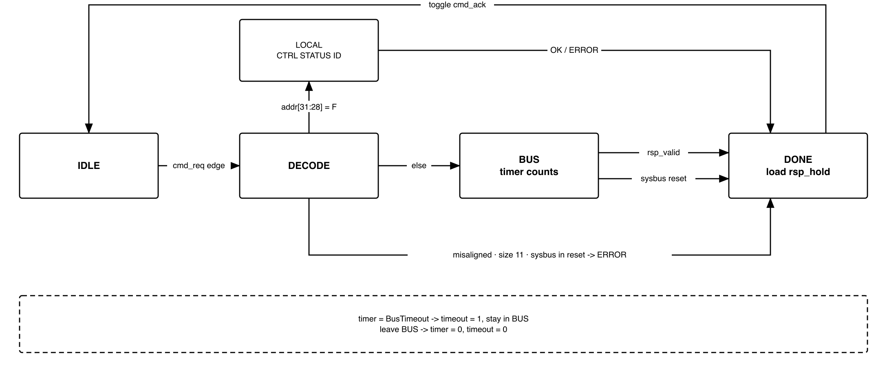

# Revision history

The reasoning behind each change, and every version before V3.0, is in
[`QNSC_SYSDBG_DECISIONS.md`](QNSC_SYSDBG_DECISIONS.md).

| Version | Date | Author | Reviewer | Description of change |
|---|---|---|---|---|
| V3.0 | 2026-09-23 | Nghia VT | -- | Rewritten. Adds the `DBG_EN` pin and CPU hold, the debug window contract, and the CDC as signals. `haltreq` now clears itself; `resumereq` removed |

# 1. Overview

`SYSDBG` is the QSOC debugger. It takes JTAG from the host, turns each JTAG command
into one bus transaction on `AXI_S0` or one access to its own registers, and drives
the Ibex `debug_req` input.

One external pin, `DBG_EN`, decides who starts the CPU after power-on:

- `DBG_EN = 0`, **normal boot**: `SCRC` releases the CPU, which runs the ROM
  bootloader. The debugger can attach later.
- `DBG_EN = 1`, **debug boot**: the CPU stays in reset until the host, over JTAG,
  has loaded the debug window and the program into `ISRAM` and released it.

`SYSDBG` does **not** reset the chip, gate a clock, or hold a debug ROM. The code
the CPU runs while halted lives in the first 4 KiB of `ISRAM`, and the host writes it.

Block directory `design/sysdbg`, module `m_qnsc_sysdbg`, owner Nghia Van Trong.

# 2. Features

- JTAG TAP to IEEE 1149.1: `IDCODE`, `BYPASS`, and one 68-bit command register, `ACCESS`.
- One scan carries one command: a byte, halfword or word read or write, anywhere in
  the memory map, **including while the CPU runs**.
- Debug boot: `DBG_EN` pin, CPU held in reset until the host clears `CTRL.cpu_hold`.
- Halt through `debug_req`. The request clears itself once the core is halted.
- CPU register access with no extra port, through a host-written debug window in `ISRAM`.

# 3. Block diagram

{width=6.5in}

Clock `i_clk_cpu`, from the `cpu` cluster, which is never gated. The system domain
is reset by power-on only. `SYSDBG` is a bus master only: it has no slave port.

# 4. IP used

: Upstream IP used

| From | Module | Commit | Licence |
|---|---|---|---|
| -- | -- | -- | -- |

In house. Nothing is instantiated. `pulp-platform/riscv-dbg` is read as a
reference only. `axi_from_mem` (`pulp-platform/axi`), which converts the bus port
to AXI4, is the bus owner's -- section 11.

# 5. Interface

: SYSDBG interface

| Signal | Dir | Width | Description |
|---|---|---:|---|
| `i_clk_cpu` | in | 1 | System clock, 20 MHz, never gated |
| `i_rst_n_por` | in | 1 | Power-on reset only. Asserted asynchronously, released synchronously to `i_clk_cpu` |
| `i_rst_n_sysbus` | in | 1 | `S_BUS` domain reset, as a level. Used only to abort a bus command -- 7.3 |
| `i_jtag_tck` | in | 1 | JTAG clock. Asynchronous to `i_clk_cpu`, may stop at any time |
| `i_jtag_tms` | in | 1 | JTAG mode select, sampled on rising `TCK` |
| `i_jtag_tdi` | in | 1 | JTAG data in, sampled on rising `TCK` |
| `i_jtag_trst_n` | in | 1 | JTAG reset. Resets the TAP and IR only |
| `o_jtag_tdo` | out | 1 | JTAG data out, changes on falling `TCK` |
| `o_jtag_tdo_oe` | out | 1 | 1 in Shift-DR and Shift-IR only |
| `i_dbg_en` | in | 1 | From the `DBG_EN` pad. Asynchronous, captured once -- 7.1 |
| `o_dbg_en` | out | 1 | Captured `DBG_EN`. Selects the Ibex boot address and forces the JTAG pins |
| `o_cpu_hold` | out | 1 | 1 holds the CPU in reset. Into the `SCRC` CPU reset synchroniser |
| `o_cpu_debug_req` | out | 1 | To Ibex `debug_req_i`. Level |
| `i_cpu_debug_mode` | in | 1 | Ibex is in Debug Mode. Same clock as `i_clk_cpu` |
| `o_mem_req` | out | 1 | Request. Held until `i_mem_gnt` |
| `o_mem_addr` | out | 32 | Byte address, aligned to the access size |
| `o_mem_we` | out | 1 | 1 write, 0 read |
| `o_mem_wdata` | out | 32 | Write data, already shifted into its byte lane |
| `o_mem_be` | out | 4 | Byte enables, from `size` and `addr[1:0]` -- 7.4 |
| `i_mem_gnt` | in | 1 | Request accepted |
| `i_mem_rsp_valid` | in | 1 | One response per granted request, read or write |
| `i_mem_rsp_rdata` | in | 32 | Read data |
| `i_mem_rsp_error` | in | 1 | Bus error (`SLVERR` or `DECERR`) |

At most one bus request is outstanding. The `o_mem_*` and `i_mem_*` names are the
`axi_from_mem` port names with the direction flipped.

: SYSDBG parameters

| Parameter | Default | Meaning |
|---|---|---|
| `IdcodeValue` | `0x0515_3001` | Part `0x5153` ("QS"), manufacturer `0x000`, bit 0 = 1 |
| `SyncStages` | 2 | Flip-flops per synchroniser |
| `BusTimeout` | 1024 | `i_clk_cpu` cycles in `BUS` before `timeout` is set |

# 6. Register map

Reached over JTAG only, at `0xF000_0000`. The registers are not on `S_BUS`, so the
CPU cannot reach them.

: SYSDBG register map

| Offset | Register | Field | Bits | Access | Reset | Description |
|---|---|---|---|---|---|---|
| `0x0` | `CTRL` | `haltreq` | 0 | RW | 0 | Drives `o_cpu_debug_req`. Hardware clears it in every cycle that `i_cpu_debug_mode = 1` |
| | | -- | 1 | RSVD | 0 | Reads 0 |
| | | `cpu_hold` | 2 | RW | 1 | Holds the CPU in reset when `o_dbg_en = 1`. No effect when `o_dbg_en = 0` |
| | | -- | 31:3 | RSVD | 0 | Reads 0 |
| `0x4` | `STATUS` | `halted` | 0 | RO | 0 | `i_cpu_debug_mode` |
| | | `dbg_en` | 1 | RO | 0 | `o_dbg_en` |
| | | `cpu_hold` | 2 | RO | 1 | `o_cpu_hold` |
| | | -- | 31:3 | RSVD | 0 | Reads 0 |
| `0x8` | `ID` | `version` | 31:0 | RO | `0x0000_0300` | Specification version, 3.0 |

- Register accesses must be word size. Any other size, or any address from
  `0xF000_000C` to `0xFFFF_FFFF`, returns `ERROR`, and no bus request is issued.
- Writes to `STATUS` and `ID` are ignored and return `OK`.

# 7. Functional behaviour

## 7.1 Debug enable and CPU hold

The system domain synchronises `i_dbg_en` through `SyncStages` flip-flops and
captures it **once**, in the first cycle after the synchroniser has filled following
the release of `i_rst_n_por`. The captured value is `o_dbg_en`. It holds until the
next power-on reset, whatever the pad does.

```
captured   = 0 from i_rst_n_por, 1 once DBG_EN has been captured
o_cpu_hold = !captured | (o_dbg_en & CTRL.cpu_hold)
```

- Until the capture, `o_cpu_hold = 1`. The CPU cannot start before the mode is known.
- **`DBG_EN = 0`:** after the capture, `o_cpu_hold = 0` permanently. `SCRC` alone
  decides when the CPU leaves reset. `CTRL.cpu_hold` has no effect.
- **`DBG_EN = 1`:** `o_cpu_hold` follows `CTRL.cpu_hold`, which is 1 at reset.
  The host starts the CPU by writing 0. Writing 1 again puts the CPU back in reset
  with `ISRAM` untouched.

`o_cpu_hold` holds the CPU **only**. It is not a reset source: it resets no other
domain and sets no bit in `RESET_CAUSE`.

## 7.2 Boot flows

{width=6.0in}

: Effect of `DBG_EN`

| | `DBG_EN = 0`, normal boot | `DBG_EN = 1`, debug boot |
|---|---|---|
| CPU leaves reset | When `SCRC` releases it | When `SCRC` releases it **and** `CTRL.cpu_hold = 0` |
| Ibex `boot_addr_i` | `0x0000_0000`, ROM | `0x2000_1000`, `ISRAM` |
| First instruction | `0x0000_0080`, bootloader | `0x2000_1080`, loaded image |
| JTAG pins `PIN_8`--`PIN_12` | IO MUX register, default JTAG | Forced to JTAG |

**Normal boot.** `SCRC` releases the domains, the CPU runs the bootloader, and the
bootloader loads the program over UART0. To attach, the host writes the debug window
(7.8) over `AXI_S0` while the CPU runs, then sets `CTRL.haltreq`.

**Debug boot.** The host takes these steps, in order:

1. Power on. `SCRC` releases the bus, ROM, RAM and peripherals. The CPU stays in reset.
2. Write the debug window, `0x2000_0000`--`0x2000_0FFF` (7.8).
3. Write the program image from `0x2000_1000`.
4. Optional: set `CTRL.haltreq`. The core then halts before its first instruction,
   with `dpc = 0x2000_1080`.
5. Write `CTRL.cpu_hold = 0`. The CPU starts.
6. Halt, resume, set breakpoints, read and write memory and registers.
7. To run again: `CTRL.cpu_hold = 1`, change the image, `CTRL.cpu_hold = 0`.

## 7.3 Reset behaviour

: What each reset does to SYSDBG

| Event | TAP, IR | Handshake, `CTRL`, `DBG_EN` capture | Command in `BUS` | CPU |
|---|---|---|---|---|
| Power-on | Reset | Reset | Lost | Reset, then 7.1 |
| Watchdog bite, software reset | -- | -- | Aborted, `ERROR` | Per `SCRC`, then 7.1 |
| `i_jtag_trst_n` or Test-Logic-Reset | Reset, IR = `IDCODE` | -- | -- | -- |

- **Handshake flip-flops.** The `TCK` side of the handshake (`cmd_req`, `cmd_hold`,
  the `cmd_ack` and `timeout` synchronisers) is reset by `i_rst_n_por` only.
- **Bus reset during a command.** While `i_rst_n_sysbus = 0`, a command in `BUS`
  drops `o_mem_req` and goes to `DONE` with `ERROR`. A new bus command goes from
  `DECODE` to `DONE` with `ERROR` and no request is issued.

## 7.4 The ACCESS register

: `ACCESS` fields

| Field | Bits | Shifted in | Shifted out |
|---|---:|---|---|
| `op` | 67:66 | `00` NOP, `01` READ, `10` WRITE, `11` NOP | 0 |
| `size` | 65:64 | `00` byte, `01` halfword, `10` word, `11` reserved | 0 |
| `addr` | 63:32 | Byte address | 0 |
| `status` | 33:32 | -- | `00` OK, `01` BUSY, `10` ERROR, `11` TIMEOUT |
| `data` | 31:0 | Write data | Read data of the previous command |

- One scan is one command. The answer shifted out belongs to the **previous**
  command, so a read takes two scans.
- `data` always uses the low bits. The block shifts write data into its lane and
  shifts read data back down. `o_mem_be` is `0001 << addr[1:0]` for a byte,
  `0011 << addr[1:0]` for a halfword, and `1111` for a word.
- A halfword at an odd address, a word at an address that is not a multiple of
  4, or `size = 11` returns `ERROR` with no request issued.

## 7.5 Command FSM

{width=6.3in}

: Command FSM states

| State | Action | Next |
|---|---|---|
| `IDLE` | Wait for a `cmd_req` edge from the CDC | `DECODE` |
| `DECODE` | Check the command against 7.4 and 7.3 | `LOCAL` if `addr[31:28] = 0xF`; `DONE` with `ERROR` if rejected; else `BUS` |
| `LOCAL` | Read or write a register of section 6, one cycle | `DONE` |
| `BUS` | Hold `o_mem_req` until `i_mem_gnt`, then wait for `i_mem_rsp_valid`. Count cycles | `DONE` |
| `DONE` | Load `rsp_hold` = {`status`, `rdata`}, then toggle `cmd_ack` one cycle later | `IDLE` |

- **In `BUS`:**
  - When the counter reaches `BusTimeout`, `timeout` goes to 1 and the FSM **stays
    in `BUS`**. A granted request cannot be cancelled, so leaving early would pair
    its late response with the next command.
  - A response that arrives after the timeout ends the command with `ERROR`.
  - `i_mem_rsp_error = 1` gives `ERROR`.
- **On leaving `BUS`:** the counter and `timeout` return to 0.

## 7.6 Clock domain crossing

Three single-bit signals cross, each through `SyncStages` flip-flops. Nothing else
is sampled across the boundary.

: Crossing signals

| Signal | From, to | Kind | Meaning |
|---|---|---|---|
| `cmd_req` | `TCK` to system | Toggle | A new command is in `cmd_hold` |
| `cmd_ack` | system to `TCK` | Toggle | The command is done; `rsp_hold` is valid |
| `timeout` | system to `TCK` | Level | The current bus command has passed `BusTimeout` |

`cmd_hold` (68 bits) and `rsp_hold` (34 bits) are read across the boundary
**without** a synchroniser. The handshake keeps each one stable whenever the other
side reads it:

1. **Update-DR**, with `op` not NOP and the `TCK` side not busy: load `cmd_hold`
   from `ACCESS` and toggle `cmd_req`.
2. The system side sees the synchronised `cmd_req` change and reads `cmd_hold`.
   `cmd_hold` does not change until `cmd_ack` is seen.
3. **`DONE`:** load `rsp_hold`, then toggle `cmd_ack`. `rsp_hold` does not change
   until the next command.
4. The `TCK` side is **busy** while `cmd_req` differs from the synchronised
   `cmd_ack`. **Update-DR while busy drops the command.** That scan has already
   shifted out `BUSY`.
5. **Capture-DR:** if not busy, load `rsp_hold` into `ACCESS`. If busy, load
   `status` = `TIMEOUT` when the synchronised `timeout` is 1, otherwise `BUSY`,
   with `data` = 0.

Toggles are levels, so the handshake works for any clock ratio and survives `TCK`
stopping at any point. The `TCK` side only learns `cmd_ack` on `TCK` edges, so a
host that polls must keep `TCK` running.

The two clocks are declared asynchronous:

```tcl
set_clock_groups -asynchronous -group [get_clocks tck] -group [get_clocks clk_cpu]
```

`cmd_hold` and `rsp_hold` are stable for at least `SyncStages` cycles of the
reading clock before they are read. Their routing delay across the boundary must
therefore stay below one `i_clk_cpu` period. Check this in the timing report.

## 7.7 Halt and resume

- **Halt.** `o_cpu_debug_req = CTRL.haltreq`. The host writes 1. Ibex enters Debug
  Mode, saves the PC in `dpc`, and jumps to `DmHaltAddr` = `0x2000_0800`.
  `i_cpu_debug_mode` rises, and the hardware clears `haltreq` in that cycle.
  `STATUS.halted` = 1.
- **Halt before starting.** If `haltreq` is 1 while the CPU is in reset, it stays 1.
  The core halts before executing its first instruction.
- **Resume.** The host writes `RESUME` = 1 in the debug window (7.8). The dispatch
  loop clears it and executes `dret`. `haltreq` is already 0, so the core does not
  halt again. No `SYSDBG` register is written.

## 7.8 Debug window

The first 4 KiB of `ISRAM`. **The host writes all of it through `AXI_S0`**:
- in debug boot, while the CPU is held (7.2 step 2);
- in normal boot, at any time before the first halt.

Firmware places nothing here.

: Debug window layout

| Address | Name | Content |
|---|---|---|
| `0x2000_0000`--`0x2000_06FF` | `SEQ` | The sequence for the current command, written by the host |
| `0x2000_0700` | `DATA` | Word passed in either direction |
| `0x2000_0704` | `EXC` | Set to 1 when a sequence traps |
| `0x2000_0708` | `CMD` | Host writes 1 to run `SEQ`; the core writes 0 when done |
| `0x2000_070C` | `RESUME` | Host writes 1 to leave Debug Mode; the core writes 0 |
| `0x2000_0800` | `ENTRY` | `DmHaltAddr`. Entered on every halt |
| `0x2000_0810` | `TRAP` | `DmExceptionAddr`. Entered on an exception in Debug Mode |
| `0x2000_0820` | `LOOP` | Dispatch loop |
| `0x2000_0840`--`0x2000_0FFF` | -- | Unused |

The code at `ENTRY`, `TRAP` and `LOOP`, the sequence rules, and the host protocol
are host software. They are in `_DECISIONS`, "Debug window code".

# 8. Instances

One, in `design/top`, with the default parameters.

# 9. What is not provided here, and who provides it

: Functions this block does not provide

| Function | Where it lives |
|---|---|
| Reset of the chip or of any domain | Nowhere. `o_cpu_hold` holds the CPU only |
| CPU clock control | Not needed. The `cpu` cluster is never gated |
| Debug ROM, program buffer | Nowhere. The debug window in `ISRAM`, 7.8 |
| `dret`, stepping, breakpoints | Ibex, driven by code in the debug window |

# 10. Tie-offs

: Tie-offs

| Port | Tied to | Why |
|---|---|---|
| -- | -- | None. Every port is connected |

# 11. Requirements on others, and open items

: Requirements on other owners

| Item | Owner | What it blocks |
|---|---|---|
| `DBG_EN` on one of the three no-connect pads, pull-down on the board | Top, pad owner | Debug boot |
| `i_rst_n_por` from power-on only, not from the watchdog | `SCRC` | Session and `CTRL.cpu_hold` surviving a watchdog bite |
| CPU reset = `SCRC` CPU reset OR `o_cpu_hold`, through the CPU reset synchroniser | `SCRC` | Debug boot. An OR after the synchroniser can glitch |
| `i_rst_n_sysbus` provided | `SCRC` | Abort of 7.3 |
| `boot_addr_i = o_dbg_en ? 0x2000_1000 : 0x0000_0000` | CPU owner | Debug boot running the loaded image |
| Export Ibex `debug_mode` as `i_cpu_debug_mode` | CPU owner | `haltreq` clearing, `STATUS.halted` |
| `DmHaltAddr = 0x2000_0800`, `DmExceptionAddr = 0x2000_0810`, window `0x2000_0000` / 4 KiB | CPU owner | 7.8 |
| `fetch_enable_i` asserted whenever the CPU reset is released, in both modes | CPU owner, `SCRC` | Open. Proposed: tie on |
| `axi_from_mem` at `AXI_S0`, `MaxRequests = 1`; `0xF000_0000` region unmapped, `DECERR` | Bus owner | Every bus access |
| `PIN_8`--`PIN_12` forced to JTAG while `o_dbg_en = 1` | IO MUX owner | Debug boot with firmware that remaps pins |
| `ISRAM` array has no reset and no clear-on-reset | RAM owner | Image surviving a watchdog or software reset |
| Image linked at `0x2000_1000` with its reset entry at `0x2000_1080`; bootloader jumps to `0x2000_1080` | Firmware owner | The same image in both boot modes |

**Accepted limits:**

1. In normal boot, firmware can take the JTAG pins, and the host cannot recover
   them. Use debug boot.
2. The watchdog keeps counting while the core is halted. Leave it disabled when
   debugging.
3. A slave that never answers keeps the FSM in `BUS` until a bus reset or power-on.
4. Stock OpenOCD cannot drive the `ACCESS` register. The host software is in house.

# 12. Verification

1. TAP: all 16 states from every state; `IDCODE` after reset; `BYPASS` 1 bit; IR
   changes only at Update-IR; `i_jtag_trst_n` mid-command does not lose the command.
2. `DBG_EN`: `o_cpu_hold` = 1 until the capture; then 0 for `DBG_EN = 0`, or
   `CTRL.cpu_hold` for `DBG_EN = 1`; toggling the pad afterwards changes nothing.
3. Register map: reset values and access types of section 6; non-word access and
   `0xF000_000C` return `ERROR` with no `o_mem_req`.
4. `haltreq` drives `o_cpu_debug_req` and clears in the cycle `i_cpu_debug_mode` = 1.
5. Every size and offset, read and write: `o_mem_be`, lane placement, read-back;
   misaligned and `size = 11` return `ERROR` with no request.
6. Bus port SVA: `o_mem_req` held until `i_mem_gnt`; one request outstanding;
   `o_mem_be` never 0 on a write. `i_mem_rsp_error` gives `ERROR`.
7. Late slave: `TIMEOUT` while waiting, `ERROR` at the end, next command correct.
   `i_rst_n_sysbus` low in `BUS`: request drops, `ERROR`, next command correct.
8. CDC: unrelated clocks, `TCK` 10x slower to 10x faster, `TCK` stopped 10,000
   cycles after Update-DR; every command executes exactly once. CDC lint: only
   `cmd_hold`, `rsp_hold` and the three synchronisers cross.
9. With Ibex, debug boot: load, `haltreq`, `cpu_hold = 0`; halts with `dpc =
   0x2000_1080`; resumes through `RESUME` without halting again. Normal boot:
   attach while running, halt, resume.

**Acceptance:** in debug boot, load an image that toggles a GPIO, release the CPU,
halt it, read `dpc`, resume it, and see the GPIO toggle again.

# Appendix A. Acronyms

: Acronyms

| Acronym | Description |
|---|---|
| CDC | Clock Domain Crossing |
| `dpc` | Debug PC: where `dret` returns |
| `dret` | Instruction that leaves Debug Mode |
| `dscratch0`, `dscratch1` | Ibex debug scratch CSRs, `0x7b2`, `0x7b3` |
| IR, DR | JTAG Instruction and Data Register |
| POR | Power-On Reset |
| SCRC | System Clock Reset Control |
| TAP | Test Access Port, IEEE 1149.1 |

# Appendix B. First review

: First review

| Item | Reviewer | Response |
|---|---|---|
| The block diagram does not show where the FSM and the CDC are | Teacher, 2026-09-23 | Section 3 shows both domains and the three crossing signals. 7.5 gives the FSM, 7.6 the crossing rules |
| Too long, and the repetition causes errors | Teacher, 2026-09-23 | Rewritten as V3.0. The reasoning moved to `_DECISIONS` |
| Who loads the 4 KiB debug program, and when? | Teacher, 2026-09-23 | The host, over JTAG. In debug boot, while the CPU is held; in normal boot, before the first halt -- 7.2, 7.8 |
| The debugger must control the CPU reset, selected by an external pin | Teacher, 2026-09-23 | `DBG_EN` and `CTRL.cpu_hold` -- 7.1. CPU clock control is not added: the `cpu` cluster is never gated |
