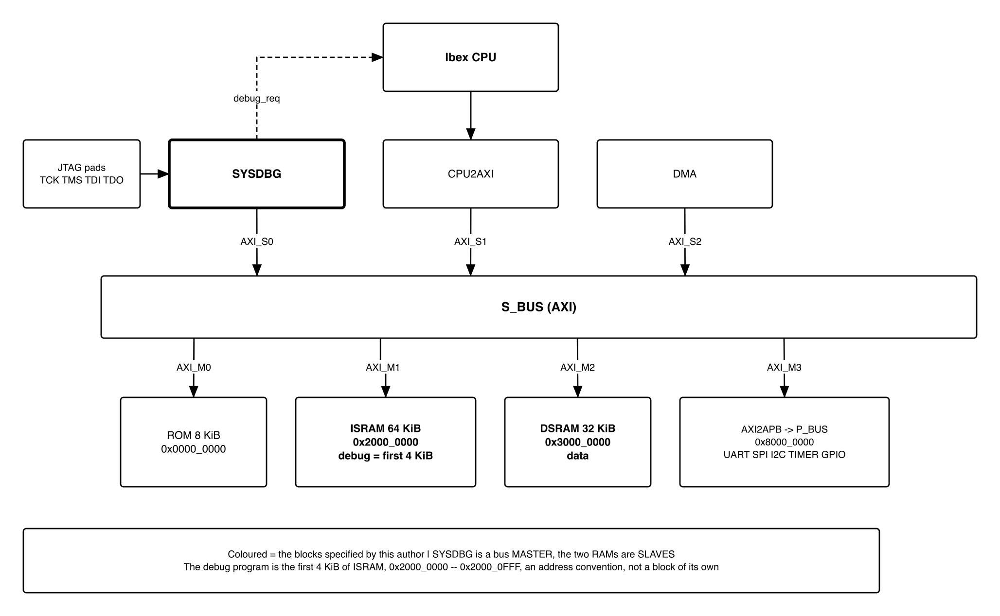
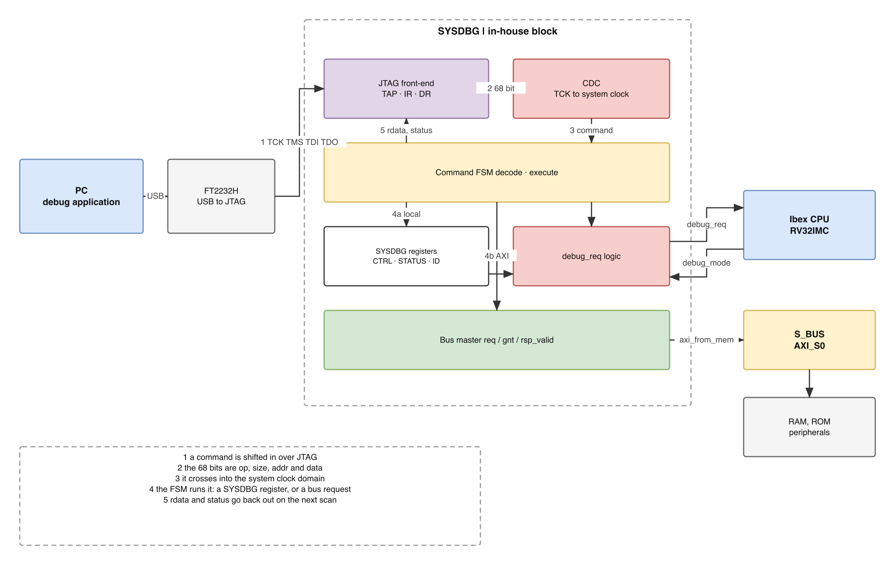
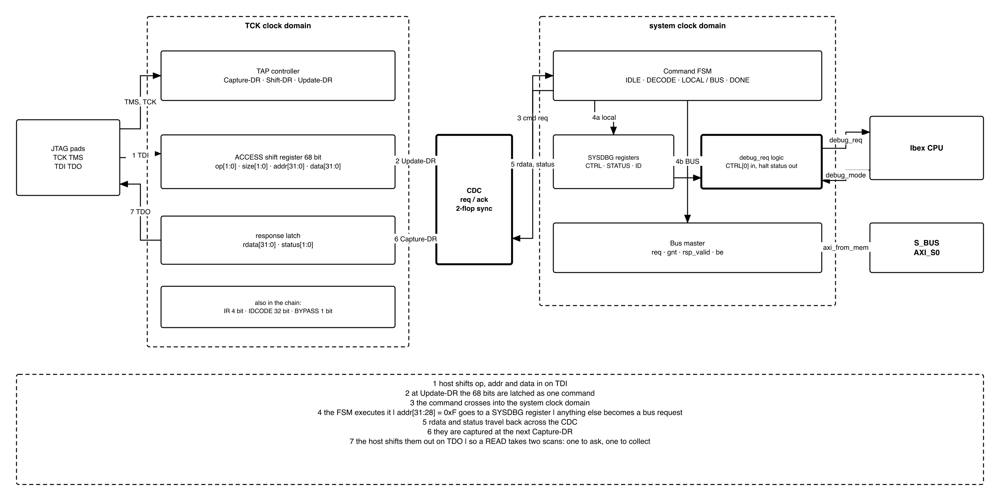
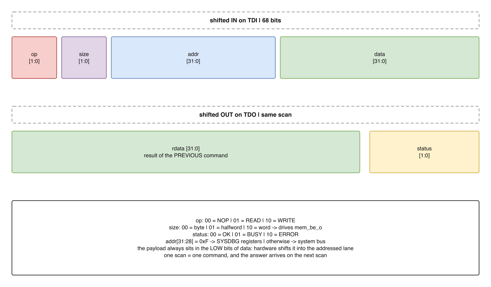
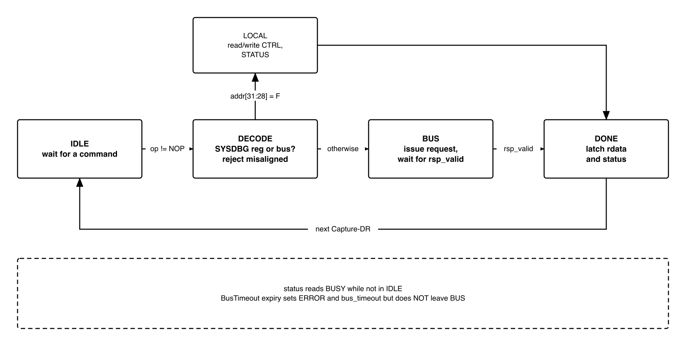
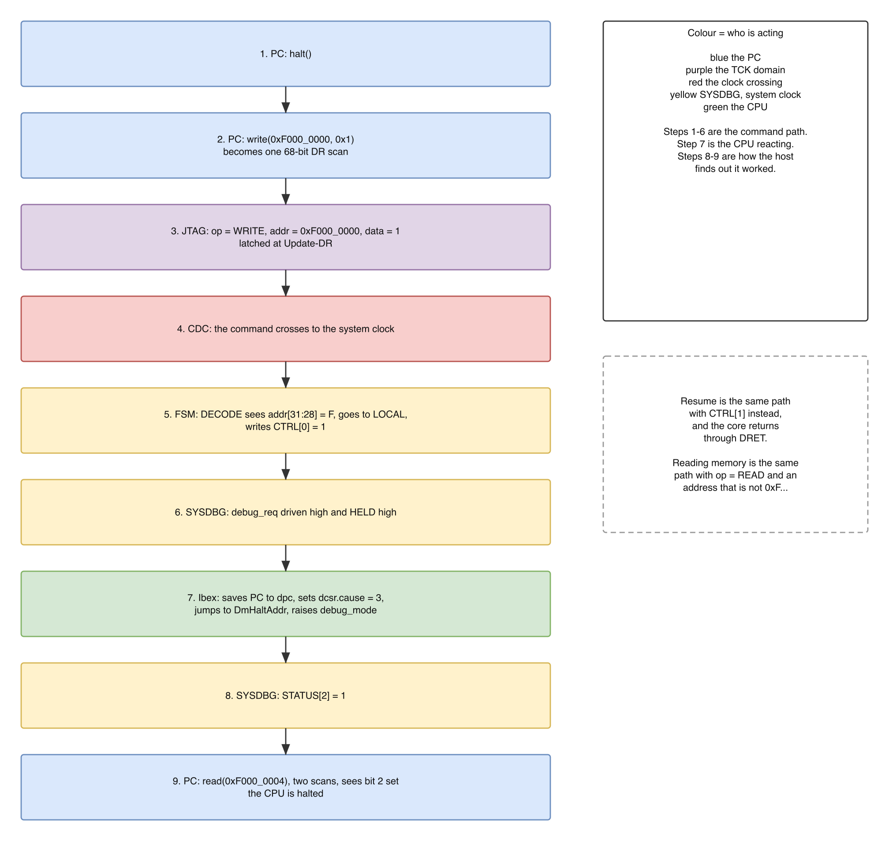
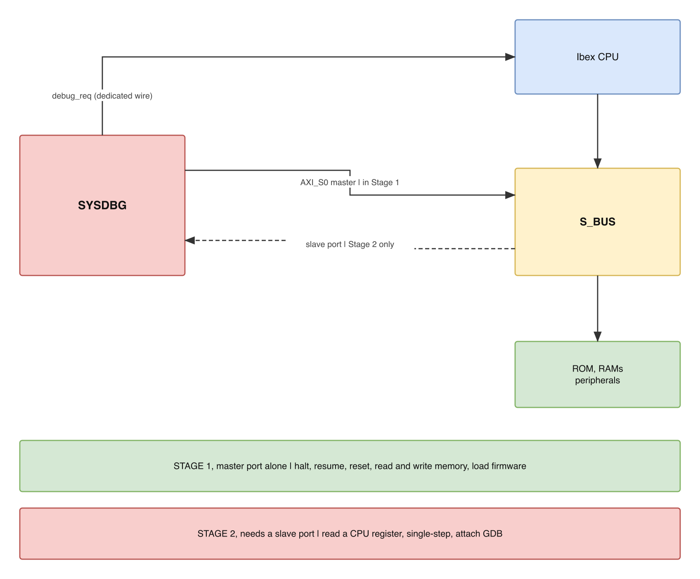
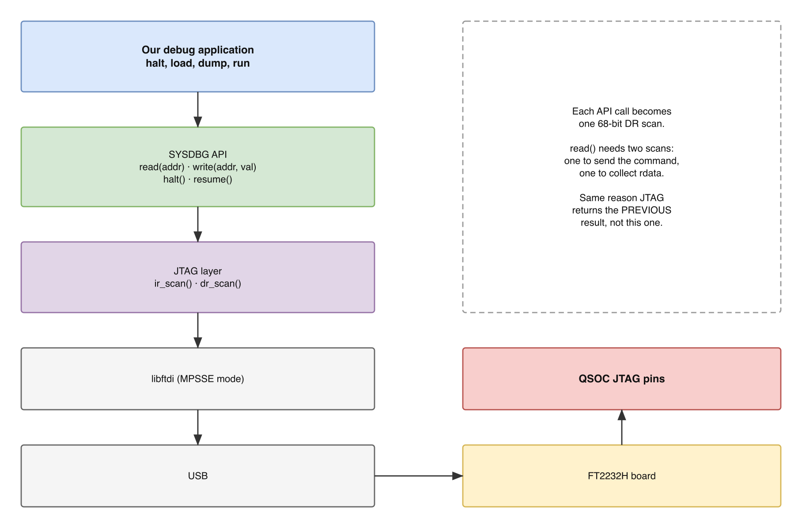

# Reversion and History

| Version | Date       | Author/Owner | Description of Change |
|---------|------------|--------------|-----------------------|
| V1.0    | 2026-09-16 | Nghia VT     | First issue as a standalone document. Supersedes the Debugger half of `QNSC_RAM_Debugger_MAS` V1.2. Content is unchanged from that issue: `SYSDBG` is an in-house block converting JTAG to AXI and controlling the CPU's `debug_req`, with `riscv-dbg` used as reference material only. |
| V1.1    | 2026-09-17 | Nghia VT     | Follows the instructor's ruling of 2026-09-17: the debug program lives inside `ISRAM` rather than on a dedicated slave port, so no port is added to `S_BUS` for it and none to this block in either stage. Table 11 gains the debug memory window and the four `Dm*` values derived from it; Table 12 restated so the two stages differ in software and memory contents, not in ports. All four `Dm*` values are unchanged from V1.0. |
| V1.2    | 2026-09-17 | Nghia VT     | Follows the agreed memory map: the debug window moves to `0x2000_0000` -- `0x2000_0FFF` and all four `Dm*` values follow (Table 11), which also now reserves a 256 B debug data scratch for Stage 2. **Stage 2 confirmed in scope**; section 4.12 restated, and section 5.2 rewritten around the questions that only arise once it is. Two Stage 2 dependencies resolved by reading the core rather than by request: `dscratch0`/`dscratch1` are unconditional in `ibex_cs_registers.sv`, and Ibex forces its instruction cache off in Debug Mode. Table of Tables rebuilt -- the V1.1 list was misnumbered from Table 11 onward. |
| V1.3    | 2026-09-18 | Nghia VT     | **Aligned with `QSOC_HAS`, which had already answered two of this document's open questions.** Nothing in the design changes; two questions close and one rationale is added. **The AXI4-Lite to AXI4 conversion at `AXI_S0` is settled and mandatory**: the HAS lists it in Table 5-5 among the project's required protocol conversions, because `S_BUS` is AXI4 full while this block is an AXI4-Lite master, so a direct connection fails at elaboration. The adapter named is now **`axi_lite_to_axi` from `pulp-platform/axi`** -- the library already chosen for `S_BUS` -- in place of the third-party `axi_axil_adapter` V1.2 suggested. Section 4.1 also now answers *why* AXI4-Lite was chosen at all, since the adapter makes it a fair question: this block moves one word per JTAG scan and never bursts, so full AXI4 would mean writing and verifying burst length, size and type, IDs with response ordering, `WLAST` alignment and the 4 KiB boundary rule -- all dead logic in the one block that must be trustworthy when nothing else is. The adapter costs nothing: it is **pure combinational wiring with no flip-flops**, so no latency and no area. **Hardware triggers are confirmed**: `DbgTriggerEn = 1'b1` with `DbgHwBreakNum = 1`, which the HAS specifies for read-only memory where a software breakpoint cannot be written. That answer is now *stronger* than V1.2's reasoning, because the corrected boot flow (`QNSC_RAM_MAS` V1.3) puts a real serial bootloader in ROM -- frame parsing, CRC32, a copy loop -- and it is the program most likely to need a breakpoint during bring-up, since nothing else runs until it works. Halt-on-reset remains open; the HAS records it as TBD for the same reset-ordering reason given here. |
| V1.4    | 2026-09-18 | Nghia VT     | **Bus master changed from AXI4-Lite to a memory-style `req`/`gnt`/`rsp_valid` port with byte enables**, section 4.1, after reading the System Bus Access port of `pulp-platform/riscv-dbg` and finding that neither it nor OpenTitan's `rv_dm` emits AXI, and that `axi_from_mem` contains the same `axi_lite_to_axi` this document already cited -- so the AXI4-Lite layer is not avoided, only moved out of this block's state machine. **Two defects fixed at the same time.** The timeout abandoned a granted request, which on a bus with no cancel would deliver its response to the *next* command as a silent wrong answer; it now reports and drains, section 4.8, with `STATUS.bus_timeout` added. And the `ACCESS` register claimed byte writes while carrying no way to express them; a 2-bit `size` field is added, 66 to 68 bits, with lane alignment done in hardware and misaligned access rejected before any request is issued |
| V1.5    | 2026-09-18 | Nghia VT     | **Cross-checked against `QSOC_HAS` EN v1.1 and signed off the two items that document marks as pending this author.** Halt-on-reset is accepted as mandatory and open question 2 closes, the deciding reason being that the ROM holds a real bootloader rather than a spin loop. The `D15` clock gate rule is confirmed and, more importantly, **the gap it exposed in this document is filled**: section 4.2 had never said anything about clock gating, and gating `clk_i` while the TAP keeps running on `tck_i` is a silent way to disable the debugger, so the gate must be open out of reset and not closable by software |
| V1.6    | 2026-09-18 | Nghia VT     | **Stage 2 is committed and specified here rather than deferred**, so both stages are now complete in this document. Section 4.12 adds the mechanism: a dispatch loop at `DmHaltAddr` polling a command word, instruction sequences written into the window through the master port that already exists, results published before the command word is cleared, and returns by jump rather than `ebreak` so that the first sequence needs nothing configured. Verified from Ibex RTL that **`dscratch0` and `dscratch1` exist**, which is what lets a sequence read a register without destroying it. Table 11 now fixes one window layout for both stages. **Two open questions close**: the debug window is enforced by a PMP region, which `QSOC_HAS` settles, and `SYSDBG` writes the dispatch loop itself |
| V1.7    | 2026-09-18 | Nghia VT     | **The two-stage framing is removed.** Both stages were committed, so the staging had become scaffolding that made a single design read as two. Everything is now one feature set: section 4.12 is *Reading a CPU register* rather than *Staged scope*, and Table 12 lists capability against "does it need an extra port" -- where every row reads **no**, which is the architectural point the staging used to carry. The technical content is unchanged; 26 places stopped saying Stage 1 or Stage 2 |
| V1.8    | 2026-09-19 | Nghia VT     | **A defect in the resume path is fixed.** Section 4.7 claimed that writing `resumereq` released the core; it does not. Reading `ibex_controller.sv` shows `debug_mode_d` is cleared in **exactly one place**, the `dret` branch, so a core in Debug Mode stays there until it executes `dret` -- and since the halted core is running the dispatch loop, nothing in the previous revision ever told that loop to do so. As written, resume could never have happened. A **resume flag** is added to the window at `0x2000_0F0C`, the dispatch loop now polls it as well as the command word, and section 4.12 specifies the **order** of the two host writes with the reason: setting the flag while `debug_req_o` is still high makes the core `dret` and then halt again at the next instruction boundary, which from the host looks like resume being ignored |
| V1.9    | 2026-09-21 | Nghia VT     | **`ndmreset` removed.** The Day005 review of 2026-09-18 fixed the chip's reset sources at three -- POR, watchdog, software -- and **removed debug reset explicitly**; SCRC confirms two global sources and three reset causes with no `DEBUG`. `CTRL[2]`, the `ndmreset_o` port and the fan-out exclusion are all gone, and section 4.2 now **publishes the cost**: with the core wedged, recovery falls to the watchdog or to power cycling. `CTRL[2]` is left **reserved rather than reassigned** so an older host cannot silently trigger a different function. Also renames the clock and reset owner from `SYSCTL` to **SCRC**, since `SYSCTL` and `SYSCSR` are now register files inside it. |
| V1.10   | 2026-09-21 | Nghia VT     | ROM range corrected to `0x0000_0000` -- `0x0000_07FF`, **2 KiB**, following the Day005 review of 2026-09-18 and the ROM owner's own specification. Earlier revisions carried 8 KiB from `QSOC_HAS`. Only the read-only-memory argument of section 4.11 depends on the range, and it is unchanged: a smaller ROM is still ROM. |
| V1.11   | 2026-09-21 | Nghia VT     | **JTAG pads confirmed, and a second silent way to lose the debugger recorded.** The team's `IOPAD_Pin_Summary` of 2026-09-20 gives all five JTAG signals pads on `PIN_8`--`PIN_12` with **b00 as the reset default** and carries `tdo_oe_o`, so the pad row of section 5.1 is closed. But all five share their pads with `GPIO0[7:3]` through a firmware-writable IO MUX, so **one register write disconnects the debug adapter** -- the same silent failure as gating the debug clock, and now unrecoverable without power cycling because section 4.2 removed the debug reset. New section 4.3.1 states the hazard and asks for one of three rules, the weakest of which costs nothing. |
| V1.12   | 2026-09-21 | Nghia VT     | **Four open questions closed now that QSOC is confirmed a training device with no external acceptance criterion.** Host-side debug: the custom 68-bit `ACCESS` register stands and the in-house host software is the deliverable; **stock OpenOCD cannot drive this block** and that is now recorded as a consequence, together with the GDB stub as optional work and the exact sections that would change if the criterion ever appeared. Production debug lockout closed as not applicable. Peripherals **keep running** while halted -- gating them would cost every other owner a gate -- with the **watchdog named as the one exception** the watchdog owner must resolve. `IDCODE`: a shape is proposed and `riscv-dbg`'s own default is **explicitly not reused**, since this is a self-designed module. |
| V1.13   | 2026-09-21 | Nghia VT     | **Two integration rows closed against the bus owner's specification.** The system bus is `axi_xbar`, **fully connected** -- every slave port reaches every master port through one shared address map -- so the bus master on `AXI_S0` reaches `ROM` on `AXI_M0`, which answers the ROM-readback item the ROM owner's document raised as unconfirmed. And each slave port has a private decode-error slave returning `32'hBADCAB1E`, so an out-of-map access is **reported rather than hung** -- the behaviour `STATUS[1]` and the bus timeout of section 4.8 already assumed but could not cite. |
| V1.14   | 2026-09-21 | Nghia VT     | **The last two items that did not need anyone else are closed by deciding.** The linker boundary was never a question: `QNSC_RAM_MAS` reserves the first 4 KiB of `ISRAM`, so `0x2000_1000` is a **consequence**, and it moves to the integration checklist as a firmware obligation. `IDCODE` is **decided as `0x0515_3001`** -- part number `0x5153` reading hex-ASCII \"QS\", version as the silicon revision, manufacturer honestly `0x000` since QSOC has no JEDEC ID, and bit 0 set as the standard requires. `riscv-dbg`'s default is explicitly not borrowed. |

# Table of Tables

| Table | Title |
|-------|-------|
| Table 1 | Sourcing decision |
| Table 2 | SYSDBG sub-blocks |
| Table 3 | SYSDBG clock and reset domains |
| Table 4 | SYSDBG port list |
| Table 5 | SYSDBG parameters |
| Table 6 | JTAG instruction registers |
| Table 7 | ACCESS data register fields |
| Table 8 | SYSDBG register map |
| Table 9 | Command FSM states |
| Table 10 | Core debug CSRs and parameters required from the CPU |
| Table 11 | Debug memory window, and the CPU parameters derived from it |
| Table 12 | What each part of the block delivers |
| Table 13 | Host software deliverables |
| Table 14 | SYSDBG verification plan |
| Table 15 | Interfaces to agree with the team |
| Table 16 | Acronyms |

# Table of Figures

| Figure | Title |
|--------|-------|
| Figure 1 | Where the debugger sits in QSOC |
| Figure 2 | The SYSDBG block |
| Figure 3 | Internal structure, and the two clock domains |
| Figure 4 | The ACCESS register, bit by bit |
| Figure 5 | Command FSM |
| Figure 6 | Halting the CPU, end to end |
| Figure 7 | What one bus port can and cannot reach |
| Figure 8 | Host software stack |

---

# 1. Overview

## 1.1 Scope

This document specifies **`SYSDBG`**, the debugger of **QSOC**, the MCU built in
this training project. In the QSOC block diagram it is a master on `AXI_S0`.

The RAM is the author's second block and is specified separately in
`QNSC_RAM_MAS`. The two are described apart because they are different kinds of
work, and the difference is the point of this document: the RAM is an
**integration** of an existing IP, while `SYSDBG` is **designed in house**.

**Table 1 -- Sourcing decision**

| Item | Source | Why |
|---|---|---|
| `SYSDBG` | **Designed in house.** [`pulp-platform/riscv-dbg`](https://github.com/pulp-platform/riscv-dbg) is read as a **reference**, not instantiated. | The block is specified as a custom design: JTAG to AXI, plus control of the CPU's `debug_req`. `riscv-dbg` shows what a spec-compliant debug module must do and supplies the address constants the CPU needs, but its full feature set -- abstract commands, a program buffer, system bus access, a spec-compliant DMI -- is far larger than QSOC requires, and building none of it would leave nothing to design. |
| Host software | **Written in house** -- section 4.13 | A debugger cannot be demonstrated without the program that drives it. |

Nothing is reused. The RISC-V Debug Specification 0.13 and the `riscv-dbg` RTL
are reference material: read to learn what a debug module must be able to do, and
to take the address constants that the Ibex integration must declare.

## 1.2 Position in the system

{width=6.4in}

Three blocks issue transactions on `S_BUS`: `CPU2AXI` on `AXI_S1`, `SYSDBG` on
`AXI_S0`, and `DMA` on `AXI_S2`. Three memories answer them: `ROM` on `AXI_M0`,
`ISRAM` on `AXI_M1` and `DSRAM` on `AXI_M2`. Peripherals sit behind the
`AXI2APB` bridge on `AXI_M3`.

Three consequences for this specification:

1. `SYSDBG` is a **bus master**. It reads and writes memory and peripherals
   without the CPU being involved -- which is how firmware is loaded, and which
   also makes this block security-relevant (section 5.2).
2. It has **one bus port, and it is a master.** Nothing in this
   specification gives `SYSDBG` a slave port. Register access adds content in
   the debug memory and software on the host, not a new port -- section 4.12.
3. **The CPU is not reachable over the bus at all.** Ibex has only master
   interfaces (`instr_*` and `data_*` are all requests going out), so no master
   can address it. `SYSDBG` and the CPU are both masters, and two masters cannot
   talk to each other -- they can only share a slave. That is why reading a CPU
   register means making the CPU write the value into memory itself, and why
   section 4.11 asks for a memory the CPU can fetch from.

`SYSDBG` also carries a connection that belongs to no bus at all: a dedicated
wire, `debug_req`, into the CPU, and a status wire, `debug_mode`, coming back.

# 2. Feature

## 2.1 Feature -- `SYSDBG`

`SYSDBG` is an in-house block. Its purpose, stated minimally: terminate a JTAG
connection from the PC, turn the commands arriving on it into bus transactions on
`AXI_S0`, drive the CPU's `debug_req` input, and report status back.

**Features:**

- **JTAG Test Access Port** to IEEE 1149.1, with `IDCODE`, `BYPASS` and one
  command register.
- A **single 68-bit command register**, so one JTAG scan is one read or write.
- **Run control**: halt, resume and non-debug-module reset of the Ibex hart,
  through `debug_req` and a status input.
- **Memory-style bus master** on `AXI_S0`: read and write any address in the
  system memory map, including while the CPU is running.
- **CPU register access**: read a GPR or a CSR by having the halted core execute a
  short instruction sequence, section 4.12. This needs **no additional port**.
- **Host software** on the PC over USB, section 4.13.

**Why a memory interface and not AXI, given that `S_BUS` is full AXI4 and an
adapter is therefore mandatory.** This block moves **one word per JTAG scan** and
never bursts, section 4.6. Driving full AXI4 would mean generating *and verifying*
burst length, size and type, transaction IDs with response ordering, `WLAST`
alignment with `AWLEN`, and the rule that a burst may not cross a 4 KiB boundary.
AXI4-Lite removes the bursts but still requires **three independent channel
handshakes for a write** -- `AW`, `W`, then `B` -- and a compliant master may not
assume an order between `AW` and `W`, so the state machine has to tolerate either.
All of that is machinery this block never exploits, in the one block whose whole
purpose is to be trusted when nothing else is.

A `req`/`gnt`/`rsp_valid` port with byte enables is the exact shape of the work:
one address, one direction, one word, one error bit back, and **the same sequence
for a read as for a write**. The adapter is `axi_from_mem` from
`pulp-platform/axi`, and the point that settles the choice is what that module is
made of -- `axi_lite_from_mem` followed by `axi_lite_to_axi`. **The AXI4-Lite layer
still exists either way.** The only question was whether this block's own state
machine generates it or a verified library module does, and there is no reason to
prefer the hand-written one.

**The reference implementations agree.** The System Bus Access port of
`pulp-platform/riscv-dbg`, the module this document reads as its reference in
Table 1, is exactly this interface: `master_req_o`, `master_add_o`, `master_we_o`,
`master_wdata_o`, `master_be_o`, `master_gnt_i`, `master_r_valid_i`,
`master_r_err_i`, `master_r_rdata_i`. That project also ships an OBI wrapper,
which is another request/response protocol, and **no AXI wrapper at all**.
OpenTitan's `rv_dm` uses TL-UL for the same port. Neither reference debug module
emits AXI, and the reason is the one above. `QSOC_HAS` Table 5-5 records the
conversion at `AXI_S0` as mandatory and describes this block's master as a
handshake interface of the same kind as the CPU's memory port, section 5.1.

**Two things a standard debug module has are deliberately not built**: an
**abstract command** engine and a **Program Buffer**. Both live inside the debug
module and require the core to fetch from it, which is what forces a slave port onto
the debug block. QSOC puts the same instructions in `ISRAM` instead -- the core
fetches from a slave that already exists, and `SYSDBG` writes them through the master
port it already has. The function is the same; the port is not needed, and **no
`Dm*` parameter moves** because the window does not move.

# 3. Block Diagram

{width=6.4in}

# 4. Micro-architecture Details

## 4.1 Structure

`SYSDBG` splits into two clock domains, described in section 4.2. The boundary
between them is the part of the design most likely to be got wrong.

{width=6.5in}

Figure 3 is the same design as Table 2, drawn as a loop: a command travels left to
right along the top, the answer returns right to left along the bottom. The
numbered steps are walked through in section 4.9.

**Table 2 -- SYSDBG sub-blocks**

| Domain | Sub-block | Role |
|---|---|---|
| `TCK` | TAP controller | The IEEE 1149.1 state machine, driven by `TMS` |
| `TCK` | IR, 4 bit | Selects which data register is in the scan chain |
| `TCK` | `IDCODE`, 32 bit | Identifies QSOC to the host |
| `TCK` | `BYPASS`, 1 bit | Required by the standard |
| `TCK` | `ACCESS`, 68 bit | The command register, section 4.6 |
| -- | CDC | Request/acknowledge handshake, section 4.10 |
| system | Command FSM | Decodes and executes one command, section 4.8 |
| system | Register file | `CTRL`, `STATUS`, `ID`, section 4.7 |
| system | `debug_req` logic | Drives the CPU input, samples `debug_mode` |
| system | Bus master | Issues bus transactions on `AXI_S0`, through `axi_from_mem` |

## 4.2 Clock and reset domains

The block spans two clocks and **three** reset domains, and the third is the one
easiest to get wrong.

**Table 3 -- SYSDBG clock and reset domains**

| Domain | Clocked by | Reset by |
|---|---|---|
| JTAG | `tck_i`, supplied by the debug adapter, and free to stop | `trst_ni`, plus the TAP's own Test-Logic-Reset state |
| System | `clk_i`, the chip clock, always running | `rst_ni`, the chip's power-on reset |
| The crossing | both | neither -- the handshake of section 4.10 survives either reset asserting alone |

Table 2 says which sub-block sits in which domain.

**QSOC has no debug reset, and this block therefore cannot restart the chip.** The
Day005 review of 2026-09-18 fixed the chip's reset sources at **three -- power-on
reset, watchdog, and software reset -- and removed debug reset explicitly**, to keep
the reset tree simple. The team's clock and reset block confirms it: its global
combine has two inputs, POR and the watchdog request, and its reset-cause register
has three causes with no `DEBUG` among them.

(That block is **SCRC**, System Clock and Reset Control. Earlier revisions of this
document called it `SYSCTL` after the QSOC block diagram. The current name is
**SCRC**, and it is the *control* half at `APB_M0`; **SYSCSR** is the separate
*status* half at `APB_M1` -- two APB slaves rather than two register files inside
one block.)

**What this costs, stated plainly.** A non-debug-module reset exists in the RISC-V
Debug Specification so that a host can restart a target while keeping its JTAG
connection. Without it, the only ways to restart QSOC are **power cycling**, the
**watchdog**, or a **software reset written by the CPU**. The last of those requires
the CPU to be running: if the core is wedged with interrupts disabled, no software
reset can be issued, so recovery falls to the watchdog or to removing power.

**What survives.** The debugger can still halt the core, resume it, read and write
any address while the core runs, and load firmware -- see Table 12. Only the
*restart* capability is absent, and nothing in this block depends on it.

`tck_i` may **stop** between commands, so no system-side logic may wait on a `TCK`
edge, and no JTAG-side logic may wait on a system edge. Each side must make
progress on its own clock alone.

**The system-side clock gate must default on and must not be closable by
software.** `QSOC_HAS` gives this block its own domain, `D15`, with clock-enable
bit 14, and proposes exactly that rule; this document **confirms it, and states the
failure it prevents**. Because the TAP runs on `tck_i`, gating `clk_i` does not stop
the JTAG side: the host would still shift commands in successfully, they would be
latched at Update-DR, and then nothing would execute. The FSM would be frozen
mid-command, `busy` would read 1 forever, and every scan would return `BUSY`. The
host cannot distinguish that from a slave that is not answering, so software able
to close this gate is software able to disable the debugger **silently**. The gate
must therefore be open out of reset -- a debugger has to be able to attach before
any software has run -- and writes that would close it must be ignored. Whether the
bit is readable is not important; whether it is writable is.

**The project has settled on a single clock frequency for the whole IC, and that
decision does not reach this block.** It governs the clocks QSOC *generates*: one
divided system clock, no per-domain frequencies, no PLL. `tck_i` is not generated
by QSOC at all -- it is an **input pin driven by the debug adapter**, at whatever
rate the host chooses, starting and stopping whenever the host likes. So the two
domains in Table 3 are not an exception to the decision; they are outside its
scope, and the crossing of section 4.10 is required regardless of how many clocks
the chip makes for itself. `SYSDBG` is the only block in QSOC with a genuinely
asynchronous input clock.

## 4.3 Block interface

**Table 4 -- SYSDBG port list**

| Group | Signal | Dir | Width | Notes |
|---|---|---|---:|---|
| Clock, reset | `clk_i`, `rst_ni` | in | 1 | System domain |
| JTAG | `tck_i`, `tms_i`, `tdi_i` | in | 1 | From the pads |
| | `tdo_o` | out | 1 | Driven only in a Shift state |
| | `tdo_oe_o` | out | 1 | Output enable for the pad |
| | `trst_ni` | in | 1 | Optional by the standard; provided |
| CPU | `debug_req_o` | out | 1 | Level-sensitive, held until resume |
| | `debug_mode_i` | in | 1 | From `ibex_top`, section 4.11 |
| Bus master | `mem_req_o`, `mem_addr_o`, `mem_we_o` | out | 1 / 32 / 1 | Request, address, and direction |
| | `mem_wdata_o`, `mem_be_o` | out | 32 / 4 | Write data and its byte enables |
| | `mem_gnt_i` | in | 1 | Request accepted |
| | `mem_rsp_valid_i` | in | 1 | Response, once per request, read **or** write |
| | `mem_rsp_rdata_i`, `mem_rsp_error_i` | in | 32 / 1 | Read data, and the bus error flag |

`tdo_oe_o` exists because the JTAG standard requires `TDO` to be tri-stated
outside the Shift-DR and Shift-IR states, so that several devices can share one
chain. QSOC has a single TAP today, but omitting the enable would make adding a
second device a change to this block rather than to the pad ring.

The nine signals above replace the eighteen an AXI4-Lite master would need, and
the names are those of `axi_from_mem` with the directions flipped, so the
instantiation is a straight connection with no renaming table to get wrong.

**Byte enables, and who aligns the data.** `mem_be_o` is derived from the `size`
field of the command and the low address bits, exactly as `dm_sba` derives its
`be_mask`: a byte access sets one bit chosen by `addr[1:0]`, a halfword sets two
chosen by `addr[1]`, a word sets all four. Sub-word access is not a luxury here --
QSOC is RV32I**MC**, so planting a software breakpoint over a compressed
instruction is a **halfword** write. This block also does the **lane alignment in
hardware**: on a write the payload is taken from the low bits of `data` and shifted
into the addressed lane, and on a read the addressed lane is shifted back down
into the low bits of `rdata`. The host therefore always puts the value in the low
bits and never has to know the shift, which is stated explicitly because a silent
disagreement about it is a bug that looks like corrupted memory.

## 4.3.1 The JTAG pins are shared with GPIO, and that is a hazard

The team's `IOPAD_Pin_Summary` of 2026-09-20 settles the pad question in this block's
favour: all five JTAG signals have pads, and **b00 -- the JTAG function -- is the reset
default**, so the debugger works before firmware runs.

| Pad | Pin | b00 | b01 |
|---|---|---|---|
| `TCK` | `PIN_8` | **TCK** | `GPIO0_7` |
| `TMS` | `PIN_9` | **TMS** | `GPIO0_6` |
| `TDI` | `PIN_10` | **TDI** | `GPIO0_5` |
| `TDO` | `PIN_11` | **TDO** | `GPIO0_4` |
| `TRSTN` | `PIN_12` | **TRSTN** | `GPIO0_3` |

**But every one of them is shared with a GPIO function, and the selection is a register
firmware can write.** A single write that moves `PIN_8` to `PIN_12` into b01 disconnects
the debug adapter.

**The failure is silent, and it is the same shape as the clock-gate failure of section
4.2.** The host keeps shifting; nothing reports an error; `TDO` simply stops answering,
and a dead adapter is indistinguishable from a dead chip. Section 4.2 required that the
debug clock gate cannot be closed by software for exactly this reason. **The IO MUX is a
second route to the same outcome and needs the same rule.**

**Recovery is worse than it was.** QSOC has no debug reset, section 4.2, so a host that
loses the pins cannot reset the chip to get them back. The only ways out are the
watchdog -- which does not restore the IO MUX unless its reset reaches that register --
or **power cycling the board**.

**What this document asks for**, in order of preference:

| | Rule |
|---|---|
| Preferred | The IO MUX **ignores writes** that would move `PIN_8`--`PIN_12` out of b00 |
| Acceptable | Those five fields are writable only after a **lock bit** is cleared, and the lock is set at reset |
| Minimum | The five fields are returned to b00 by **any** reset that reaches the IO MUX register, so a watchdog bite restores debug access |

The minimum is worth stating separately because it costs nothing at design time and it
is the difference between a recoverable board and one that needs its power removed.

**This is a constraint on the IO MUX, not on this block**, and it belongs in the
integration checklist of section 5.1 alongside the clock-gate rule.

## 4.4 Parameters

**Table 5 -- SYSDBG parameters**

| Parameter | Default | Meaning |
|---|---|---|
| `IdcodeValue` | to be assigned | The 32-bit `IDCODE`. Project-level decision, section 5.1 |
| `AddrWidth` | 32 | System bus address width; must match `S_BUS` |
| `DataWidth` | 32 | System bus data width; the `ACCESS` register width follows from it |
| `RegBaseAddr` | `0xF000_0000` | Base of the `SYSDBG` register window |
| `RegAddrMatch` | `addr[31:28] == 4'hF` | The decode rule of section 4.8 |
| `SyncStages` | 2 | Flip-flops in each CDC synchroniser. Raise to 3 only if a timing analysis asks for it |
| `BusTimeout` | 1024 | System-clock cycles before an unanswered bus request is **reported**; it is never abandoned, section 4.8 |

## 4.5 JTAG instruction registers

**Table 6 -- JTAG instruction registers**

| IR value | Name | DR width | Purpose |
|---|---|---:|---|
| `0x1` | `IDCODE` | 32 | Target identification; read first after reset |
| `0x2` | `ACCESS` | 68 | Read or write a system address, section 4.6 |
| `0xf` | `BYPASS` | 1 | Standard-mandated pass-through |

## 4.6 The ACCESS data register

One data register carries a whole command, so **one scan is one operation**.

{width=6.3in}

**Table 7 -- ACCESS data register fields**

| Direction | Field | Width | Meaning |
|---|---|---:|---|
| in, on `TDI` | `op` | 2 | `00` NOP · `01` READ · `10` WRITE |
| in | `size` | 2 | `00` byte · `01` halfword · `10` word · `11` reserved |
| in | `addr` | 32 | Target address |
| in | `data` | 32 | Write data; ignored for READ |
| out, on `TDO` | `rdata` | 32 | Result of the **previous** command |
| out | `status` | 2 | `00` OK · `01` BUSY · `10` ERROR |

The value shifted out is the previous command's result, not this one's. That is
not a defect to work around: in a scan chain the shift out happens at the same
time as the shift in, before the new command has had a chance to run. A host
therefore reads a location with **two scans** -- one to issue the READ, one to
collect it. The DMI defined by the RISC-V Debug Specification behaves the same
way, which is good evidence that the shape is right.

**Address decode.** `addr[31:28] = 0xF` selects the `SYSDBG` register file. Every
other address is handed to the bus master unchanged, so the whole system memory
map is reachable with no special cases.

## 4.7 Register map

**Table 8 -- SYSDBG register map**

| Address | Name | Access | Bits |
|---|---|---|---|
| `0xF000_0000` | `CTRL` | RW | `[0]` `haltreq` · `[1]` `resumereq` · `[2]` reserved, reads 0 |
| `0xF000_0004` | `STATUS` | RO | `[0]` `busy` · `[1]` `error` · `[2]` `cpu_halted` · `[3]` `bus_timeout` |
| `0xF000_0008` | `ID` | RO | Version and build identifier |

Three registers is deliberately the whole of it. Halting the CPU is
`write(0xF000_0000, 1)`; confirming it halted is `read(0xF000_0004)` and testing
bit 2.

**The three `CTRL` bits do not all behave the same way, and the difference has to be
stated because a driver written against the wrong assumption fails in a way that
looks like the CPU ignoring the debugger.**

| Bit | Behaviour | Why |
|---|---|---|
| `[0]` `haltreq` | **Held.** Written 1, stays 1, and is cleared only by writing `resumereq` | `debug_req_o` is level-sensitive: the core samples a level, not an edge, so the request must persist. A self-clearing `haltreq` would drop `debug_req` before the core had acted on it |
| `[1]` `resumereq` | **Write 1, self-clearing.** Reads back 0 | It is an *event*, not a state. Its effect is to clear `haltreq`, and once that has happened there is nothing left for the bit to mean |
| `[2]` reserved | Reads 0, writes ignored | QSOC has no debug reset -- section 4.2. The bit position is kept unused rather than reassigned, so a host written against an earlier revision cannot silently trigger something else |

**Writing `resumereq` lowers `debug_req_o`; it does not by itself restart the core.**
Once the core is in Debug Mode it stays there until it executes a **`dret`**
instruction -- `ibex_controller.sv` clears `debug_mode_d` in exactly one place, the
`dret` branch, and nowhere else. Since the halted core is executing the dispatch
loop, the loop is what has to run `dret`, so it has to be told. Section 4.12 gives
the mechanism and the order the two steps must be taken in.

These registers are reachable **only over JTAG**. They are deliberately not
placed on the system bus: software running on the CPU must not be able to halt
itself or grant itself debug access.

## 4.8 Command FSM

{width=6.0in}

**Table 9 -- Command FSM states**

| State | What happens |
|---|---|
| `IDLE` | Wait for the TAP to reach Update-DR with `op != NOP` |
| `DECODE` | Inspect `addr[31:28]`: local register file or system bus. Reject a misaligned or reserved `size` here, without issuing a request |
| `LOCAL` | Read or write `CTRL` / `STATUS` / `ID`; completes in one cycle |
| `BUS` | Drive `mem_req_o`; wait for `mem_gnt_i`, then for `mem_rsp_valid_i`. `BusTimeout` expiry is flagged here but does **not** leave the state |
| `DONE` | Latch `rdata` and `status` for the next scan to collect |

While the FSM is not in `IDLE`, `status` reads back as `BUSY`. A host that issues
a command before the previous one has finished receives `BUSY` rather than a
corrupted result, which makes the protocol safe to drive from a simple program
with no timing model of the target.

**A slave that never answers is reported, not abandoned.** An unmapped address,
or a block whose clock is not running, would otherwise leave the FSM waiting
forever, and a debugger that hangs takes with it the only tool available for
finding out why. The tempting fix -- give up after `BusTimeout` cycles and return
`status = ERROR` -- is **wrong, and quietly so**. Neither AXI, nor TL-UL, nor a
`req`/`gnt` bus has any way to cancel a request that has already been granted. A
block that stops waiting still has a response coming, and that response would be
delivered to the **next** command: the host would receive data from an address it
never asked about, together with `status = OK`. A silent wrong answer from the
debugger is worse than a visible stall, because every conclusion drawn after it is
also wrong.

So on expiry the FSM latches `status = ERROR` and sets `STATUS.bus_timeout`, and
then **keeps waiting**. `busy` stays high, so a host that issues another command
is told `BUSY` and is never handed a mismatched result. If the response eventually
arrives it is **discarded** and the FSM returns to `IDLE`. If it never arrives,
`busy` and `bus_timeout` both stay set, and that pair is a diagnosis rather than a
hang: the host reads `STATUS` over JTAG -- a path that does not depend on the
system bus at all -- and knows a slave is not answering. `dm_sba` in
`pulp-platform/riscv-dbg` takes the same position, exposing
`sbbusy_o = (state_q != Idle)` and never cancelling.

## 4.9 One command, end to end

The sections above describe the blocks. This is the same design followed as a
single path, and it exercises every one of them.

{width=6.3in}

Reading a memory word is the same path with `op = READ` and an address that is
not `0xF...`, so that step 5 enters `BUS` rather than `LOCAL`. Resuming is the
same path with `CTRL[1]`.

## 4.10 Clock domain crossing

Three rules, and nothing else crosses the boundary:

1. The 68-bit command is **captured once**, at Update-DR, and passed across as a
   single unit with a request/acknowledge pair. The shift register itself is
   never sampled from the system side; it is moving.
2. `rdata` and `status` cross back the same way and are **captured at
   Capture-DR**, so the value the host shifts out is stable for the whole scan.
3. Two-flop synchronisers on the request and acknowledge lines.

This is the classic slow-to-fast handshake and is implemented as a small separate
module, `m_sysdbg_cdc`, so that it can be verified on its own (section 4.14). The
four signals that cross are named here so that the figures and the testbench agree:
**`cmd_req`** and **`cmd_ack`** for the command going in, **`rsp_req`** and
**`rsp_ack`** for the result coming back. Each is a single bit and each is toggled,
not pulsed, so that a level-change detector on the far side works regardless of how
long `TCK` stays stopped.

**A timing constraint must accompany it.** The 68-bit command register is read by
the system domain but is never timed against it, so synthesis must be told:

```tcl
set_false_path -from [get_clocks tck] -to [get_clocks clk]
set_false_path -from [get_clocks clk] -to [get_clocks tck]
```

Without it the tool will try to close timing between two unrelated clocks and
report failures that mean nothing. With it, the handshake is what guarantees
correctness, which is the reason only two single-bit signals are allowed to cross.

## 4.11 Requirements on the CPU side

`SYSDBG` cannot be specified independently of the core. Five items must be agreed
with the owner of the Ibex integration.

**Table 10 -- Core debug CSRs and parameters required from the CPU**

| Item | Where it lives | Why `SYSDBG` cares |
|---|---|---|
| `debug_req_i` | `ibex_top.sv` | The wire `SYSDBG` drives; level-sensitive, must be held until the core halts |
| `debug_mode` | exists as `debug_mode_q` in `ibex_controller.sv`; **not currently a port** | Requested as a new output. It makes `STATUS[2]` a direct observation instead of an inference |
| `DmHaltAddr`, `DmExceptionAddr` | Ibex parameters | The core jumps to `DmHaltAddr` on every halt, so it must point at valid code |
| `DmBaseAddr`, `DmAddrMask` | Ibex parameters, feed the PMP | If PMP is enabled these must cover the debug memory or the core cannot fetch it |
| `dcsr` `0x7b0`, `dpc` `0x7b1`, `dscratch0/1` `0x7b2`/`0x7b3` | core CSRs | **Nothing to request** -- all four are unconditional flops in `ibex_cs_registers.sv`; see below |
| `ICache` | `ibex_top.sv` parameter, default `1'b0` | `SYSDBG` writes instructions into `ISRAM` and the core must fetch them, not a cached copy. **Nothing to request either** -- see below |

**On `debug_mode`.** The RISC-V Debug Specification gives the core no output
announcing that it has entered Debug Mode; `riscv-dbg` infers it from the core
writing to a `Halted` location in the debug ROM, which requires a slave port **on
the debug module itself** so that it can observe the write.
Because `SYSDBG` is designed in house alongside the core, a direct signal is
available instead, and it removes the need for a debug ROM entirely.
The signal already exists inside the core and is already exported for
verification as `rvfi_ext_debug_mode`. This is the clearest illustration of the
difference between integrating a standard block and designing one: the standard
must work with every core, so it cannot assume such a signal exists.

**Two things that would normally have to be asked of the CPU owner turn out to
need nothing at all.** Both were settled by reading the core rather than by
asking, and both are recorded because their absence would have been expensive to
discover late.

**`dscratch0` and `dscratch1` are always present.** An instruction
sequence has a bootstrap problem: to store a register to memory it needs a second
register to hold the address, and clobbering that one loses the value it was sent
to fetch. The two scratch CSRs exist to break exactly that cycle -- `csrw
dscratch0, s0` parks a register without touching memory. `ibex_pkg.sv` annotates
them `// optional`, which reads like a warning but is the **RISC-V Debug
Specification's** word, not Ibex's: `ibex_cs_registers.sv` instantiates
`u_dscratch0_csr` and `u_dscratch1_csr` as ordinary flops, outside any `generate`
block and behind no parameter. There is nothing to request.

**The core disables its own instruction cache in Debug Mode.** The design depends on
`SYSDBG` writing instructions into `ISRAM` over the bus and the core then
fetching them; a cached copy of whatever was previously at that address would
break it silently. Ibex closes this itself:

```systemverilog
// ibex_cs_registers.sv
assign icache_enable_o =
  cpuctrlsts_part_q.icache_enable & ~(debug_mode_i | debug_mode_entering_i);
```

and with `icache_enable_i` low, `ibex_icache.sv` never performs a lookup
(`lookup_actual_ic0 = lookup_grant_ic0 & icache_enable_i & ...`), so every fetch
goes to the bus. Instructions written while the core is halted are therefore
always seen. **One case is left over:** if `SYSDBG` loads a *new main image* into
`ISRAM` and then resumes, the cache may still hold the old one. That is handled
in software -- the sequence ends with `fence.i` before the resume -- or avoided
entirely by leaving `ICache` at its default `1'b0`.

### The debug memory window

The four `Dm*` parameters are not free choices -- they are derived from one base
address, and Ibex's own PMP fixes the rule. `ibex_pmp.sv` matches the debug region
as

```systemverilog
debug_mode_allowed_access = debug_mode_i &
                            ((pmp_req_addr[31:0] & ~DmAddrMask) == DmBaseAddr);
```

so the window must be a **power of two** and its base must be **aligned to its own
size**. `DmAddrMask` is the size minus one. Ibex's default mask, `0x0000_0FFF`,
makes that **4 KiB**, which is also comfortably more than the offsets `riscv-dbg`
uses inside the region (the debug ROM begins at `0x800`).

**Table 11 -- Debug memory window, and the CPU parameters derived from it**

| Parameter | Value | Where it comes from |
|---|---|---|
| Window | `0x2000_0000` -- `0x2000_0FFF`, 4 KiB | The **first 4 KiB of `ISRAM`**, `QNSC_RAM_MAS` section 5.1 |
| `DmBaseAddr` | `0x2000_0000` | The base itself; low 12 bits must be zero |
| `DmAddrMask` | `0x0000_0FFF` | Size minus one |
| `DmHaltAddr` | `0x2000_0800` | base + `dm_pkg::HaltAddress` |
| `DmExceptionAddr` | **`0x2000_0810`** | base + `dm_pkg::ExceptionAddress`, which is `HaltAddress + 16` |

Inside those 4 KiB the layout is fixed:

| Offset | Address | Size | Contents |
|---|---|---|---|
| `0x000` -- `0x7FF` | `0x2000_0000` | 2 KiB | **Instruction sequence area**, where `SYSDBG` writes the sequence the core is to execute |
| `0x800` | `0x2000_0800` | -- | **`DmHaltAddr`**, the **dispatch loop** of section 4.12 |
| `0x810` | `0x2000_0810` | -- | **`DmExceptionAddr`.** A fault raised while in Debug Mode lands here; it records the fault and re-enters the dispatch loop |
| `0x820` -- `0xEFF` | `0x2000_0820` | ~1.7 KiB | Free |
| `0xF00` -- `0xF07` | `0x2000_0F00` | 8 B | **Result words**, where a sequence writes the value it was sent to fetch |
| `0xF08` | `0x2000_0F08` | 4 B | **Command word.** Non-zero means a sequence is ready at `0x2000_0000`; the sequence clears it when finished |
| `0xF0C` | `0x2000_0F0C` | 4 B | **Resume flag.** Non-zero tells the dispatch loop to execute `dret`; the loop clears it first |
| `0xF10` -- `0xFFF` | `0x2000_0F10` | 240 B | Reserved scratch |

**The window is part of `ISRAM`, not a port on this block and not a block of its
own.** The instructor's ruling was to keep the debug program inside a RAM rather
than give it dedicated hardware, so it is the first 4 KiB of the instruction RAM
and nothing more -- an address convention. The CPU reaches it by fetching, and
`SYSDBG` writes into it through the bus master port it already has. Nothing is
added to `SYSDBG` and no new master appears anywhere.

**It is the first 4 KiB and not the last, and that is a decision rather than a
default.** All four parameters in Table 11 are **compile-time parameters of
`ibex_top`**; changing one means re-elaborating the CPU. Anchored to the bottom of
`ISRAM` they depend on the base address alone, which does not move. Anchored to
the top they would be `base + size - 0x1000`, so every change to `ISRAM`'s
capacity -- a single `PARA_SRAM_DEPTH` edit, and the cheapest change in the RAM
specification -- would drag all four with it and force a CPU rebuild.
`QNSC_RAM_MAS` section 5.1 records the same reasoning from the RAM's side.

The arrangement is safe because the same ruling split the RAM in two: a stray data
pointer writes into `DSRAM` and cannot reach `ISRAM` unless it deliberately
addresses that range. `QNSC_RAM_MAS` section 5.1 records the options and why this
one was taken.

**The window is placed inside `ISRAM` rather than borrowing an address in the main
ROM**, and that matters because `DmBaseAddr` is a compile-time parameter: moving it
is not a local change, it moves the CPU parameters, the memory map and the PMP
region together.

**A defect to avoid.** Ibex's default `DmExceptionAddr` is `DmHaltAddr + 8`. In
`riscv-dbg` that offset is the **resume** entry point, not the exception entry
point; the exception entry is at `+0x10`. Leaving the defaults in place means an
exception inside debug mode jumps into the resume path. OpenTitan derives all
four parameters explicitly rather than relying on the defaults, and QSOC must do
the same.

## 4.12 Reading a CPU register

{width=6.2in}

**Table 12 -- What each part of the block delivers**

| Capability | What it needs | Extra port? |
|---|---|---|
| Halt, resume, non-debug-module reset | `debug_req`, `debug_mode`, three JTAG registers | no |
| Read and write any address, **including while the CPU runs** | The bus master on `AXI_S0` | no |
| Load firmware and run it | The same master, then `resumereq` | no |
| **Read a GPR or a CSR** | The halted core executes a sequence from the debug window | **no** |
| OpenOCD and GDB | Host software on top of the above | no |

**Every row reads "no", and that is the result worth drawing attention to.** The
block has exactly one bus port and it is a master. Register access is the row that
looks as though it must need a slave port -- a standard debug module would put a
Program Buffer inside itself and let the core fetch from it -- and it does not,
because the instructions go in `ISRAM` instead.

The rest of this section is how that row works.

A CPU register has **no bus address**, so no amount of bus mastering reaches it.
The only defined route is to make the core **execute a store**, then read the
address it stored to.

**The dispatch loop at `DmHaltAddr`.** Whatever sits at `DmHaltAddr` runs on every
halt, so what goes there is a loop that polls **two words**: the **command word** at
`0x2000_0F08` and the **resume flag** at `0x2000_0F0C`. A non-zero command word means
a sequence is waiting at `0x2000_0000`, so the loop jumps there. A non-zero resume
flag means the host wants the program to continue, so the loop clears the flag and
executes **`dret`**, which restores the PC from `dpc` and leaves Debug Mode. If both
are zero it keeps spinning.

**Register discipline, and why two debug CSRs are needed.** A sequence that reads
`x5` must not destroy anything -- including the register it needs to hold an
address. Ibex implements **`dscratch0` at `0x7b2` and `dscratch1` at `0x7b3`**, two
CSRs that exist for exactly this purpose and that ordinary firmware never touches.
A sequence saves the working registers there first and restores them last, so the
machine state the host sees is the state the program had:

```asm
        csrw    dscratch0, t0       # park t0 where firmware cannot see it
        csrw    dscratch1, t1
        lui     t0, 0x20000         # t0 = 0x2000_0000, the window base
        csrr    t1, dpc             # the value being fetched; a GPR needs no csrr
        sw      t1, 0xF00(t0)       # publish the result
        sw      zero, 0xF08(t0)     # clear the command word LAST
        csrr    t1, dscratch1       # restore, in reverse order
        csrr    t0, dscratch0
        j       0x2000_0800         # back to the dispatch loop
```

**The result is written before the command word is cleared, and that order is a
requirement, not a style.** The host detects completion by polling the command
word; if the flag cleared first, the host could read a stale result and believe it.

**Sequences return by a jump, not by `ebreak`, and that is deliberate.** An `ebreak`
re-enters Debug Mode and lands on `DmHaltAddr`, which would also work -- but only
once `dcsr.ebreakm` is set, and setting a CSR requires a sequence, which would
require the return path to already work. Returning by an ordinary jump breaks that
circle: the first sequence ever executed needs nothing configured. `dcsr.ebreakm`
is still set later, because it is what makes a **software breakpoint** planted in
application code enter Debug Mode instead of trapping.

**What `SYSDBG` does, in order.** Write the sequence into `0x2000_0000` through the
bus master; write the command word non-zero; poll the command word until it reads
zero; read the result from `0x2000_0F00`. Four ordinary bus accesses, each one JTAG
scan, using only the master port.

**Why `SYSDBG` also writes the dispatch loop itself.** `ISRAM` is volatile, so after
power-on the window holds garbage and **something valid has to be at `DmHaltAddr`
before the first halt**. `SYSDBG` writes it over JTAG as the first thing a session
does, which depends on nobody: not on the ROM bootloader having run, not on reset
ordering, and not on a firmware image being present. This is the answer to what was
open question 7.

### Resume, and why the order of the two steps matters

Resume is **two host writes, and they are not interchangeable**:

1. Write `resumereq` to `CTRL[1]`. This clears `haltreq`, so **`debug_req_o` goes
   low**.
2. Then write a non-zero value to the **resume flag** at `0x2000_0F0C`.

Doing it the other way round produces a fault that looks like resume being ignored.
If the flag is set while `debug_req_o` is **still high**, the loop executes `dret`,
the core leaves Debug Mode -- and then at the very next instruction boundary it sees
`debug_req_i` still asserted and **halts again immediately**. From the host the
program appears never to start, and `STATUS[2]` goes back to 1 with no explanation.
Lowering the request first removes the race entirely.

**Why this is in software rather than hardware.** `SYSDBG` could write the resume
flag itself as a side effect of the `resumereq` write, but that would put a bus
transaction inside a register write in the command FSM -- more states, for something
the host can do with an ordinary `write()` it already has. The hardware stays at
three registers and the ordering rule lives in one place, the `resume()` function of
section 4.13.

**The one limit worth stating plainly.** Everything above requires the core to be
**halted**, because it works by borrowing the core's own pipeline. Reading memory
needs no halt; reading a register always does.

## 4.13 Host software

A debugger cannot be demonstrated without software on the host side. This is a
deliverable of the block, not an afterthought.

{width=5.6in}

**Table 13 -- Host software deliverables**

| Layer or item | Contents |
|---|---|
| JTAG layer | `ir_scan()`, `dr_scan()` over the 68-bit ACCESS register, on `libftdi` in MPSSE mode |
| `SYSDBG` API | `read(addr)`, `write(addr, val)`, `halt()`, `resume()`, `reset()`. **`resume()` is two writes in a fixed order**: `resumereq` first, then the resume flag, section 4.12 |
| Firmware loader | Writes an image into the RAM over the bus master, then releases the core |
| **Debug window initialiser** | Writes the dispatch loop to `DmHaltAddr` and the fault handler to `DmExceptionAddr` at the start of every session, section 4.12 |
| **Sequence generator** | Emits the instruction sequences for `read_gpr(n)` and `read_csr(addr)`, then polls the command word and returns the result word |
| Smoke test | Read `IDCODE`; write `CTRL` and read `STATUS` back; halt and confirm `STATUS[2]`; write and read back a RAM word; load a program and watch it run; **halt and read `dpc`** |

Each API call is one 68-bit DR scan; `read()` is two, for the reason in section
4.6. The five steps of the smoke test are ordered so that each proves exactly one
thing and a failure localises immediately: the JTAG chain, then the CDC and FSM,
then `debug_req` reaching the core, then the bus master, then the whole path.

The third step is the acceptance criterion for the block as a whole -- it is the
point at which `debug_req` becomes observable from the host.

## 4.14 Verification plan

The RAM arrives with 46 tests already written (`QNSC_RAM_MAS`, section 4.9).
`SYSDBG` arrives with none, because nobody has written it yet -- so the
verification plan is part of the design rather than an afterthought.

**Table 14 -- SYSDBG verification plan**

| Level | What is checked | How |
|---|---|---|
| `m_sysdbg_cdc` alone | No data is sampled while moving; the handshake completes; behaviour when `TCK` stops mid-sequence | Directed testbench with two independent, deliberately unrelated clocks, including a `TCK` that stops after Update-DR |
| TAP alone | The 16-state walk from every state; `IDCODE` reads correctly after reset; `BYPASS` is one bit; IR update takes effect only at Update-IR | Directed JTAG stimulus driving `TMS` patterns |
| Command FSM alone | Every state transition; `BUSY` while not `IDLE`; misaligned and reserved `size` rejected in `DECODE` | Directed, with a stub slave whose grant and response latency is programmable |
| `BusTimeout` behaviour | On expiry: `ERROR` and `bus_timeout` set, `busy` stays high, no new command accepted; a response arriving **after** expiry is discarded and never returned as a result | Stub slave told to answer only after `BusTimeout` cycles. This is the test that proves the hazard of section 4.8 is closed |
| Bus master port | `req` held until `gnt`; exactly one `mem_rsp_valid_i` per granted request; no second request while one is outstanding; `mem_be_o` never zero on a write, and equal to the size-and-address decode | Four SVA properties, modelled on `sva/dm_sba_sva.sv` in `pulp-platform/riscv-dbg` |
| The pair with its adapter | Protocol legality of the AXI4 that reaches `AXI_S0`; `SLVERR` and `DECERR` both arrive as `mem_rsp_error_i` and become `status = ERROR` | An AXI checker or the Synopsys VIP already used for the RAM, applied to `SYSDBG` + `axi_from_mem` together, since that pair is what the crossbar sees |
| **Resume ordering** | Setting the resume flag **before** lowering `debug_req` makes the core re-halt immediately; doing it in the specified order resumes once and stays running | Directed test driving both orders and checking `debug_mode` and `STATUS[2]` |
| Block level | A scan in produces the right transaction out; a read needs two scans; byte and halfword accesses land in the right lane both ways; `debug_req` rises and is held | Behavioural JTAG driver plus a memory model |
| System level | The five bring-up steps of section 4.13, against Ibex | RTL simulation of the whole SoC, then the FPGA |

Two properties deserve an assertion rather than a test case, because they are
invariants and a directed test can only sample them:

1. `debug_req_o` never falls while `CTRL[0]` is set.
2. The system side never reads the `ACCESS` register while `shift_dr` is active.

**The acceptance criterion for the whole block is the third bring-up step:** write
`CTRL.haltreq` over JTAG, poll `STATUS[2]`, and see it go high. Everything before
it proves a piece; that step is the first that proves the block.

# 5. Integration into QSOC

## 5.1 Interfaces to agree with the team

**Table 15 -- Interfaces to agree with the team**

| Item | Owner of the other side | Why it matters |
|---|---|---|
| `S_BUS` geometry: data width, address width | bus owner | Parameters of the bus master, section 4.4. `QSOC_HAS` fixes both at **32 bits** |
| **Conversion to AXI4 at `AXI_S0`: settled, and required** | bus owner | `QSOC_HAS` Table 5-5 lists this among the *mandatory* protocol conversions and describes this block's master as a handshake interface of the same kind as the CPU's memory port -- which is what section 4.1 specifies. Use **`axi_from_mem`** from `pulp-platform/axi`, the library already chosen for `S_BUS` and already used for `CPU2AXI`, with **`MaxRequests = 1`**, because this block has exactly one command outstanding at a time. The adapter is **not delivered by this block**: it belongs with the other conversions at the crossbar, so that all bus-protocol adaptation is owned and verified by one person. This block's own testbench instantiates it in order to check the AXI4 side, section 8 |
| **`D15` clock gate: bit 14, open out of reset, not closable by software** | clock and reset owner | Section 4.2. `QSOC_HAS` proposes it and this document confirms it. Software able to close this gate can disable the debugger silently, because the TAP keeps working on `tck_i` while the command FSM is frozen |
| The memory map | memory map owner | `QNSC_RAM_MAS` Table 10: `0x2000_0000` for the debug window, `0xF000_0000` for these registers |
| JTAG `IDCODE` for QSOC | project level | Hard-coded in the TAP and checked by the host software |
| **Export of `debug_mode` from `ibex_top`** | CPU owner | Removes the need for a debug ROM, and is how `SYSDBG` knows an instruction sequence has finished, section 4.11 |
| All four `Dm*` parameters | CPU owner | Derived in Table 11; **not** the Ibex defaults |
| 4 KiB reserved at `0x2000_0000` | memory map owner | Table 11 -- so the parameters never have to move |
| `0xF000_0000` left **unmapped** on `S_BUS`, answering `DECERR` | bus owner | Section 4.7 -- these registers live in the JTAG command space only; a bus slave claiming that region would shadow them |
| `ISRAM` reserving its first 4 KiB for the debug program | RAM owner (this author) and the firmware linker script | Table 11 -- the main image must start at `0x2000_1000` |
| **`SYSDBG` released from reset before the CPU** | SCRC owner | Section 4.2 and open question 3 -- halt-on-reset fails if `debug_req` is not already high when the core leaves reset. SCRC's own boot flow now states this requirementebug connection |
| **Firmware links the main image at `0x2000_1000`** | firmware owner | Section 5.2 item 6 -- forced by the 4 KiB debug window in `QNSC_RAM_MAS`, and enforced by a PMP region |
| **Reach of the bus master: settled** | bus owner | The system bus is `axi_xbar` from `pulp-platform/axi`, **fully connected** -- *"every slave port has a direct wired datapath to every master port"* -- with one shared address map, so `AXI_S0` reaches **every** subordinate including `ROM` on `AXI_M0`. This answers the ROM-readback item the ROM owner's specification raised. `QuachHuynhHuuTai_AXI4_System_Bus_Crossbar` section 2.1 |
| **Decode errors are observable: settled** | bus owner | Each slave port owns a private decode-error slave returning `32'hBADCAB1E` per beat, so an out-of-map access **reports** rather than hangs -- which is what `STATUS[1]` `error` and the timeout of section 4.8 assume. Same document, section 2.3 |
| **JTAG pins in the pad ring, and `tdo_oe`: settled** | pad owner | `IOPAD_Pin_Summary` of 2026-09-20 places all five on `PIN_8`--`PIN_12` with **b00 as the default**, and carries `tdo_oe_o`. Section 4.3 |
| **IO MUX must not be able to steal the JTAG pins** | pad / IO MUX owner | Section 4.3.1 -- the five pads are shared with `GPIO0[7:3]`, and a write that switches them disconnects the debugger silently |

## 5.2 Open questions

They are grouped by who has to answer.

**For the CPU owner:**

1. **Hardware triggers: `QSOC_HAS` has answered this, and the answer is yes ---
   `DbgTriggerEn = 1'b1` with `DbgHwBreakNum = 1`.** The reasoning this document
   arrived at independently is the reasoning the HAS gives: for code in `ISRAM` a
   breakpoint costs nothing, because the program is in writable RAM and a
   **software** breakpoint -- an `ebreak` patched over the instruction and restored
   afterwards -- works. **ROM is the exception.** `0x0000_0000` -- `0x0000_07FF`
   cannot be written, so no breakpoint can be set there unless a hardware trigger
   does it, and the HAS specifies exactly one trigger for that purpose: *"1 hardware
   breakpoint trigger, usable in read-only memory where a software breakpoint cannot
   be written"*.

   **The boot flow makes this necessary rather than merely nice.** With the
   application loaded by a **serial bootloader in ROM** (`QNSC_RAM_MAS` section 5.1),
   the ROM holds a real program -- frame parsing, CRC32, a copy loop into `ISRAM` --
   and it is exactly the program most likely to need a breakpoint during bring-up,
   because nothing else can run until it works. An earlier revision of this document
   left the question open on the grounds that the ROM might hold little more than a
   spin loop; that premise was wrong.

   **What remains for the CPU owner is only to set the parameter before elaboration**,
   since `DbgTriggerEn` is a compile-time parameter of `ibex_top` and not a register.
2. **Halt-on-reset: settled as required, and this document agrees.** Stopping the
   core *before* it executes the first ROM instruction is a standard expectation of
   a GDB session. It is not a feature of `SYSDBG` so much as a **reset-ordering
   requirement**: `debug_req` must already be high when the core leaves reset, which
   means `SCRC` releases `SYSDBG` from reset **before** the core, and there is no
   handshake to wait on -- a request that arrives late arrives after the core has
   already run. Section 4.2 records that QSOC has no debug reset at all, so this
   ordering requirement is the only reset-tree constraint this block places on SCRC. `QSOC_HAS` now
   marks halt-on-reset **mandatory**, pending this author's sign-off, and the sign-off
   is given here: the ROM holds a **serial bootloader**, not a spin loop
   (`QNSC_RAM_MAS` section 5.1), so a fault in the ROM is a fault in real code, and
   without halt-on-reset the core has already run into it before the debugger can
   attach. This is the same premise that makes the hardware trigger necessary,
   section 4.11. **What remains is sequencing, and it belongs to the `SCRC`
   owner**, not to this block.

**For the instructor, or the project:**

3. **Closed: there is no external acceptance criterion, because QSOC is a training
   device.** The question was whether a standard tool must work unmodified, since
   stock OpenOCD drives a **DMI-compatible** register and this block uses the custom
   68-bit `ACCESS` register of section 4.6. With no acceptance criterion to meet, the
   custom register stands and the **host software of section 4.13 is the deliverable**.

   **The consequence is recorded rather than hidden.** Stock OpenOCD cannot drive this
   block, so no tool built on it -- GDB through OpenOCD, or an IDE through either --
   attaches without work. What *is* reachable, and costs no RTL: GDB speaks the
   **Remote Serial Protocol** to a stub on the host, and a stub over the `SYSDBG` API
   of Table 13 would give `x1`--`x31` and `dpc` in a real GDB session. That is
   optional future work, not a requirement of this block.

   **What would force an architecture change**, if the criterion ever appears: a
   requirement that stock OpenOCD work. The `ACCESS` register would have to be
   replaced by a DMI-shaped one, which is a change to sections 4.6, 4.8 and 4.13.
   Recording it here means the cost is known before anyone promises it.
4. **Decided: peripherals keep running while the core is halted, with one exception
   to settle.** Nothing in this design stops them, and adding a debug-halt gate would
   mean a new signal from this block to **every** peripheral plus a gate inside each
   one -- a cost spread across other people's blocks for a convenience this device
   does not need.

   **The consequence, so nobody debugs against a wrong model:** single-stepping a loop
   that reads a timer sees it jump by thousands of ticks between steps, a UART
   transmission completes on its own, and a PWM channel keeps switching. Any timing
   measured while halted is meaningless. This is normal for small MCUs and is stated
   here only because the opposite is often assumed.

   **The exception is the watchdog, and it is not this block's to fix.** Ibex ignores
   the NMI in Debug Mode, so a watchdog left running during a halt barks unheard and
   **resets the chip the moment the core resumes**, with nothing recording why. Since
   QSOC also has no debug reset, section 4.2, the host sees the target vanish. This
   document asks the watchdog owner for one of two things: a way to stop the watchdog
   while `debug_mode` is asserted, or an explicit instruction that firmware must
   disable it before a debug session. `QNSC_Interrupt_Map_MAS` raises the same point
   from the interrupt side.
5. **Closed as not applicable to this device.** QSOC is a training chip with no life
   cycle controller, so today `SYSDBG` is always reachable, and it is a bus master
   that can write anywhere. For an FPGA demonstration that is acceptable, but it
   should be stated rather than left unsaid.

**For the firmware or ROM owner:**

6. **Closed: the boundary is fixed by this author's own two documents, so there is
   nothing to confirm.** `QNSC_RAM_MAS` reserves the first 4 KiB of `ISRAM` for the
   debug window, so the main image **must** start at `0x2000_1000` -- that is a
   consequence, not a request. `QSOC_HAS` settles the enforcement: the CPU runs with
   **PMP enabled, four regions and granularity 0**, so a region can end exactly at
   `0x2000_0FFF` and a stray pointer is stopped in hardware rather than discovered at
   the next halt. The linker script honouring the same boundary is therefore a
   **firmware obligation recorded in section 5.1**, not an open question: a correct
   program never provokes the PMP region in the first place.

7. **Closed.** The core executes the dispatch loop of section 4.12, and
   **`SYSDBG` writes it over JTAG at the start of a session** rather
   than depending on the ROM bootloader or on reset ordering, section 4.12.
8. **Decided: `IDCODE` = `0x0515_3001`.** IEEE 1149.1 fixes the shape -- bit 0 must
   read **1**, bits 11:1 are a manufacturer ID, bits 27:12 a part number and bits 31:28
   a version. QSOC has no JEDEC manufacturer ID, so any value is a local convention and
   there is nothing to wait for. The value chosen is self-describing:

   | Field | Bits | Value | Meaning |
   |---|---|---|---|
   | Version | 31:28 | `0x0` | silicon revision; increments per tape-out |
   | Part number | 27:12 | `0x5153` | hex-ASCII **"QS"**, for QSOC |
   | Manufacturer | 11:1 | `0x000` | **no JEDEC ID assigned** -- stated honestly rather than borrowed |
   | Required 1 | 0 | `1` | mandated by IEEE 1149.1 |

   **`pulp-platform/riscv-dbg`'s own default, `32'h0000_0DB3`, is deliberately not
   reused.** This is a self-designed debug module, and answering a host with another
   project's `IDCODE` would tell it something untrue. If QSOC ever obtains a real
   manufacturer ID, only bits 11:1 change and nothing else in this document moves.


# 6. Observations

1. **The CPU offers one wire, and the block is everything built around it.**
   `debug_req_i` is the entire debug interface of the core. It is a trigger, not
   a debugger; everything in section 4.1 exists to get a command from a PC to
   that one wire and an answer back.
2. **The most valuable finding came from reading the core, not the spec.** Section
   4.11 works it through: `debug_mode` exists inside Ibex as `debug_mode_q` but is
   not exported, and asking for it removes both the debug ROM and the slave port
   that `riscv-dbg` needs in order to infer the same fact. A standard block could
   not have asked, because a standard must work with every core.
3. **The one real limit is stated rather than hidden.** A register can only be read
   while the core is **halted**, because the mechanism borrows the core's own
   pipeline. Memory needs no halt; a register always does, and section 4.12 says so
   plainly instead of leaving it to be discovered.
4. **The host software is the part most likely to be underestimated.** Without
   it, nothing about this block can be demonstrated, which is why it is specified
   here (section 4.13) rather than assumed.
5. This block and the RAM are specified from opposite directions, deliberately.
   `SYSDBG` is a **design**: nothing is instantiated, `riscv-dbg` is read only to
   learn what a debug module must do, and every block inside Figure 2 is written
   for QSOC. Both, in the end, came down to the same activity -- reading somebody
   else's RTL closely enough to know exactly where it stops.

# Appendix A. Acronyms

**Table 16 -- Acronyms**

| Acronym | Description |
|---------|-------------|
| AXI | Advanced eXtensible Interface |
| CDC | Clock Domain Crossing |
| CSR | Control and Status Register |
| DM | Debug Module |
| DMI | Debug Module Interface |
| DTM | Debug Transport Module |
| FSM | Finite State Machine |
| GDB | GNU Debugger |
| IP | Intellectual Property block |
| JTAG | Joint Test Action Group, IEEE 1149.1 |
| QSOC | The MCU built in this training project |
| RTL | Register Transfer Level |
| SBA | System Bus Access |
| TAP | Test Access Port |
| BE | Byte enable, one bit per data byte, selecting which bytes a write updates |

# Appendix B. First Review

| Item | Reviewer | Response |
|------|----------|----------|
|      |          |          |
|      |          |          |

# Appendix C. References

1. RISC-V Foundation, *RISC-V External Debug Support, Version 0.13*
2. PULP Platform, *riscv-dbg*, <https://github.com/pulp-platform/riscv-dbg>
   -- reference only, not instantiated
3. PULP Platform, *RISC-V Debug System Documentation*, `doc/debug-system.md`
4. lowRISC, *Ibex Documentation* and RTL, `ibex_top.sv`, `ibex_controller.sv`
5. IEEE 1149.1, *Standard Test Access Port and Boundary-Scan Architecture*
6. ARM, *AMBA AXI and ACE Protocol Specification*, IHI 0022
7. QSOC block diagram and IP assignment sheet, `VLSIT_DeepTraining_20260908`
8. **`QSOC_HAS`** -- the system architecture specification. Authority for the
   mandatory conversion to AXI4 at `AXI_S0` and for the hardware breakpoint
   trigger
9. PULP Platform, *axi*: `axi_from_mem.sv`, which instantiates
   `axi_lite_from_mem.sv` and `axi_lite_to_axi.sv`,
   <https://github.com/pulp-platform/axi>
10. PULP Platform, *riscv-dbg*: `src/dm_sba.sv` for the System Bus Access port
    this document's master follows, `src/dm_obi_top.sv`, and `sva/dm_sba_sva.sv`
    for the assertions of section 8
11. `QNSC_RAM_MAS` -- the companion specification for the author's second block
