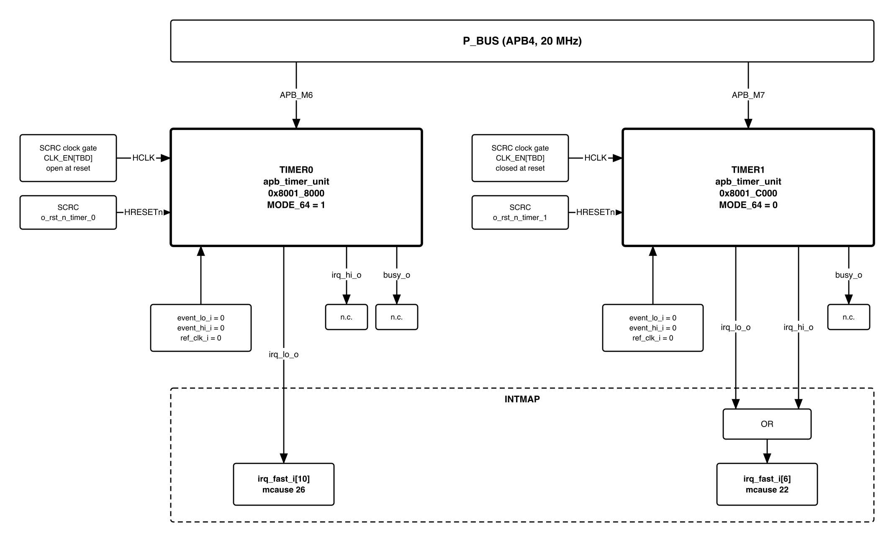
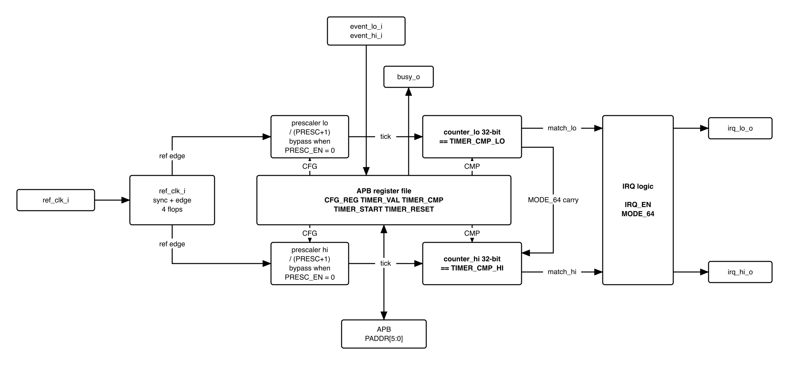

# Revision history

The reasoning behind each change is in
[`QNSC_TIMER_DECISIONS.md`](QNSC_TIMER_DECISIONS.md).

| Version | Date | Author | Reviewer | Description of change |
|---|---|---|---|---|
| V2.0 | 2026-09-23 | Nghia VT | -- | Rewritten as specification only, on the MAS template |
| V2.1 | 2026-09-24 | Nghia VT | -- | One-shot and `CFG_REG_HI[31]` behaviour corrected from the RTL; wrapper interface, full register map, tie-offs and two figures added |
| V2.2 | 2026-09-25 | Nghia VT | -- | `SCRC` reset outputs named `o_rst_n_timer_0`, `o_rst_n_timer_1` (was `o_rst_timer0_n`), per `QNSC_RTL_Design_Naming_Rule` 1.3 and 1.4 |
| V2.3 | 2026-09-25 | Nghia VT | -- | Ports and addresses moved up one slot after GPIO3 was dropped: `TIMER0` on `APB_M6` at `0x8001_8000`, `TIMER1` on `APB_M7` at `0x8001_C000` |

# 1. Overview

`TIMER0` and `TIMER1` are two instances of `pulp-platform/apb_timer_unit`, each an APB
slave with two 32-bit counters that can be chained into one 64-bit counter. Each
counter compares on equality and can raise one interrupt. The block has no pad
connection and no interrupt status register.

Block directory `design/timer`, wrapper module `m_qnsc_wrap_apb_timer_unit`, owner
Nghia Van Trong.

: Instance assignment

| Instance | Base | APB port | Mode | Clock gate out of reset | Interrupt |
|---|---|---|---|---|---|
| `TIMER0` | `0x8001_8000` | `APB_M6` | 64-bit: firmware writes `MODE_64` = 1 | open | `irq_lo_o` to `irq_fast_i[10]` (mcause 26); `irq_hi_o` not connected |
| `TIMER1` | `0x8001_C000` | `APB_M7` | two 32-bit: `MODE_64` stays 0 | closed | `irq_lo_o` and `irq_hi_o` to `irq_fast_i[6]` (mcause 22) |

# 2. Features

- Two 32-bit counters per instance, chainable into one 64-bit counter -- 7.2.
- 8-bit prescaler ahead of each counter -- 7.1.
- Periodic, free-running or one-shot operation, selected per counter -- 7.3.
- Equality compare, one interrupt output per counter -- 7.3, 7.4.
- Zero-wait-state APB slave that never returns an error -- 7.6.

# 3. Block diagram

{width=6.4in}

Both instances are in the `peri` clock cluster. Each has its own clock gate,
`CLK_EN[TBD]` in `SCRC`, and its own reset, `o_rst_n_timer_0` or `o_rst_n_timer_1` from
`SCRC`.

{width=6.4in}

# 4. IP used

: Upstream IP used

| From | Module | Commit | Licence |
|---|---|---|---|
| `pulp-platform/timer_unit` | `apb_timer_unit`, `timer_unit_counter`, `timer_unit_counter_presc` | `4c69615c` | SolderPad 0.51 |

# 5. Interface

Names follow `QNSC_RTL_Design_Naming_Rule` V1.0. The IP port each wrapper port drives
is named in the description.

: TIMER interface

| Signal | Dir | Width | Description |
|---|---|---:|---|
| `i_clk_peri` | in | 1 | gated `peri` clock, to `HCLK` |
| `i_rst_n_peri` | in | 1 | asynchronous active-low reset from `o_rst_n_timer_0` / `o_rst_n_timer_1`, to `HRESETn` |
| `i_bus_apb_paddr` | in | 12 | to `PADDR`; only `[5:0]` decoded -- 7.6 |
| `i_bus_apb_pwdata` | in | 32 | to `PWDATA` |
| `i_bus_apb_pwrite`, `i_bus_apb_psel`, `i_bus_apb_penable` | in | 1 each | to `PWRITE`, `PSEL`, `PENABLE` |
| `i_bus_apb_pstrb` | in | 4 | not connected; every write stores all 32 bits |
| `i_bus_apb_pprot` | in | 3 | not connected |
| `o_bus_apb_prdata` | out | 32 | from `PRDATA`; 0 at unimplemented offsets |
| `o_bus_apb_pready` | out | 1 | from `PREADY` = `PSEL & PENABLE`, zero wait states |
| `o_bus_apb_pslverr` | out | 1 | from `PSLVERR`, constant 0 |
| `o_int_timer` | out | 2 | `[0]` = `irq_lo_o`, `[1]` = `irq_hi_o`, to `INTMAP` -- 7.3 |

# 6. Register map

All registers reset to 0. `lo` and `hi` registers are identical except `MODE_64`.

: Register map

| Offset | Register | Field | Bits | Access | Reset | Description |
|---|---|---|---|---|---|---|
| `0x00` | `CFG_REG_LO` | `ENABLE` | 0 | RW | 0 | 1 = counter `lo` runs |
| | | `RESET` | 1 | RW | 0 | 1 = clear counter and prescaler `lo`; returns to 0 the next cycle |
| | | `IRQ_EN` | 2 | RW | 0 | 1 = compare drives `irq_lo_o` |
| | | `IEM` | 3 | RW | 0 | 1 = `event_lo_i` sets `ENABLE`; no effect in QSOC -- section 10 |
| | | `CMP_CLR` | 4 | RW | 0 | 1 = clear the counter at the compare |
| | | `ONE_SHOT` | 5 | RW | 0 | 1 = clear `ENABLE` at the compare |
| | | `PRESC_EN` | 6 | RW | 0 | 1 = count prescaler ticks |
| | | `REF_CLK_EN` | 7 | RW | 0 | 1 = count `ref_clk_i` rising edges; counter stops in QSOC -- section 10 |
| | | `PRESC` | 15:8 | RW | 0 | prescaler divisor, tick every `PRESC`+1 cycles |
| | | -- | 30:16 | RW | 0 | stored and read back, no function |
| | | `MODE_64` | 31 | RW | 0 | 1 = chain `lo` and `hi` into one 64-bit counter |
| `0x04` | `CFG_REG_HI` | bits 0-15 | 15:0 | RW | 0 | as `CFG_REG_LO`, for counter `hi` |
| | | -- | 30:16 | RW | 0 | stored and read back, no function |
| | | -- | 31 | RW | 0 | must be 0 -- 7.3 |
| `0x08` | `TIMER_VAL_LO` | `VAL` | 31:0 | RW | 0 | count of `lo`; a write loads it |
| `0x0C` | `TIMER_VAL_HI` | `VAL` | 31:0 | RW | 0 | count of `hi`; a write loads it |
| `0x10` | `TIMER_CMP_LO` | `CMP` | 31:0 | RW | 0 | compare value of `lo` |
| `0x14` | `TIMER_CMP_HI` | `CMP` | 31:0 | RW | 0 | compare value of `hi` |
| `0x18` | `TIMER_START_LO` | -- | 31:0 | WO | 0 | any write sets `CFG_REG_LO.ENABLE`; reads 0 |
| `0x1C` | `TIMER_START_HI` | -- | 31:0 | WO | 0 | any write sets `CFG_REG_HI.ENABLE`; reads 0 |
| `0x20` | `TIMER_RESET_LO` | -- | 31:0 | WO | 0 | any write clears counter and prescaler `lo`; reads 0 |
| `0x24` | `TIMER_RESET_HI` | -- | 31:0 | WO | 0 | any write clears counter and prescaler `hi`; reads 0 |
| `0x28`-`0x3C` | -- | -- | 31:0 | RSVD | 0 | writes ignored, reads 0 |

In 64-bit mode with `CFG_REG_LO.ENABLE` = 1, `CFG_REG_LO` alone controls the count and
the interrupt; of `CFG_REG_HI` only `RESET` acts. Firmware keeps `CFG_REG_HI` = 0 in
64-bit mode: with `CFG_REG_LO.ENABLE` = 0, `CFG_REG_HI.ENABLE` = 1 runs counter `hi`
alone.

# 7. Functional behaviour

## 7.1 Counting rate

The counter advances once per **tick**.

: Tick source

| `REF_CLK_EN` | `PRESC_EN` | Tick | 32-bit wrap at 20 MHz |
|---|---|---|---|
| 0 | 0 | every `HCLK` cycle | 214.7 s |
| 0 | 1 | every `PRESC`+1 `HCLK` cycles | 214.7 s x (`PRESC`+1), 15.3 h at most |
| 1 | 0 or 1 | each, or every `PRESC`+1, rising edge of `ref_clk_i` | never: `ref_clk_i` = 0 in QSOC |

"The counter advances every cycle" below means `REF_CLK_EN` = 0 and either
`PRESC_EN` = 0 or `PRESC` = 0.

## 7.2 64-bit mode

With `CFG_REG_LO.MODE_64` = 1, counter `hi` advances only on a tick in which
`TIMER_VAL_LO` = `0xFFFF_FFFF`, so `{TIMER_VAL_HI, TIMER_VAL_LO}` is one 64-bit count.
The 64-bit value matches when `TIMER_VAL_HI` = `TIMER_CMP_HI` and `TIMER_VAL_LO` =
`TIMER_CMP_LO`, and 7.3 applies to it as to a 32-bit counter. `irq_hi_o` is 0 in this
mode.

## 7.3 Compare and interrupt

The match flag of each counter is a flop: it is 1 in the cycle after each cycle in
which the count equals `TIMER_CMP`, whether or not `ENABLE` is set. The interrupt is combinational:

: Interrupt equations

| Mode | `irq_lo_o` | `irq_hi_o` |
|---|---|---|
| 32-bit | `match_lo & CFG_REG_LO.IRQ_EN` | `match_hi & CFG_REG_HI.IRQ_EN` |
| 64-bit | `match_lo & match_hi & CFG_REG_LO.IRQ_EN` | 0 |

: Interrupt shape by mode

| `CMP_CLR` | `ONE_SHOT` | Counter advances | At the match | Interrupt |
|---|---|---|---|---|
| 1 | 0 | any | clears to 0, keeps running -- periodic | 1-cycle pulse |
| 0 | 0 | every cycle | runs on -- free-running | 1-cycle pulse |
| 0 | 0 | prescaled or `ref_clk_i` | runs on -- free-running | pulse of one tick |
| 0 | 1 | every cycle | `ENABLE` cleared, stops at `CMP`+1 | 1-cycle pulse |
| 0 | 1 | prescaled or `ref_clk_i` | `ENABLE` cleared, stops at `CMP` | level, held until cleared -- 7.5 |
| 1 | 1 | any | clears to 0 and stops | 1-cycle pulse |

Periodic operation gives a pulse. One-shot gives a level held until cleared when the
counter is prescaled or counts `ref_clk_i`, and a 1-cycle pulse when it is not.

: Interrupt period, `CMP` >= 1

| Mode | Period |
|---|---|
| Periodic, counter advances every cycle | `CMP`+1 `HCLK` cycles |
| Periodic, `PRESC_EN` = 1 and `PRESC` >= 1 | `CMP` x (`PRESC`+1) `HCLK` cycles |
| Free-running | 2^32 ticks, or 2^64 ticks in 64-bit mode |

Writing 1 to `CFG_REG_HI[31]` in 32-bit mode stops counter `hi` from clearing its own
`ENABLE` at its match in one-shot mode. Firmware keeps that bit 0.

## 7.4 Equality compare

A match requires the count to equal `TIMER_CMP`. A compare value that the count has
already passed matches only after the counter wraps: 2^32 ticks later, 214.7 s at
20 MHz, or 2^64 ticks in 64-bit mode.

## 7.5 Clearing the interrupt

A held one-shot level falls on any of: a write to `TIMER_RESET_x` or `CFG_REG_x.RESET`
= 1; a `TIMER_CMP_x` or `TIMER_VAL_x` write that makes count and compare differ;
`CFG_REG_x.IRQ_EN` = 0.

A write to `TIMER_START_x` alone does not restart a counter held at its match: the
one-shot condition clears `ENABLE` again.

No register records which `TIMER1` counter raised `irq_fast_i[6]`. In one-shot mode a
counter that was started and reads `ENABLE` = 0 has matched; in periodic and
free-running mode no register identifies the source.

## 7.6 APB response and address decode

- `PREADY` = `PSEL & PENABLE`: every access completes with zero wait states.
- `PSLVERR` = 0 for every offset.
- Only `PADDR[5:0]` is decoded, so the 64-byte map repeats 256 times in the 16 KiB
  region: `base + 0x40` is `CFG_REG_LO`.
- `PSTRB` is not connected: a byte or halfword store writes all 32 bits of `PWDATA`.
- While the clock gate is closed, the counters and compare flags hold their value,
  so `o_int_timer` holds its value; the `SCRC` gated-domain responder answers accesses
  to the region with an error.

# 8. Instances

Two instances of one wrapper with identical parameters. They differ only in `MODE_64`
as written by firmware, the clock gate reset state and the `INTMAP` line -- section 1.

# 9. What is not provided here, and who provides it

: Functions this block does not provide

| Function | Where it lives |
|---|---|
| Interrupt status or flag | nowhere |
| Interrupt acknowledge | firmware writes to the block -- 7.5 |
| Source of `irq_fast_i[6]` between `TIMER1` `lo` and `hi` | nowhere in periodic or free-running mode -- 7.5 |
| Error response | `SCRC` responder, only while the clock gate is closed -- 7.6 |
| Greater-or-equal compare | nowhere -- 7.4 |
| `mtime` and `mtimecmp` | nowhere; `irq_timer_i` is tied 0 at the core |
| Aggregation onto a CPU interrupt line | `INTMAP` |

# 10. Tie-offs

: Tie-offs

| Port | Tied to | Why |
|---|---|---|
| `event_lo_i`, `event_hi_i` | 0 | no hardware start source in QSOC; `IEM` has no effect |
| `ref_clk_i` | 0 | no reference clock in QSOC; `REF_CLK_EN` = 1 stops the counter |
| `busy_o` | open | no consumer in QSOC |
| `irq_hi_o` of `TIMER0` | open at `INTMAP` | 0 in 64-bit mode -- 7.2 |
| `i_bus_apb_pstrb`, `i_bus_apb_pprot` | open | the IP has no such inputs |

# 11. Requirements on others, and open items

: Requirements on other owners

| Item | Owner | What it blocks |
|---|---|---|
| `i_bus_apb_paddr[11:0]` = the low 12 bits of the offset (`P_BUS` subtracts the base; offset bits 13:12 are not used) | bus owner | register decode |
| `CLK_EN` and `SOFT_RST_CTRL` bit positions for `TIMER0` and `TIMER1` | `SCRC` owner | the wrapper's clock and reset connection |
| Gate reset values: `TIMER0` open, `TIMER1` closed | `SCRC` owner | `TIMER0` counting before firmware writes `SCRC` |

Accepted limits and firmware rules:

1. Compute each compare value from a fresh read of the count, with margin for
   interrupt latency; a passed value is missed for a full wrap -- 7.4.
2. Clear a held one-shot level by one of the writes in 7.5 before `mret`, or the
   handler is re-entered.
3. Keep `CFG_REG_HI[31]` = 0 -- 7.3; use word stores only -- 7.6.
4. Do not close a timer's clock gate while its interrupt is asserted: the level holds
   and the block cannot be written to clear it -- 7.6.
5. Closing `TIMER0`'s clock gate stops the timebase without any record.
6. Read the 64-bit count as `HI`, `LO`, `HI`; if the two `HI` values differ, read again.
7. Restart a one-shot with `TIMER_RESET_x`, then `TIMER_START_x` -- 7.5.

Open: gate count, from synthesis.

# 12. Verification

The IP has no testbench. Each check below is added by QSOC.

1. Register reset values and access types match section 6, including reads of 0 from
   `0x18`-`0x3C` and read-back of `CFG` bits 30:16.
2. `base + 0x40` accesses `CFG_REG_LO`; every access in the 16 KiB region completes
   with zero wait states and `PSLVERR` = 0; a byte store writes all 32 bits.
3. Tick rate for each row of 7.1, including `PRESC` = 0 and 255.
4. 64-bit mode: `TIMER_VAL_HI` advances exactly once per `lo` wrap, with and without
   the prescaler; `irq_hi_o` stays 0; one pulse at the programmed 64-bit value.
5. Every row of the interrupt shape table in 7.3, in 32-bit and 64-bit mode. **Confirm
   in simulation** the one-shot rows: 1-cycle pulse and stop at `CMP`+1 when the
   counter advances every cycle; held level and stop at `CMP` when prescaled.
6. Periodic period equals the 7.3 formula, with and without the prescaler; **confirm
   in simulation**.
7. Each clearing action of 7.5 drops a held level; `TIMER_START_x` alone does not
   restart it -- **confirm in simulation**.
8. A compare value written one tick behind the count is missed until the wrap.
9. `CFG_REG_HI[31]` = 1 in 32-bit mode changes counter `hi` one-shot behaviour -- 7.3.
10. Tie-offs of section 10 present; `IEM` = 1 and `REF_CLK_EN` = 1 act as stated there.
11. Integration: `TIMER0` `irq_lo_o` reaches `irq_fast_i[10]`, both `TIMER1` outputs
    reach `irq_fast_i[6]`, and the gate reset values match section 1.

Acceptance: `TIMER0` in 64-bit mode raises exactly one interrupt at a programmed
64-bit value, and a value written behind the count is missed.

# Appendix A. Acronyms

: Acronyms

| Acronym | Description |
|---|---|
| APB | AMBA Advanced Peripheral Bus |
| `mtime`, `mtimecmp` | RISC-V machine timer registers |
| SCRC | System clock and reset controller |

# Appendix B. First review

: First review

| Item | Reviewer | Response |
|---|---|---|
| Too long, and the redundancy causes wrong information | Teacher, 2026-09-23 | V2.0 rewrite; V2.1 cuts the remaining reasoning to `_DECISIONS` |
